<div>
  <script>
    document.addEventListener('DOMContentLoaded', () => {
      const footerNav = document.querySelector('.md-footer__inner');
      if (footerNav) {
        footerNav.style.display = 'none';
      }
    });
  </script>
</div>


# Pre-Requisites and Setup (Optional Step)

!!! important

    The following steps are provided for your information only. Since you've already signed up using your personal email and received the necessary API keys (which were pre-generated and provided to you as a .txt file), there's no need to follow these instructions during the lab. However, if you're interested in learning how to create the API keys yourself, feel free to review the steps below. We've pre-created the keys to save time during the session.
    

???+ blank "Google Colab - Accessing Google Colab and creating account"

    ??? info "Introduction"

        === "How to Use"

            Google Colab is one of several, cloud-based platform that provides a convenient environment for running notebooks. If you want to create a machine learning model but don't have a computer that can handle the workload, Google Colab is the platform for you. In our lab, we will be using Google Colab to test and run our code. However, if you have your own Python environment and prefer to run the code on your local machine, please feel free to do so.

            Here are some reasons why using Google Colab can be beneficial for this lab:

            * Free Access to GPUs and TPUs: Google Colab offers free access to powerful GPUs and TPUs, which can significantly accelerate the training and fine-tuning of machine learning models.
            * No Setup Required: With Colab, there is no need to set up your local environment. Everything runs in the cloud, which saves time and avoids configuration issues.
            * Easy Collaboration: Colab notebooks can be easily shared and collaborated on with team members, making it an ideal tool for collaborative projects.
            * Integration with Google Drive: Colab integrates seamlessly with Google Drive, allowing you to save and manage your work conveniently.
            * Pre-installed Libraries: Many popular machine learning libraries, including TensorFlow and PyTorch, come pre-installed in Colab, making it easy to start working on your projects immediately.

            <p align="right"><a href="https://allchapters.github.io/genAi/Task1/#__tabbed_1_2" class="md-button md-button--primary">Next</a></p>

            <p align="right"><a href="https://allchapters.github.io/genAi/Task1/Getting Started With Google Colab" class="md-button md-button--primary">Next</a></p>

            [Next →](../next-section/)

            [Next →](../#__tabbed_1_2/)

            [Next →](Task1.md#__tabbed_1_2/)

            omer

            [Next →](Task1.md/#__tabbed_1_2/)

            [Next →](Task1.md/Getting-Started-With-Google-Colab)

            [Next →](Task1.md/#Getting-Started-With-Google-Colab)

            


        === "Getting-Started-With-Google-Colab"

            

            
            === "Initial Step"
                To start working with Google Collab Notebook you first need to log in to your Google account, then go to this link <a href="https://colab.research.google.com" target="_blank">Google Colab</a>

                !!! Note
                    You can use your personal Google account(gmail) for your lab

                <p align="right"><a href="https://allchapters.github.io/genAi/Task1/#__tabbed_2_2" class="md-button md-button--primary">Next</a></p>

            === "New Jupyter Notebook"
                * Create a new Jupyter Notebook

                 
                 
                * On creating a new notebook, it will create a Jupyter notebook with Untitled0.ipynb and save it to your google drive in a folder named Colab Notebooks. Now as it is essentially a Jupyter Notebook, all commands of Jupyter Notebooks will work here. 

                 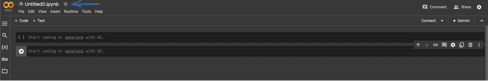

                ??? note
                    * There might be times when we need to fine-tune models or perform specific tasks that require changing the runtime environment in Colab. Google Colab offers different runtime environments that can be selected based on your requirements:
                  
                    * **Python Versions:** You can select between different versions of Python (e.g., Python 2 or Python 3)depending on the compatibility of the code and libraries. We will be using Python3 for our lab.
                    
                    * **Hardware Accelerators:** Colab provides access to hardware accelerators, which can be particularly useful for intensive computations. You can choose between:
                        ```
                        None: No hardware acceleration, suitable for basic tasks.
                        GPU: Accelerate your computations with a Graphics Processing Unit.
                        TPU: Use a Tensor Processing Unit for even faster performance, especially beneficial for deep learning tasks.
                        ```

                * Click the arrow next to “Connect” to open the dropdown

                    

                * Select “Change runtime type”: This will open a dialog box where you can configure the runtime environment.
                
                  * Select Python Version: Choose Python 3 from the “Runtime type” dropdown menu.

                  * Select Hardware Accelerator: From the “Hardware accelerator” dropdown menu, choose  GPU, or TPU .

                ??? note 

                    * GPU (Graphics Processing Unit): Best for tasks requiring extensive parallel processing, such as training neural networks (the main focus in our lab guide).

                    * TPU (Tensor Processing Unit): Optimized for deep learning tasks

                

                * Save Settings: Click “Save” to apply the changes.

                ??? note 

                    * **New Cell:** Whenever you want to copy the code in Google Colab and run it, be sure to click on + Code to add a new code cell.
                    
                    

                    * **Execute Code:** Click the play button to the left of the code, or use the keyboard shortcut "Command/Ctrl+Enter" while the cell is selected.
                    
                    
                    
                <p align="right"><a href="https://allchapters.github.io/genAi/Task1/#__tabbed_2_3" class="md-button md-button--primary">Next</a></p>

            === "GPU and TPU Information"

                While Google Colab offers free access to GPUs and TPUs, there are limitations. For more consistent access to high-performance GPUs and TPUs, you might need to subscribe to <a href="https://colab.research.google.com/signup" target="_blank">Colab Pro or Colab Pro+ accounts</a>. These paid plans provide priority access to better hardware, longer runtimes, and more memory.
            
                <p align="right"> 👉 When you're ready, click the <strong>“Huggingface Hub - Creating Account”</strong> tab below to proceed. </p>


???+ blank "Huggingface Hub - Creating Account"

    ??? info "Introduction - Using Huggingface Hub to share our Datasets"

        In this lab, we will be utilizing the [Hugging Face Hub](https://huggingface.co/) to load our custom datasets (Optional Task). As we progress, we will be working with datasets, so let’s create a Hugging Face account to facilitate our lab exercises. Hugging Face provides an extensive repository of datasets that can be easily integrated into your machine learning workflows. For the purposes of this lab, we will demonstrate how to access/upload and use our custom datasets effectively.

        However, when fine-tuning models in your own work environment, especially if you are using private data, there are important considerations to keep in mind:

        * **Private Datastores:** If you are working with proprietary or sensitive data, it is crucial to use your organization's secure datastores. Ensure that all data handling complies with your organization's data privacy policies and regulations.
        * **Hugging Face Datasets:** If you prefer to use Hugging Face for dataset storage and management, make sure to mark your datasets as private. This setting ensures that your data cannot be accessed by anyone outside your organization, maintaining the confidentiality and integrity of your information. Please refer to Huggingface documentation for more info.

        **Few more Condsideration**

        * **Upload Dataset:** When uploading your dataset to Hugging Face, choose the appropriate privacy settings. You can set your dataset to private during the upload process.
        * **Check Permissions:** Regularly review and manage the permissions of your datasets to ensure they remain private and secure.
        * **Collaborator Access:** If you need to share the dataset with specific team members, use the Hugging Face interface to grant access to trusted collaborators only.

        By following these guidelines, you can ensure that your data remains secure while leveraging the powerful tools and resources provided by Hugging Face. This approach not only enhances your workflow efficiency but also upholds the best practices in data security and privacy.

        === "Accessing Hugging Face"

            Hugging Face can be accessed by browsing to <a href="https://huggingface.co/" target="_blank">huggingface</a>
            
            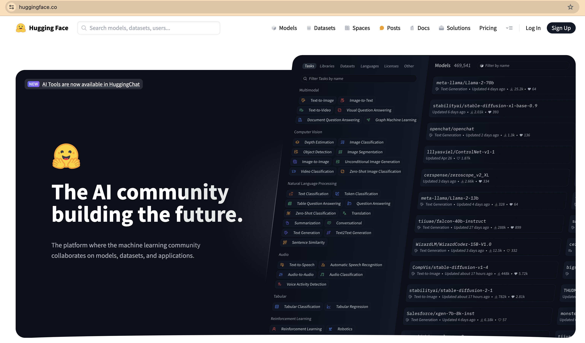

            <p align="right"><a href="http://127.0.0.1:8000/Task1/#__tabbed_3_2" class="md-button md-button--primary">Next</a></p>

        === "Signing up & creating account"

            * Browse to Hugging Face home page and click on Sign up. Follow the instructions as per below images

            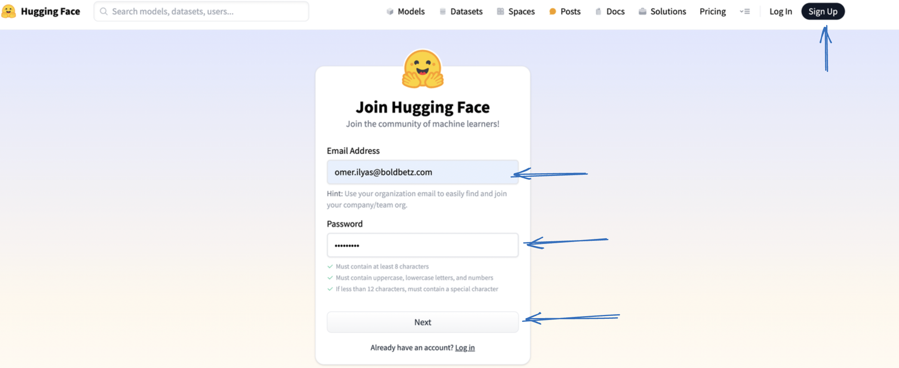

            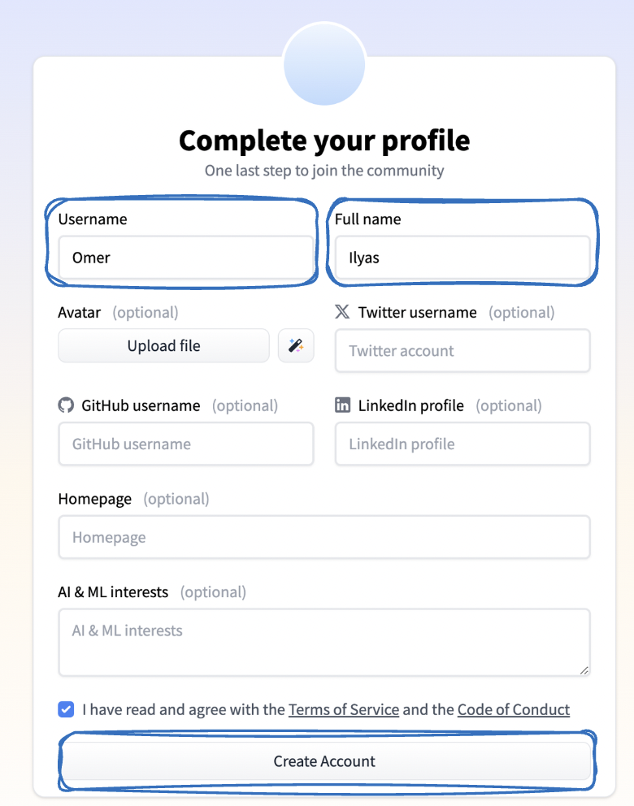

            * Please check your email address for a confirmation link and click to verify your account 

            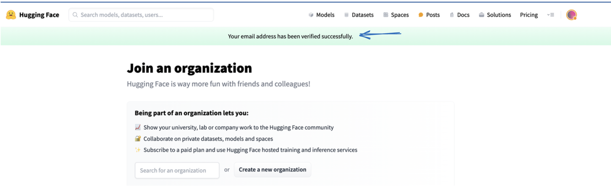

            * Organization Creation (Optional): While you can upload datasets and fine-tune models directly on Hugging Face without creating an organization, you have the option to create an organization on Hugging Face. This can be particularly useful for team collaboration, as it allows you to upload all your datasets and models in one centralized location. Click on "Create a New organization". In our example, we're creating an organization called <span class="colour" style="color:red">OmerAccount</span>. If that name is already taken, please choose another name of your preference.

            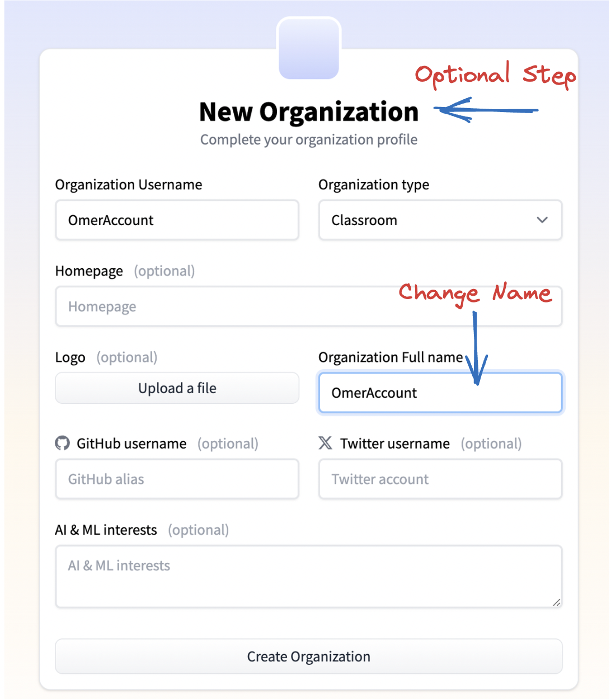

            * Access Your Models and Datasets: The same can be accessed by clicking your profile picture on the top right corner of the Hugging Face website. This will take you to your personal dashboard where you can view and manage your models and datasets.

            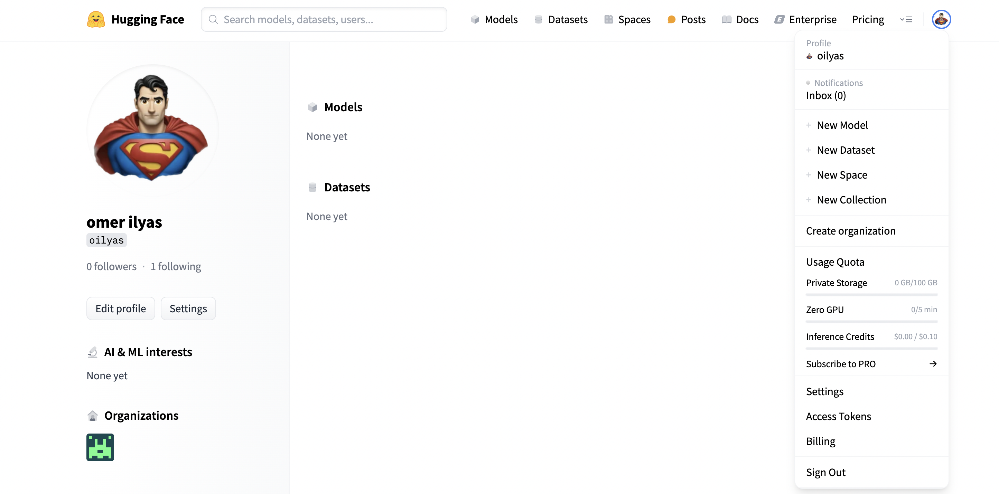

            *  At this stage, you will see no models or datasets created under your account.

            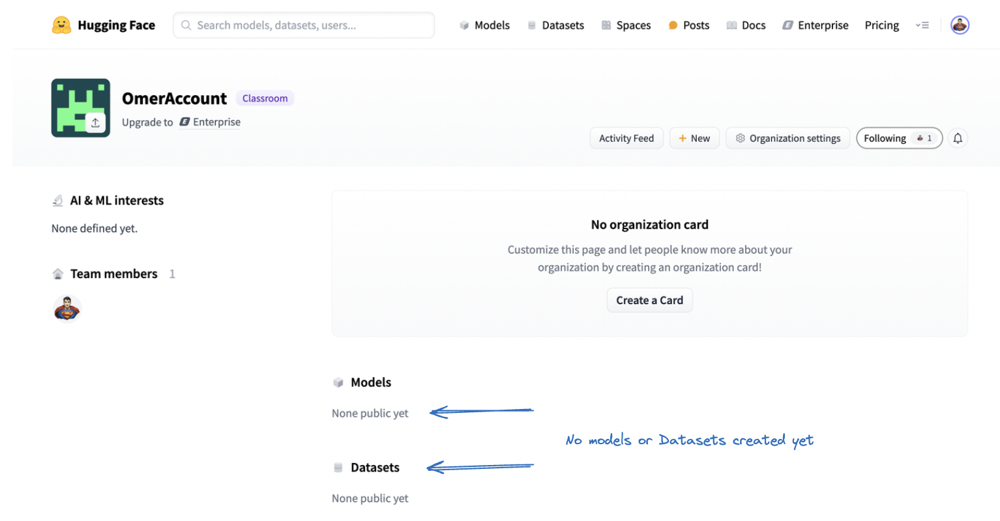

            <p align="right"><a href="http://127.0.0.1:8000/Task1/#__tabbed_3_3" class="md-button md-button--primary">Next</a></p>
        
        === "Hugging Face API Keys"

            * **Create an API Key:** Sine we will be uploading our datasets to the Hugging Face Hub, we need to create an API key for our account. This API key will be used to authenticate and interact with the Hugging Face services programmatically. You can browse to [huggingface API Key](https://huggingface.co/settings/token)

            or 

            * Click on your profile picture > Settings > Access Tokens

            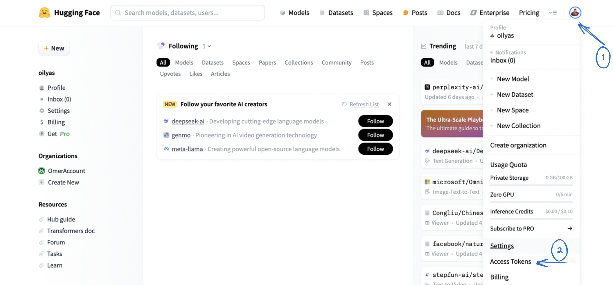

            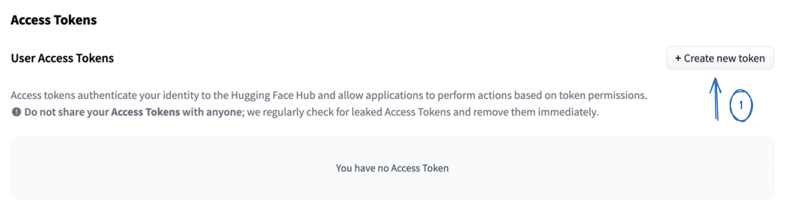

            * Under the "Access Tokens" section, click on "Create new token." You will see options to select the token type and provide a token name. For example, you might name your token "OmerToken" and select the approperiate permissions.  

                * Fine-grained: tokens with this role can be used to provide fine-grained access to specific resources, such as a specific model or models in a specific organization. This type of token is useful in production environments, as you can use your own token without sharing access to all your resources.

                * Read: tokens with this role can only be used to provide read access to repositories you could read. That includes public and private repositories that you, or an organization you’re a member of, own. Use this role if you only need to read content from the Hugging Face Hub 
                (e.g. when downloading private models or doing inference).

                * Write: tokens with this role additionally grant write access to the repositories you have write access to. Use this token if you need to create or push content to a repository (e.g., when training a model or modifying a model card).

            * As we have a lab envoirnment we will be using the "Write" permission. This token will have read and write access to all your resources and can make calls to inference API on your behalf, as shown in the image below.

            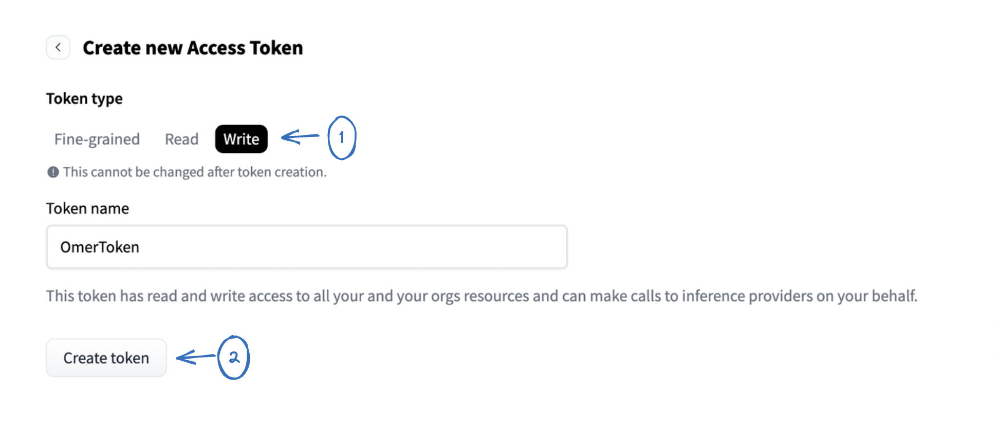

            * **Save and Secure the Token:** Once the token is generated, save it securely, as it will be needed to access and manage your datasets via the API. The image below is for reference only. Make sure to use and save the token you generate.

            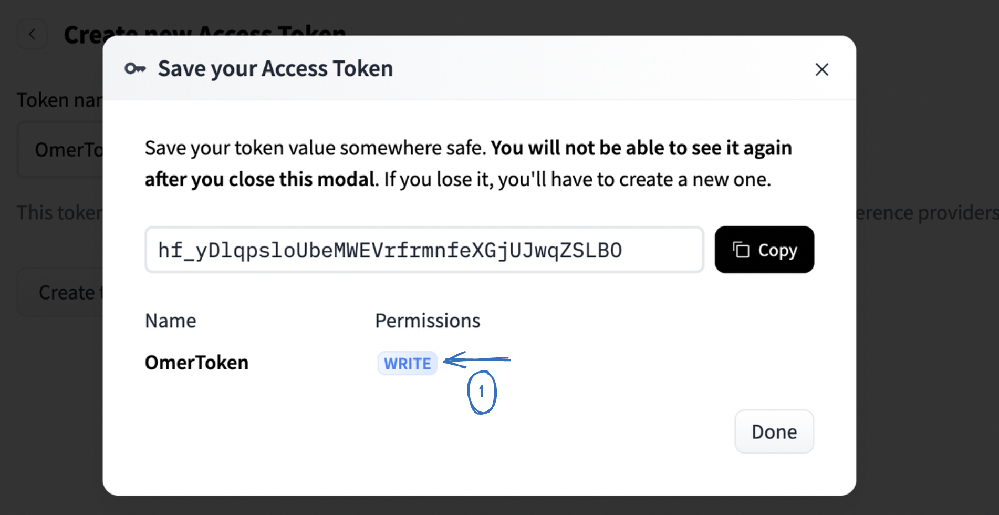

            <p align="right"><a href="http://127.0.0.1:8000/Task1/#__tabbed_3_4" class="md-button md-button--primary">Next</a></p>

        === "Accessing Hugging Face in Colab"

            * Open the Google Colab notebook and navigate to the new “Secrets” section in the sidebar by clicking the "key icon”

            

            * Click on “Add a new secret.” Enter the name example: HF_TOKEN and value of the secret. Note: The name is permanent once set. 

            * The list of secrets is global across all your notebooks.

            * Use the “Notebook access” toggle to grant or revoke access to a secret for each notebook.

            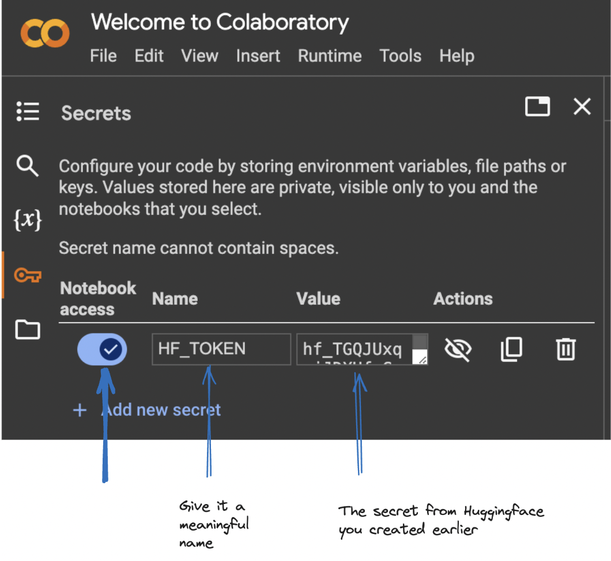

            <p align="right"><a href="http://127.0.0.1:8000/Task1/#__tabbed_3_5" class="md-button md-button--primary">Next</a></p>

            <p align="right"> 👉 When you're ready, click the <strong>“langchain”</strong> tab below to proceed. </p>

        === "Optional Steps(For Python Envoirnment)"
            
            ??? note 
            
                * For Python modules requiring API keys as environment variables, you can use the below code snippet:

                The below code snippet is for reference only; there's no need to execute it at this point.

                ```py linenums="1"
                # Import Colab Secrets userdata module

                from google.colab import userdata
                import os

                # Set other API keys similarly
                os.environ["HF_TOKEN"] = userdata.get('HF_TOKEN')
                ```
            <p align="right"> 👉 When you're ready, click the <strong>“Langchain”</strong> tab below to proceed. </p>


???+ blank "LangChain"

    ??? info "Introduction - Using Langchain"

        === "Getting Started"

            LangChain is a framework that enables developers to build applications using large language models (LLMs). It connects with various AI models, data sources, and APIs, allowing the creation of complex work flows for tasks such as question answering, chatbot interactions, and document summarization. We will explore LangChain in more detail in the later section.
            
            Let's explore how to create a LangChain account and obtain the API key, which we will use later in our lab. 
            
            To start building applications with LangChain, you'll need an API key. This key allows your applications to securely connect with LangChain's services, ensuring proper authentication and usage tracking.

            Lets start by visiting the official <a href="https://smith.langchain.com/settings" target="_blank">LangChain website</a> and create an account. You'll need to enter some basic information about yourself or your organization. In this example, I will be using my Google account (tmedemouserX) to sign up.
            
            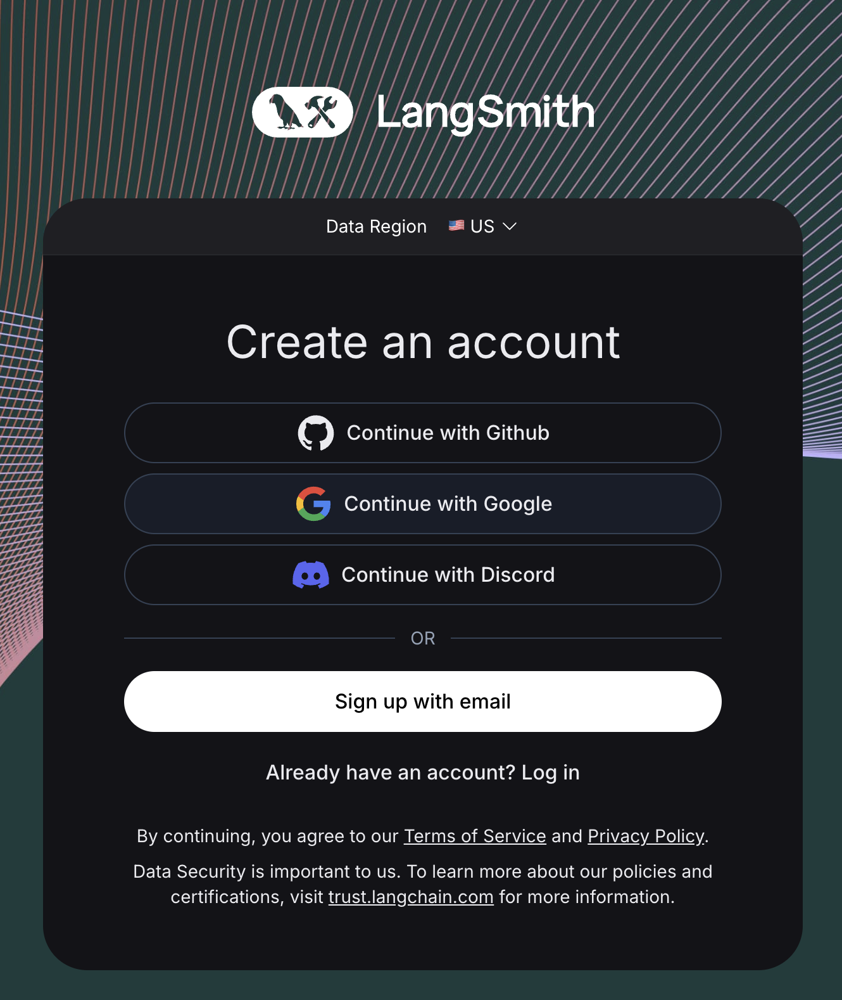

            <p align="right"><a href="http://127.0.0.1:8000/Task1/#__tabbed_4_2" class="md-button md-button--primary">Next</a></p>

        === "Langchain API Keys"
        
            * To create an API key head to the **Settings** page. Then click Create API Key.

            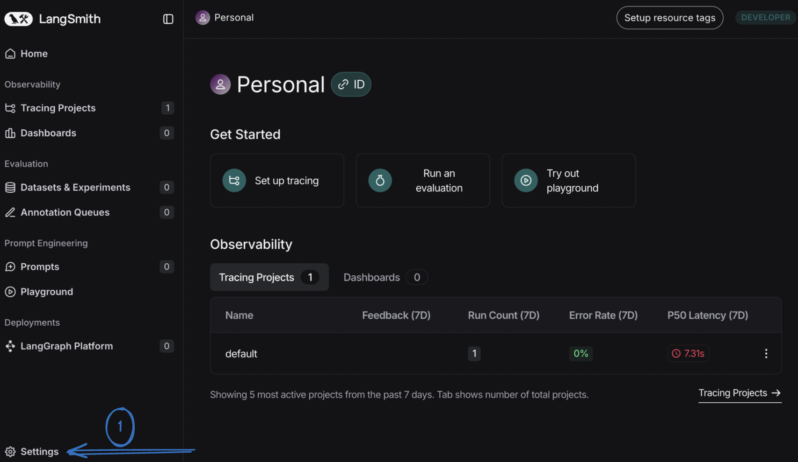

            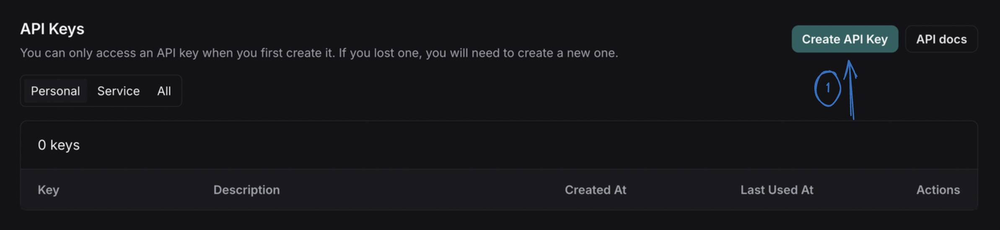
            
            * Lets create a Personal Access Token

            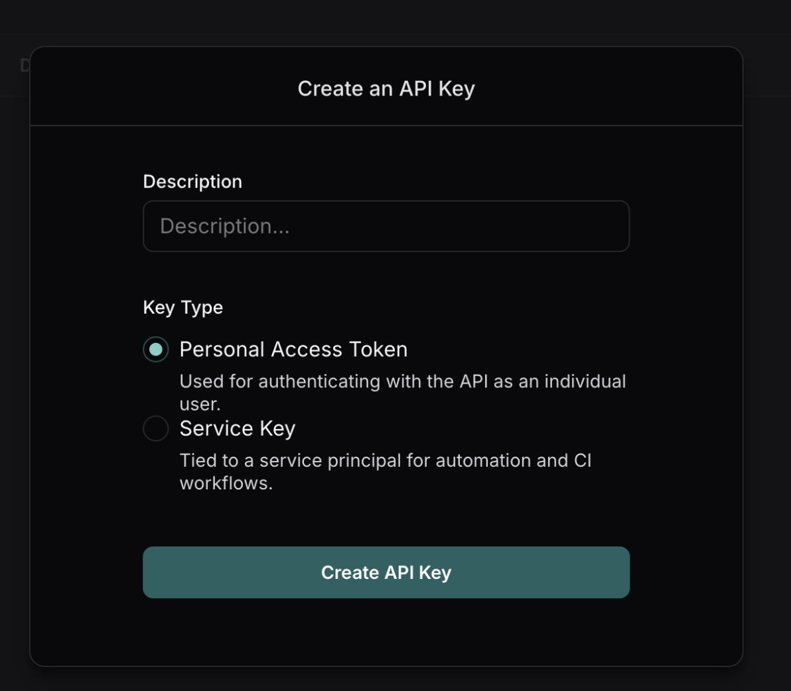

            ??? note
                After generating the token, store it securely, as you will need it for future tasks. Ensure you use and save the token you create.
            
            <p align="right"><a href="http://127.0.0.1:8000/Task1/#__tabbed_4_3" class="md-button md-button--primary">Next</a></p>
 
        === "LangServe"          

            ??? note 
                The below code snippet is for reference only, there's no need to execute it at this point.  
              
                In the code test snippet below, we'll configure our environment to enable tracing of AI calls and set up the API key for interacting with LangChain's services. We will be using these in the upcoming section.
                ```py linenums="1"
                    !pip install -U langchain langchain-openai
                    !pip install langchain-community
                    export LANGCHAIN_TRACING_V2=true
                    export LANGCHAIN_API_KEY=<your-api-key>
                ```
            <p align="right"> 👉 When you're ready, click the <strong>"Ollama - Running Locally - Optional Task"</strong> tab below to proceed. </p>

???+ blank "Ollama - Running Locally - Optional Task"

    ??? info "Introduction"

        Have you ever used ChatGPT and amazed at its ability to understand and respond to your queries? But did you know that you can also harness the power of open-source models using Ollama? With Ollama, you can download and interact with these models directly, getting responses that are tailored to your needs.
        
        In this lab, I'll show you how to install Ollama locally on your machine and start using it to generate responses. You'll learn how to download and load open-source models, and then use Ollama's intuitive interface to interact with them. More info for <a href="https://ollama.com/" target="_blank">Ollama can be found here</a>

        ??? note
            The steps below are provided for informational purposes. If you are using the demo laptop in this lab, feel free to follow these instructions. However, if you are using your personal or work machine, please ensure that you have the necessary privileges and authorization from your organization's administrator to install Ollama locally.


        === "Prerequisites for Installing Ollama Locally"
            
            * Ensure that Docker is installed and running on your machine. It is available for various operating systems, including macOS, Windows, and Linux. You can download it from the <a href="https://www.docker.com/" target="_blank">official Docker website</a> and follow the installation instructions for your specific OS.

            <p align="right"><a href="http://127.0.0.1:8000/Task1/#__tabbed_5_2" class="md-button md-button--primary">Next</a></p>

        === "Installing Ollama Locally"

            ??? note
                Since we're using a Mac, I'll demonstrate how you can install it on macOS.
            
            * First, you need to install Ollama. You can download it <a href="https://ollama.com" target="_blank">here</a> and clicking on the download button. Follow the instructions.

            * Once installed, Ollama functions as a command-line application, allowing you to interact with it directly through the terminal. To get started, open the terminal and enter the following command:

            ``` py linenums="1" title="SHELL"
            ollama
            ```

            * It will output the below commands
            
            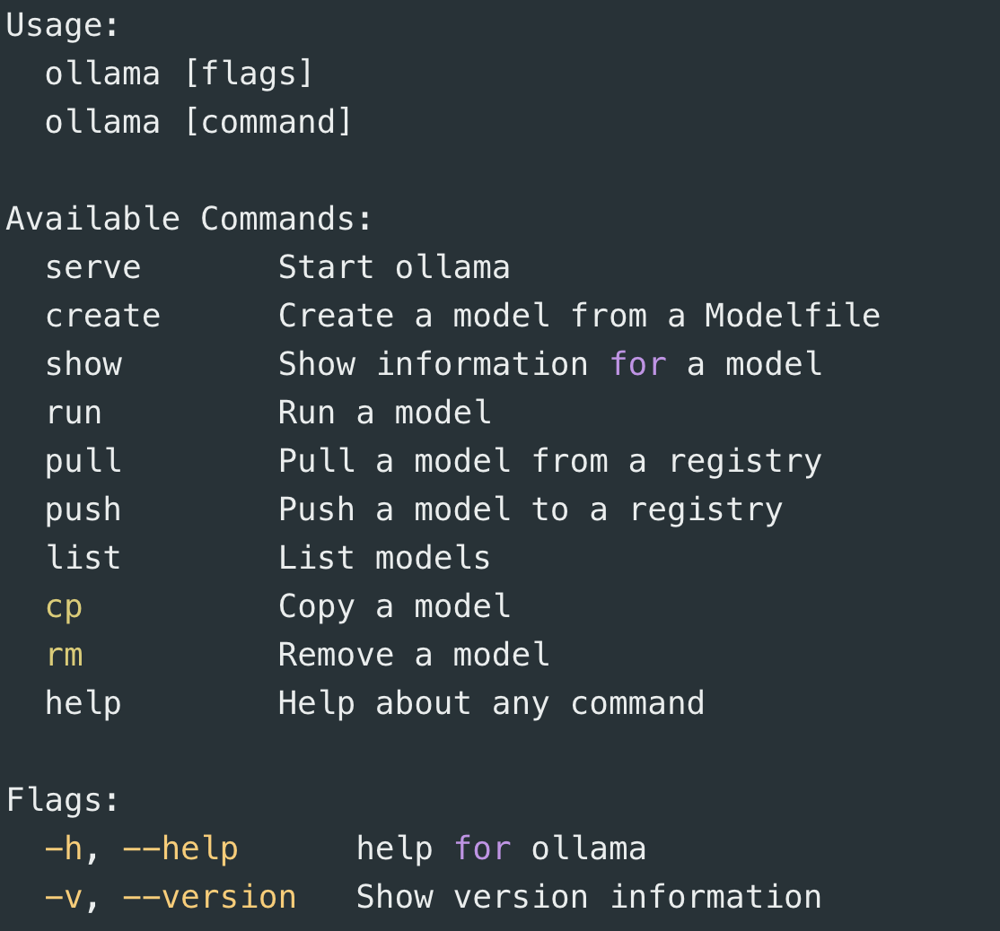

            * Ollama supports a list of models available <a href="https://ollama.com/library" target="_blank">here</a>. Below are some example models that can be downloaded:

            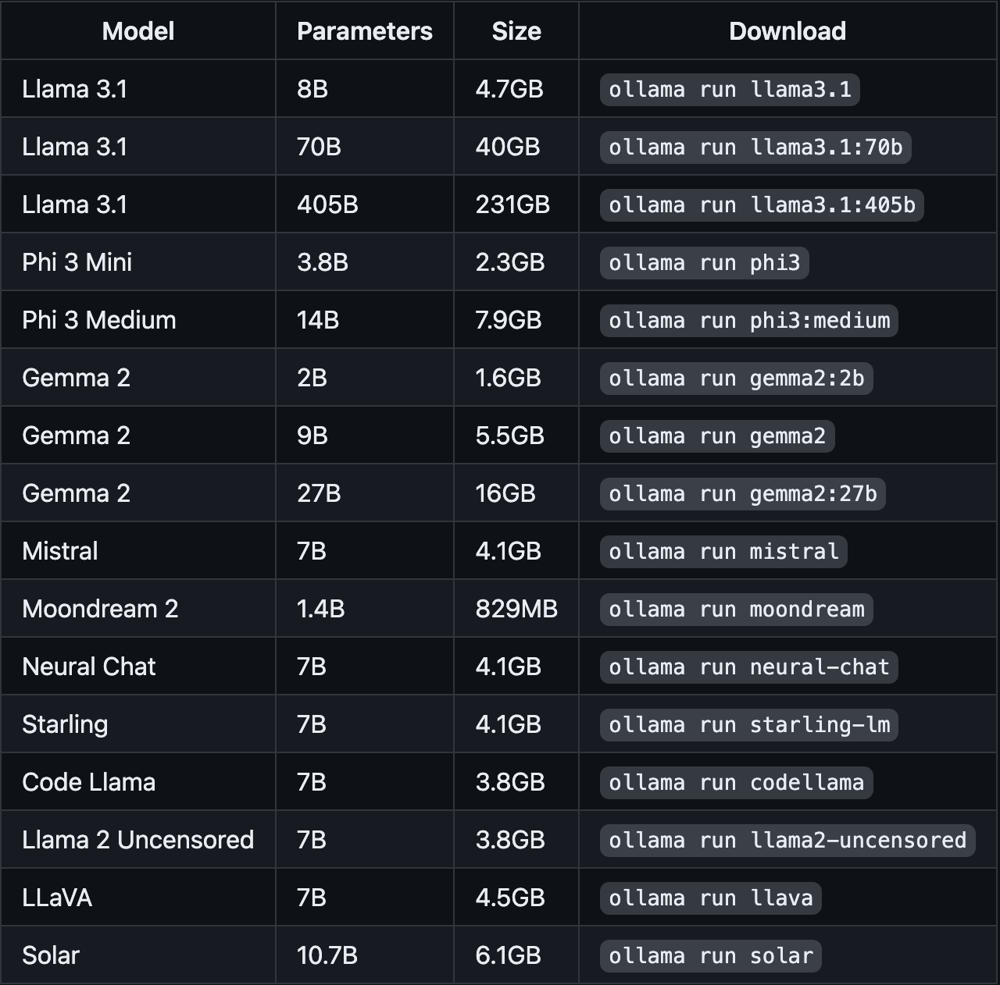

            * To download a model, for example, gemma:2b, which is a lighter model, we can simply type:

            ``` py title="SHELL"
            ollama pull gemma:2b
            ```

            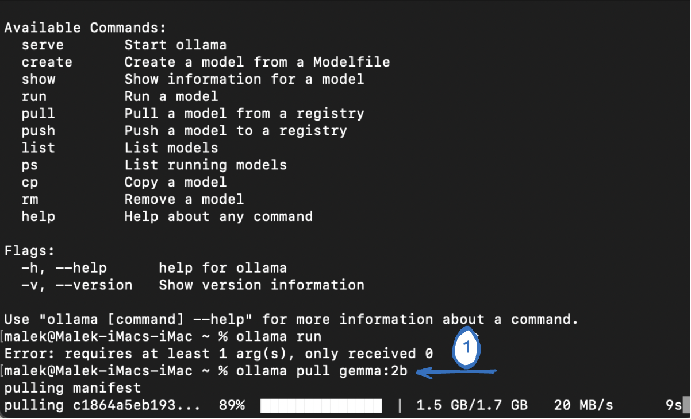

            * After pulling the model we can interact with it in the terminal by typing:

            ``` py title="SHELL"
            ollama run gemma:2b
            ```

            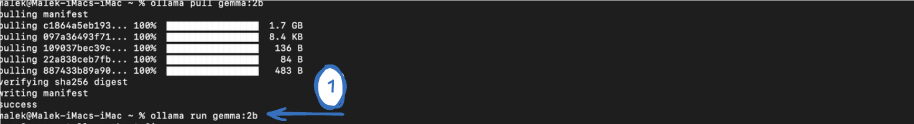

            * We can now ask our question directly in the terminal

            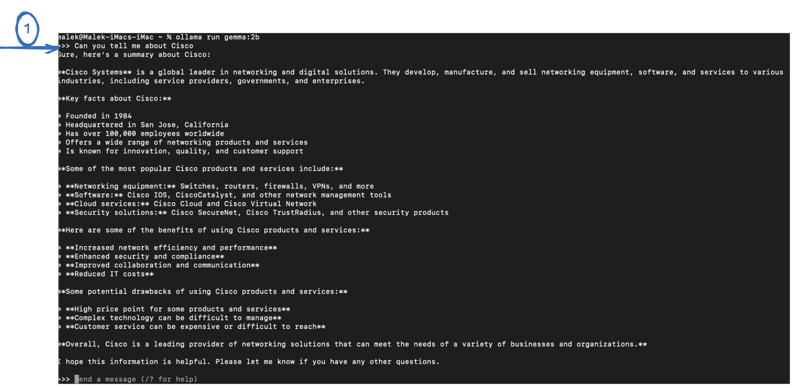

            * To remove model you can type

            ``` py title="SHELL"
            ollama rm gemma:2b
            ```

            * To see the models installed, just enter 

            ``` py title="SHELL"
            ollama list
            ```
            <p align="right"><a href="http://127.0.0.1:8000/Task1/#__tabbed_5_3" class="md-button md-button--primary">Next</a></p>

        === "Ollama - Web Interface"
            
            ??? note
                Docker must be installed beforehand as a prerequisite.

            Once we've installed Ollama, we can interact with it directly through the terminal, as demonstrated earlier. But what if you prefer a web interface? There are several open-source tools available, but I'll show you how to use <a href="https://github.com/open-webui/open-webui" target="_blank">Open WebUI</a>, which was previously known as Ollama WebUI.

            Open WebUI is a versatile, feature-rich, and user-friendly web interface that you can host yourself and use entirely offline. It offers a ChatGPT-style interface, allowing you to interact with language models running on locally (Ollama). This tool is especially useful for those who want to run language models locally or in a self-hosted environment, ensuring both data privacy and control.

            * After installing Ollama, simply run the following Docker command to set up the interface

            ``` py title="SHELL"
            docker run -d -p 3000:8080 --add-host=host.docker.internal:host-gateway -v open-webui:/app/backend/data --name open-webui --restart always ghcr.io/open-webui/open-webui:main
            ```

            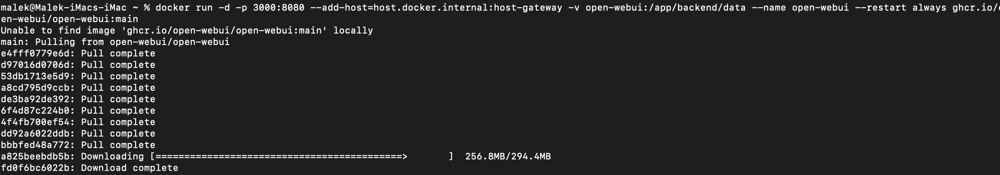

            * Once installed, you can access Open WebUI at <a href="http://localhost:3000" target="_blank">localhost</a>. 

            <span style="color: RED;">Note: Before accessing the web interface, you will be prompted to create an account. Please follow the instructions.</span>

            * In the dropdown menu, you'll see the model you previously installed via the terminal (gemma:2b).

            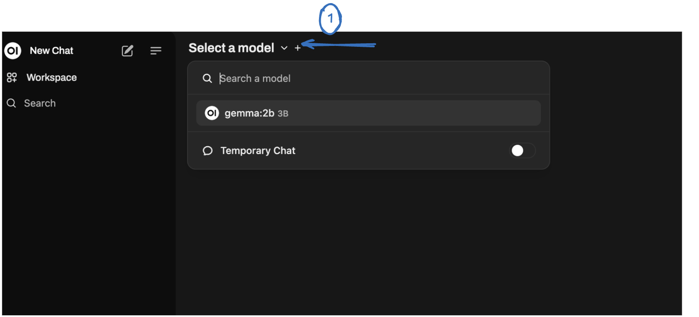

            * You can now Interact with the model via WebUi

            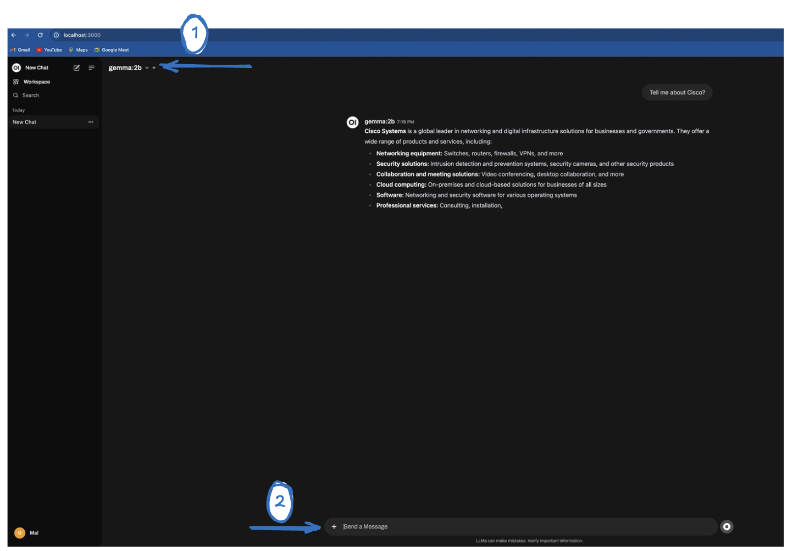

            * You no longer need to use the terminal to download a model. Simply navigate to the “Settings --> Models” section in the WebUI, and select the specific model you want to download.

            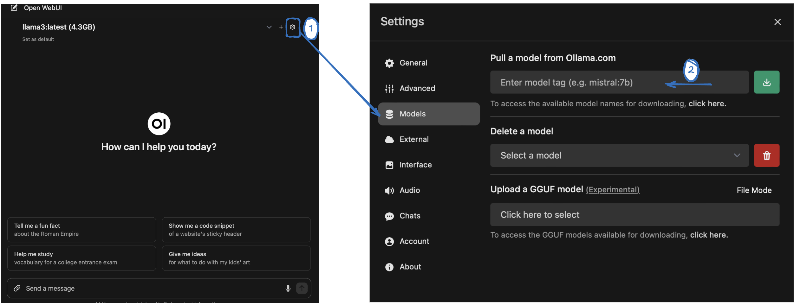

            * After installing, all the installed models will be displayed in the UI.

            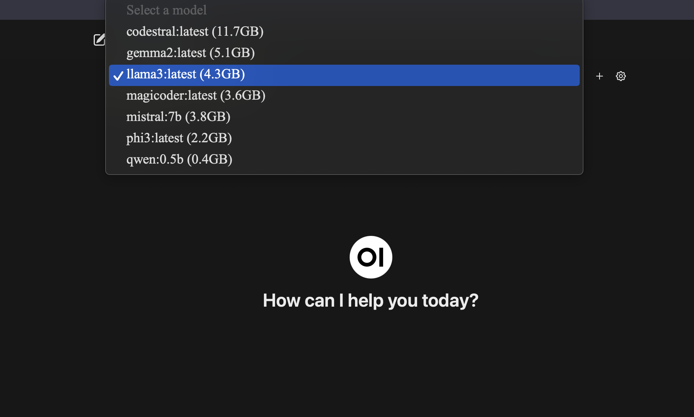

            ??? note
                Using LangChain with Ollama allows you to leverage Ollama's capabilities within the LangChain ecosystem. You can find <a href="https://python.langchain.com/v0.1/docs/get_started/quickstart/" target="_blank">more information here

            <p align="right"> 👉 This concludes the task. Click the <strong>"AI/ML Revolution Unveiled "</strong> Task on the left. </p>


  