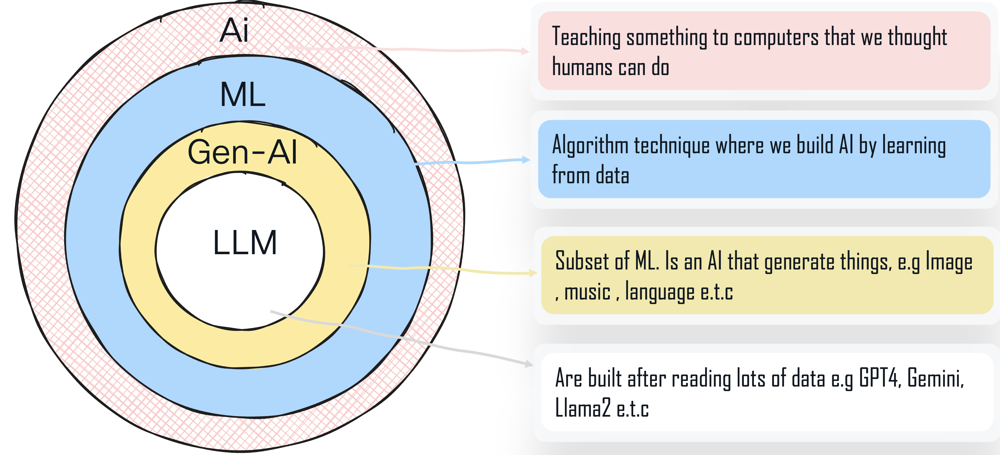
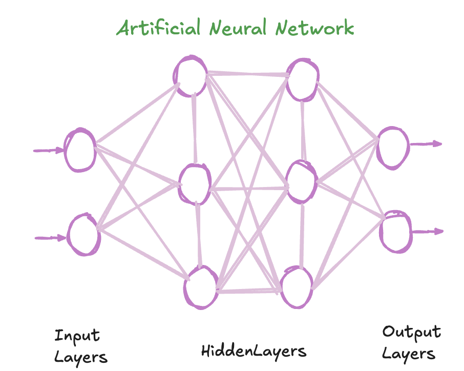
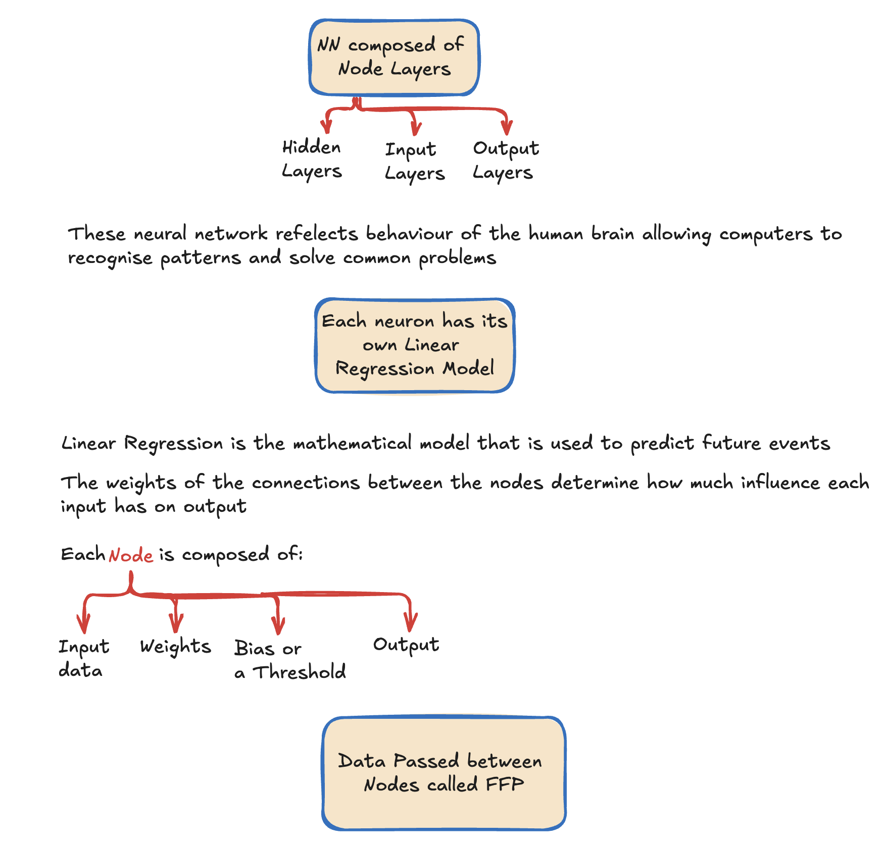
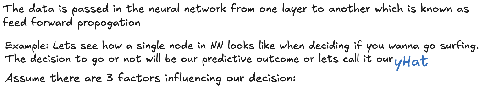
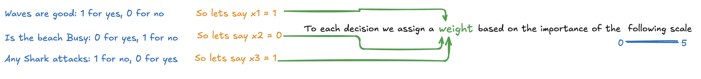
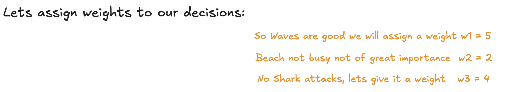
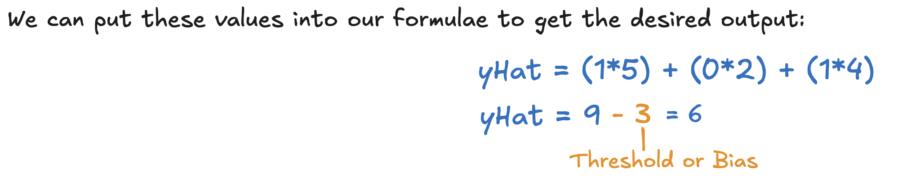

# AI/ML Revolution Unveiled

!!! important
    This task does not require any configuration. It is purely informational and is designed to help you understand the fundamentals of neural networks.

???+ blank "Different Types of AI"

    ??? info "Introduction"

        

        !!! note
             Subset of AI is ML and kind of ML is Gen-AI . LLM e.g GPT are subset of Gen-AI

???+ blank "Neural Network"

    ??? info "Introduction"

        

         Note: The way nodes are connected is called weights 

        

        

        

        
        
        

        !!! note

             Note: Threshold and Bias are random generated values, used in neural networks to help determine neuron activation and adjust outputs. To understand neural networks more comprehensively, here are some foundational papers and articles:

            * <a href="http://neuralnetworksanddeeplearning.com" target="_blank">Neural Networks and Deep Learning by Michael Nielsen</a>

            * <a href="https://medium.com/@theDrewDag/introduction-to-neural-networks-weights-biases-and-activation-270ebf2545aa" target="_blank">Introduction to neural networks — weights, biases and activation</a>

            * <a href="https://spotintelligence.com/2023/03/13/feedforward-neural-networks/" target="_blank">Neural Networks Made Simple</a>

            

        

        !!! note

             Note: Neural Network rely on training data to learn and improve their accuracy over time. We used supervised learning to train the NN algorithm. 
            There are multiple types of Neural network other than the Feed Forward Network that we have defined here. Example: CNN: Convolutional Neural Network is a unique architecture for identifying patterns
            like image recognition, or RNN: Recurrent Neural Network, that uses time series data to make prediction about future events like sales forecasting. 
    
        
 👉 When you're ready, click the <strong>"Tokenization"</strong> Task on the left. 

