# Task 5: Context Windows and Retrieval Augmented Generation (RAG)

???+ blank "Context Windows"

    ??? info "Introduction"

        === "Introduction"

            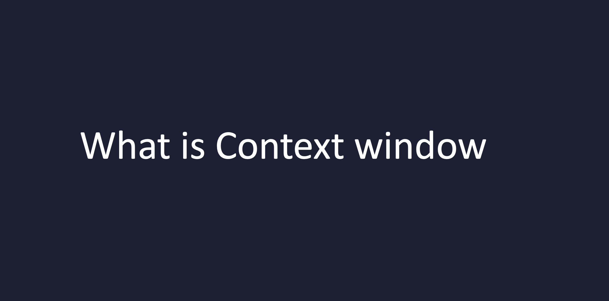

            * The context window is the limit on how much text the model can keep and process at once. It includes your messages, the model’s replies, and any other text in the conversation. If the conversation gets too long and goes beyond this limit, the model might start to forget what was said earlier.

            **Example** 

            * For GPT-3.5, the context window limit is approximately 8,000 tokens (one token typically represents about 4 characters on average). If the input text along with previous interactions (if any) exceeds the limit of LLM, the model may not be able to see or remember parts of the text that fall outside this window. This can result in errors or the inability to refer back to earlier parts of the conversation or document. 

            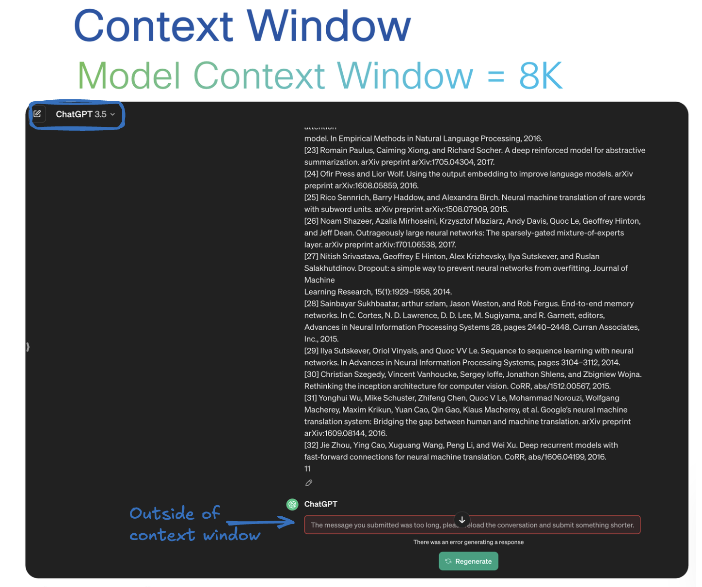

            !!! note
                A token can be as small as a piece of a word or as large as a word itself, depending on the language and complexity of the text.

            * Consider a model with a context window limit of 8,000 tokens. If we input 6,000 tokens and the model generates a response of 1,500 tokens, the total token count is 7,500. This is within the model's context window, so all information is processed correctly.
            Conversely, if the input increases to 10,000 tokens and the response remains at 1,500 tokens, the total becomes 11,500 tokens. This exceeds the model's 8,000-token limit. Consequently, the model might lose context or be unable to respond properly as the excess information falls outside its context window. This demonstrates the importance of managing input size to stay within the model's processing capabilities.

            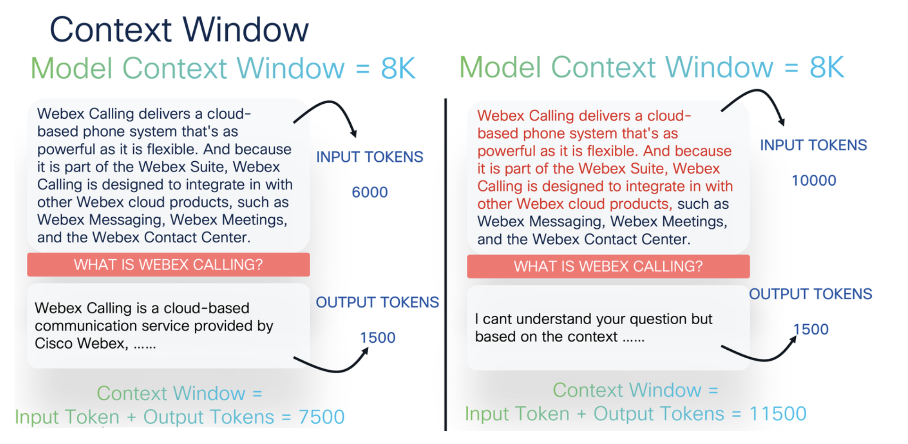

            <p align="right"><a href="http://127.0.0.1:8000/Task5/#__tabbed_1_2" class="md-button md-button--primary">Next</a></p>

        === "How Context window work"
            
            * In the below example , multiple potential predicted words exist, but the model chooses the words based on the surrounding context and their probability. However, if the context window size increases and the word "Webex" moves out of the window, the model may lose critical context. As a result, the next predicted word might be incorrect, as the model can no longer reference "Webex" to inform its predictions accurately. This highlights the importance of keeping key information within the context window to maintain the accuracy of the model's predictions.

            * Additionally, the temperature setting in the model can influence the type of content it generates. Lower temperatures are useful for summarizing or generating more deterministic and concise outputs, while higher temperatures encourage creativity, making the model more suitable for writing stories or poems. Adjusting the temperature allows you to control the balance between predictability and creativity in the model's output.

            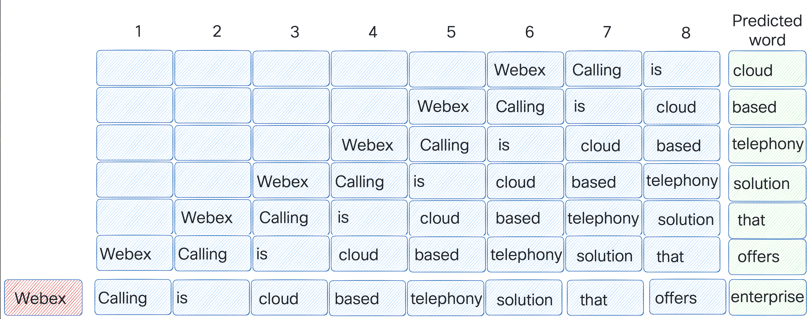

            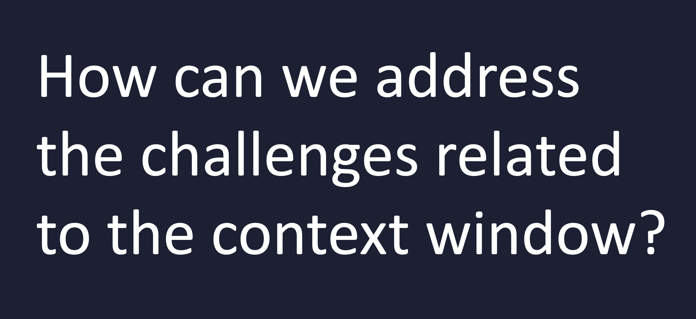

            * Thats where RAG come into play

            <p align="right"><a href="http://127.0.0.1:8000/Task5/#__tabbed_2_1" class="md-button md-button--primary">Next</a></p>


???+ blank "Retrieval Augmented Generation (RAG)"

    ??? info "Introduction"

        === "Introduction"

            Let's start by understanding what RAGs are before examining how they address context window issues.

            RAG = Retrieval Augmented Generation

            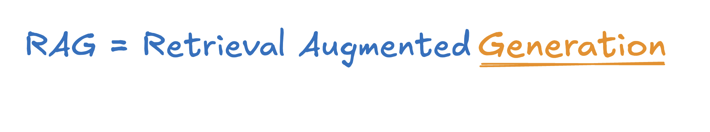

            !!! important
                Lets focus on the <span class="colour" style="color:red">Generation </span>part. Generation basically means responding to user query. For example, you might ask the model whether DX or Navigators are compatible with supporting ThousandEyes.

            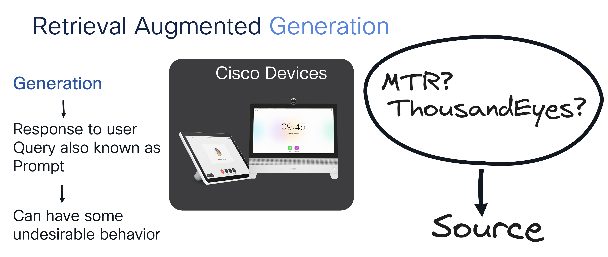

            That's an excellent question. LLMs are trained on vast amounts of historical data, so they may recognize that DX and Navigators are well-regarded Cisco products. As a result, the LLM might confidently respond that you can install ThousandEyes on those devices. However, the issue is that the response may lack a verifiable source to back up that claim or the information can be out-of-date  

            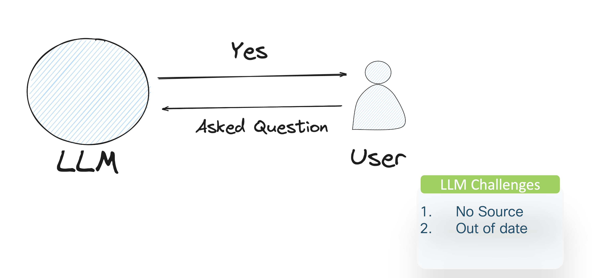

            What if, instead of just asking the question, I had first consulted a reputable source and only then informed the user that ThousandEyes can't be installed on those devices? This is where Retrieval-Augmented Generation comes into play. By integrating a knowledge base such as PDFs, CSVs, images, and other resources into the model, we ensure that any time a question is asked, the response is based on the most current and accurate information available.

            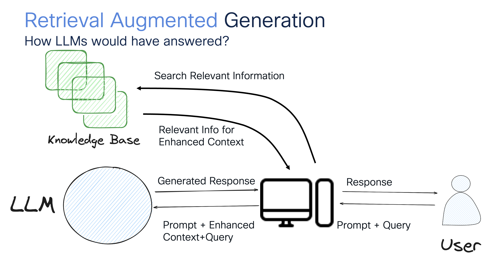

            <p align="right"><a href="http://127.0.0.1:8000/Task5/#__tabbed_2_2" class="md-button md-button--primary">Next</a></p>

        === "How can RAG address the limitations we've seen with the context window?"
            
            To address the context window limitation, we can use an embedding model to convert relevant text into embeddings and store them in a vector database (covered in the previous section). When a user submits a query, we transform it into an embedding and compare it to the stored embeddings to find the closest match. Once we identify the match, we retrieve that specific chunk of text to respond to the query. This approach effectively overcomes the context window limitation by ensuring that our responses are accurate and contextually relevant.

            Now you can see how RAG can address some of the challenges with LLMs. Instead of re-training or fine-tuning the model with new information, we can augment our data sources to retrieve the most up-to-date information. Additionally, LLMs are now instructed to prioritize primary source data before generating responses, making them less likely to hallucinate and encouraging more accurate and reliable outputs.

            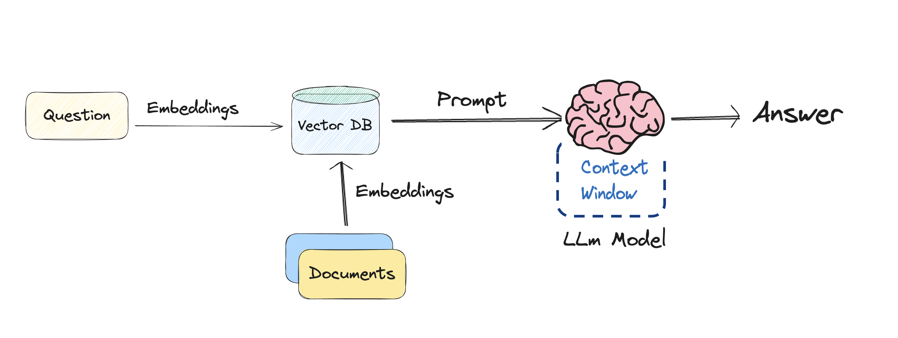

            <p align="right"><a href="http://127.0.0.1:8000/Task5/#__tabbed_2_3" class="md-button md-button--primary">Next</a></p>

        === "What's Happening Under the Hood?"

            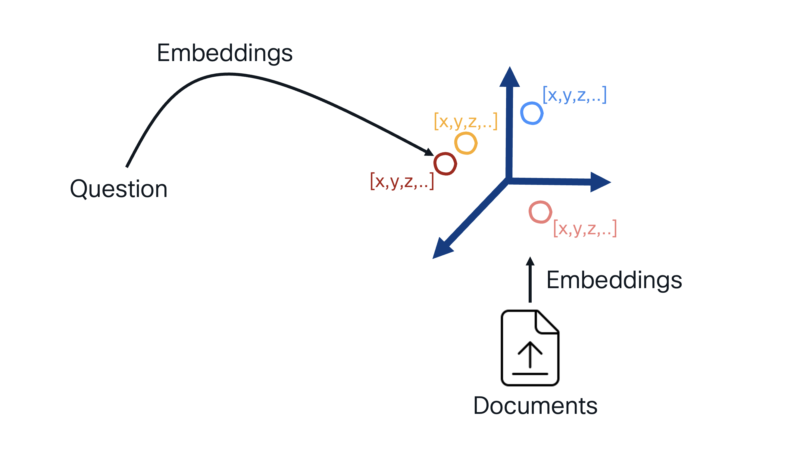

            We normally start by taking multiple documents and converting them into embeddings. Imagine these embeddings as points in a 3D space, where each document is projected based on its semantic meaning or content. Documents located near each other in this space contain similar semantic information, which is crucial when we search for or retrieve information.

            Now, when we receive a query, we also convert it into an embedding (numerical value). We then perform a similarity search in a multidimensional space, looking for the documents that are closest to our query's embedding. These nearby documents are likely to contain the most relevant information.

            Once we've identified these matching documents, we retrieve the relevant sections (or "splits") and feed all this information into the LLM's context window, allowing it to generate a well-informed response.

            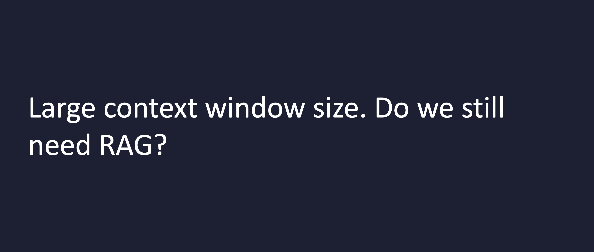

            We've seen models like Gemini Pro with a context window size of million, allowing them to retain more information. So, why use RAG? The answer is that RAG remains highly beneficial for sourcing real-time data,fact-checking, and accessing external knowledge that isn't contained within the context window.

            <p align="right"><a href="http://127.0.0.1:8000/Task5/#__tabbed_2_4" class="md-button md-button--primary">Next</a></p>

        === "LAB"

            === "Let's build a quick RAG application"

                While LLMs (Large Language Models) like GPT's , Llama, Gemini e.t.c possess impressive general knowledge, they don't inherently have access to your data. To connect LLMs with your own data sources, we can use frameworks like <span class="colour" style="color:red">LangChain</span>. These frameworks enable us to leverage our own data by breaking down documents into smaller chunks and storing them as embeddings in vector databases.

                This approach allows us to build applications that can effectively use language models. Example: When a user asks a question, we convert it into embeddings, perform a semantic search to find the most relevant answers, and then send both the question and the retrieved information to the LLM to generate a response.

                In this section, we'll continue using LangChain, but in the following chapters, we'll explore it in greater depth to gain a more thorough understanding of its functionality.

                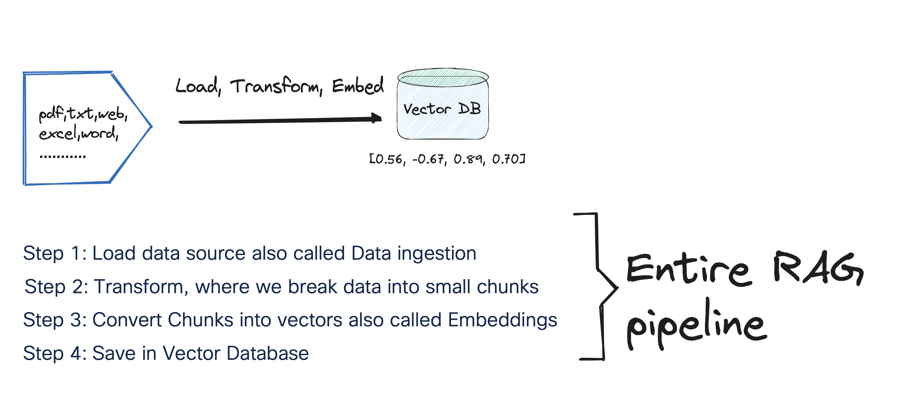

                !!! important
                    In this section, we will be using a version of <a href="https://www.cisco.com/c/dam/en/us/td/docs/voice_ip_comm/cuipph/MPP/6800-DECT/deployment/CiscoDECT6800DeploymentGuide.pdf" target="_blank">Cisco DECT 6800 Deployment Guide</a>.  For the purposes of this lab, I've modified the original PDF by removing a few pages and saving it as a new file. 

                !!! note
                    The PDF we are using in this lab can be downloaded from [here](./assets/static/dect.pdf){:target="_blank" download="dect.pdf"}</span>

                !!! important
                    

                * Open Google Colab and create a new notebook. Click on "File" > "New notebook". Please refer to the [following section](Task1.md) to create Google Colab account.

                

                * Make sure you are connected to a runtime. For this task, you can use the CPU as the runtime environment.

                

                * Within your existing Google Colab notebook navigate to the new “Secrets” section in the sidebar.

                

                !!! important

                    - If not already done, Click on “Add a new secret.” Enter the name example: OPENAI_API_KEY and value of the secret(the API key created earlier). Note: The name is permanent once set. 

                    - The list of secrets is global across all your notebooks.

                    - Use the “Notebook access” toggle to grant or revoke access to a secret for each notebook.

                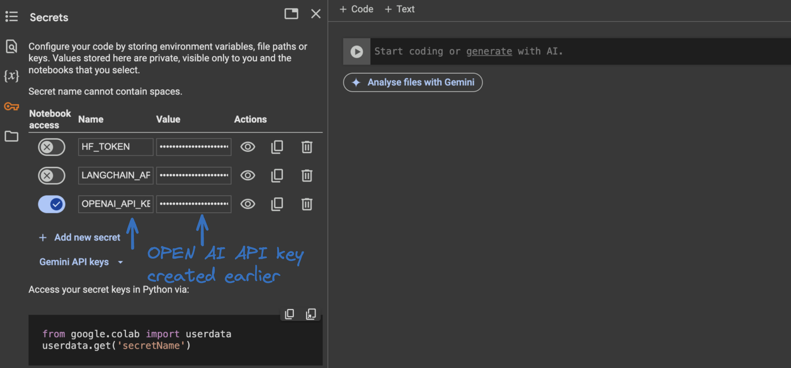

                *  Let's load our PDF files into Google Colab. For this example, we can use the [modified DECT guide](./assets/static/dect.pdf){:target="_blank" download="dect.pdf"}

                * Within Google Colab, Click on Folder and create a new folder called "data"

                

                * Click on [...], select Upload. Make sure you choose your dect.pdf file 

                

                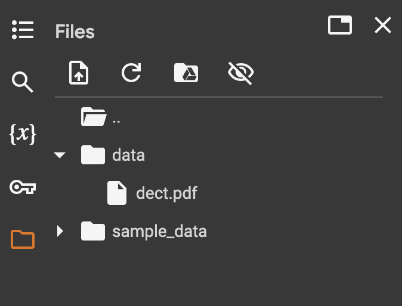

                * First let’s install the necessary Python packages. Click "Restart Session", once the below packages are installed.

                ```py linenums="1"
                !pip install langchain langchain_community langchain-openai python-dotenv chromadb pymupdf
                ```

                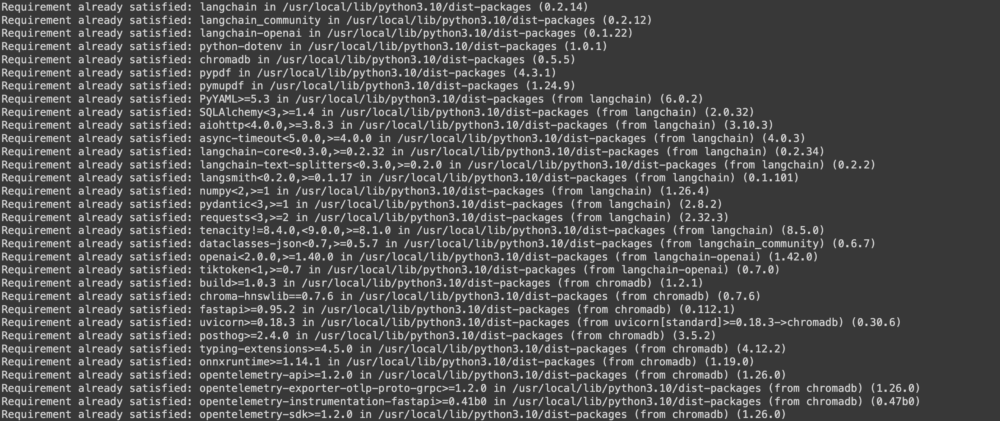

                !!! note
                    Please remember to let each cell finish executing before moving on to the next one.

                * Let's retrieve a OpenAI API key and set it as an environment variable within the Colab environment

                ```py linenums="1"
                import os
                from google.colab import userdata
                os.environ['OPENAI_API_KEY'] = userdata.get('OPENAI_API_KEY')
                ```

                * Let's import relevant libraries for RAG

                ```py linenums="1"
                from langchain import hub
                import os
                from langchain.text_splitter import RecursiveCharacterTextSplitter
                from langchain_community.document_loaders import WebBaseLoader
                from langchain_community.vectorstores import Chroma
                from langchain_core.output_parsers import StrOutputParser
                from langchain_core.runnables import RunnablePassthrough
                from langchain_openai import ChatOpenAI, OpenAIEmbeddings
                from dotenv import load_dotenv
                from langchain.document_loaders import PyMuPDFLoader
                # load_dotenv()
                ```

                !!! note
                    If you receive any warnings related to langchain_community, or "USER_AGENT environment variable not set", you can safely ignore it. This does not affect functionality, especially in Google Colab.
                    or  you can always insert the following command os.environ["USER_AGENT"] = "MyLangChainApp/1.0"

                * Next let’s load the data source. This is also known as “Data Ingestion”.

                ```py linenums="1"
                loader = PyMuPDFLoader("/content/data/dect.pdf")
                docs = loader.load()
                ```

                * Transform, where we break data into small chunks. We can use techniques like RecursiveCharacterTextSplitter or tiktoken for tokenizing text.

                ```py linenums="1"
                text_splitter = RecursiveCharacterTextSplitter(chunk_size=1000, chunk_overlap=200)
                splits = text_splitter.split_documents(docs)
                ```

                !!! important
                    RecursiveCharacterTextSplitter Covered in previous section

                * Let's create our embeddings. As discussed in the Embedding section, there are multiple techniques available. In this lab, we will use OpenAI embeddings. By default, the text-embedding-ada-002 model is used, but we can also opt for the text-embedding-3-large model if desired. Once the embeddings are created, they can be stored in a Vector Database. 
                While there are various databases available, as covered in the Embeddings and Vector DB section, in our example, we will use the Chroma Vector DB, which can be easily deployed locally on your machine. 
                We will also create a retriever by using  retriever = vectorstore.as_retriever() which converts the vector store into a retriever object. This retriever can then be used to find and retrieve documents or data from the vector store that are most relevant to a given query, based on the similarity of their embeddings.

                ```py linenums="1"
                vectorstore = Chroma.from_documents(documents=splits, 
                                                    embedding=OpenAIEmbeddings(model="text-embedding-3-large"))

                retriever = vectorstore.as_retriever()
                ```

                !!! note
                    We are using Chroma dB but you have options to use other databases as well such as Faiss. 
                    Also we can use [embeddings from Ollama](https://python.langchain.com/v0.2/docs/integrations/text_embedding/ollama/), an open-source and cost-free embedding solution. Below is a code snippet for your reference only:

                    !!! important

                        ``` 
                        # from langchain_community.embeddings import OllamaEmbeddings
                        # embeddings = OllamaEmbeddings()
                        ``` 

                !!! note
                    More info on Vector Databases can be found <a href="https://python.langchain.com/v0.2/docs/integrations/vectorstores/" target="_blank">here</a>

                * At this stage, we've loaded the document, created splits, converted them into embeddings, and stored them in the Vector DB (without passing anything to the LLM yet). Now, let's query the database to ensure we can retrieve the information.

                ```py linenums="1"
                query = "what is the Quick Set up and Installation Process for the Dect phones"
                result = vectorstore.similarity_search(query)
                print(result[0].page_content)
                ```

                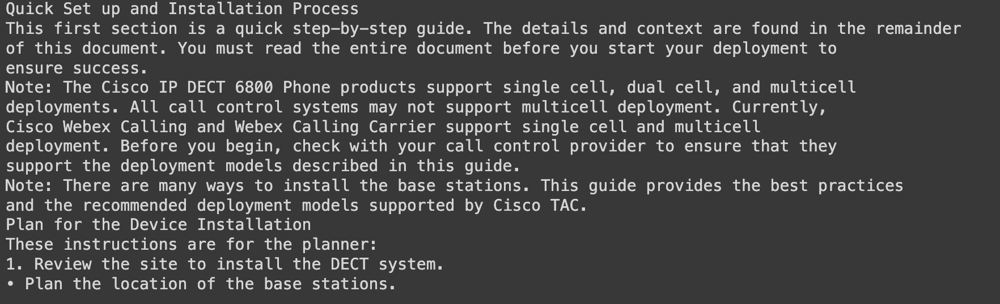

                * Let's now create our prompt. There are several ways to do this, you can either craft it manually or use prompts that have already been made available on the LangChain Hub. In this section, I'll demonstrate how to pull a prompt from the LangChain Hub and use it. 
                First browse to <a href="https://smith.langchain.com/" target="_blank">Langmith</a> and create an account or use the tmedemouserX account to signin. In this example, I'll use Google to sign up for a Langsmith account, but feel free to choose the option that works best for you.

                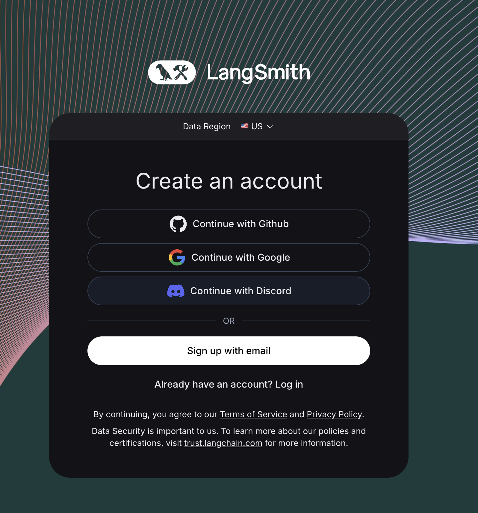

                * Create your API Key

                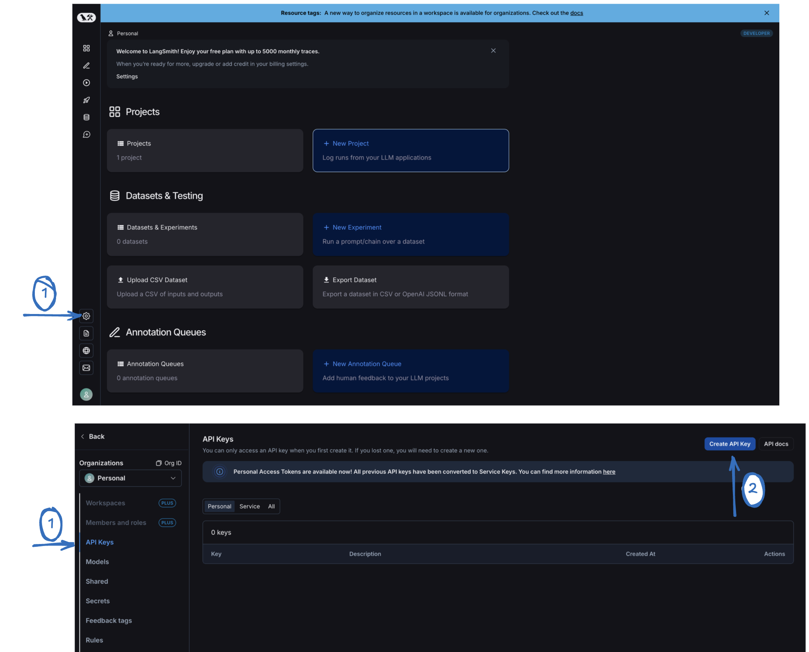

                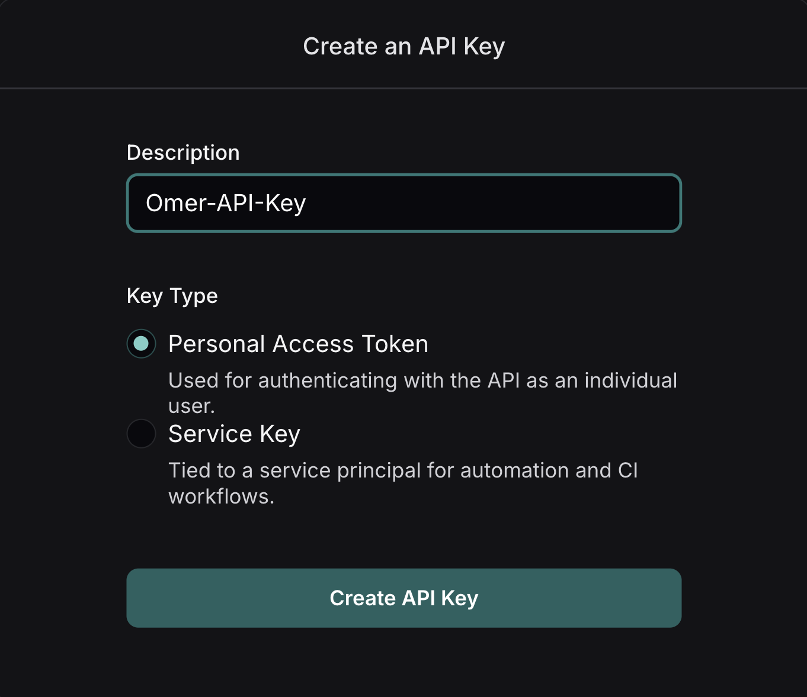

                * You can either enter your key in the secret folder or paste it manually here.

                !!! note
                    You can also use the key that was sent to your tmedemouserX account.

                ```py linenums="1"
                os.environ["LANGCHAIN_API_KEY"] = "PASTE-YOUR-KEY-HERE"
                ```

                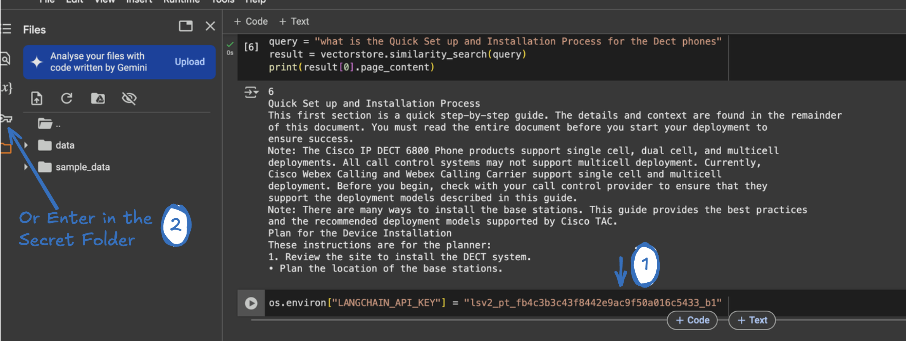

                * We will be using a LangChain template prompt, which allows us to define and reuse structured prompts easily. In the example below, we're pulling a pre-defined prompt from a repository using hub.pull() and assigning it to the variable prompt. This can help us streamline the workflow, especially when dealing with large language models.

                ```py linenums="1"
                prompt = hub.pull("rlm/rag-prompt")
                prompt
                ```

                !!! note
                    You can see the prompt template, 
                    <span style="color:red">OUTPUT:</span>
                    "You are an assistant for question-answering tasks. Use the following pieces of retrieved context to answer the question. If you don't know the answer, just say that you don't know. Use three sentences maximum and keep the answer concise.\nQuestion: {question} \nContext: {context} \nAnswer:"

                * To retrieve the template message only, you can also execute the following command:

                ```py linenums="1"
                req1 = prompt.messages[0].prompt.template
                req1
                ```

                !!! note
                    Here's an example of a manual prompt for your reference only—if you prefer not to use the downloaded prompt.

                    ``` title="Reference ONLY"
                    template = """Answer the question based only on the following context:
                    {context}
                    Question: {question}
                    """
                    ```

                * We can now connect LLMs to our data sources. In this lab, we are using OpenAI models, but feel free to use open-source models if you prefer.

                ```py linenums="1"
                llm = ChatOpenAI(model_name="gpt-4o", temperature=0)
                def format_docs(docs):
                    return "\n\n".join(doc.page_content for doc in docs)
                ```

                *  Lets use the Retrieval-Augmented Generation (RAG) pipeline to put all together. We will use retriever | format_docs to retrieve relevant documents (or context) related to the input question and formats them. The RunnablePassthrough method will be used to  simply pass the question  without modifying it.


                ```py linenums="1"
                Question = "Quick Set up and Installation Process for dectphone and summarise"
                #  Chain that wik take our input question from below
                rag_chain = (
                    {"context": retriever | format_docs, "question": RunnablePassthrough()}
                    | prompt
                    | llm
                    | StrOutputParser()  # This component parses the LLM's output, typically converting it into a string format for easy use.
                )
                req = rag_chain.invoke(Question)
                print(req)
                ```

                !!! note
                    When we pass our question into the rag_chain.invoke() method, it first goes through the retriever component that we set up earlier. The retriever uses the same embedding model, text-embedding-3-large, to transform the  question into an embedding vector. This vector is then compared with the embeddings of documents stored in the Chroma vector store to identify the most relevant ones. Once these relevant documents are retrieved based on the similarity of their embeddings, they are sent along with the original question to the language model (LLM), which then generates a response.</span>

                !!! note

                    <span style="color:orange">OUTPUT</span>
                    To set up and install a DECT phone system, first review the site and plan the location of the base stations, ensuring they are within 50 meters of each other for good coverage. Upgrade the base stations to the latest firmware, configure them according to the Cisco IP DECT 6800 Series Administration Guide, and unpack and prepare the handsets. Finally, mount the base stations, place the handsets in their cradles, and make a few test calls to ensure everything is working correctly.

                <p align="right"><a href="http://127.0.0.1:8000/Task5/#__tabbed_3_2" class="md-button md-button--primary">Next</a></p>

            === "Measuring Vector Similarity Using Cosine Similarity"
                
                Cosine similarity is a metric used to measure how similar two vectors are, regardless of their magnitude. It is particularly useful in the context of text analysis, information retrieval, and machine learning, where it is often used to compare the similarity of two text documents, sentences, or any other data that can be represented as vectors. In our code, we will use it to match the similarity between the question we asked and the answer we receive.

                * Lets create a function that calculates the cosine similarity between two vectors by using dot product a scalar value. 

                ```py linenums="1"
                # Define the cosine similarity function
                import numpy as np
                # Define the cosine similarity function
                def cosine_similarity(vec1, vec2):
                    dot_product = np.dot(vec1, vec2)
                    norm_vec1 = np.linalg.norm(vec1)
                    norm_vec2 = np.linalg.norm(vec2)
                    return dot_product / (norm_vec1 * norm_vec2)
                ```


                * We will now convert the question into an embedding, retrieve the embedding of our question, and the embeddings of the documents retrieved by the retriever.

                ```py linenums="1"
                # Convert the question into an embedding
                embedding_model = OpenAIEmbeddings(model="text-embedding-3-large")
                question_embedding = embedding_model.embed_query(Question)
                retrieved_docs = retriever.invoke(Question)
                ```

                !!! note
                    If you receive any warnings related to langchain, you can safely ignore this warning.

                * Lets calculate and print similarity between the question and each retrieved document

                ```py linenums="1"
                for doc in retrieved_docs:
                    # Assuming your retriever does not provide embeddings directly, re-embed each document
                    doc_embedding = embedding_model.embed_query(doc.page_content)
                    similarity = cosine_similarity(question_embedding, doc_embedding)
                    print(f"Document: {doc.page_content[:100]}...")  # Print a preview of the document
                    print(f"Cosine Similarity: {similarity}\n")
                ```

                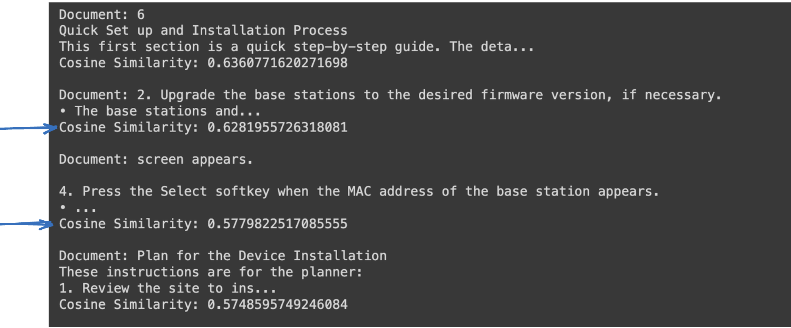

                !!! note
                    Cosine similarity values range from -1 to 1, where 1 means the vectors are identical, 0 means they are completely different, and values closer to 1 indicate greater similarity.  In our example where one similarity score is 0.63 and another is 0.57, the document with a score of 0.63 is more similar to the query than the one with 0.57. Both scores indicate a moderate similarity to the query, but the document with 0.63 contains slightly more relevant information. </span>
                    
                <p align="right"> 👉 This concludes the task. Click the <strong>"Multimodal RAG"</strong> Task on the left. </p>
