# Multimodal RAG

???+ blank "Multimodal RAG"

    ??? info "Introduction"

        === "Introduction"

            In the previous section, we explored RAG systems primarily designed for handling text. However, in real-world scenarios, many documents within organizations contain valuable information in the form of images, tables, and other non-text elements. 

            When building a robust RAG system, it's crucial to have the capability to retrieve not just text-based information but also relevant images and other visual data. This multimodal approach significantly enhances the effectiveness of information retrieval. In this section, we will explore methods to retrieve both images and text in response to user queries, enabling a more comprehensive and efficient RAG based system.

            <p align="right"><a href="http://127.0.0.1:8000/Task6/#__tabbed_1_2" class="md-button md-button--primary">Next</a></p>

        === "Three Different approaches for Multimodal RAG"

            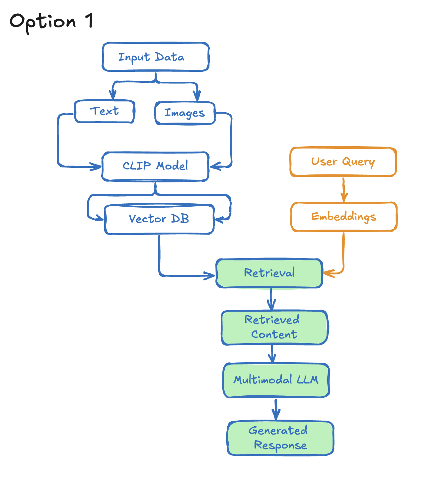

            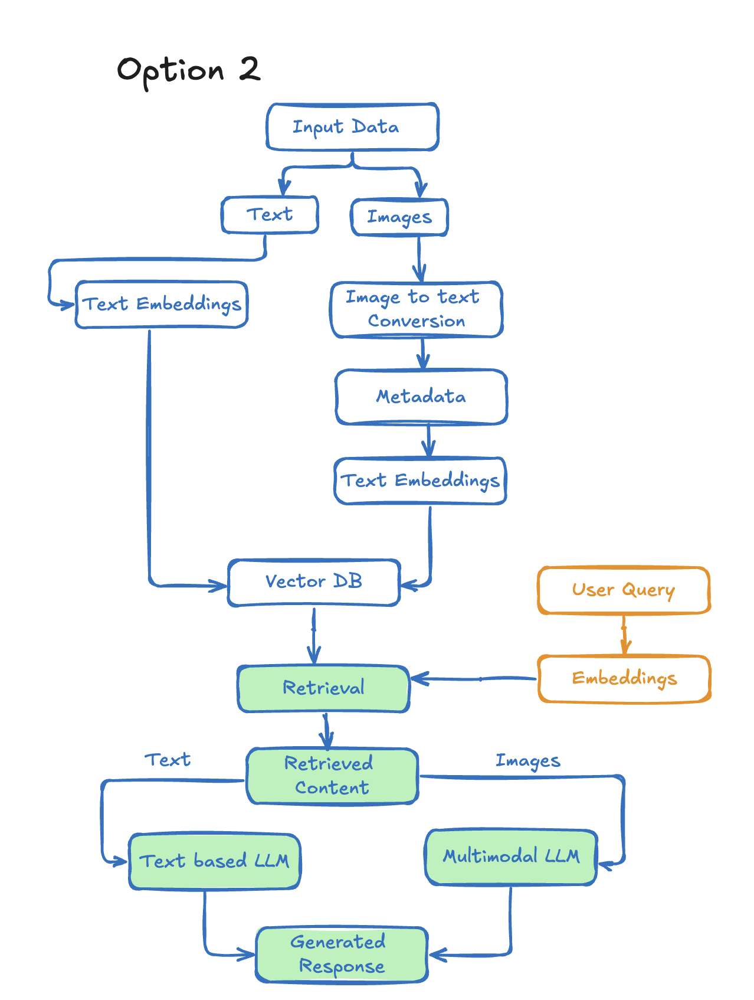

            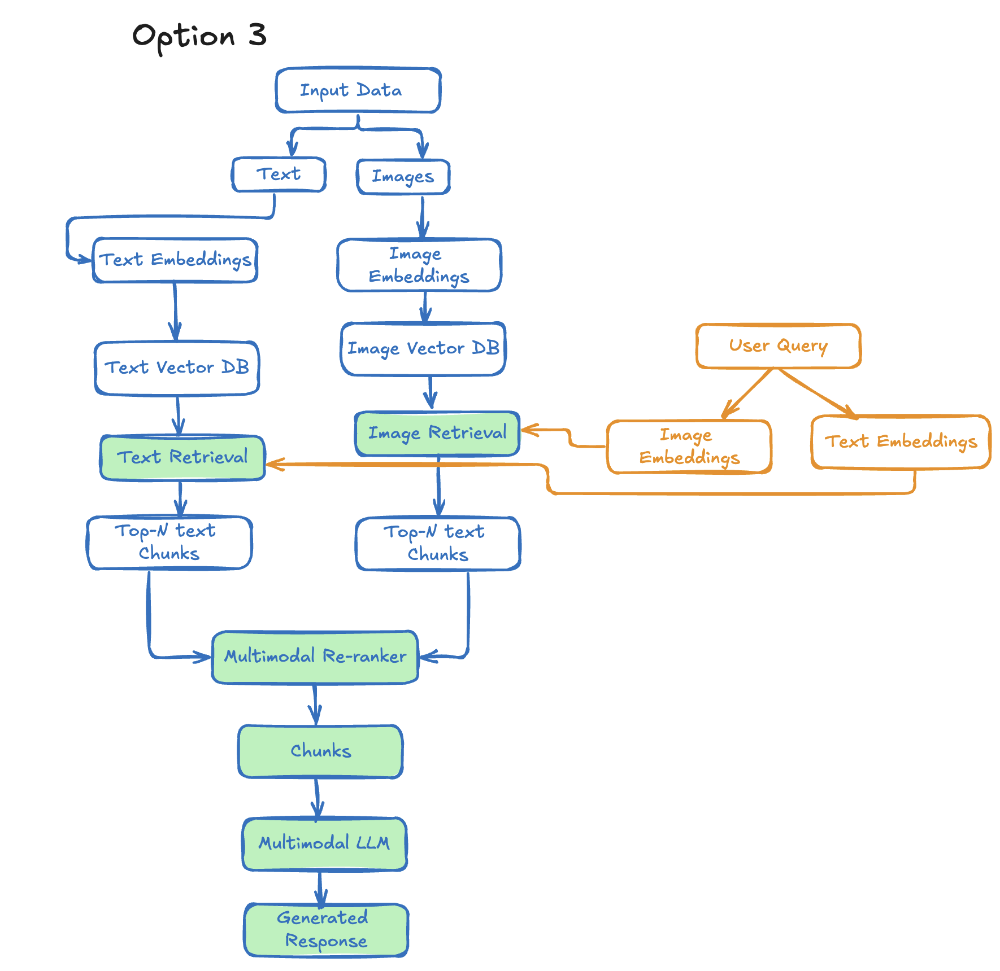

            !!! note

                We will be using Option 2 for our lab.

                Embedding for images can be done via CLIP model.

            === "Contrastive Language-Image Pretraining - CLIP Model"

                Unlike other embedding models that focus on a single modality, such as text or images, the <a href="https://openai.com/index/clip/" target="_blank">CLIP (Contrastive Language-Image Pretraining)</a>  was developed by OpenAI in 2021, handles multiple modalities by integrating both text and images.

                !!! note
                    CLIP models are embedding models, not traditional Large Language Models (LLMs).

                The primary function of CLIP (Contrastive Language-Image Pretraining) is to create a shared embedding space where both text and images are represented as vectors. The key idea is to learn representations where images and their corresponding text descriptions are close to each other in this embedding space, while unrelated image-text pairs are far apart. This allows CLIP to perform tasks like image classification, zero-shot learning, and text-to-image retrieval based on the semantic similarity between text and images. So in summary CLIP models create a relationship between images and text.

                <p align="right"><a href="http://127.0.0.1:8000/Task6/#__tabbed_2_2" class="md-button md-button--primary">Next</a></p>

            === "Zero-Shot Learning (ZSL)"
            
                Zero-Shot Learning (ZSL): This technique enhances the ability of AI systems to classify and recognize objects they have not been explicitly trained on. Instead of relying solely on trained data, ZSL uses auxiliary information to make predictions. For example, in an image classification scenario where a model is trained to recognize dogs and cats, if it encounters an image of a zebra (which the model has never seen before), it can still classify it correctly if it has auxiliary information describing a zebra as an animal with black and white stripes.

                Using ZSL, CLIP models can perform tasks they were not specifically trained on, in real-time. Essentially, they have capabilities similar to text-based embedding models. Just as we create chunks of text and use a user query to find similar text chunks, the same concept applies to images using CLIP.

                <p align="right"><a href="http://127.0.0.1:8000/Task6/#__tabbed_2_3" class="md-button md-button--primary">Next</a></p>

            === "OpenCLIP Model"
            
                It's important to note that the original CLIP model by OpenAI is not publicly available. However, people have taken the concepts from OpenAI's CLIP paper and developed open-source models like OpenCLIP.

                !!! note
                    <a href="https://github.com/mlfoundations/open_clip" target="_blank">OpenCLIP</a> is an open-source implementation and extension of the original CLIP (Contrastive Language-Image Pretraining) model developed by OpenAI.
                
                <p align="right"><a href="http://127.0.0.1:8000/Task6/#__tabbed_2_4" class="md-button md-button--primary">Next</a></p>

            === "Different types of Multimodal Embeddings and LLM"

                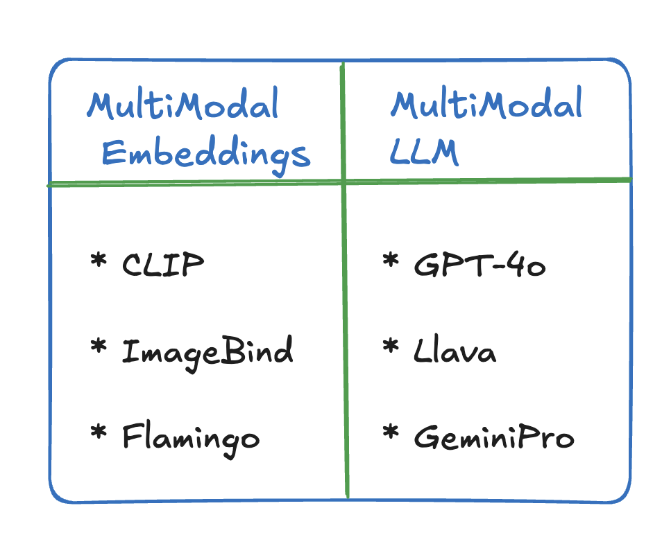

                * **Usecases for Multimodal RAG**

                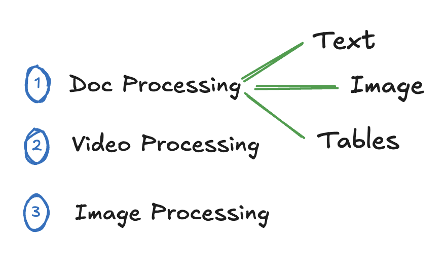

                Let’s continue by jumping over to our lab environment!

                <p align="right"><a href="http://127.0.0.1:8000/Task6/#__tabbed_4_1" class="md-button md-button--primary">Next</a></p>

    ??? info "Multimodal RAG"

        === "Deploy Multimodal RAG"
        
            Whenever we develop applications based on Large Language Models (LLMs), handling data is a crucial aspect. As discussed in the previous section (RAG), data injection is the initial step in this process. It's important to note that there are typically three types of data structure.

            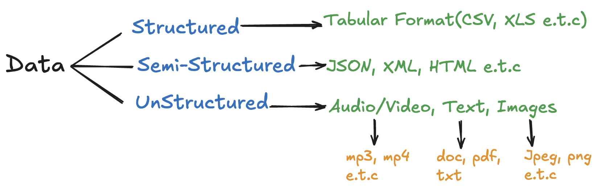

            === "Task 1: Log into the Lab Environment"
            
                

                * Open Google Colab and create a new notebook. Click on "File" > "New notebook". Please refer to the [following section](Task1.md) to create Google Colab account.

                

                * Change Runtime Environment: Click the “Runtime” dropdown menu at the top of the Colab interface.

                

                * Select “Change runtime type”: This will open a dialog box where you can configure the runtime environment.

                * Select Hardware Accelerator: From the “Hardware accelerator” dropdown menu, choose >> T4 GPU 

                

                * Save Settings: Click “Save” to apply the changes.

                !!! note
                    Whenever you want to copy the code in Google Colab and run it, be sure to click on + Code to add a new code cell.

                

                !!! important
                    Click the play button to the left of the code, or use the keyboard shortcut "Command/Ctrl+Enter" while the cell is selected.

                

                <p align="right"><a href="http://127.0.0.1:8000/Task6/#__tabbed_4_2" class="md-button md-button--primary">Next</a></p>

            === "Set OpenAI token - MultiModal"
                
                !!! important
                    First, create an account from the [OpenAI official website](https://platform.openai.com/).If you’ve already obtained the token in a previous step or section, you can skip this part. It should be in the .txt file you downloaded at the beginning of the lab. If you’ve already completed this step, please ignore it and jump to the “Update Google Colab Environment” section.

                * Create a new project API key by browsing to [API Keys web page](https://platform.openai.com/api-keys). Select Create new secret key. The API key is automatically generated. Save the APi Key as we will be using it in the later steps .

                

                * Within your existing Google Colab notebook navigate to the new “Secrets” section in the sidebar.

                

                * Click on “Add a new secret.” Enter the name example: OPENAI_API_KEY and value of the secret(the API key created above). Note: The name is permanent once set. 

                * The list of secrets is global across all your notebooks.

                * Use the “Notebook access” toggle to grant or revoke access to a secret for each notebook.

                

                <p align="right"><a href="http://127.0.0.1:8000/Task6/#__tabbed_4_3" class="md-button md-button--primary">Next</a></p>

            === "Update Google Colab envoirnment and install packages"
                !!! note
                    To avoid errors, overlap, or dependencies from previous tasks, open a new Google Colab notebook for this step. This will ensure a clean environment and prevent any potential issues related to previous work.

                PDFs often contain tables and other structured data that can be challenging to split accurately using character-based embedding techniques. For PDFs, it's important to extract and chunk all elements, including tables, effectively. We'll accomplish this using the <a href="https://unstructured.io/" target="_blank">Unstructured</a>, which is specifically designed for handling such tasks. If you have a large collection of PDFs, <a href="https://unstructured.io/" target="_blank">Unstructured</a> is an excellent tool to manage them efficiently.

                * Install relevant libraries including <a href="https://unstructured.io/" target="_blank">Unstructured</a> . Unstructured will partition PDF files by first removing all embedded image blocks. Then it will use a layout model (YOLOX) to get bounding boxes (for tables) as well as titles.

                ```py linenums="1"
                !pip install "unstructured[all-docs]" pillow pydantic lxml matplotlib langchain langchain_community chromadb langchain-experimental langchain_openai
                ```
                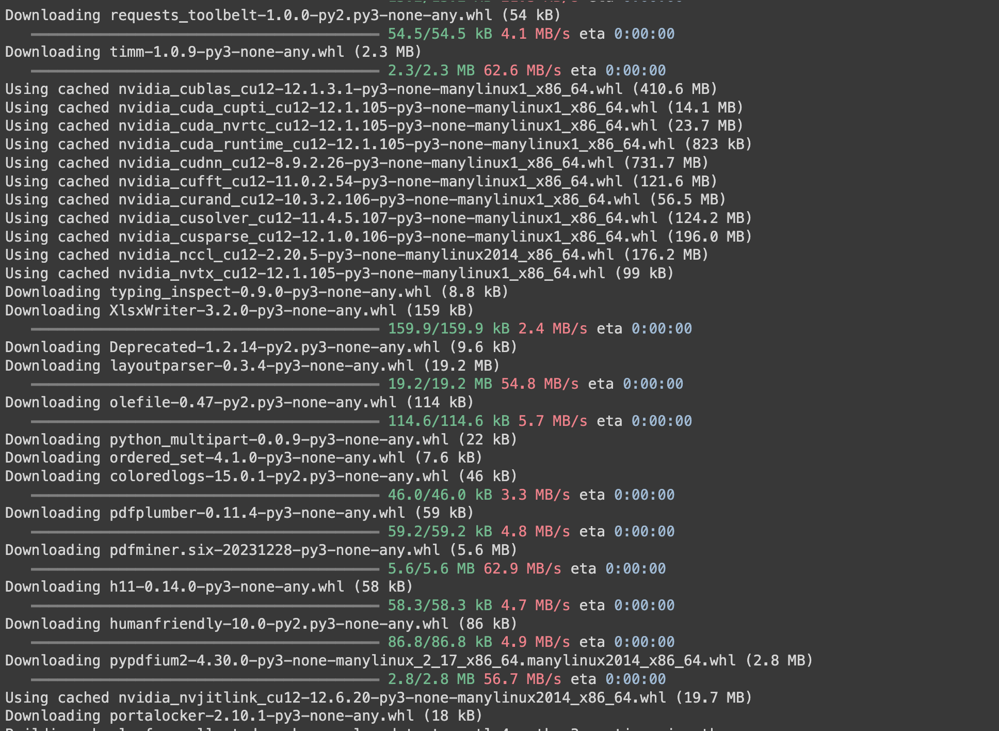

                !!! note
                    Make sure to RESTART your notebook after installing the packages

                * Since Google Colab is built on top of an Ubuntu environment, it's necessary to update the Google Colab environment to ensure we can effectively extract information from images or PDFs for analysis and processing.

                ```py linenums="1"
                !sudo apt-get update
                ```

                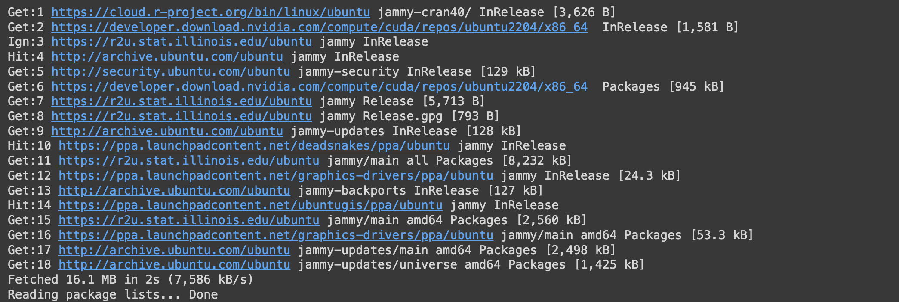

                * Poppler-utils will help us extracting info from our pdf

                ```py linenums="1"
                !sudo apt-get install poppler-utils
                ```

                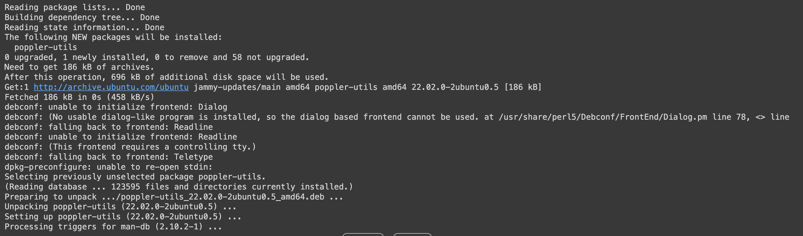

                ```py linenums="1"
                !sudo apt-get install libleptonica-dev tesseract-ocr libtesseract-dev python3-pil tesseract-ocr-eng tesseract-ocr-script-latn
                ```

                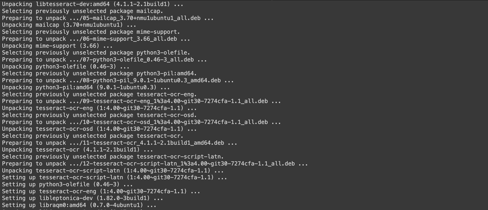

                ```py linenums="1"
                !pip install unstructured-pytesseract
                !pip install tesseract-ocr
                ```

                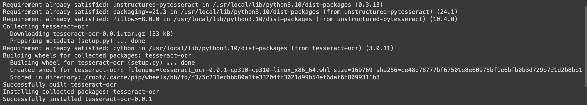

                * In Google Colab, I noticed some challenges with the NLTK library, so let's set the path correctly to resolve these issues.

                ```py linenums="1"
                import os
                # Set the NLTK_DATA environment variable to the correct path
                os.environ['NLTK_DATA'] = '/root/nltk_data'
                ```

                * Let's make sure we have nltk version 3.9.1 installed

                ```py linenums="1"
                !pip install --upgrade nltk
                ```

                * Check version of nltk
                ```
                import nltk
                print(nltk.__version__)
                ```

                ```
                import nltk
                nltk.download('punkt_tab')
                nltk.download('averaged_perceptron_tagger')
                nltk.download('averaged_perceptron_tagger_eng')
                ```

                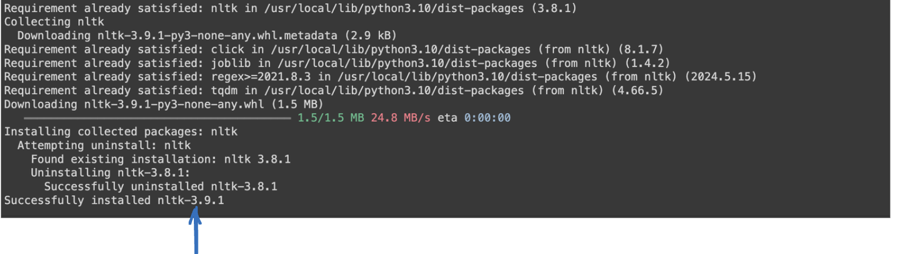

                * Let's load our data, by browsing to "PDF with table" tab

                <p align="right"><a href="http://127.0.0.1:8000/Task6/#__tabbed_4_4" class="md-button md-button--primary">Next</a></p>

            === "PDF with table"
            
                * Let's load our PDF files into Google Colab. For this example, we can use the article titled "Webex Customer Experience Essentials" from the [Webex Help Center](https://help.webex.com/en-us/article/72sb3r/Webex-Customer-Experience-Essentials). You can  [download the modified article here](./assets/static/CX-Essentials.pdf){:target="_blank" download="CX-Essentials.pdf"} as we will be using in the next step.

                !!! download
                    To save time and speed up processing in this lab, I have modified the CX-Essentials.pdf file by reducing it to only a few pages. You can download this version from the modified link provided above.

                * Within Google Colab, Click on Folder and create a new folder called "dat"

                

                * Click on [...], select Upload

                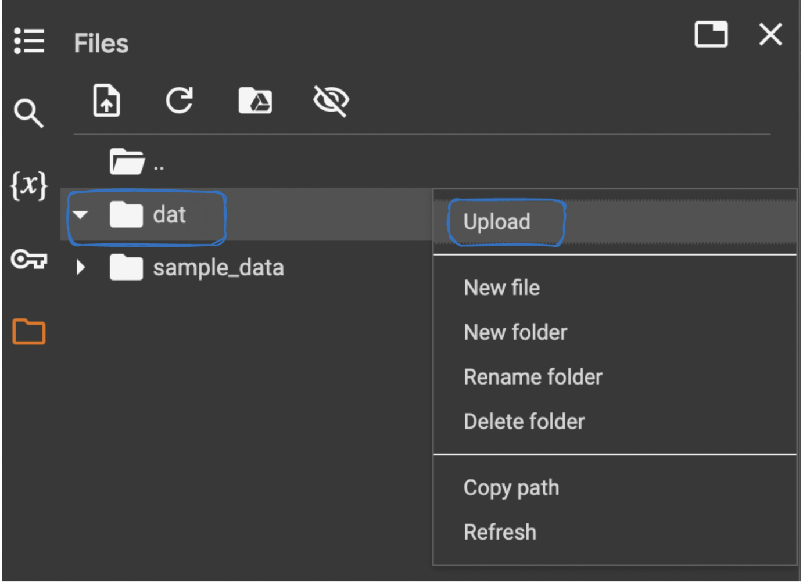

                * Choose your CX-Essentials.pdf file and click Open

                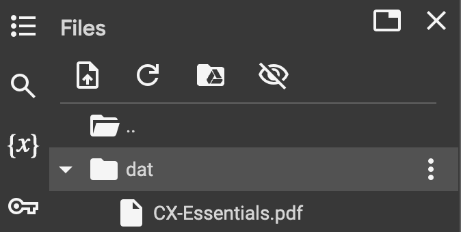

                * Let's process our PDF document by splitting it into smaller, manageable chunks based on titles, extracting images, and handling text in a way that ensures the chunks are neither too large nor too small. We will store the extracted elements (text, images, etc.) in the pdf_elements variable, and images are saved in the specified path(image_path). To understand more about <a href="https://docs.unstructured.io/open-source/core-functionality/partitioning#partition-csv" target="_blank">unstructured partition_pdf, click here</a>.

                !!! important 
                    Unstructured will partition PDF files by first extracting embedded images if specified. It then processes the document's layout, dividing the content into structured elements such as titles, tables, and paragraphs based on the layout and text structure. For more detailed layout analysis, it may use advanced models like YOLOX to identify and extract bounding boxes for elements like tables and titles. This allows for the precise extraction and organization of text and images, making the content more suitable for further analysis and processing.

                ```py linenums="1"
                from unstructured.partition.pdf import partition_pdf
                image_path = "./content/images"
                pdf_elements = partition_pdf(
                    filename="/content/dat/CX-Essentials.pdf",
                    chunking_strategy="by_title",
                    extract_images_in_pdf=True,
                    # extract_image_block_types=["Image", "Table"],
                    max_characters=3000, # Sets the maximum number of characters
                    new_after_n_chars=2800, # Character threshold after which a new chunk will start. Ensures  chunks are created before the max_characters limit is reached
                    combine_text_under_n_chars=2000, #If chunk of text is smaller than 2000 characters, it should be combined with the following chunk to create a more substantial piece 
                    image_output_dir_path=image_path
                )
                ```

                

                !!! note
                    This process may take a few minutes to complete as we are extracting information from the PDF.

                * You'll also notice that a folder has been created containing all the extracted images.

                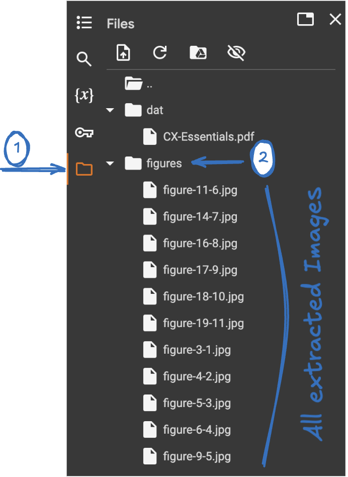

                !!! note
                    This images might differ in the lab

                * To see different elements from our pdf we can look into the variable

                ```py linenums="1"
                pdf_elements
                ```

                !!! important
                    Since we are working with a modified CX-Essentials.pdf file, you may notice that there are no pdf_elements for tables.

                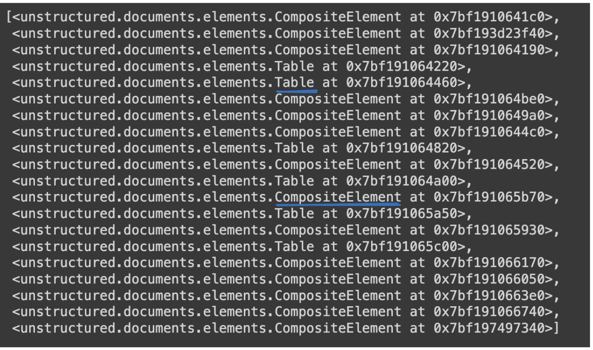

                * Let's categorize extracted elements from a PDF into two types: text elements and table elements. 

                ```py linenums="1"
                # Categorize elements by type
                def categorize_elements(raw_pdf_elements):
                    """
                    raw_pdf_elements: List of unstructured.documents.elements
                    """
                    tables = []
                    texts = []
                    for element in raw_pdf_elements:
                        if "unstructured.documents.elements.Table" in str(type(element)):
                            tables.append(str(element))
                        elif "unstructured.documents.elements.CompositeElement" in str(type(element)):
                            texts.append(str(element))
                    return texts, tables

                texts, tables = categorize_elements(pdf_elements)
                ```

                ```py linenums="1"
                texts
                ```

                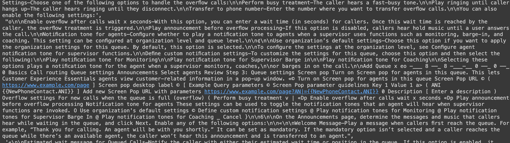

                ```py linenums="1"
                tables
                ```

                !!! note
                    The output will be blank when running the table command as the modified file doesnot have any tables.

                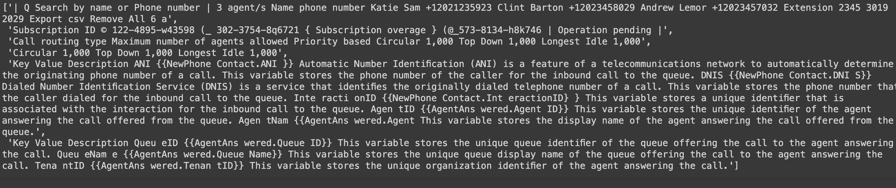


                * Let's now create summary from our data by passing the info to Multimodal model

                !!! note
                    We will be using GPT-4o as our Multimodal to create summary

                * Let's retrieve an OpenAI API key and set it as an environment variable within the Colab environment

                ```py linenums="1"
                import os
                from dotenv import load_dotenv
                from google.colab import userdata
                OPENAI_API_TOKEN=userdata.get('OPENAI_API_KEY')
                os.environ["OPENAI_API_KEY"] = OPENAI_API_TOKEN
                # load_dotenv()
                ```

                * Let's create a summary for our text element

                ```py linenums="1"
                from langchain.chat_models import ChatVertexAI
                from langchain.llms import VertexAI
                from langchain.prompts import PromptTemplate
                from langchain.schema.output_parser import StrOutputParser
                from langchain_core.messages import AIMessage
                from langchain_core.runnables import RunnableLambda
                from langchain_core.output_parsers import StrOutputParser
                from langchain_core.prompts import ChatPromptTemplate
                from langchain_openai import ChatOpenAI

                # Generate summaries of text elements
                def generate_text_summaries(texts, tables, summarize_texts=False):
                    """
                    Summarize text elements
                    texts: List of str
                    tables: List of str
                    summarize_texts: Bool to summarize texts
                    """

                    # Prompt
                    prompt_text = """You are an assistant tasked with summarizing tables and text for retrieval. \
                    These summaries will be embedded and used to retrieve the raw text or table elements. \
                    Give a concise summary of the table or text that is well-optimized for retrieval. Table \
                    or text: {element} """
                    prompt = PromptTemplate.from_template(prompt_text)
                    empty_response = RunnableLambda(
                        lambda x: AIMessage(content="Error processing document")
                    )
                    # Model
                    model = ChatOpenAI(temperature=0, model="gpt-4o")
                    summarize_chain = {"element": lambda x: x} | prompt | model | StrOutputParser()

                    # Initialize empty summaries
                    text_summaries = []
                    table_summaries = []

                    # Apply to text if texts are provided and summarization is requested
                    if texts and summarize_texts:
                        text_summaries = summarize_chain.batch(texts, {"max_concurrency": 1})
                    elif texts:
                        text_summaries = texts

                    # Apply to tables if tables are provided
                    if tables:
                        table_summaries = summarize_chain.batch(tables, {"max_concurrency": 1})

                    return text_summaries, table_summaries


                # Get text, table summaries
                text_summaries, table_summaries = generate_text_summaries(
                    texts, tables, summarize_texts=True
                )
                ```

                * Now Let's create summary for our images 

                ```py linenums="1"
                import base64
                import os

                from langchain_core.messages import HumanMessage

                def encode_image(image_path):
                    """Getting the base64 string"""
                    with open(image_path, "rb") as image_file:
                        return base64.b64encode(image_file.read()).decode("utf-8")

                def image_summarize(img_base64, prompt):
                    """Make image summary"""
                    model = ChatOpenAI(temperature=0, model="gpt-4o")
                    msg = model.invoke(
                        [
                            HumanMessage(
                                content=[
                                    {"type": "text", "text": prompt},
                                    {
                                        "type": "image_url",
                                        "image_url": {"url": f"data:image/jpeg;base64,{img_base64}"},
                                    },
                                ]
                            )
                        ]
                    )
                    return msg.content

                def generate_img_summaries(path):
                    """
                    Generate summaries and base64 encoded strings for images
                    path: Path to list of .jpg files extracted by Unstructured
                    """
                    # Store base64 encoded images
                    img_base64_list = []
                    # Store image summaries
                    image_summaries = []
                    # Prompt
                    prompt = """You are an assistant tasked with summarizing images for retrieval. \
                    These summaries will be embedded and used to retrieve the raw image. \
                    Give a concise summary of the image that is well optimized for retrieval."""

                    # Apply to images
                    for img_file in sorted(os.listdir(path)):
                        if img_file.endswith(".jpg"):
                            img_path = os.path.join(path, img_file)
                            base64_image = encode_image(img_path)
                            img_base64_list.append(base64_image)
                            image_summaries.append(image_summarize(base64_image, prompt))

                    return img_base64_list, image_summaries

                fpath = "/content/figures"
                # Image summaries
                img_base64_list, image_summaries = generate_img_summaries(fpath)
                ```

                ```py linenums="1"
                image_summaries[0]
                ```

                !!! important
                    This will generate a list of image summaries, each corresponding to an image in the figures directory. For example, if there are 11 images extracted from the PDF, you can access the summary for the 11th image by running: image_summaries[10]


                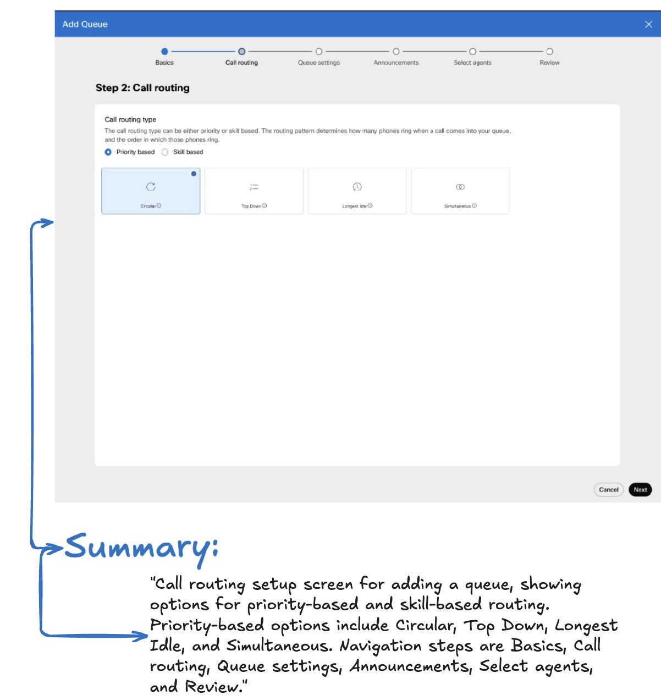

                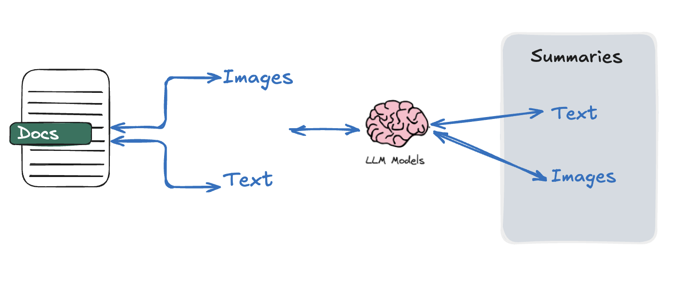

                * Let's now create our MultiVector Retriever and RAG system - incl storing summary embeddings in Vector DB. Lets jump to "Create our MultiVector Retriever" tab

                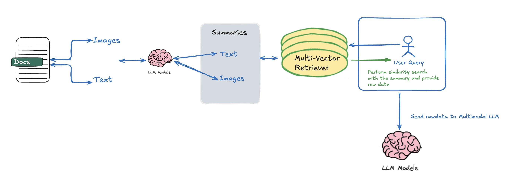

                <p align="right"><a href="http://127.0.0.1:8000/Task6/#__tabbed_4_5" class="md-button md-button--primary">Next</a></p>

            === "Create our MultiVector Retriever"
            
                * While on the same notebook, let's install packages for chroma, our in-memory db and MultiVectorRetriever

                ```py linenums="1"
                import uuid
                from langchain.retrievers.multi_vector import MultiVectorRetriever
                from langchain.storage import InMemoryStore
                from langchain_community.vectorstores import Chroma
                from langchain_core.documents import Document
                from langchain_openai import OpenAIEmbeddings
                ```

                ```py linenums="1"
                pip install -U langchain-chroma
                ```

                * Let's create our function to build a multi-vector retriever. We will use OpenAI embeddings and create a Chroma vector store to index our summaries. This function will allow us to index summaries of texts, tables, and images, while retrieving the raw data (texts, tables, or images) based on those summaries. By leveraging the OpenAI embeddings, our Chroma vector store will effectively handle and retrieve multimodal content.

                ```py linenums="1"
                import uuid

                from langchain.embeddings import VertexAIEmbeddings
                from langchain.retrievers.multi_vector import MultiVectorRetriever
                from langchain.schema.document import Document
                from langchain.storage import InMemoryStore
                # from langchain.vectorstores import Chroma
                from langchain_chroma import Chroma


                def create_multi_vector_retriever(
                    vectorstore, text_summaries, texts, table_summaries, tables, image_summaries, images
                ):
                    """
                    Create retriever that indexes summaries, but returns raw images or texts
                    """

                    # Initialize the storage layer
                    store = InMemoryStore()
                    id_key = "doc_id"

                    # Create the multi-vector retriever
                    retriever = MultiVectorRetriever(
                        vectorstore=vectorstore,
                        docstore=store,
                        id_key=id_key,
                    )
                    # Helper function to add documents to the vectorstore and docstore
                    def add_documents(retriever, doc_summaries, doc_contents):
                        doc_ids = [str(uuid.uuid4()) for _ in doc_contents]
                        summary_docs = [
                            Document(page_content=s, metadata={id_key: doc_ids[i]})
                            for i, s in enumerate(doc_summaries)
                        ]
                        retriever.vectorstore.add_documents(summary_docs)
                        retriever.docstore.mset(list(zip(doc_ids, doc_contents)))

                    # Add texts, tables, and images
                    # Check that text_summaries is not empty before adding
                    if text_summaries:
                        add_documents(retriever, text_summaries, texts)
                    # Check that table_summaries is not empty before adding
                    if table_summaries:
                        add_documents(retriever, table_summaries, tables)
                    # Check that image_summaries is not empty before adding
                    if image_summaries:
                        add_documents(retriever, image_summaries, images)

                    return retriever

                # The vectorstore to use to index the summaries
                vectorstore = Chroma(
                    collection_name="mm_ai_lab_cl",
                    embedding_function=OpenAIEmbeddings(),
                    # embedding_function=VertexAIEmbeddings(model_name="textembedding-gecko@latest"),
                )

                # Create retriever
                retriever_multi_vector_img = create_multi_vector_retriever(
                    vectorstore,
                    text_summaries,
                    texts,
                    table_summaries,
                    tables,
                    image_summaries,
                    img_base64_list,
                )
                ```

                ```py linenums="1"
                retriever_multi_vector_img
                ```

                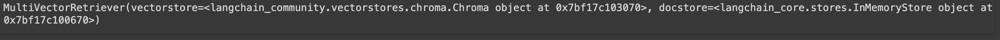


                ??? "Create our RAG (Multimodal)"

                    
                    * Let's create a multi_modal_rag_chain(retriever). This pipeline integrates both text and image data to enhance the quality of responses generated by an AI model

                    ``` py linenums="1"
                    import io
                    import re
                    import base64
                    from IPython.display import Image, display
                    from PIL import Image as PILImage
                    from langchain.schema.runnable import RunnableLambda, RunnablePassthrough


                    def looks_like_base64(sb):
                        """Check if the string looks like base64"""
                        return re.match("^[A-Za-z0-9+/]+[=]{0,2}$", sb) is not None

                    def is_image_data(b64data):
                        """
                        Check if the base64 data is an image by looking at the start of the data
                        """
                        image_signatures = {
                            b"\xFF\xD8\xFF": "jpg",
                            b"\x89\x50\x4E\x47\x0D\x0A\x1A\x0A": "png",
                            b"\x47\x49\x46\x38": "gif",
                            b"\x52\x49\x46\x46": "webp",
                        }
                        try:
                            header = base64.b64decode(b64data)[:8]  # Decode and get the first 8 bytes
                            for sig, format in image_signatures.items():
                                if header.startswith(sig):
                                    return True
                            return False
                        except Exception:
                            return False


                    def resize_base64_image(base64_string, size=(128, 128)):
                        """
                        Resize an image encoded as a Base64 string
                        """
                        # Decode the Base64 string
                        img_data = base64.b64decode(base64_string)
                        img = PILImage.open(io.BytesIO(img_data))

                        # Resize the image
                        resized_img = img.resize(size, PILImage.LANCZOS)

                        # Save the resized image to a bytes buffer
                        buffered = io.BytesIO()
                        resized_img.save(buffered, format=img.format)

                        # Encode the resized image to Base64
                        return base64.b64encode(buffered.getvalue()).decode("utf-8")

                    def split_image_text_types(docs):
                        """
                        Split base64-encoded images and texts
                        """
                        b64_images = []
                        texts = []
                        for doc in docs:
                            # Check if the document is of type Document and extract page_content if so
                            if isinstance(doc, Document):
                                doc = doc.page_content
                            if looks_like_base64(doc) and is_image_data(doc):
                                doc = resize_base64_image(doc, size=(1300, 600))
                                b64_images.append(doc)
                            else:
                                texts.append(doc)
                        if len(b64_images) > 0:
                            return {"images": b64_images[:1], "texts": []}
                        return {"images": b64_images, "texts": texts}

                    def img_prompt_func(data_dict):
                        """
                        Join the context into a single string
                        """
                        formatted_texts = "\n".join(data_dict["context"]["texts"])
                        messages = []

                        # Adding the text for analysis
                        text_message = {
                            "type": "text",
                            "text": (
                                "You are an AI scientist tasking with providing factual answers.\n"
                                "You will be given a mixed of text, tables, and image(s) usually of charts or graphs.\n"
                                "Use this information to provide answers related to the user question. \n"
                                f"User-provided question: {data_dict['question']}\n\n"
                                "Text and / or tables:\n"
                                f"{formatted_texts}"
                            ),
                        }
                        messages.append(text_message)
                        # Adding image(s) to the messages if present
                        if data_dict["context"]["images"]:
                            for image in data_dict["context"]["images"]:
                                image_message = {
                                    "type": "image_url",
                                    "image_url": {"url": f"data:image/jpeg;base64,{image}"},
                                }
                                messages.append(image_message)
                        return [HumanMessage(content=messages)]

                    def multi_modal_rag_chain(retriever):
                        """
                        Multi-modal RAG chain
                        """
                        model = ChatOpenAI(temperature=0, model="gpt-4o")

                        # RAG pipeline
                        chain = (
                            {
                                "context": retriever | RunnableLambda(split_image_text_types),
                                "question": RunnablePassthrough(),
                            }
                            | RunnableLambda(img_prompt_func)
                            | model
                            | StrOutputParser()
                        )

                        return chain

                    # Create RAG chain
                    chain_multimodal_rag = multi_modal_rag_chain(retriever_multi_vector_img)

                    ```

                    !!! challenge
                        Let's Query our Multimodal Retriever

                    * Open your CX-Essentials.pdf, and let's try querying some information from it.


                    ```py linenums="1"
                    query = """how can I Upgrade call queue from Customer Experience Basic to Customer Experience Essentials. explain images if any there as well"""
                    docs = chain_multimodal_rag.invoke(query)
                    print(docs)
                    ```


                    ```py linenums="1"
                    query = """how can I Assign Customer Experience Essentials license to users"""
                    docs = retriever_multi_vector_img.invoke(query, limit=1)
                    ```

                    ```py linenums="1"
                    # To display the image
                    for doc in docs:
                        if looks_like_base64(doc) and is_image_data(doc):
                            image_data = base64.b64decode(doc)
                            display(Image(data=image_data))
                        else:
                            print(doc)
                    ```
                    * You'll notice that in our multimodal RAG system, I'm now able to retrieve images, tables, and text seamlessly.

                    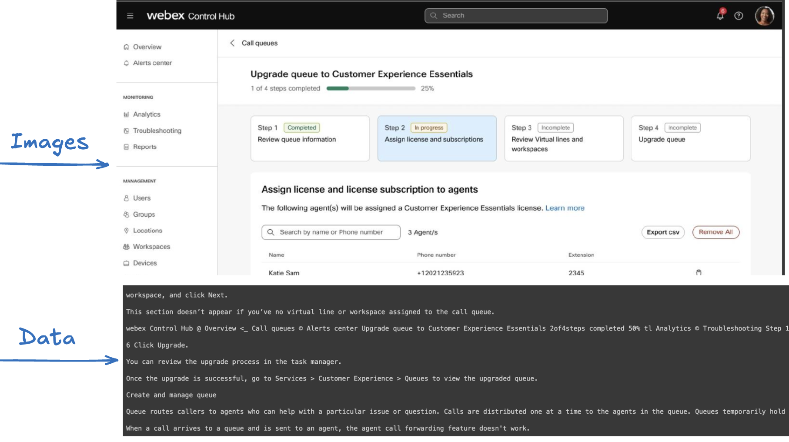

                    <p align="right"> 👉 This concludes the task. Click the <strong>"GenAI- Frameworks"</strong> Task on the left. </p>