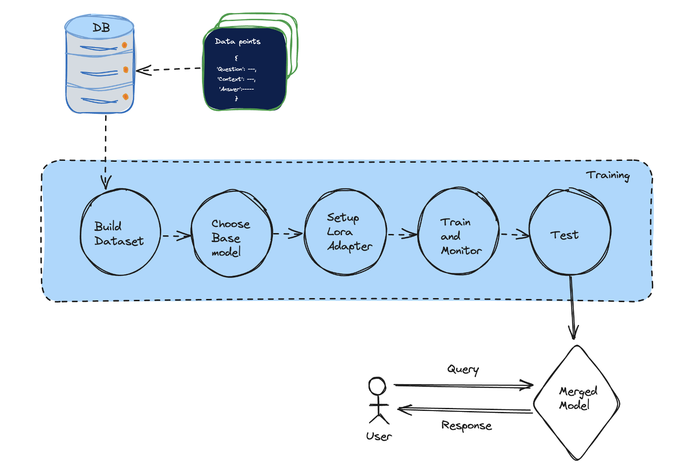

## Introduction

This diagram represents the workflow of training and using a LLM. Here’s a step-by-step explanation:

* Build Dataset: Once we have determined that fine-tuning is the right solution, we need to create a dataset to fine-tune our model. Datasets are collections of structured or unstructued data used to train machine learning models.
* Choose Base Model: A base model is selected. This could be a pre-trained model that will be fine-tuned with the new dataset e.g Llama2 or Llama3 (in our lab)
* Setup Lora Adapter: The LoRA (Low-Rank Adaptation) adapter is set up a technique used to fine-tune the model efficiently.
* Train and Monitor: The model is trained using the dataset. During training, the process is monitored to ensure it’s proceeding correctly and to make adjustments if necessary.
* Merged Model: Once the model has been tested and validated, it is considered a merged model. This model is ready to handle user queries.
* User Interaction: Users can now interact with the model by sending queries. The model processes these queries and returns appropriate responses.

## Pre-requisites

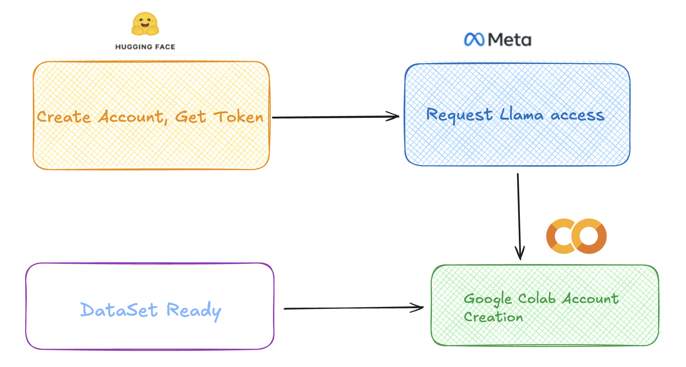

## UseCase 1 - Fine-Tuning Using Llama2

### Datasets Creation

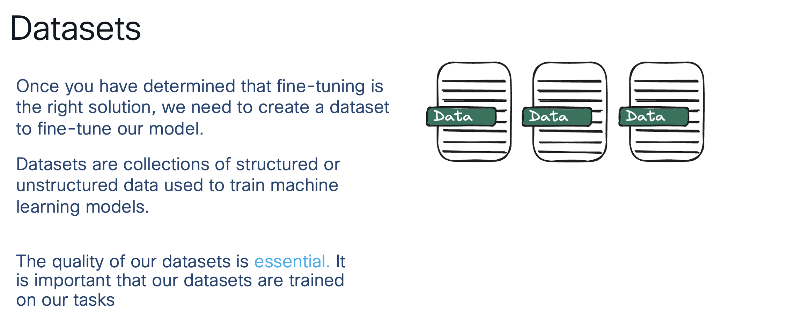

There are several ways to create datasets:

* Using existing open source datasets e.g. The Pile, Common Crawl , Wiki or even HuggingFace
* Using LLM to create synthetic datasets faster and can be less expensive
* Using your own custom datasets e.t.c <-- Focus for our lab

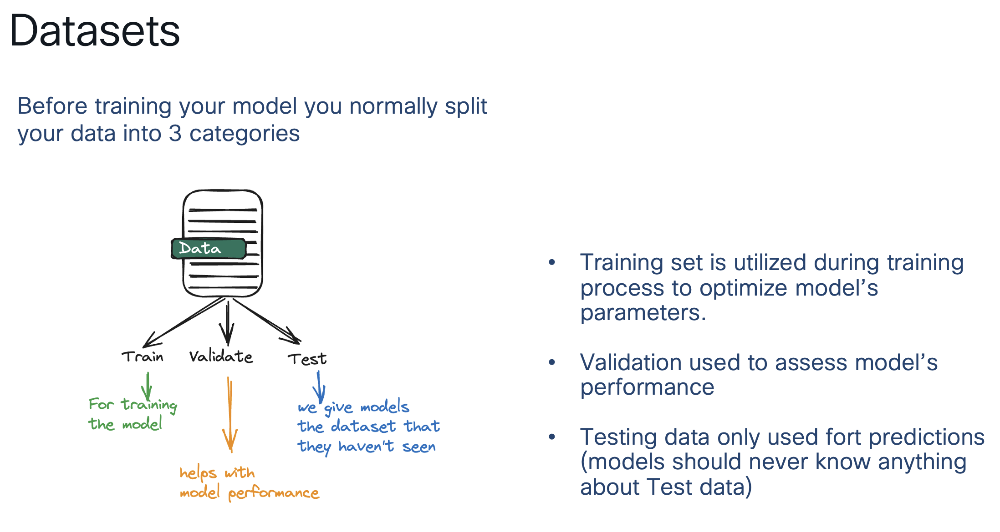

### Custom datasets

As we will be using and Fine-Tuning Llam2  we need to convert them(datasets) into a uniform format compatible with training regimens <a href="https://llama.meta.com/docs/model-cards-and-prompt-formats/other-models#meta-llama-2" target="_blank">More Info</a>

#### Example Format for Llama2

``` title="Sample Format - Dont Copy - reference ONLY"
<s>[INST] <<SYS>>
{{ system_prompt }}
<</SYS>>
{{ user_message }} [/INST] Model answer </s>
```

### Datasets Creation

After defining the problem and confirming that LLMs are a suitable solution, the next step is to prepare a dataset for fine-tuning. If you already have a clean, high-quality dataset, that's great. However, let's assume you don't have one readily available.

In my scenario, I was able to generate synthetic dataset from the [Cisco Preferred Architecture for Webex Calling](https://www.cisco.com/c/dam/en/us/td/docs/solutions/CVD/Collaboration/hybrid/AltDesigns/PA-WbxCall.pdf).

#### Creating a Dataset from a PDF - Summary

To delve into the intricacies of dataset creation, let's explore a scenario where we aim to train an AI to replicate our Preferred architecture. In this lab, we will transform a PDF document into a dataset. Specifically, we will use a PDF about Webex Calling as our source material.

Our goal is to convert the PDF into a dynamic and engaging dialogue, similar to an interview format. This will allow us to create a more interactive and informative dataset.

<span class="colour" style="color:red">Steps Involved</span>

<span class="colour" style="color:red">Converting the PDF to Text</span>

* Begin by extracting the text content from the PDF document.

<span class="colour" style="color:red">Paragraph Analysis and Segmentation:</span>

* Once the PDF is in text form, analyze and segment it into individual paragraphs. Combine short paragraphs and split longer ones to ensure each segment is coherent and self-contained, while still contributing to the overall narrative.

<span class="colour" style="color:red">Generating Interview Questions:</span>

* For each paragraph, create an artificial interview scenario where a language model (LLM) acts as the interviewer.
* Develop questions that naturally elicit responses based on the content of the paragraph.
* The objective is to simulate an insightful dialogue, making it seem as though the PDF is responding to questions about its content and experiences.

By following these steps, we will convert the static information in the PDF into a dynamic and interactive dataset, facilitating a deeper understanding and more engaging learning experience. You can find the complete code that worked for me [here](https://github.com/geronimi73/qlora-minimal/blob/main/book-to-QA.py).

Here's an example of the resulting file. Please note that for this lab demonstration, only a few data points were converted from the PDF.

<span class="colour" style="color:red">Note: We will use the following file to create and eventually train downstream tasks for our LLM, specifically the Llama2 model.</span>

[Download example.txt](./assets/static/example.txt){:target="_blank" download="example.txt"}

#### Sample File Content

``` JSON title="example.txt"
human_text: What is the solution provided by Webex Calling? assistant_text: Webex Calling provides enterprise-grade PBX features, functionality, and performance.
human_text: What options are available for PSTN access in Webex Calling? assistant_text: The options are Cisco Calling Plans, Cloud Connected PSTN, and Premises-based PSTN.
human_text: What type of devices does Webex Calling support? assistant_text: Webex Calling supports Cisco MPP Series IP Phones, Webex Devices, and a variety of third-party devices.
human_text: How are Webex Calling data centers distributed? assistant_text: Webex Calling data centers are globally distributed and geo-redundant, located in six regions: US, Canada, Europe, UK, Australia, and Japan.
human_text: What is the function of the Local Gateway in Webex Calling? assistant_text: The Local Gateway connects to the PSTN and registers with Webex Calling to handle all calls between the PSTN and Webex Calling.
human_text: What are the key benefits of Webex Calling for large enterprises? assistant_text: Webex Calling offers scalability, advanced call management, and integration with collaboration tools for large enterprises.
human_text: How does Webex Calling handle call encryption? assistant_text: SRTP and TLS are used in Webex Calling to encrypt media and signaling for secure communications.
human_text: What features are included in the Webex Calling analytics suite? assistant_text: Call quality, usage patterns, and performance metrics are part of the Webex Calling analytics suite.
human_text: How does Webex Calling integrate with third-party devices? assistant_text: Integration with third-party SIP phones provides flexibility in device choices for Webex Calling users.
human_text: What disaster recovery mechanisms are available in Webex Calling? assistant_text: Geo-redundant data centers and automatic failover mechanisms support disaster recovery in Webex Calling.
human_text: How does Webex Calling manage international call routing? assistant_text: A global network of data centers manages international call routing in Webex Calling.
human_text: What role does the Webex Control Hub play in Webex Calling? assistant_text: Provisioning, configuring, and managing Webex Calling services are handled through the Webex Control Hub.
human_text: What are the main security protocols used in Webex Calling? assistant_text: SRTP and TLS are the main security protocols used in Webex Calling.
human_text: How does Webex Calling support mobile users? assistant_text: The Webex App enables mobile users to make and receive calls on smartphones and tablets in Webex Calling.
human_text: What are the benefits of Webex Calling for remote teams? assistant_text: Remote teams benefit from enterprise-grade calling features, mobility, and collaboration tool integration in Webex Calling.
human_text: How does Webex Calling ensure compliance with regulatory requirements? assistant_text: Compliance with regulatory requirements in Webex Calling is ensured through call recording, monitoring, and secure data handling.
human_text: What redundancy features are built into Webex Calling? assistant_text: Geo-redundant data centers and automatic failover ensure continuous service in Webex Calling.
human_text: What user management capabilities are available in Webex Calling? assistant_text: User settings and permissions are managed through the Webex Control Hub in Webex Calling.
human_text: How does Webex Calling handle call routing? assistant_text: Dial plans and customizable routing rules manage call routing in Webex Calling.
human_text: What kind of customer support does Cisco provide for Webex Calling? assistant_text: Technical assistance, training, and deployment resources are part of Cisco's support for Webex Calling.
human_text: How does Webex Calling support hybrid deployments? assistant_text: Integration with cloud and on-premises PBX systems supports hybrid deployments in Webex Calling.
human_text: What are the call management features in Webex Calling? assistant_text: Call management features in Webex Calling include call forwarding, call transfer, call hold, and voicemail.
human_text: How does Webex Calling support video calls? assistant_text: Video calls are supported between video-capable devices in Webex Calling.
human_text: What compliance features are available in Webex Calling? assistant_text: Compliance features in Webex Calling include call recording, logging, and monitoring.
human_text: What is the function of SRTP in Webex Calling? assistant_text: SRTP encrypts media streams in Webex Calling to ensure secure communication.
human_text: How does Webex Calling support call analytics? assistant_text: Webex Calling provides detailed call analytics on call quality, usage patterns, and performance.
human_text: What kind of redundancy features are available in Webex Calling? assistant_text: redundancy features in Webex Calling include geo-redundant data centers and automatic failover.
human_text: How does Webex Calling ensure secure voice communications? assistant_text: Encryption protocols like SRTP for media and TLS for signaling ensure secure voice communications in Webex Calling.
human_text: What integrations does Webex Calling offer with contact center solutions? assistant_text: Integration with Webex Contact Center offers advanced features like call routing, IVR, and analytics.
human_text: How does Webex Calling handle call monitoring and recording? assistant_text: Call monitoring and recording features in Webex Calling support compliance, training, and quality assurance.
human_text: What options are available for user authentication in Webex Calling? assistant_text: Webex Calling supports user authentication through secure protocols and integration with identity providers for SSO.
human_text: What is the role of the Webex App in Webex Calling? assistant_text: The Webex App unifies messaging, video conferencing, and calling for a seamless communication experience.
human_text: How does Webex Calling support international business operations? assistant_text: Global data centers support reliable and high-quality voice communication for international operations in Webex Calling.
human_text: What management capabilities does Webex Calling provide? assistant_text: The Webex Control Hub provides centralized provisioning, configuration, and monitoring for Webex Calling services.
human_text: How does Webex Calling handle voice and video integration? assistant_text: Integration with Webex Meetings and Webex Teams allows for seamless voice and video communication in Webex Calling.
human_text: What are the benefits of Webex Calling for large enterprises? assistant_text: Scalability, advanced call management, and integration with collaboration tools are benefits for large enterprises using Webex Calling.
human_text: What disaster recovery options are available with Webex Calling? assistant_text: Geo-redundant data centers and automatic failover provide disaster recovery options in Webex Calling.
human_text: How does Webex Calling manage call quality? assistant_text: Call quality in Webex Calling is managed through network optimization, advanced codecs, and QoS policies.
human_text: What user profile management features are available in Webex Calling? assistant_text: User profile management features in Webex Calling include settings and permissions configuration through the Webex Control Hub.
human_text: How does Webex Calling integrate with CRM systems? assistant_text: Integration with CRM systems enhances customer interactions and business processes in Webex Calling.
human_text: What compliance features does Webex Calling offer? assistant_text: Compliance features in Webex Calling include call recording, monitoring, and secure data handling.
human_text: How does Webex Calling support remote teams? assistant_text: Remote teams benefit from enterprise-grade calling features, mobility, and collaboration tool integration in Webex Calling.
human_text: What are the main security features of Webex Calling? assistant_text: Security features in Webex Calling include encryption, secure voice, and industry-standard compliance.
human_text: How does Webex Calling handle emergency call routing? assistant_text: Predefined routing rules manage emergency call routing in Webex Calling.
human_text: What kind of support does Cisco provide for Webex Calling? assistant_text: Technical assistance, training, and deployment resources are part of Cisco's support for Webex Calling.
human_text: How does Webex Calling support hybrid work environments? assistant_text: Webex Calling supports hybrid work environments by integrating with cloud and on-premises PBX systems.
human_text: What management tools are available in Webex Calling? assistant_text: Management tools in Webex Calling include the Webex Control Hub for provisioning, configuring, and managing services.
human_text: How does Webex Calling handle call quality issues? assistant_text: Tools for monitoring and diagnosing issues ensure high-quality voice communication in Webex Calling.
human_text: What kind of analytics does Webex Calling offer? assistant_text: Analytics on call quality, usage patterns, and performance metrics are available in Webex Calling.
human_text: What devices are compatible with Webex Calling? assistant_text: Compatible devices for Webex Calling include Cisco IP Phones, Webex Room Devices, and third-party SIP phones.
human_text: How does Webex Calling integrate with Webex Meetings? assistant_text: Integration with Webex Meetings provides a seamless experience for scheduling and joining video meetings in Webex Calling.
human_text: What role does Webex Control Hub play in Webex Calling? assistant_text: Webex Control Hub provides a centralized interface for provisioning, configuring, and managing Webex Calling services.
human_text: How does Webex Calling ensure security for voice communications? assistant_text: Encryption protocols like SRTP for media and TLS for signaling ensure security in Webex Calling.
human_text: What features does Webex Calling offer for team collaboration? assistant_text: Group call management, conferencing, and Webex Teams integration are features of Webex Calling for team collaboration.
human_text: How is call recording handled in Webex Calling? assistant_text: Built-in call recording features in Webex Calling support compliance, training, and quality assurance.
human_text: What scalability options are available in Webex Calling? assistant_text: Scalability in Webex Calling supports small businesses to large enterprises, accommodating thousands of users.
human_text: How does Webex Calling support international operations? assistant_text: Global data centers ensure reliable and high-quality voice communication for international operations in Webex Calling.
human_text: What redundancy features are built into Webex Calling? assistant_text: redundancy features in Webex Calling include geo-redundant data centers and automatic failover for continuous service.
human_text: How does Webex Calling handle user authentication? assistant_text: Secure protocols and integration with identity providers for single sign-on (SSO) manage user authentication in Webex Calling.
human_text: What reporting capabilities does Webex Calling provide? assistant_text: Detailed call analytics, usage patterns, and performance metrics are part of Webex Calling's reporting capabilities.
human_text: What integrations does Webex Calling support with CRM systems? assistant_text: Integrations with CRM systems in Webex Calling enhance customer interactions and streamline business processes.
human_text: How does Webex Calling support compliance with regulations? assistant_text: Compliance features in Webex Calling include call recording, monitoring, and secure data handling.
human_text: What is the role of SRTP in Webex Calling? assistant_text: SRTP encrypts voice media streams to ensure secure communication in Webex Calling.
human_text: How does Webex Calling manage user profiles? assistant_text: Webex Control Hub manages user profiles in Webex Calling, enabling configuration of settings and permissions by administrators.
human_text: How does Webex Calling support video conferencing? assistant_text: Webex Calling supports video conferencing via integration with Webex Meetings.
human_text: What is the role of a Local Gateway in Webex Calling? assistant_text: The Local Gateway connects to the PSTN and handles call routing between Webex Calling and on-premises PBX systems.
human_text: How does Webex Calling handle number porting? assistant_text: Webex Calling allows users to port existing phone numbers from another provider.
human_text: How does Webex Calling support disaster recovery? assistant_text: Geo-redundant data centers and automatic failover mechanisms support disaster recovery in Webex Calling.
human_text: What is the Webex Calling architecture? assistant_text: Webex Calling has a cloud-based architecture with distributed data centers for high availability and resilience.
human_text: How does Webex Calling support call encryption? assistant_text: SRTP and TLS are used to encrypt call signaling and media in Webex Calling.
human_text: What are the benefits of Webex Calling for small businesses? assistant_text: Small businesses benefit from enterprise-grade calling features, scalability, and collaboration tool integration at a lower cost with Webex Calling.
human_text: How does Webex Calling integrate with existing collaboration tools? assistant_text: Integration with Webex Teams and Microsoft Teams offers a seamless collaboration experience in Webex Calling.
human_text: What analytics features are available in Webex Calling? assistant_text: Analytics features in Webex Calling include call quality monitoring, usage reports, and performance dashboards.
human_text: How does Webex Calling support mobile devices? assistant_text: The Webex App enables Webex Calling users to make and receive calls on mobile devices.
human_text: What is the role of the Webex App in Webex Calling? assistant_text: The Webex App offers a unified interface for messaging, video conferencing, and calling in Webex Calling.
human_text: How does Webex Calling handle multi-location deployments? assistant_text: Centralized management and consistent calling features support multi-location deployments in Webex Calling.
human_text: What troubleshooting tools are available in Webex Calling? assistant_text: Troubleshooting tools in Webex Calling include diagnostic reports, call logs, and real-time call quality monitoring.
human_text: How does Webex Calling ensure voice quality? assistant_text: Voice quality in Webex Calling is ensured by network optimization, advanced codecs, and QoS policies.
human_text: What integrations does Webex Calling support? assistant_text: Integrations with CRM systems, collaboration tools, and contact center solutions are supported by Webex Calling.
human_text: How does Webex Calling handle call recording? assistant_text: Call recording in Webex Calling is available for compliance, training, and quality assurance.
human_text: What role do data centers play in Webex Calling? assistant_text: Data centers provide redundancy, high availability, and disaster recovery in Webex Calling.
human_text: What are the benefits of Webex Calling for remote teams? assistant_text: Enterprise-grade calling features, mobility, and collaboration tool integration benefit remote teams using Webex Calling.
human_text: How does Webex Calling handle call forwarding? assistant_text: Flexible call forwarding options in Webex Calling allow users to redirect calls to other numbers or devices.
human_text: What is Webex Calling? assistant_text: Webex Calling is a cloud-based phone system offering enterprise-grade calling features.
human_text: What types of phones are supported by Webex Calling? assistant_text: Webex Calling supports Cisco MPP Series IP Phones, Webex Devices, and various third-party devices.
human_text: How does Webex Calling integrate with other Webex services? assistant_text: Webex Calling integrates with Webex Meetings, Webex Teams, and Webex Contact Center.
human_text: What are the deployment options for Webex Calling? assistant_text: Webex Calling offers cloud-only and hybrid deployment options.
human_text: How is call quality maintained in Webex Calling? assistant_text: Advanced codecs, network optimization, and QoS policies maintain call quality in Webex Calling.
human_text: What is the purpose of the Webex Control Hub? assistant_text: The Webex Control Hub centralizes management for provisioning, configuring, and managing Webex Calling services.
human_text: How does Webex Calling support remote work? assistant_text: Webex Calling supports remote work by offering enterprise-grade calling features and connectivity from any location with internet access.
human_text: What security measures are implemented in Webex Calling? assistant_text: Encryption, secure voice, and industry-standard compliance are key security measures in Webex Calling.
human_text: How does Webex Calling handle emergency calls? assistant_text: Emergency calls in Webex Calling are handled by comparing the dial string with defined emergency numbers.
human_text: What are the benefits of Webex Calling for enterprises? assistant_text: Lower maintenance costs, scalability, remote work support, and collaboration tool integration are benefits for enterprises using Webex Calling.
human_text: How does Webex Calling manage call routing? assistant_text: Dial plans and route groups manage call routing in Webex Calling.
human_text: What customer support is available for Webex Calling? assistant_text: Webex Calling customer support includes technical assistance, training, and deployment resources from Cisco.
human_text: How does Webex Calling ensure high availability? assistant_text: Geo-redundant data centers and a redundant global backbone network ensure high availability in Webex Calling.
human_text: What are the international calling capabilities of Webex Calling? assistant_text: International calling is supported by Webex Calling's global data center network for high-quality voice communication.
human_text: What is the role of SIP in Webex Calling? assistant_text: SIP manages signaling and multimedia communication sessions in Webex Calling.
human_text: How does Webex Calling handle compliance with local regulations? assistant_text: Compliance with local regulations is ensured by routing calls through regional data centers and supporting lawful intercept.
human_text: What integration options are available for Webex Calling? assistant_text: Webex Calling integrates with Webex Meetings, Webex Teams, and third-party tools for enhanced productivity.
human_text: How does Webex Calling support contact centers? assistant_text: Advanced contact center features like call routing, IVR, and analytics are provided through Webex Contact Center integration.
human_text: What is the function of SRTP in Webex Calling? assistant_text: SRTP encrypts media streams to ensure secure communication in Webex Calling.
human_text: How does Webex Calling handle video calls? assistant_text: Video calls are supported between video-capable MPP phones, Webex Devices, and the Webex App in Webex Calling.
human_text: What are the benefits of Webex Calling for remote workers? assistant_text: Webex Calling offers remote workers enterprise-grade calling features and connectivity from any location with internet access.
human_text: What is the role of the Webex Control Hub in managing Webex Calling? assistant_text: The Webex Control Hub centralizes management for provisioning, configuring, and managing Webex Calling services.
human_text: How does Webex Calling integrate with existing on-premises PBX systems? assistant_text: Webex Calling integrates with on-premises PBX systems via Local Gateways for hybrid deployment.
human_text: What is the significance of SRTP in Webex Calling? assistant_text: SRTP encrypts media streams in Webex Calling to ensure secure communication.
human_text: How does Webex Calling support compliance with local regulations? assistant_text: Webex Calling complies with local regulations by using regional data centers and supporting lawful intercept.
human_text: What features are available for call management in Webex Calling? assistant_text: Webex Calling offers call forwarding, call transfer, call hold, and voicemail features.
human_text: What options are available for integrating Webex Calling with other collaboration tools? assistant_text: Webex Calling integrates with Webex Meetings, Webex Teams, and third-party tools for enhanced productivity.
human_text: How does Webex Calling handle call routing? assistant_text: Dial plans and route groups manage call routing in Webex Calling.
human_text: What security features are built into Webex Calling? assistant_text: Webex Calling features encryption, secure voice, and industry-standard compliance for communication security.
human_text: How does Webex Calling support mobile users? assistant_text: The Webex App enables mobile users to make and receive calls on their devices with Webex Calling.
human_text: How does Webex Calling integrate with Cisco devices? assistant_text: Cisco MPP phones and Webex Room devices integrate with Webex Calling for unified communication.
human_text: What are the deployment models available for Webex Calling? assistant_text: Webex Calling supports cloud-only and hybrid deployment models.
human_text: How does Webex Calling handle international calling? assistant_text: International calling is supported by Webex Calling's global data center network for high-quality voice communication.
human_text: What features does Webex Calling offer for contact centers? assistant_text: Advanced contact center features like call routing, IVR, and analytics are offered through Webex Contact Center integration.
human_text: How does Webex Calling support scalability? assistant_text: The cloud-based architecture of Webex Calling supports scalability for businesses of all sizes.
human_text: What type of customer support is available for Webex Calling? assistant_text: Webex Calling customer support includes technical assistance, training, and deployment resources from Cisco.
human_text: How does Webex Calling handle voice quality? assistant_text: High voice quality in Webex Calling is ensured by advanced codecs, network optimization, and QoS policies.
human_text: What are the benefits of using Webex Calling over traditional PBX systems? assistant_text: Benefits of Webex Calling include lower maintenance costs, scalability, remote work support, and collaboration tool integration.
human_text: What signaling and media protocols does Webex Calling use? assistant_text: Webex Calling uses SIP for signaling and SRTP for media.
human_text: What is the role of the Webex Control Hub in Webex Calling? assistant_text: The Webex Control Hub provides connection parameters and digest credentials for SIP authentication during Local Gateway registration.
human_text: What group features does Webex Calling provide? assistant_text: Webex Calling provides group features like unlimited subscriptions of auto-attendants, hunt groups, and call queues.
human_text: What are the regional platforms for Webex Calling? assistant_text: Webex Calling operates regional platforms in the US, Canada, UK, Europe, APJC Japan, and APJC Australia.
human_text: What role do load balancers play in Webex Calling datacenters? assistant_text: Load balancers are used to build a scalable, redundant datacenter architecture.
human_text: What are the capabilities of the Webex App in Webex Calling? assistant_text: The Webex App supports mid-call features, rich presence, and control of the user's Cisco MPP phone.
human_text: What is the role of the Webex Control Hub in Local Gateway registration? assistant_text: The Webex Control Hub provides connection parameters and digest credentials for SIP authentication during Local Gateway registration.
human_text: What deployment options are available for Webex Calling? assistant_text: Webex Calling can be deployed as a cloud-only solution or as part of a hybrid cloud.
human_text: What are the data center locations for Webex Calling in the US? assistant_text: Webex Calling data centers in the US are located in Dallas, Chicago, and New York.
human_text: What capabilities does the Webex App offer when integrated with Webex Calling? assistant_text: The Webex App offers messaging, screen sharing, audio and video conferencing, and integrated calling with mid-call features or control of a user’s desk phone.
human_text: What are the considerations for video calls in Webex Calling? assistant_text: Video calls can be made within a single Webex Calling org between video-capable devices or Webex App, while PSTN only supports voice calls.
human_text: What are the main functions hosted in each Webex Calling datacenter? assistant_text: Webex Calling datacenters host call routing functions, provide provisioning interface access, and host access and peering SBCs.
human_text: How does Webex Calling ensure firewall traversal for calls? assistant_text: Webex Calling ensures firewall traversal by using TLS connections initiated by phones and Local Gateways, and sending traffic back through the same connection.
human_text: How are trunks used in Webex Calling? assistant_text: Trunks connect Webex Calling with Local Gateways or Dedicated Instances.
human_text: What is the Private Network Connect (PNC) solution? assistant_text: The Private Network Connect (PNC) solution extends private networks to the cloud for high quality of service and low latency.
human_text: What type of subscription is Webex Calling based on? assistant_text: Webex Calling uses a subscription-based licensing model managed with the Cisco Collaboration Flex Plan.
human_text: Where are Webex Calling data centers located? assistant_text: Webex Calling data centers are located in the US, Canada, Europe, UK, Australia, and Japan.
human_text: How does Webex Calling handle emergency calls? assistant_text: Emergency calls are handled by comparing the dial string with emergency numbers defined in the national numbering plan.
human_text: How are unknown numbers handled in Webex Calling? assistant_text: Unknown numbers are handled based on the 'Unknown Number Handling' and 'Calls to On-Premises Extension' settings.
human_text: What is the purpose of dial plans in Webex Calling? assistant_text: Dial plans enable call routing to premises-based call control instances based on dial patterns.
human_text: What are the benefits of using route groups in Webex Calling? assistant_text: Route groups provide redundancy and increased capacity by grouping multiple trunks together.
human_text: What happens if ICE negotiation fails in Webex Calling? assistant_text: If ICE negotiation fails, media is anchored on the Webex Calling Access SBC, resulting in media flowing through the customer’s Internet edge to the SBC and back to the destination endpoint.
human_text: What are route groups in Webex Calling? assistant_text: Route groups provide redundancy or increased capacity by grouping multiple trunks together.
human_text: What is required for Webex Calling endpoints to connect to the datacenters? assistant_text: Webex Calling endpoints use the public Internet to connect to datacenters and establish over-the-top TLS connections.
human_text: What features does the Dedicated Instance option provide in Webex Calling? assistant_text: The Dedicated Instance option provides a Cisco Unified Communications Manager based stack of applications in a private cloud dedicated to a single customer.
human_text: How does Webex Calling handle PSTN access? assistant_text: Webex Calling handles PSTN access through Cisco Calling Plans, Cloud Connected PSTN, and Premises-based PSTN.
human_text: What are the benefits of the Webex Calling global backbone? assistant_text: The global backbone optimizes media round-trip times and ensures high availability with a multi-gigabit, fully redundant network.
human_text: What is the purpose of a Local Gateway in Webex Calling? assistant_text: The Local Gateway connects to the PSTN and registers with Webex Calling to handle all calls between the PSTN and Webex Calling.
human_text: What is the significance of media path optimization in Webex Calling? assistant_text: Media path optimization establishes a direct media path between entities to reduce bandwidth usage and improve call quality.
human_text: What is Webex Edge Connect? assistant_text: Webex Edge Connect peers Webex meetings and Webex Calling traffic with an Equinix Cloud Exchange (ECX) location to improve user experience with guaranteed bandwidth and QoS.
human_text: What is the Webex Calling solution overview? assistant_text: Webex Calling provides enterprise-grade PBX features, functionality, and performance.
human_text: What connectivity options are available for Webex Calling? assistant_text: Connectivity options for Webex Calling include Over-the-top (OTT) Internet, Webex Edge Connect, and Private Network Connect.
human_text: What type of patterns can be included in a Webex Calling dial plan? assistant_text: Dial plans can include numeric patterns and domain patterns for routing SIP URIs.
human_text: What is the role of Local Gateways in Webex Calling? assistant_text: Local Gateways provide PSTN access and connect Webex Calling to existing on-premises call control services.
human_text: How does Webex Calling handle calls between different customers? assistant_text: Calls between different Webex Calling customers are routed through the PSTN.
human_text: What types of phones are supported by Webex Calling? assistant_text: Webex Calling supports all models of Cisco Multiplatform Phones (MPP).
human_text: What is Webex Edge Connect? assistant_text: Webex Edge Connect peers Webex meetings and Webex Calling traffic with an Equinix Cloud Exchange location, improving user experience with guaranteed bandwidth and QoS.
human_text: How can video calls be made in Webex Calling? assistant_text: Video calls in Webex Calling can be made between video capable MPP phones, Webex Devices, and Webex App.
human_text: What is the Dedicated Instance option in Webex Calling? assistant_text: The Dedicated Instance option provides a Cisco Unified Communications Manager based stack of applications in a private cloud dedicated to a single customer.
human_text: How many participants can Webex Meetings support when added to Webex Calling? assistant_text: Webex Meetings can support up to 1000 meeting participants.
```

<p style="color: red;">Save the file as example.txt as we will be using it in the next step</p>

***To finalize, we again convert the above dataset (example.txt) into Llama2 format. Lets look into those steps***

#### Convert dataset into Llama2 format and upload on Hugging Face


* Open Google Colab and create a new notebook. Click on "File" > "New notebook" .Go to the "Secrets" section in the sidebar and ensure the Hugging Face toggle is enabled. Please refer to the [following section](Task1.md) to create Google Colab account.

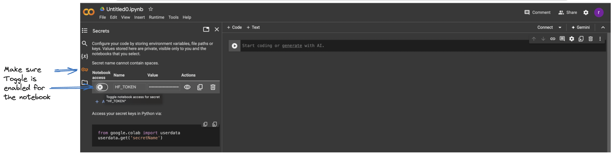

* Make sure you are connected to a runtime. For this task, you can use the CPU as the runtime environment.


* Click on Folder and create a new folder called "data"


* Click on [...], select Upload


* Choose your example.txt file and click Open

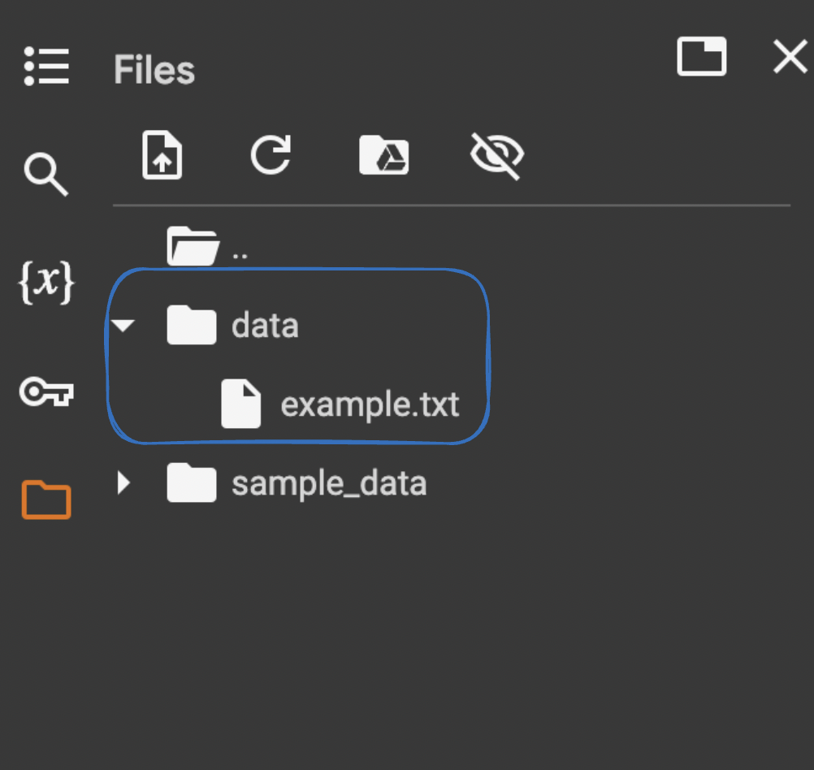

<span class="colour" style="color:red">Note: Ensure that your files are saved elsewhere. This runtime's files will be deleted when it is terminated.</span>

***Summary: So far, we have our raw dataset as example.txt, enabled Hugging Face in our Colab notebook, and uploaded the data into our folder. we will be convertig the dataset (example.txt) into Llama2 format and uploading on Hugging Face so it can be used for our Fine-Tuning in the upcoming steps***

<span style="color: green;"> We will start by installing specific Python packages. </span>

``` py
!pip install datasets huggingface_hub google-colab
```

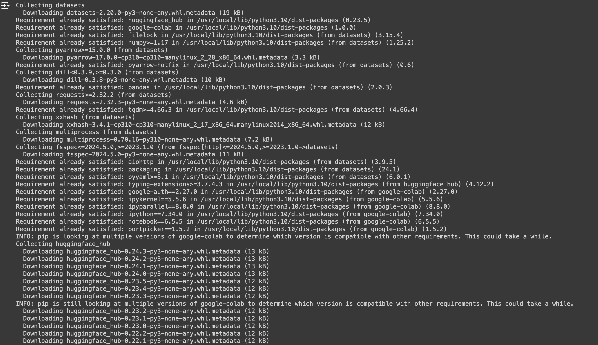

* The ! at the beginning is used in Jupyter notebooks or Google Colab to run shell commands. Using pip install we will install Python packages  

* datasets: This package is part of the Hugging Face ecosystem and provides tools for working with large datasets. It allows users to easily download, preprocess, and manage datasets, especially those used in machine learning and natural language processing (NLP).

* huggingface_hub: This package provides tools to interact with the Hugging Face Hub. 

* google-colab: This package includes utilities specifically designed for Google Colab, a  Jupyter notebook environment that runs in the cloud.


<span style="color: green;"> Step 1: Import the required modules </span>

``` py linenums="1"

# Import required modules
from datasets import Dataset
from huggingface_hub import login
import os
from google.colab import userdata
```

* from datasets import Dataset: imports the Dataset class from the datasets library. The Dataset class is used to create and manipulate datasets. This library is part of the Hugging Face ecosystem and is especially useful for handling datasets for machine learning and NLP tasks.

* from huggingface_hub import login: This imports the login function from the huggingface_hub library. The login function is used to authenticate with the Hugging Face Hub, allowing the user to upload and manage models and datasets on the platform.

* import os: This imports the os module, which provides a way of using operating system-dependent functionality like reading or writing to the file system, environment variables, and more. 

* from google.colab import userdata: imports the userdata module from the google.colab library. The google.colab library contains utilities specifically designed for use with Google Colab. 


<span style="color: green;">Step 2:  Retrieve Hugging Face token from Colab secrets </span>

``` py linenums="1"
# Retrieve Hugging Face token from Colab secrets
os.environ["HF_TOKEN"] = userdata.get('HF_TOKEN')
# Login to Hugging Face
login(token=os.environ["HF_TOKEN"])
```

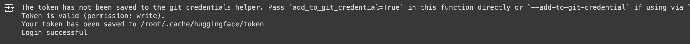

* This part of the code retrieves a previously stored Hugging Face token from Colab secrets. This token is essential for authenticating with the Hugging Face platform. Storing tokens in Colab secrets is a secure way to handle sensitive information without hardcoding it in your script.

* Login to Hugging Face: This line logs into Hugging Face using the retrieved token. Logging in allows our code to interact with the Hugging Face Hub, and allow us to upload datasets and models.

<span style="color: green;"> Step 3: Define a fuction that will help us convert our example.txt into Llama2 format </span>

``` py linenums="1"
# Define the generator function
def data_generator(file_path):
    with open(file_path, 'r') as file:
        for line in file:
            if "assistant_text: " in line:
                parts = line.split("assistant_text: ")
                human_text = parts[0].replace("human_text: ", "").strip()
                assistant_text = parts[1].strip()
                reformatted_segment = f'<s>[INST] {human_text} [/INST] {assistant_text} </s>'
                yield {"reformatted_segment": reformatted_segment}
```

* def data_generator(file_path): defines a function named data_generator that takes a single argument, file_path.

* with open(file_path, 'r') as file:   opens the file specified by file_path in read mode ('r'). 

* for line in file: iterates over each line in the file. 

* if "assistant_text: " in line: checks if the string "assistant_text: " is present in the current line (example.txt) file 

* parts = line.split("assistant_text: "): splits the current line into two parts using "assistant_text: " as the delimiter.

* human_text = parts[0].replace("human_text: ", "").strip(): takes the first part of the split line (parts[0]), replaces "human_text: " with an empty string, and then removes any leading or trailing whitespace using the strip() method.

* assistant_text = parts[1].strip(): takes the second part of the split line (parts[1]) and removes any leading or trailing whitespace using the strip() method. 

* reformatted_segment =  Creates a formatted string. The human_text and assistant_text variables are inserted into the string at the specified locations, to replicate Llama2 format.

* yield {"reformatted_segment": reformatted_segment}: the yield statement  return a dictionary containing the reformatted_segment. The yield statement makes this function a generator, allowing it to produce a sequence of values over time, rather than returning them all at once.

<span style="color: green;"> Step 4: Define the path for the file that we want to convert </span>

``` py linenums="1"
# Path to your data file
file_path = '/content/data/example.txt'
```

<span class="colour" style="color:red"> Note: How to get path for your file in Google COlab </span>

* Right click on your file (example.txt) and select Copy Path

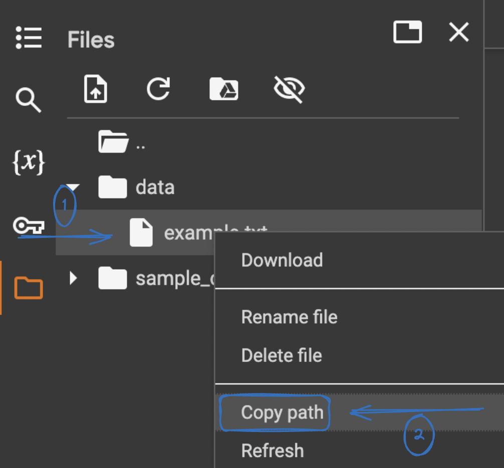

<span style="color: green;"> Step 5: Calling data_generator function </span>

<span class="colour" style="color:red">Note: Make sure to add quotations around the "file_path" in the command as shown below.</span> 

``` py linenums="1"
# Create the dataset from the generator
ds = Dataset.from_generator(data_generator, gen_kwargs={"file_path": file_path})
```

*  Creating a Dataset object by passing the file (example.txt) to the data_generator function

<span style="color: green;"> Step 6: Verify if our data formatted </span>

``` py linenums="1"
# Access the dataset
print(ds[2])
```

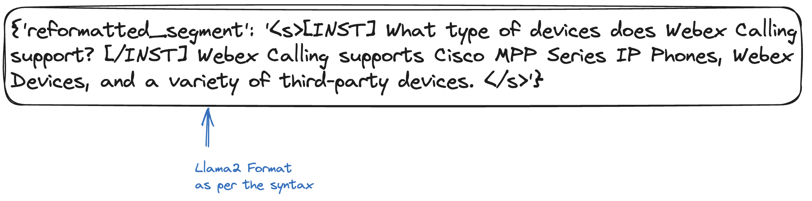

<span style="color: green;"> Step 7: Verify values in our variable ds </span>

``` py linenums="1"
# Access the dataset
print(ds)
```

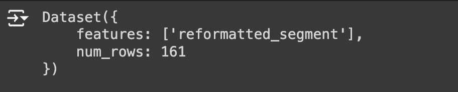

<span style="color: green;"> Step 8: Consolidates all the data and create new Dataset </span>

``` py linenums="1"
reformatted_segments_list = []
# Iterate through the dataset and collect reformatted segments
for example in ds:
    reformatted_segment = example["reformatted_segment"]
    reformatted_segments_list.append(reformatted_segment)
# Now you have all reformatted segments in reformatted_segments_list
print("Total reformatted segments:", len(reformatted_segments_list))
print("First reformatted segment example:", reformatted_segments_list[0])
# Create a new Dataset object with these reformatted segments
reformatted_ds = Dataset.from_dict({"text": reformatted_segments_list})  # Assuming downstream processes expect 'text'
```

* The  above code snippet iterates over the original dataset (ds), extracts the reformatted segments, and collects them into a list (reformatted_segments_list). This process consolidates all the relevant data into a single list for further processing.

* After collecting all the reformatted segments, we will create a new Dataset object (reformatted_ds) from the list. This new dataset is structured in a way that is required by downstream processes when Fine-Tuning starts.

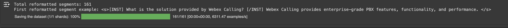

<span style="color: green;"> Step 9: Push our new Dataset to Hugging Face Hub so it can be processed and used for Fine-Tuning. Please remember to replace WebexOne with your org name that was created in Task1. </span>

``` py linenums="1"
# Push the dataset to the Hub. Please remember to replace WebexOne with your org name that was created in Task1.
reformatted_ds.push_to_hub("WebexOne/test")
```

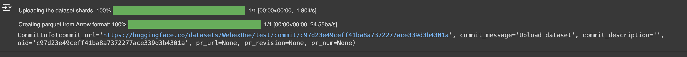

* The push_to_hub method is used to upload the dataset reformatted_ds to the Hugging Face Hub. This makes the dataset publicly available (or private, depending on the repository settings) for others to access and use.

* Repository Naming: The string "WebexOne/test" specifies the target repository on the Hugging Face Hub. 

<span class="colour" style="color:red">Let's login to Hugging Face and view our uploaded dataset</span>

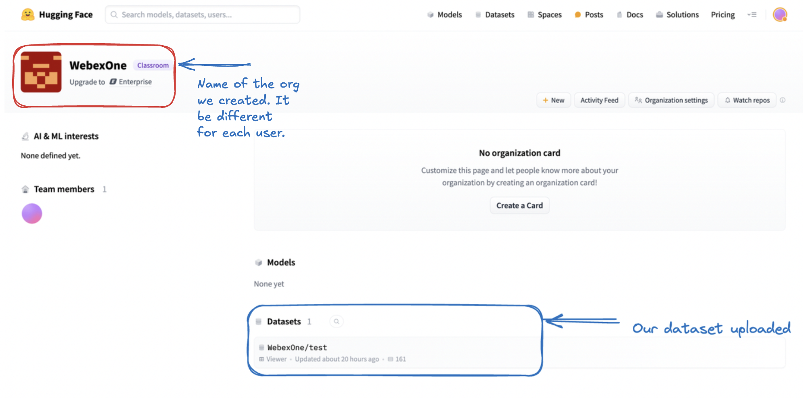

<span class="colour" style="color:red">Our uploaded Dataset</span>

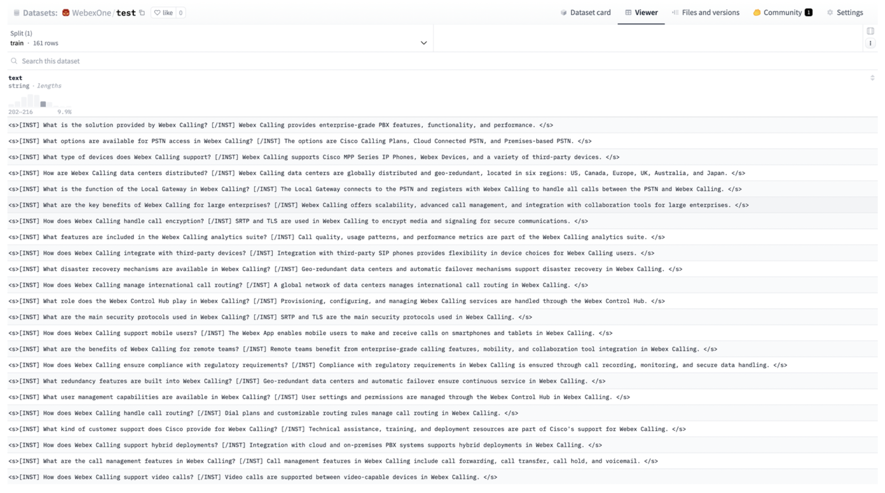

<span class="colour" style="color:red">Complete Code - FOR REFERENCE ONLY</span>

``` py linenums="1"
!pip install datasets huggingface_hub google-colab
# Import required modules
from datasets import Dataset
from huggingface_hub import login
import os
from google.colab import userdata
# Retrieve Hugging Face token from Colab secrets
os.environ["HF_TOKEN"] = userdata.get('HF_TOKEN')
# Login to Hugging Face
login(token=os.environ["HF_TOKEN"])
# Define the generator function
def data_generator(file_path):
    with open(file_path, 'r') as file:
        for line in file:
            if "assistant_text: " in line:
                parts = line.split("assistant_text: ")
                human_text = parts[0].replace("human_text: ", "").strip()
                assistant_text = parts[1].strip()
                reformatted_segment = f'<s>[INST] {human_text} [/INST] {assistant_text} </s>'
                yield {"reformatted_segment": reformatted_segment}
# Path to your data file
file_path = '/content/data/example.txt'
# Create the dataset from the generator
ds = Dataset.from_generator(data_generator, gen_kwargs={"file_path": file_path})

reformatted_segments_list = []
# Iterate through the dataset and collect reformatted segments
for example in ds:
    reformatted_segment = example["reformatted_segment"]
    reformatted_segments_list.append(reformatted_segment)

# Now you have all reformatted segments in reformatted_segments_list
print("Total reformatted segments:", len(reformatted_segments_list))
print("First reformatted segment example:", reformatted_segments_list[0])

# Create a new Dataset object with these reformatted segments
reformatted_ds = Dataset.from_dict({"text": reformatted_segments_list})  # Assuming downstream processes expect 'text'

# Save the dataset locally - OPTIONAL STEP
reformatted_ds.save_to_disk('/content/data/reformatted_dataset')

# Push the dataset to the Hub. Please remember to replace WebexOne with your org name that was created in Task1. 
reformatted_ds.push_to_hub("WebexOne/test")
```
### Fine-tuning Llama2-7B Model

<span class="colour" style="color:red"> NOTE: If you’re serious about fine-tuning models, using a script instead of a notebook is recommended. You can easily rent GPUs on Lambda Labs, Runpod, Vast.ai e.t.c </span>

### Background on Fine-Tuning 

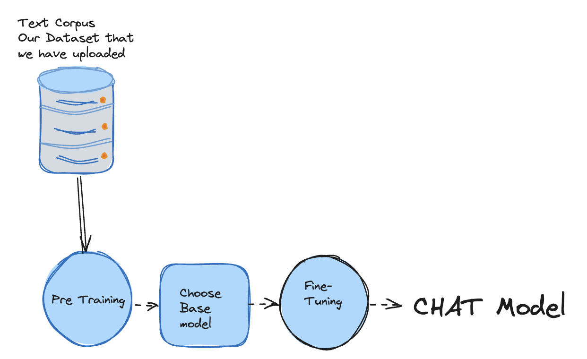

Language models (LLMs) are pretrained on extensive text corpus. For example, Llama 2 was trained with 2 trillion tokens. As mentioned before pretraining is resource-intensive and often faces hardware challenges.

After pretraining, models like Llama 2, can predict the next word in a sequence but don't naturally follow instructions. To make them better assistants, we use instruction tuning, which involves two primary methods:

* **Supervised Fine-Tuning (SFT): Models are trained on datasets of instructions and responses to minimize the difference between their answers and the correct ones.**

* **Reinforcement Learning from Human Feedback (RLHF): Models learn through interaction and feedback to optimize a reward signal based on human evaluations.**

RLHF can capture nuanced human preferences but is complex to implement, requiring a well-designed reward system and consistent feedback. <span class="colour" style="color:red">Not a focus for this lab</span>

In this lab, we will use Supervised Fine-Tuning (SFT). Fine-tuning works well because it builds on the knowledge gained during pretraining. If a model has seen similar data, fine-tuning can significantly enhance performance. For instance, fine-tuning a LLaMA model with 65 billion parameters on 1,000 high-quality samples can outperform larger models like GPT-3.

<span class="colour" style="color:red">Note:</span> As mentioned earlier, the choice of prompt template is crucial for fine-tuning. In our dataset section, we have converted our data into the following template:

`<s>[INST] <<SYS>>
{{ system_prompt }}
<</SYS>>
{{ user_message }} [/INST] Model answer </s>`

<span class="colour" style="color:red">Note:</span> For this tutorial, we will use a preformatted dataset (WebexOne/test) that was uploaded earlier on Hugging Face. We will apply Supervised Fine-Tuning (SFT) to a base model. Please remember to replace WebexOne with your org name that was created in Task1.

#### Guide to Fine-Tuning Llama 2

In this section, we will learn about all the steps required to fine-tune the Llama 2 model with 7 billion parameters on a T4 GPU with high RAM using Google Colab.

The Colab T4 GPU has a limited 16 GB of VRAM. That is barely enough to store Llama 2–7b's weights (7b × 2 bytes = 14 GB in FP16), which means full fine-tuning is not possible, and we need to use parameter-efficient fine-tuning techniques like LoRA and QLoRA.

We will use the QLoRA technique to fine-tune the model in 4-bit precision and optimize VRAM usage. For that, we will use the Hugging Face ecosystem of LLM libraries: <span class="colour" style="color:blue">  transformers, accelerate, peft, trl, and bitsandbytes.</span>

#### Base models for Fine-Tuning

* We have the option to fine-tune the Llama2 Base model <span class="colour" style="color:blue">(meta-llama/Llama-2-7b-hf)</span>, which can be found in the Hugging Face <a href="https://huggingface.co/meta-llama/Llama-2-7b-hf" target="_blank">repository</a>

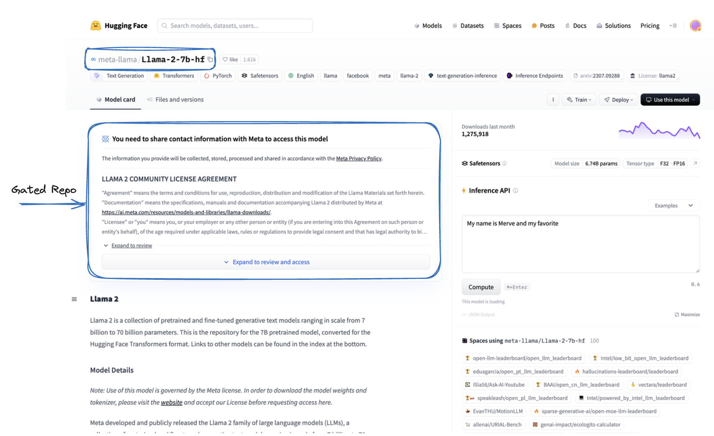

* Since it is a gated repository, you'll need to provide the required information to access and use the model. Please scroll down, fill in the necessary details, and submit the form.

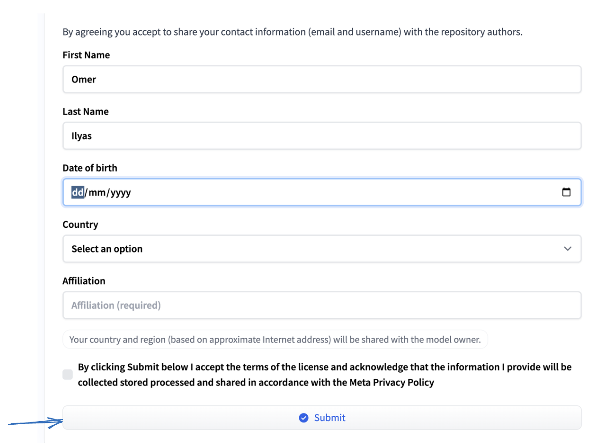

* Once submitted, you can check the status of your request by navigating to Settings and clicking on Gated Repositories.

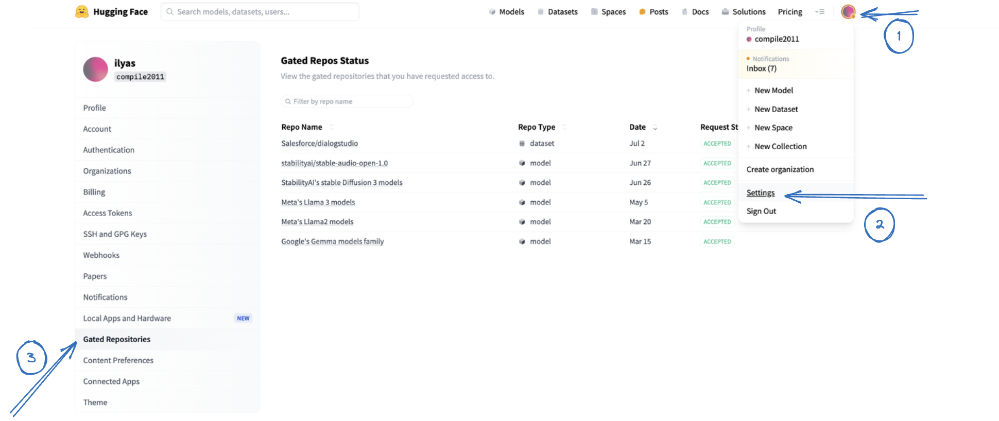

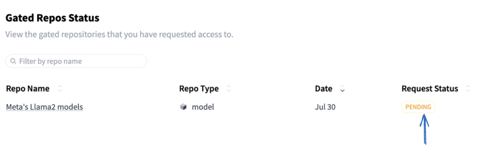

<span class="colour" style="color:red"> Note: It may take some time for the status to update from Pending to Accepted.</span>

<span class="colour" style="color:red"> Note: In this lab environment, we can use the Llama2 base model from another repository (NousResearch/Llama-2-7b-chat-hf) that is not gated.</span> <span class="colour" style="color:red"> More Info at: </span> <a href="https://huggingface.co/NousResearch/Llama-2-7b-chat-hf" target="_blank">Repository</a>

* Lets continue

#### Logging into Google Collab

* You can either use the existing notebook from above and add a new code cell to start fine-tuning, or create a new Jupyter Notebook.


* Change Runtime Environment: Click the “Runtime” dropdown menu at the top of the Colab interface.

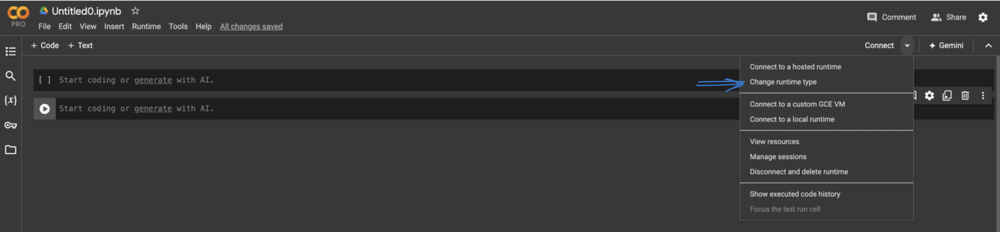

* Select “Change runtime type”: This will open a dialog box where you can configure the runtime environment.

* Select Hardware Accelerator: From the “Hardware accelerator” dropdown menu, choose >> T4 GPU and enable toggle for High RAM

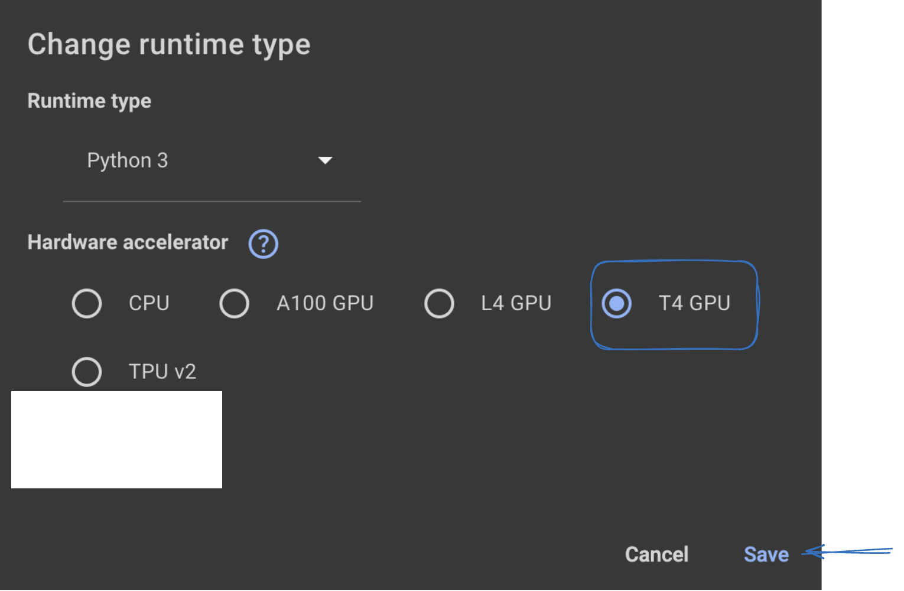

* Save Settings: Click “Save” to apply the changes.

<span class="colour" style="color:red">Reminder: </span>Whenever you want to copy the code in Google Colab and run it, be sure to click on + Code to add a new code cell.


<span class="colour" style="color:red">Reminder: </span>Click the play button to the left of the code, or use the keyboard shortcut "Command/Ctrl+Enter" while the cell is selected.


#### Set up Envoirnment

<span class="colour" style="color:green">Step 1: Check the status of Nvidia chipset. OPTIONAL STEP </span>

```py linenums="1"
!nvidia-smi 
```

<span class="colour" style="color:red">Note: Remember to execute each cell individually </span>

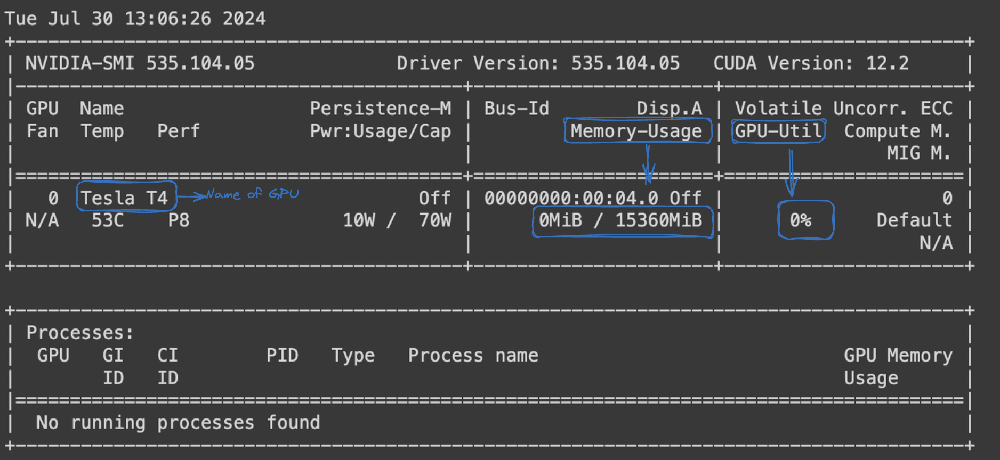

<span class="colour" style="color:red">Note: </span> nvidia-smi stands for NVIDIA System Management Interface. It is a command-line utility that provides information about NVIDIA GPUs installed on the system. This tool is part of the NVIDIA GPU driver package. By using !nvidia-smi, you can quickly check the status and health of your NVIDIA GPUs from within a Jupyter Notebook, making it a useful tool for machine learning and data science workflows.

<span class="colour" style="color:green">Step 2: Install the required libraries. </span>

``` py linenums="1"
!pip install -q accelerate==0.21.0 peft==0.4.0 bitsandbytes==0.40.2 transformers==4.31.0 trl==0.4.7 python-dotenv
```

<span class="colour" style="color:red">Note: Remember to execute each cell individually </span>

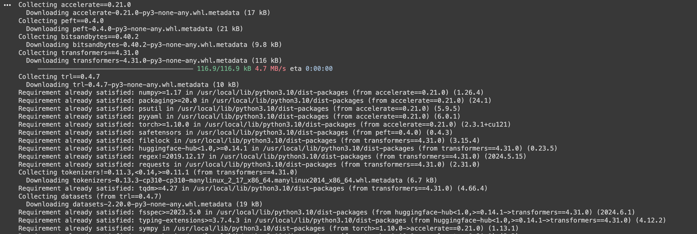

* -q: flag stands for "quiet" mode, which minimizes the output during the installation process. OPTIONAL FLAG

* accelerate==0.21.0: accelerate is a library from Hugging Face for easily running models on different devices (e.g., CPU, GPU). 

* peft stands for Parameter-Efficient Fine-Tuning. It is a library that provides tools for fine-tuning large models efficiently. 

* bitsandbytes==0.40.2: is a library for efficient model quantization 

* transformers==4.31.0: library by Hugging Face that provides pre-trained models and tools for natural language processing (NLP) tasks.

* trl==0.4.7:  Transformer Reinforcement Learning. It is a library for applying reinforcement learning techniques to transformer models. 

<span class="colour" style="color:green">Step 3: Load the necessary modules </span>

``` py linenums="1"
import os
import torch
from datasets import load_dataset
from transformers import (
    AutoModelForCausalLM,
    AutoTokenizer,
    BitsAndBytesConfig,
    HfArgumentParser,
    TrainingArguments,
    pipeline,
    logging,
)
from peft import LoraConfig, PeftModel
from trl import SFTTrainer
```

<span class="colour" style="color:red">Note: Remember to execute each cell individually </span>

* datasets:  library, is part of the Hugging Face ecosystem, that provides tools to load and process datasets.

* transformers: Hugging Face Transformers library, which provides tools for working with transformer-based models.

* AutoModelForCausalLM: automatically selects the appropriate model architecture for causal language modeling (e.g., Llama or GPT based models).

* AutoTokenizer: A class that automatically selects the appropriate tokenizer for a given model.

* BitsAndBytesConfig: Configuration class for model quantization

* HfArgumentParser: A helper class for parsing command-line arguments, designed for Hugging Face libraries.

* TrainingArguments: A class that defines the training configuration, such as learning rate, batch size, number of epochs, etc.

* pipeline: The pipelines are a great and easy way to use models for inference. [More info](https://huggingface.co/docs/transformers/en/main_classes/pipelines)

* peft: Stands for Parameter-Efficient Fine-Tuning (PEFT), which includes methods like LoRA (Low-Rank Adaptation) and Qlora

* trl: Stands for Transformer Reinforcement Learning, a library that includes tools for fine-tuning and training models

<span class="colour" style="color:green">Step 4: Retrieve Hugging Face token and set as an environment variable. </span>

```py linenums="1"
from google.colab import userdata
os.environ["HF_TOKEN"] = userdata.get("HF_TOKEN")
```
<span class="colour" style="color:red">Note: Remember to execute each cell individually </span>

``` py linenums="1"
!huggingface-cli whoami
```

<span class="colour" style="color:red">Note: It will output your custom HuggingFace org </span>

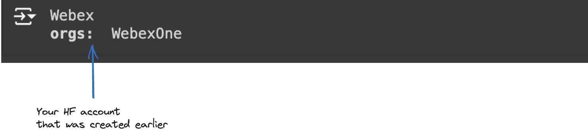

* Verify to confirm that the Hugging Face CLI is correctly authenticated with your account.


#### Load and prepare dataset and model 

<span class="colour" style="color:green">Step 5: Before we start processing the data we prepared earlier, we need to load the model, tokenizer and datasets. As mentioned earlier we will be using NousResearch/Llama-2-7b-chat-hf as our base Llama2 model.</span>

``` py linenums="1"
# model_name = "meta-llama/Llama-2-7b-hf" as its a gated repo
model_name = "NousResearch/Llama-2-7b-chat-hf"
# Change the "new_model" name for your finetuned model. 
new_model = "WebexOneDemo-Llama-2-7b-chat-finetune"
```
<span class="colour" style="color:red">Note: You can name the new_model variable whatever you prefer.</span>

* We can use the gated repo or the one mentioned earlier

``` py linenums="1"
# The instruction dataset to use that we created earlier. Please remember to replace WebexOne with the org name that was created in Task1.
dataset_name = "WebexOne/test"

# Load dataset (you can process it here)
dataset = load_dataset(dataset_name, split="train")
```

``` py linenums="1"
print(dataset)
```

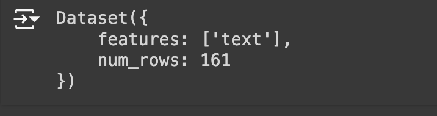

``` py linenums="1"
print(dataset['text'][2])
```

* Shows the total number of rows in our dataset

* Loading the previously created dataset from the Hugging Face Hub

#### Training parameters and 4 bit Quantization Parameters (Qlora)

<span class="colour" style="color:green">Step 6: Define hyperparameters for training a machine learning model using QLoRA (Quantized Low-Rank Adaptation) and bitsandbytes, along with the TrainingArguments for the training process. In the below we will use QLoRA with a rank of 64 and a scaling parameter of 16. We’ll load the Llama 2 model directly in 4-bit using the NF4 type and train it for 10 epoch. </span>

``` py linenums="1"
################################################################################
# QLoRA parameters - That we will use
################################################################################

# LoRA attention dimension . A higher value increases the model's capacity to learn but also its computational cost. The higher the rank the more parameters you train and the bigger your adapter files will be.
lora_r = 64

# Alpha parameter for LoRA scaling. It controls the trade-off between model capacity and stability.
lora_alpha = 16

# Dropout probability for LoRA layers. The dropout probability applied to the LoRA layers to prevent overfitting.
lora_dropout = 0.1

################################################################################
# bitsandbytes parameters
################################################################################

# Activate 4-bit precision base model. Enables loading the base model with 4-bit precision, which reduces memory usage.
use_4bit = True

# Compute dtype for 4-bit base models. Specifies the data type for computations in 4-bit precision models
bnb_4bit_compute_dtype = "float16"

# Quantization type (fp4 or nf4) we’ll load the Llama 2 model directly in 4-bit precision using the NF4 type
bnb_4bit_quant_type = "nf4"

# Activate or Deactivate nested quantization for 4-bit base models (double quantization)
use_nested_quant = False

################################################################################
# TrainingArguments parameters
################################################################################

# Output directory where the model predictions and checkpoints will be stored
output_dir = "./results"

# Number of training epochs. Epochs efers to one complete pass through the entire training dataset. During an epoch, the model processes each example in the training set once and updates its weights accordingly
# In machine learning, particularly in training neural networks, the term "number of training epochs" refers to the number of times the entire training dataset is passed forward and backward through the neural network. Each pass through the entire dataset is counted as one epoch.

num_train_epochs = 10

# Enable fp16/bf16 training (set bf16 to True with an A100)
fp16 = False
bf16 = False

# Batch size per GPU for training
per_device_train_batch_size = 4

# Batch size per GPU for evaluation
per_device_eval_batch_size = 4

# Number of steps to accumulate gradients before updating model weights.
gradient_accumulation_steps = 1

#  Enables saving memory during training by checkpointing gradients.
gradient_checkpointing = True

# Maximum gradient normal (gradient clipping)
max_grad_norm = 0.3

# Initial learning rate (AdamW optimizer)
learning_rate = 2e-4

# Weight decay to apply to all layers except bias/LayerNorm weights
weight_decay = 0.001

# Optimizer to use
optim = "paged_adamw_32bit"

# Learning rate schedule (constant a bit better than cosine)
lr_scheduler_type = "constant"

# Number of training steps (overrides num_train_epochs)
max_steps = -1

# Ratio of steps for a linear warmup (from 0 to learning rate)
warmup_ratio = 0.03

# Group sequences into batches with same length
# Saves memory and speeds up training considerably
group_by_length = True

# Save checkpoint every X updates steps
save_steps = 25

# Log every X updates steps
logging_steps = 25

################################################################################
# SFT parameters
################################################################################

# Maximum sequence length to use
max_seq_length = None

# Pack multiple short examples in the same input sequence to increase efficiency
packing = False

# Load the entire model on the GPU 0
device_map = {"": 0}
```

#### Load tokenizer

<span class="colour" style="color:green">Step 7: Load Tokenizer </span>

``` py linenums="1"
compute_dtype = getattr(torch, bnb_4bit_compute_dtype)

bnb_config = BitsAndBytesConfig(
    load_in_4bit=use_4bit,
    bnb_4bit_quant_type=bnb_4bit_quant_type,
    bnb_4bit_compute_dtype=compute_dtype,
    bnb_4bit_use_double_quant=use_nested_quant,
)

# Check GPU compatibility with bfloat16
if compute_dtype == torch.float16 and use_4bit:
    major, _ = torch.cuda.get_device_capability()
    if major >= 8:
        print("=" * 80)
        print("Your GPU supports bfloat16: accelerate training with bf16=True")
        print("=" * 80)

# Load base model
model = AutoModelForCausalLM.from_pretrained(
    model_name,
    quantization_config=bnb_config,
    device_map=device_map
)
model.config.use_cache = False
model.config.pretraining_tp = 1

# Load LLaMA tokenizer
tokenizer = AutoTokenizer.from_pretrained(model_name, trust_remote_code=True)

# Set the padding token and EOS token to the same value
# tokenizer.pad_token = "</s>"
# tokenizer.add_special_tokens({'eos_token': '</s>'})
tokenizer.pad_token = tokenizer.eos_token
tokenizer.padding_side = "right"
```

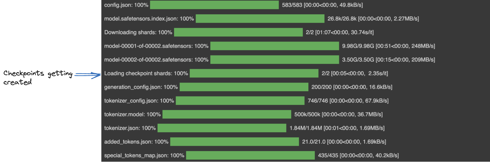

#### Load LoRA configuration

<span class="colour" style="color:green">Step 8: Load Lora Config </span>

``` py linenums="1"
peft_config = LoraConfig(
    lora_alpha=lora_alpha,
    lora_dropout=lora_dropout,
    r=lora_r,
    bias="none",
    task_type="CAUSAL_LM",
)
```

#### Setting Peft Parameters

<span class="colour" style="color:green">Step 9: Setting Peft Config </span>

``` py linenums="1" 
# Set training parameters
training_arguments = TrainingArguments(
    output_dir=output_dir,
    num_train_epochs=num_train_epochs,
    per_device_train_batch_size=per_device_train_batch_size,
    gradient_accumulation_steps=gradient_accumulation_steps,
    optim=optim,
    save_steps=save_steps,
    logging_steps=logging_steps,
    learning_rate=learning_rate,
    weight_decay=weight_decay,
    fp16=fp16,
    bf16=bf16,
    max_grad_norm=max_grad_norm,
    max_steps=max_steps,
    warmup_ratio=warmup_ratio,
    group_by_length=group_by_length,
    lr_scheduler_type=lr_scheduler_type,
    report_to="tensorboard"
)

# Set supervised fine-tuning parameters
trainer = SFTTrainer(
    model=model,
    train_dataset=dataset,
    peft_config=peft_config,
    dataset_text_field="text",
    max_seq_length=max_seq_length,
    tokenizer=tokenizer,
    args=training_arguments,
    packing=packing,
)

```

* Supervised fine-tuning (SFT) is a key step in reinforcement learning. We will provide SFT Trainer the model, dataset, Lora configuration, tokenizer, and training parameters.

<span class="colour" style="color:green">Step 10: We will use .train() to fine-tune the Llama 2 model on our new dataset.</span>

``` py linenums="1" 
trainer.train()
```

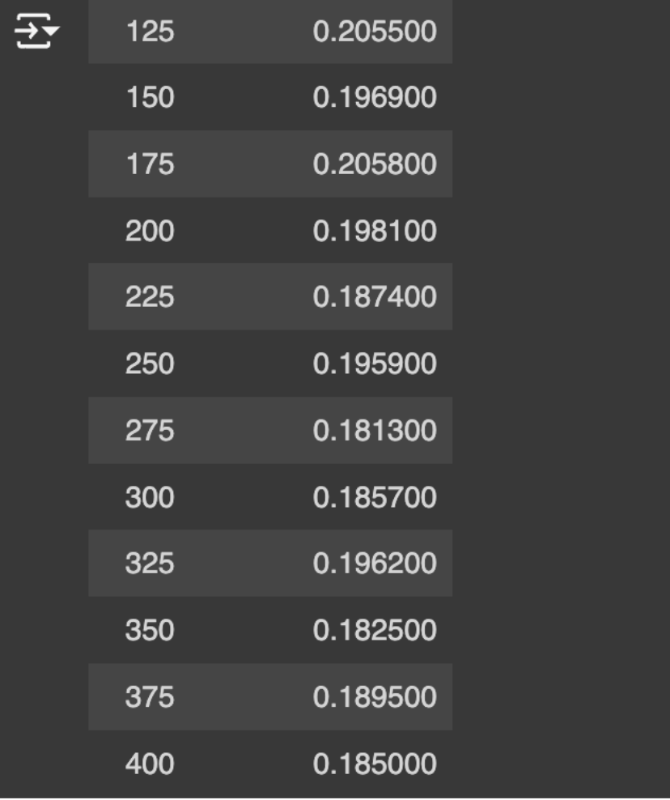

<span class="colour" style="color:red">Note: Given our minimal dataset, the training process may take up to 10 minutes. However, with larger datasets, the training duration can range from an hour to several hours, depending on the size and complexity of the data. </span>

<span class="colour" style="color:green">Step 11: After training the model, we will save the model adopter and tokenizers.</span>

``` py linenums="1"
trainer.model.save_pretrained(new_model)
trainer.tokenizer.save_pretrained(new_model)
```

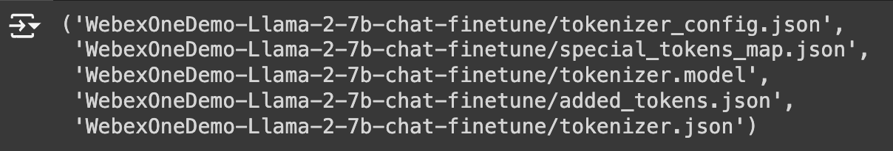

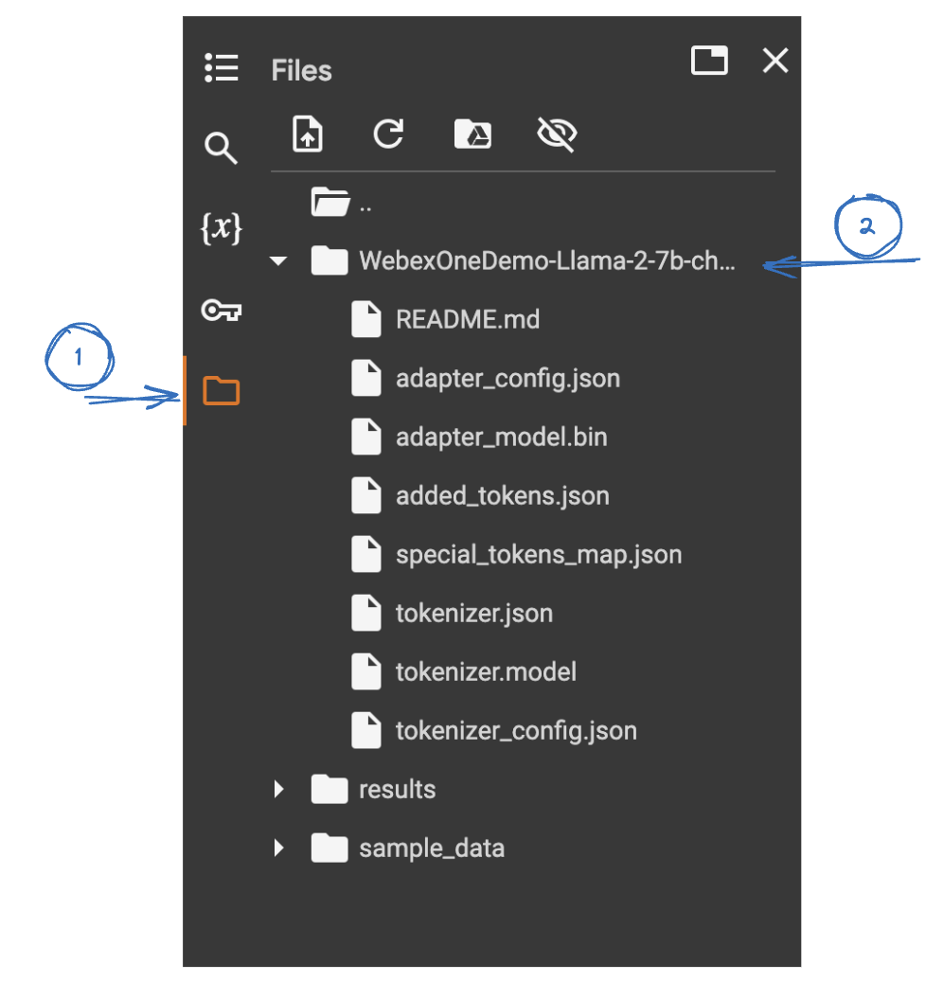

<span class="colour" style="color:green">Step 12: To ensure our model is functioning correctly, let's ask a question from our dataset. While a more comprehensive evaluation is necessary for production, we can perform a basic check in our lab using the text generation pipeline. For instance, we can ask, "What capabilities does the Webex App offer when integrated with Webex Calling?" Note that the input is formatted to match Llama 2's prompt template. </span>

* Our dataset on HF

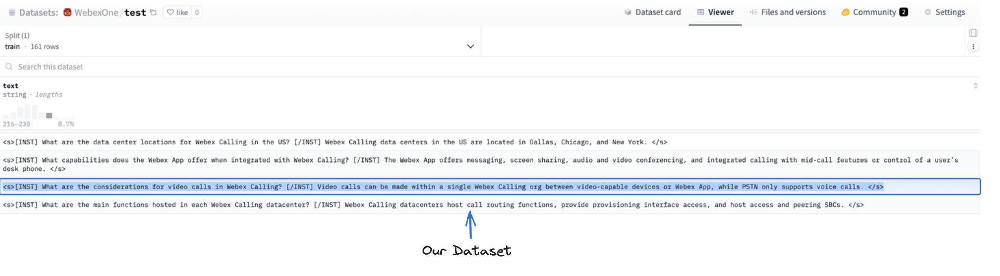


``` py linenums="1"
# Run text generation pipeline with our next model
prompt = "What are the considerations for video calls in Webex Calling?"
pipe = pipeline(task="text-generation", model=model, tokenizer=tokenizer, max_length=200)
result = pipe(f"<s>[INST] {prompt} [/INST]")
print(result[0]['generated_text'])
```

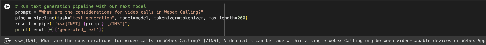

#### Merge LoRA adapters with base model and saving our model

<span class="colour" style="color:green"> Step 13:  Merge LoRA adapters </span>

* To store our newly fine-tuned <span class="colour" style="color:blue"> WebexOneDemo-Llama-2-7b-chat-finetune </span> model, we need to merge the LoRA weights with the base model. This involves reloading the base model with FP16 precision and using the PEFT library to combine all components.

```py linenums="1"
base_model = AutoModelForCausalLM.from_pretrained(
    model_name,
    low_cpu_mem_usage=True,
    return_dict=True,
    torch_dtype=torch.float16,
    device_map="auto",
)
model = PeftModel.from_pretrained(base_model, new_model)
model = model.merge_and_unload()
tokenizer = AutoTokenizer.from_pretrained(model_name, trust_remote_code=True)
# tokenizer.pad_token = "</s>"
# tokenizer.add_special_tokens({'eos_token': '</s>'})
tokenizer.pad_token = tokenizer.eos_token
tokenizer.padding_side = "right"
```

<span class="colour" style="color:red"> Optional STEP: if you run out of GPU memory - Create a function to clear GPU cache on google colab </span>

``` py linenums="1"
# Function to clear GPU cache
def clear_gpu_cache():
    torch.cuda.empty_cache()

clear_gpu_cache()
```


<span class="colour" style="color:green"> Step 14:  Push our model and tokenizer to Hugging Face</span>

* We can now push everything to the Hugging Face Hub to save our model.

``` py linenums="1"
model.push_to_hub(new_model, use_temp_dir=False)
# tokenizer.push_to_hub(new_model, use_temp_dir=False) # Get push automatically
```

Or we can push it to the org that we created earlier in my case I called it - WebexOne

``` py linenums="1"
org_name = "WebexOne" 
model.push_to_hub(f"{org_name}/{new_model}", use_temp_dir=False)
tokenizer.push_to_hub(f"{org_name}/{new_model}", use_temp_dir=False)
```

<span class="colour" style="color:green"> Please replace "WebexOne" with the name of the organization created in [Task 1](https://allchapters.github.io/Ai/Task1/#accessing-hugging-face-api-in-google-colab) </span>

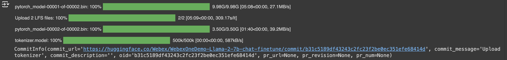

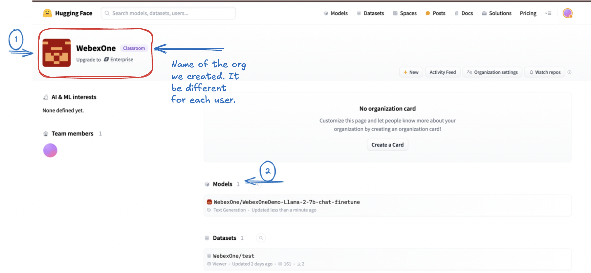

#### Load the  pretrained model from Hugging Face and use for inference 

* The Model Hub simplifies the process of selecting the appropriate model. Since we've just uploaded the model to HuggingFace, there may be a slight delay before it becomes accessible. In the meantime, you can use the model I’ve already uploaded, <a href="https://huggingface.co/WebexOne/WebexOneDemo-Llama-2-7b-chat-finetune" target="_blank">WebexOne/WebexOneDemo-Llama-2-7b-chat-finetune</a> for inference. You can load it like any other Llama 2 model from the Hub. Let's dive into how to use this pre-uploaded model due to time constraints.


<span class="colour" style="color:green"> Step 15:  login into Hugging Face hub </span>

* We will use the WebexOne/WebexOneDemo-Llama-2-7b-chat-finetune model as mentioned in the previous step. Click Use this model, Select Transformers. Within Transformers command, Please do not replace "WebexOne" with your created organization name, as we will be using an already uploaded model due to time constraints.

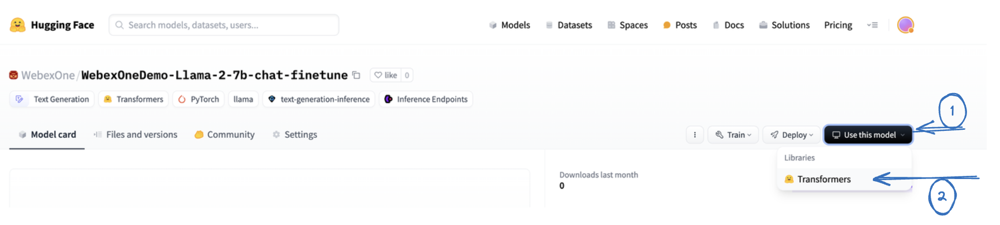

<span class="colour" style="color:red">Note: The inference api requires that the model repo have a certain amount of user activity before it can be used directly on api-inference or "Use the model" tab appears. If you having issues please speak with the lab proctor</span>

* Lets click on Transformer so we can instantiate it using the pipeline() function:

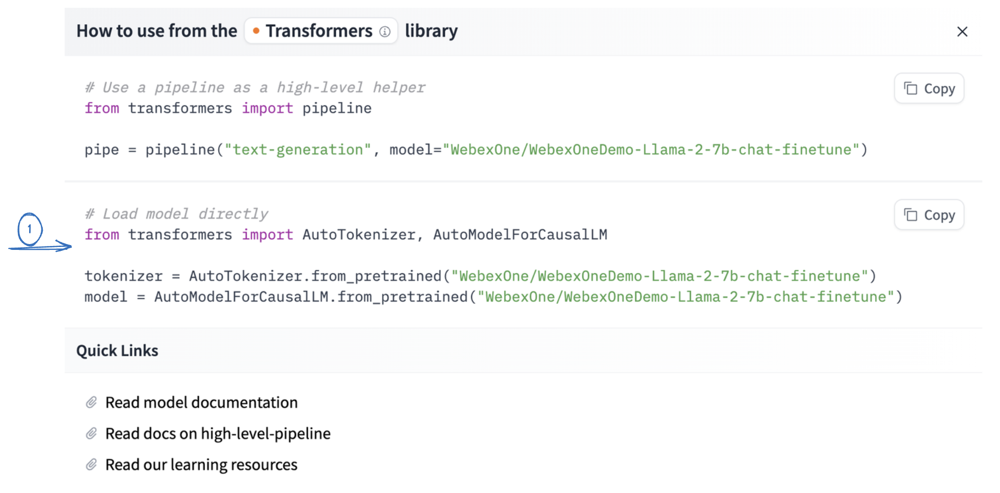

<span class="colour" style="color:green"> Step 16: Copy the code for transformers </span>

``` py linenums="1"
from transformers import pipeline, AutoModelForCausalLM, AutoTokenizer
# Load the model and tokenizer
model_name = "WebexOne/WebexOneDemo-Llama-2-7b-chat-finetune"
model = AutoModelForCausalLM.from_pretrained(model_name)
tokenizer = AutoTokenizer.from_pretrained(model_name)
```

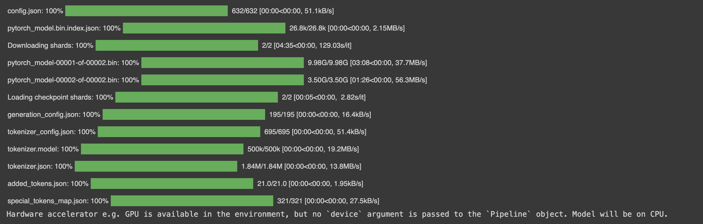

The process involves downloading the necessary files for the model and tokenizer from the Hub to ensure the model and tokenizer work correctly.  Followed by loading them into memory so they can be used for generating text. When downloading a model, the following components are typically fetched:

* **Model Configuration:** Defines the architecture and hyperparameters (config.json).

* **Weight Shards:** Large binary files containing the model's trained parameters (pytorch_model-00001-of-00002.bin, pytorch_model-00002-of-00002.bin).

* **Index Files:** Help manage and load weight shards (pytorch_model.bin.index.json).

* **Generation Configuration:** Specifies settings for text generation tasks (generation_config.json).

* **Tokenizer Files:** Include configuration, the tokenizer model, and mappings for converting text to tokens (tokenizer_config.json, tokenizer.model, tokenizer.json).

* **Special Tokens:** Ensures special tokens are correctly handled (added_tokens.json, special_tokens_map.json).

<span class="colour" style="color:green"> Step 17: Instantiate using the pipeline() function </span>

```  py linenums="1"
# Set up the text generation pipeline
pipe = pipeline(
    "text-generation",
    model=model,
    tokenizer=tokenizer,
    max_length=200,
    pad_token_id=tokenizer.eos_token_id  # Ensure the padding token is correctly set
)

```
<span class="colour" style="color:green"> Step 18: Example 1: </span>

<span class="colour" style="color:red"> Note: </span> Lets take one question from our dataset.

```  py linenums="1"
# Define the prompt
prompt = "What is the Private Network Connect (PNC) solution?"

# Run the text generation pipeline with the prompt
result = pipe(f"<s>[INST] {prompt} [/INST]")

# Print the generated text
print(result[0]['generated_text'])
```

<span class="colour" style="color:red"> Output: </span>

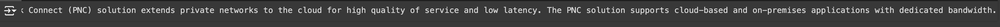


<span class="colour" style="color:green"> Step 19: Example 2: </span>

<span class="colour" style="color:red"> Note: </span> Lets take one question from our dataset.

``` py linenums="1"
# Define the prompt
prompt = "What happens if ICE negotiation fails in Webex Calling?"

# Run the text generation pipeline with the prompt
result = pipe(f"<s>[INST] {prompt} [/INST]")

# Print the generated text
print(result[0]['generated_text'])
```

<span class="colour" style="color:red"> Output: </span>


### Fine-Tuning - Example 2

In this example, I will show you how to fine-tune using the <a href="https://www.cisco.com/c/dam/en/us/td/docs/voice_ip_comm/cuipph/MPP/6800-DECT/deployment/CiscoDECT6800DeploymentGuide.pdf" target="_blank">Cisco IP DECT Phone 6800 Series Deployment Guide</a>. We have also created the dataset from the PDF, which can be found at <a href="https://huggingface.co/datasets/WebexOne/dect1?row=0" target="_blank">WebexOne/dect1</a>

<span class="colour" style="color:green"> Step 1: Import the Necessary Libraries </span>

``` py linenums="1"
import os
import torch
from datasets import load_dataset
from transformers import (
    AutoModelForCausalLM,
    AutoTokenizer,
    BitsAndBytesConfig,
    HfArgumentParser,
    TrainingArguments,
    pipeline,
    logging,
)
from peft import LoraConfig, PeftModel
from trl import SFTTrainer
from dotenv import load_dotenv
```

<span class="colour" style="color:green"> Step 2: Load your HuggingFace tokens </span>

```py linenums="1"
from google.colab import userdata
os.environ["HF_TOKEN"] = userdata.get("HF_TOKEN")
```

<span class="colour" style="color:green"> Step 3: Load the Datasets and our base model</span>

``` py linenums="1"
dataset_name = "WebexOne/dect1"
dataset = load_dataset(dataset_name, split="train")
# model_name = "meta-llama/Llama-2-7b-hf" as its a gated repo
model_name = "NousResearch/Llama-2-7b-chat-hf"
new_model = "dect-phone-Llama-2-7b-Finale"
```

<span class="colour" style="color:red">Note: You can name the new_model variable whatever you prefer. </span>

<span class="colour" style="color:green"> Step 4: Load pre-trained model with 4-bit quantization</span>

``` py linenums="1"
###############################################################################
# QLoRA parameters - That we will use
################################################################################

# LoRA attention dimension . A higher value increases the model's capacity to learn but also its computational cost. The higher the rank the more parameters you train and the bigger your adapter files will be.
lora_r = 64

# Alpha parameter for LoRA scaling. It controls the trade-off between model capacity and stability.
lora_alpha = 16

# Dropout probability for LoRA layers. The dropout probability applied to the LoRA layers to prevent overfitting.
lora_dropout = 0.1

################################################################################
# bitsandbytes parameters
################################################################################

# Activate 4-bit precision base model. Enables loading the base model with 4-bit precision, which reduces memory usage.
use_4bit = True

# Compute dtype for 4-bit base models. Specifies the data type for computations in 4-bit precision models
bnb_4bit_compute_dtype = "float16"

# Quantization type (fp4 or nf4) we’ll load the Llama 2 model directly in 4-bit precision using the NF4 type
bnb_4bit_quant_type = "nf4"

# Activate or Deactivate nested quantization for 4-bit base models (double quantization)
use_nested_quant = False

################################################################################
# TrainingArguments parameters
################################################################################

# Output directory where the model predictions and checkpoints will be stored
output_dir = "./dectresults1"

# Number of training epochs. Epochs efers to one complete pass through the entire training dataset. During an epoch, the model processes each example in the training set once and updates its weights accordingly
num_train_epochs = 10

# Enable fp16/bf16 training (set bf16 to True with an A100)
fp16 = False
bf16 = False

# Batch size per GPU for training
per_device_train_batch_size = 4

# Batch size per GPU for evaluation
per_device_eval_batch_size = 4

# Number of steps to accumulate gradients before updating model weights.
gradient_accumulation_steps = 1

#  Enables saving memory during training by checkpointing gradients.
gradient_checkpointing = True

# Maximum gradient normal (gradient clipping)
max_grad_norm = 0.3

# Initial learning rate (AdamW optimizer)
learning_rate = 2e-4

# Weight decay to apply to all layers except bias/LayerNorm weights
weight_decay = 0.001

# Optimizer to use
optim = "paged_adamw_32bit"

# Learning rate schedule (constant a bit better than cosine)
lr_scheduler_type = "constant"

# Number of training steps (overrides num_train_epochs)
max_steps = -1

# Ratio of steps for a linear warmup (from 0 to learning rate)
warmup_ratio = 0.03

# Group sequences into batches with same length
# Saves memory and speeds up training considerably
group_by_length = True

# Save checkpoint every X updates steps
save_steps = 25

# Log every X updates steps
logging_steps = 25

################################################################################
# SFT parameters
################################################################################

# Maximum sequence length to use
max_seq_length = None

# Pack multiple short examples in the same input sequence to increase efficiency
packing = False

# Load the entire model on the GPU 0
device_map = {"": 0}
```

<span class="colour" style="color:green"> Step 5: Configure PEFT and Training Parameters</span>

``` py linenums="1"
peft_config = LoraConfig(
    lora_alpha=lora_alpha,
    lora_dropout=lora_dropout,
    r=lora_r,
    bias="none",
    task_type="CAUSAL_LM",
)

# Set training parameters
training_arguments = TrainingArguments(
    output_dir=output_dir,
    num_train_epochs=num_train_epochs,
    per_device_train_batch_size=per_device_train_batch_size,
    gradient_accumulation_steps=gradient_accumulation_steps,
    optim=optim,
    save_steps=save_steps,
    logging_steps=logging_steps,
    learning_rate=learning_rate,
    weight_decay=weight_decay,
    fp16=fp16,
    bf16=bf16,
    max_grad_norm=max_grad_norm,
    max_steps=max_steps,
    warmup_ratio=warmup_ratio,
    group_by_length=group_by_length,
    lr_scheduler_type=lr_scheduler_type,
    report_to="tensorboard"
)

# Set supervised fine-tuning parameters
trainer = SFTTrainer(
    model=model,
    train_dataset=dataset,
    peft_config=peft_config,
    dataset_text_field="text",
    max_seq_length=max_seq_length,
    tokenizer=tokenizer,
    args=training_arguments,
    packing=packing,
)
```

<span class="colour" style="color:green"> Step 6: Train the Model Using the Trainer API and Save the model</span>

``` py linenums="1"
trainer.train()
trainer.model.save_pretrained(new_model)
```

<span class="colour" style="color:green"> Testing the model Locally</span>

``` py linenums="1"
# Run text generation pipeline with our next model
prompt = "What is a key consideration when planning the DECT system for different regions?"
sys1 = "You are an interviewer AI tasked with asking questions about a deployment guide for the Cisco IP DECT Phone 6800 Series. Your goal is to elicit detailed responses from the text as if the pdf itself were answering. Be polite and address the user's query directly. Aim to offer clear and accurate answers. If you dont find the answer in pdf just say no info available at this time please contact your Cisco TME"
pipe = pipeline(task="text-generation", model=model, tokenizer=tokenizer, max_length=200)
result = pipe(f"<s>[INST] <<SYS>> {sys1} <</SYS>> {prompt} [/INST]")
print(result[0]['generated_text'])
```

<span class="colour" style="color:green"> Step 7: Push the Model to Hub</span>
``` py linenums="1"
model.push_to_hub(new_model, use_temp_dir=False)
tokenizer.push_to_hub(new_model, use_temp_dir=False)
```

<span class="colour" style="color:green"> Step 8: Verify the Model: </span>

* **Log in to the Hugging Face Hub and navigate to your model's page.**
* **Click on "Use this model" and then "Transformers".**
* **Copy the provided code snippet for using the model.**

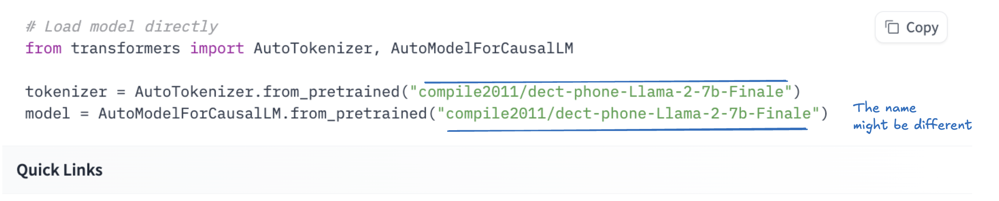

<span class="colour" style="color:green"> Step 9: Configure Inferencing </span>

``` py linenums="1"
# Load model directly
from transformers import AutoTokenizer, AutoModelForCausalLM, pipeline
tokenizer = AutoTokenizer.from_pretrained("compile2011/dect-phone-Llama-2-7b-Finale")
model = AutoModelForCausalLM.from_pretrained("compile2011/dect-phone-Llama-2-7b-Finale")
from transformers import pipeline
pipe = pipeline(
    "text-generation",
    model=model,
    tokenizer=tokenizer,
    max_length=200,
    pad_token_id=tokenizer.eos_token_id  # Ensure the padding token is correctly set
)
```

<span class="colour" style="color:green"> Step 10: Inferencing with downloaded Model to test </span>

``` py linenums="1"
# Run text generation pipeline with our next model
prompt = "What is a key consideration when planning the DECT system for different regions?"
sys1 = "You are an interviewer AI tasked with asking questions about a deployment guide for the Cisco IP DECT Phone 6800 Series. Your goal is to elicit detailed responses from the text as if the pdf itself were answering. Be polite and address the user's query directly. Aim to offer clear and accurate answers. If you dont find the answer in pdf just say no info available at this time please contact your Cisco TME"
# pipe = pipeline(task="text-generation", model=model, tokenizer=tokenizer, max_length=200)
result = pipe(f"<s>[INST] <<SYS>> {sys1} <</SYS>> {prompt} [/INST]")
print(result[0]['generated_text'])
```

<span class="colour" style="color:orange">  OUTPUT </span>
``` 

<s>[INST] <<SYS>> You are an interviewer AI tasked with asking questions about a deployment guide for the Cisco IP DECT Phone 6800 Series. Your goal is to elicit detailed responses from the text as if the pdf itself were answering. Be polite and address the user's query directly. Aim to offer clear and accurate answers. If you dont find the answer in pdf just say no info available at this time please contact your Cisco TME <</SYS>> What is a key consideration when planning the DECT system for different regions? [/INST]
Consider the regulatory requirements for DECT frequencies in different regions. Cisco offers units set up correctly for each region, such as 1880-1900 MHz for Australia and New Zealand, 1880-1900 MHz for E.U. and APAC. 
``` 

#### Troubleshooting - Best Practices

* Challenges are an inherent part of model training. Let's discuss some common issues and their resolutions.

##### Out of Memory (OOM) Errors

* If you encounter an Out of Memory (OOM) error:

    * **reduce Batch Size:** Lowering the batch size can help fit the model into memory.
    * **Shorten Training Samples:** Decrease the context length (e.g., max_length in tokenize()).

##### Slow Training

* If training seems sluggish:

    * **Increase Batch Size:** A larger batch size can speed up training.

    * **Use Multiple GPUs:** Consider using multiple GPUs, either by purchasing or renting (e.g., on platforms like Runpod). The provided code is compatible with accelerate for multi-GPU settings. Simply launch it with <span class="colour" style="color:blue"> accelerate launch your_file.py </span> instead of <span class="colour" style="color:blue"> python your_file.py </span>

##### Poor Model Quality

The quality of your model reflects the quality of your dataset. To improve model quality ensure your dataset is rich and relevant.

##### Metadata - Info on HuggingFace - Optional

``` JSON
---
inference: true
language:
- en
pipeline_tag: text-generation
tags:
- facebook
- meta
- pytorch
- llama
- llama-2
license: llama2
library_name: transformers
---

```

## Conclusions

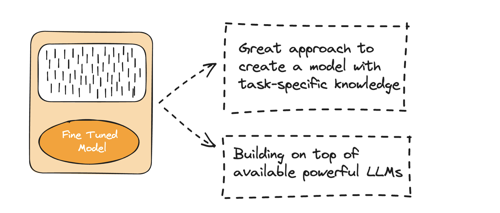

So, we have explored the process of fine-tuning our model and performing inference with it. Now, let’s say you have successfully trained or fine-tuned your model and are ready to deploy it for widespread use. However, you notice that the latency is too slow, and you want to speed up the model. There are four key methods you can employ to enhance your model's performance. While these steps are not covered in this lab, they serve as a good starting point for further investigation:

* **Quantization**
* **Pruning**
* **Model or Knowledge Distillation**
* **Engineering Optimizations**


