## Introduction

This diagram represents the workflow of training and using a LLM. 

<span class="colour" style="color:red">Note: This diagram is referenced from [Task8a](Task8a.md)</span>

## Pre-requisites


<span class="colour" style="color:red">Note: Referenced from [Task8a](Task8a.md)</span>

## UseCase 1 - Fine Tuning Using Llama3

### Datasets Creation

As we will be using and fine tuning Llama3 base model we need to convert datasets into a uniform format compatible with Llama3. <a href="https://llama.meta.com/docs/model-cards-and-prompt-formats/meta-llama-3/" target="_blank">More Info here</a>

#### Example Format for Llama3 - Instruct

``` title="Sample Format - Dont Copy - reference ONLY" 

<|begin_of_text|><|start_header_id|>system<|end_header_id|> You are a helpful AI assistant for  Collaboration<|eot_id|>

                 <|start_header_id|>user<|end_header_id|> What can you help me with?<|eot_id|>

                 <|start_header_id|>assistant<|end_header_id|>
```

* **<|begin_of_text|>:** Specifies the start of the prompt
* **<|start_header_id|>system<|end_header_id|>:** Specifies the role for the following message, i.e. “system”
You are a helpful AI assistant for Collaboration
* **<|eot_id|>:** Specifies the end of the input message
* **<|start_header_id|>user<\end_header_id|>:** Specifies the role for the following message i.e. “user” What can you help me with?: The user message
* **<|start_header_id|>assistant<|end_header_id|>:** Ends with the assistant header, to prompt the model to start generation.

### Datasets Creation

The next step is to prepare a dataset for fine-tuning. If you already have a clean, high-quality dataset, that's great. However, let's assume you don't have one readily available.

In my scenario, I was able to generate synthetic dataset from the <a href="https://www.cisco.com/c/dam/en/us/td/docs/solutions/CVD/Collaboration/hybrid/AltDesigns/PA-WbxCall.pdf" target="_blank">Cisco Preferred Architecture for Webex Calling</a>

#### Creating a Dataset from a PDF - Summary

To delve into the intricacies of dataset creation, let's explore a scenario where we aim to train an AI to replicate our preferred architecture. In this lab, we will transform a PDF document into a dataset. Specifically, we will use a PDF about Webex Calling as our source material.

<span class="colour" style="color:red">Steps Involved</span>

<span class="colour" style="color:red">Converting the PDF to Text</span>

* Begin by extracting the text content from the PDF document.

<span class="colour" style="color:red">Paragraph Analysis and Segmentation:</span>

* Once the PDF is in text form, analyze and segment it into individual paragraphs. Combine short paragraphs and split longer ones to ensure each segment is coherent and self-contained, while still contributing to the overall narrative.

<span class="colour" style="color:red">Generating Interview Questions:</span>

* For each paragraph, create an artificial interview scenario where a language model (LLM) acts as the interviewer.
* Develop questions that naturally elicit responses based on the content of the paragraph.
* The objective is to simulate an insightful dialogue, making it seem as though the PDF is responding to questions about its content and experiences.

By following these steps, we will convert the static information in the PDF into a dynamic and interactive dataset, facilitating a deeper understanding and more engaging learning experience.

Here's an example of the resulting file. Please note that for this lab demonstration, only a few data points were converted from the PDF.

<span class="colour" style="color:red">Note: The dataset (Cisco Preferred Architecture for Webex Calling) has already been formatted to Llama3 format. We'll use this dataset to create and train downstream tasks for our LLM, specifically the Llama3 model. Please scroll down to [download](https://allchapters.github.io/Ai/Task8b/#convert-dataset-into-llama3-format-and-upload-on-hugging-face) the dataset file.</span>

#### Sample File

``` JSON title="example_llama3.json"
[
    {
        "question":"What is the solution provided by Webex Calling?",
        "context":"Webex Calling is part of an integrated, intelligent, and modular team collaboration suite. It provides enterprise-grade PBX features, functionality, and performance previously only possible with an on-premises PBX network.",
        "answer":"Webex Calling provides enterprise-grade PBX features, functionality, and performance."
    },
    {
        "question":"What options are available for PSTN access in Webex Calling?",
        "context":"Webex Calling can access the PSTN in three ways: Cisco Calling Plans, Cloud Connected PSTN, and Premises-based PSTN.",
        "answer":"The options are Cisco Calling Plans, Cloud Connected PSTN, and Premises-based PSTN."
    },
    {
        "question":"What type of devices does Webex Calling support?",
        "context":"Webex Calling supports a wide range of Cisco MPP Series IP Phones (6800, 7800, and 8800 Series), Webex Devices, and a variety of third-party devices.",
        "answer":"Webex Calling supports Cisco MPP Series IP Phones, Webex Devices, and a variety of third-party devices."
    },
    {
        "question":"How are Webex Calling data centers distributed?",
        "context":"Webex Calling data centers are globally distributed and geo-redundant. The data centers are located in six regions: US, Canada, Europe, UK, Australia, and Japan.",
        "answer":"Webex Calling data centers are globally distributed and geo-redundant, located in six regions: US, Canada, Europe, UK, Australia, and Japan."
    },
    {
        "question":"What is the function of the Local Gateway in Webex Calling?",
        "context":"A Local Gateway connects to the PSTN either directly by terminating a PSTN trunk or by connecting to an existing PSTN gateway via a SIP trunk. It also registers with Webex Calling and handles all calls between the PSTN and Webex Calling.",
        "answer":"The Local Gateway connects to the PSTN and registers with Webex Calling to handle all calls between the PSTN and Webex Calling."
    },
    {
        "question":"What are the key benefits of Webex Calling for large enterprises?",
        "context":"Webex Calling provides large enterprises with scalability, advanced call management features, and integration with other collaboration tools to streamline communication.",
        "answer":"Webex Calling offers scalability, advanced call management, and integration with collaboration tools for large enterprises."
    },
    {
        "question":"How does Webex Calling handle call encryption?",
        "context":"Webex Calling uses SRTP for media encryption and TLS for signaling encryption to ensure secure communications.",
        "answer":"SRTP and TLS are used in Webex Calling to encrypt media and signaling for secure communications."
    },
    {
        "question":"What features are included in the Webex Calling analytics suite?",
        "context":"Webex Calling offers analytics on call quality, usage patterns, and performance metrics to help optimize communication systems.",
        "answer":"Call quality, usage patterns, and performance metrics are part of the Webex Calling analytics suite."
    },
    {
        "question":"How does Webex Calling integrate with third-party devices?",
        "context":"Webex Calling supports integration with third-party SIP phones, enabling flexibility in device choices.",
        "answer":"Integration with third-party SIP phones provides flexibility in device choices for Webex Calling users."
    },
    {
        "question":"What disaster recovery mechanisms are available in Webex Calling?",
        "context":"Webex Calling ensures disaster recovery through geo-redundant data centers and automatic failover mechanisms.",
        "answer":"Geo-redundant data centers and automatic failover mechanisms support disaster recovery in Webex Calling."
    },
    {
        "question":"How does Webex Calling manage international call routing?",
        "context":"International call routing in Webex Calling is managed through a global network of data centers to ensure high-quality communication.",
        "answer":"A global network of data centers manages international call routing in Webex Calling."
    },
    {
        "question":"What role does the Webex Control Hub play in Webex Calling?",
        "context":"The Webex Control Hub is used for provisioning, configuring, and managing Webex Calling services from a centralized interface.",
        "answer":"Provisioning, configuring, and managing Webex Calling services are handled through the Webex Control Hub."
    },
    {
        "question":"What are the main security protocols used in Webex Calling?",
        "context":"Webex Calling uses SRTP for media encryption and TLS for signaling encryption to protect communications.",
        "answer":"SRTP and TLS are the main security protocols used in Webex Calling."
    },
    {
        "question":"How does Webex Calling support mobile users?",
        "context":"Webex Calling supports mobile users through the Webex App, which allows calls to be made and received on smartphones and tablets.",
        "answer":"The Webex App enables mobile users to make and receive calls on smartphones and tablets in Webex Calling."
    },
    {
        "question":"What are the benefits of Webex Calling for remote teams?",
        "context":"Webex Calling provides remote teams with enterprise-grade calling features, mobility, and integration with collaboration tools.",
        "answer":"Remote teams benefit from enterprise-grade calling features, mobility, and collaboration tool integration in Webex Calling."
    },
    {
        "question":"How does Webex Calling ensure compliance with regulatory requirements?",
        "context":"Webex Calling includes features such as call recording, monitoring, and secure data handling to ensure compliance with regulatory requirements.",
        "answer":"Compliance with regulatory requirements in Webex Calling is ensured through call recording, monitoring, and secure data handling."
    },
    {
        "question":"What redundancy features are built into Webex Calling?",
        "context":"Webex Calling includes redundancy features like geo-redundant data centers and automatic failover to ensure continuous service.",
        "answer":"Geo-redundant data centers and automatic failover ensure continuous service in Webex Calling."
    },
    {
        "question":"What user management capabilities are available in Webex Calling?",
        "context":"Webex Calling provides user management capabilities through the Webex Control Hub, allowing administrators to configure user settings and permissions.",
        "answer":"User settings and permissions are managed through the Webex Control Hub in Webex Calling."
    },
    {
        "question":"How does Webex Calling handle call routing?",
        "context":"Call routing in Webex Calling is managed through dial plans and routing rules that can be customized to meet business needs.",
        "answer":"Dial plans and customizable routing rules manage call routing in Webex Calling."
    },
    {
        "question":"What kind of customer support does Cisco provide for Webex Calling?",
        "context":"Cisco provides comprehensive customer support for Webex Calling, including technical assistance, training, and resources for deployment and management.",
        "answer":"Technical assistance, training, and deployment resources are part of Cisco's support for Webex Calling."
    },
    {
        "question":"How does Webex Calling support hybrid deployments?",
        "context":"Webex Calling supports hybrid deployments by integrating with both cloud and on-premises PBX systems, allowing for seamless communication.",
        "answer":"Integration with cloud and on-premises PBX systems supports hybrid deployments in Webex Calling."
    },
    {
        "question":"What are the call management features in Webex Calling?",
        "context":"Webex Calling provides call management features such as call forwarding, call transfer, call hold, and voicemail.",
        "answer":"Call management features in Webex Calling include call forwarding, call transfer, call hold, and voicemail."
    },
    {
        "question":"How does Webex Calling support video calls?",
        "context":"Webex Calling supports video calls between video-capable devices, allowing users to make and receive video calls seamlessly.",
        "answer":"Video calls are supported between video-capable devices in Webex Calling."
    },
    {
        "question":"What compliance features are available in Webex Calling?",
        "context":"Webex Calling includes compliance features such as call recording, logging, and monitoring to meet regulatory requirements.",
        "answer":"Compliance features in Webex Calling include call recording, logging, and monitoring."
    },
    {
        "question":"What is the function of SRTP in Webex Calling?",
        "context":"Secure Real-Time Transport Protocol (SRTP) is used to encrypt media streams in Webex Calling, ensuring secure communication.",
        "answer":"SRTP encrypts media streams in Webex Calling to ensure secure communication."
    },
    {
        "question":"How does Webex Calling support call analytics?",
        "context":"Webex Calling offers detailed call analytics, including metrics on call quality, usage patterns, and performance to help optimize communication systems.",
        "answer":"Webex Calling provides detailed call analytics on call quality, usage patterns, and performance."
    },
    {
        "question":"What kind of redundancy features are available in Webex Calling?",
        "context":"Webex Calling includes geo-redundant data centers and automatic failover mechanisms to ensure continuous service and high availability.",
        "answer":"Redundancy features in Webex Calling include geo-redundant data centers and automatic failover."
    },
    {
        "question":"How does Webex Calling ensure secure voice communications?",
        "context":"Webex Calling uses encryption protocols such as SRTP for media and TLS for signaling to protect voice communications.",
        "answer":"Encryption protocols like SRTP for media and TLS for signaling ensure secure voice communications in Webex Calling."
    },
    {
        "question":"What integrations does Webex Calling offer with contact center solutions?",
        "context":"Webex Calling integrates with Webex Contact Center, providing advanced features like call routing, IVR, and analytics to enhance customer service operations.",
        "answer":"Integration with Webex Contact Center offers advanced features like call routing, IVR, and analytics."
    },
    {
        "question":"How does Webex Calling handle call monitoring and recording?",
        "context":"Webex Calling includes features for call monitoring and recording, which can be used for compliance, training, and quality assurance purposes.",
        "answer":"Call monitoring and recording features in Webex Calling support compliance, training, and quality assurance."
    },
    {
        "question":"What options are available for user authentication in Webex Calling?",
        "context":"User authentication in Webex Calling is managed through secure protocols and can integrate with identity providers for single sign-on (SSO).",
        "answer":"Webex Calling supports user authentication through secure protocols and integration with identity providers for SSO."
    },
    {
        "question":"What is the role of the Webex App in Webex Calling?",
        "context":"The Webex App provides a unified interface for messaging, video conferencing, and calling, allowing users to manage all communication needs from a single platform.",
        "answer":"The Webex App unifies messaging, video conferencing, and calling for a seamless communication experience."
    },
    {
        "question":"How does Webex Calling support international business operations?",
        "context":"Webex Calling supports international operations with global data centers, ensuring reliable and high-quality voice communication around the world.",
        "answer":"Global data centers support reliable and high-quality voice communication for international operations in Webex Calling."
    },
    {
        "question":"What management capabilities does Webex Calling provide?",
        "context":"Webex Calling offers comprehensive management tools through the Webex Control Hub, allowing for centralized provisioning, configuration, and monitoring of services.",
        "answer":"The Webex Control Hub provides centralized provisioning, configuration, and monitoring for Webex Calling services."
    },
    {
        "question":"How does Webex Calling handle voice and video integration?",
        "context":"Webex Calling integrates with Webex Meetings and Webex Teams to provide seamless voice and video communication, enhancing collaboration.",
        "answer":"Integration with Webex Meetings and Webex Teams allows for seamless voice and video communication in Webex Calling."
    },
    {
        "question":"What are the benefits of Webex Calling for large enterprises?",
        "context":"Webex Calling offers large enterprises scalability, advanced call management features, and integration with other collaboration tools to streamline communication.",
        "answer":"Scalability, advanced call management, and integration with collaboration tools are benefits for large enterprises using Webex Calling."
    },
    {
        "question":"What disaster recovery options are available with Webex Calling?",
        "context":"Webex Calling ensures disaster recovery through geo-redundant data centers and automatic failover to maintain continuous service.",
        "answer":"Geo-redundant data centers and automatic failover provide disaster recovery options in Webex Calling."
    },
    {
        "question":"How does Webex Calling manage call quality?",
        "context":"Webex Calling manages call quality with network optimization, advanced codecs, and quality of service (QoS) policies to ensure clear voice communication.",
        "answer":"Call quality in Webex Calling is managed through network optimization, advanced codecs, and QoS policies."
    },
    {
        "question":"What user profile management features are available in Webex Calling?",
        "context":"User profiles in Webex Calling are managed through the Webex Control Hub, allowing administrators to configure settings and permissions.",
        "answer":"User profile management features in Webex Calling include settings and permissions configuration through the Webex Control Hub."
    },
    {
        "question":"How does Webex Calling integrate with CRM systems?",
        "context":"Webex Calling supports integration with CRM systems, enhancing customer interactions and improving business processes.",
        "answer":"Integration with CRM systems enhances customer interactions and business processes in Webex Calling."
    },
    {
        "question":"What compliance features does Webex Calling offer?",
        "context":"Webex Calling includes compliance features such as call recording, monitoring, and secure data handling to meet regulatory requirements.",
        "answer":"Compliance features in Webex Calling include call recording, monitoring, and secure data handling."
    },
    {
        "question":"How does Webex Calling support remote teams?",
        "context":"Webex Calling supports remote teams by providing enterprise-grade calling features, mobility, and integration with collaboration tools.",
        "answer":"Remote teams benefit from enterprise-grade calling features, mobility, and collaboration tool integration in Webex Calling."
    },
    {
        "question":"What are the main security features of Webex Calling?",
        "context":"Webex Calling includes security features such as encryption, secure voice, and compliance with industry standards to protect communications.",
        "answer":"Security features in Webex Calling include encryption, secure voice, and industry-standard compliance."
    },
    {
        "question":"How does Webex Calling handle emergency call routing?",
        "context":"Emergency call routing in Webex Calling is managed through predefined routing rules that ensure calls are directed to the appropriate emergency services.",
        "answer":"Predefined routing rules manage emergency call routing in Webex Calling."
    },
    {
        "question":"What kind of support does Cisco provide for Webex Calling?",
        "context":"Cisco provides comprehensive support for Webex Calling, including technical assistance, training, and resources for deployment and management.",
        "answer":"Technical assistance, training, and deployment resources are part of Cisco's support for Webex Calling."
    },
    {
        "question":"How does Webex Calling support hybrid work environments?",
        "context":"Webex Calling supports hybrid work environments by integrating with both cloud and on-premises PBX systems, allowing for seamless communication.",
        "answer":"Webex Calling supports hybrid work environments by integrating with cloud and on-premises PBX systems."
    },
    {
        "question":"What management tools are available in Webex Calling?",
        "context":"Webex Calling provides management tools such as the Webex Control Hub for provisioning, configuring, and managing services.",
        "answer":"Management tools in Webex Calling include the Webex Control Hub for provisioning, configuring, and managing services."
    },
    {
        "question":"How does Webex Calling handle call quality issues?",
        "context":"Webex Calling includes tools for monitoring call quality and diagnosing issues, ensuring high-quality voice communication.",
        "answer":"Tools for monitoring and diagnosing issues ensure high-quality voice communication in Webex Calling."
    },
    {
        "question":"What kind of analytics does Webex Calling offer?",
        "context":"Webex Calling offers analytics on call quality, usage patterns, and performance metrics to help optimize communication.",
        "answer":"Analytics on call quality, usage patterns, and performance metrics are available in Webex Calling."
    },
    {
        "question":"What devices are compatible with Webex Calling?",
        "context":"Webex Calling is compatible with a range of devices including Cisco IP Phones, Webex Room Devices, and third-party SIP phones.",
        "answer":"Compatible devices for Webex Calling include Cisco IP Phones, Webex Room Devices, and third-party SIP phones."
    },
    {
        "question":"How does Webex Calling integrate with Webex Meetings?",
        "context":"Webex Calling integrates with Webex Meetings to provide a seamless experience for scheduling and joining video meetings.",
        "answer":"Integration with Webex Meetings provides a seamless experience for scheduling and joining video meetings in Webex Calling."
    },
    {
        "question":"What role does Webex Control Hub play in Webex Calling?",
        "context":"Webex Control Hub is used for provisioning, configuring, and managing Webex Calling services, providing a centralized management interface.",
        "answer":"Webex Control Hub provides a centralized interface for provisioning, configuring, and managing Webex Calling services."
    },
    {
        "question":"How does Webex Calling ensure security for voice communications?",
        "context":"Webex Calling ensures security through encryption protocols like SRTP for media and TLS for signaling, protecting voice communications.",
        "answer":"Encryption protocols like SRTP for media and TLS for signaling ensure security in Webex Calling."
    },
    {
        "question":"What features does Webex Calling offer for team collaboration?",
        "context":"Webex Calling offers features such as group call management, conferencing, and integration with Webex Teams for enhanced collaboration.",
        "answer":"Group call management, conferencing, and Webex Teams integration are features of Webex Calling for team collaboration."
    },
    {
        "question":"How is call recording handled in Webex Calling?",
        "context":"Call recording in Webex Calling is managed through built-in features that allow recording for compliance, training, and quality assurance.",
        "answer":"Built-in call recording features in Webex Calling support compliance, training, and quality assurance."
    },
    {
        "question":"What scalability options are available in Webex Calling?",
        "context":"Webex Calling is designed to scale from small businesses to large enterprises, supporting thousands of users across multiple locations.",
        "answer":"Scalability in Webex Calling supports small businesses to large enterprises, accommodating thousands of users."
    },
    {
        "question":"How does Webex Calling support international operations?",
        "context":"Webex Calling supports international operations with global data centers, ensuring reliable and high-quality voice communication worldwide.",
        "answer":"Global data centers ensure reliable and high-quality voice communication for international operations in Webex Calling."
    },
    {
        "question":"What redundancy features are built into Webex Calling?",
        "context":"Webex Calling includes redundancy features like geo-redundant data centers and automatic failover to ensure continuous service.",
        "answer":"Redundancy features in Webex Calling include geo-redundant data centers and automatic failover for continuous service."
    },
    {
        "question":"How does Webex Calling handle user authentication?",
        "context":"User authentication in Webex Calling is managed through secure protocols and integration with identity providers for single sign-on (SSO).",
        "answer":"Secure protocols and integration with identity providers for single sign-on (SSO) manage user authentication in Webex Calling."
    },
    {
        "question":"What reporting capabilities does Webex Calling provide?",
        "context":"Webex Calling provides reporting capabilities that include detailed call analytics, usage patterns, and performance metrics.",
        "answer":"Detailed call analytics, usage patterns, and performance metrics are part of Webex Calling's reporting capabilities."
    },
    {
        "question":"What integrations does Webex Calling support with CRM systems?",
        "context":"Webex Calling supports integrations with CRM systems to enhance customer interactions and streamline business processes.",
        "answer":"Integrations with CRM systems in Webex Calling enhance customer interactions and streamline business processes."
    },
    {
        "question":"How does Webex Calling support compliance with regulations?",
        "context":"Webex Calling supports compliance with regulations through features like call recording, monitoring, and secure data handling.",
        "answer":"Compliance features in Webex Calling include call recording, monitoring, and secure data handling."
    },
    {
        "question":"What is the role of SRTP in Webex Calling?",
        "context":"Secure Real-Time Transport Protocol (SRTP) is used in Webex Calling to encrypt voice media streams, ensuring secure communication.",
        "answer":"SRTP encrypts voice media streams to ensure secure communication in Webex Calling."
    },
    {
        "question":"How does Webex Calling manage user profiles?",
        "context":"User profiles in Webex Calling are managed through the Webex Control Hub, allowing administrators to configure settings and permissions.",
        "answer":"Webex Control Hub manages user profiles in Webex Calling, enabling configuration of settings and permissions by administrators."
    },
    {
        "question":"How does Webex Calling support video conferencing?",
        "context":"Webex Calling supports video conferencing through integration with Webex Meetings, allowing users to join video meetings from their phones or Webex devices.",
        "answer":"Webex Calling supports video conferencing via integration with Webex Meetings."
    },
    {
        "question":"What is the role of a Local Gateway in Webex Calling?",
        "context":"A Local Gateway connects to the PSTN and handles call routing between Webex Calling and on-premises PBX systems.",
        "answer":"The Local Gateway connects to the PSTN and handles call routing between Webex Calling and on-premises PBX systems."
    },
    {
        "question":"How does Webex Calling handle number porting?",
        "context":"Webex Calling supports number porting, allowing users to transfer existing phone numbers from another provider to Webex Calling.",
        "answer":"Webex Calling allows users to port existing phone numbers from another provider."
    },
    {
        "question":"How does Webex Calling support disaster recovery?",
        "context":"Webex Calling ensures disaster recovery through geo-redundant data centers and automatic failover mechanisms.",
        "answer":"Geo-redundant data centers and automatic failover mechanisms support disaster recovery in Webex Calling."
    },
    {
        "question":"What is the Webex Calling architecture?",
        "context":"Webex Calling is built on a cloud-based architecture with distributed data centers to ensure high availability and resilience.",
        "answer":"Webex Calling has a cloud-based architecture with distributed data centers for high availability and resilience."
    },
    {
        "question":"How does Webex Calling support call encryption?",
        "context":"Webex Calling uses Secure Real-Time Transport Protocol (SRTP) and Transport Layer Security (TLS) to encrypt call signaling and media.",
        "answer":"SRTP and TLS are used to encrypt call signaling and media in Webex Calling."
    },
    {
        "question":"What are the benefits of Webex Calling for small businesses?",
        "context":"Webex Calling offers small businesses enterprise-grade calling features, scalability, and integration with collaboration tools at a lower cost.",
        "answer":"Small businesses benefit from enterprise-grade calling features, scalability, and collaboration tool integration at a lower cost with Webex Calling."
    },
    {
        "question":"How does Webex Calling integrate with existing collaboration tools?",
        "context":"Webex Calling integrates with tools like Webex Teams and Microsoft Teams, providing a seamless collaboration experience.",
        "answer":"Integration with Webex Teams and Microsoft Teams offers a seamless collaboration experience in Webex Calling."
    },
    {
        "question":"What analytics features are available in Webex Calling?",
        "context":"Webex Calling provides analytics features such as call quality monitoring, usage reports, and performance dashboards.",
        "answer":"Analytics features in Webex Calling include call quality monitoring, usage reports, and performance dashboards."
    },
    {
        "question":"How does Webex Calling support mobile devices?",
        "context":"Webex Calling supports mobile devices through the Webex App, allowing users to make and receive calls on their smartphones.",
        "answer":"The Webex App enables Webex Calling users to make and receive calls on mobile devices."
    },
    {
        "question":"What is the role of the Webex App in Webex Calling?",
        "context":"The Webex App provides a unified interface for messaging, video conferencing, and calling within Webex Calling.",
        "answer":"The Webex App offers a unified interface for messaging, video conferencing, and calling in Webex Calling."
    },
    {
        "question":"How does Webex Calling handle multi-location deployments?",
        "context":"Webex Calling supports multi-location deployments by allowing centralized management and consistent calling features across all locations.",
        "answer":"Centralized management and consistent calling features support multi-location deployments in Webex Calling."
    },
    {
        "question":"What troubleshooting tools are available in Webex Calling?",
        "context":"Webex Calling provides troubleshooting tools such as diagnostic reports, call logs, and real-time call quality monitoring.",
        "answer":"Troubleshooting tools in Webex Calling include diagnostic reports, call logs, and real-time call quality monitoring."
    },
    {
        "question":"How does Webex Calling ensure voice quality?",
        "context":"Webex Calling ensures voice quality through network optimization, advanced codecs, and quality of service (QoS) policies.",
        "answer":"Voice quality in Webex Calling is ensured by network optimization, advanced codecs, and QoS policies."
    },
    {
        "question":"What integrations does Webex Calling support?",
        "context":"Webex Calling supports integrations with CRM systems, collaboration tools, and contact center solutions.",
        "answer":"Integrations with CRM systems, collaboration tools, and contact center solutions are supported by Webex Calling."
    },
    {
        "question":"How does Webex Calling handle call recording?",
        "context":"Webex Calling includes call recording features for compliance, training, and quality assurance purposes.",
        "answer":"Call recording in Webex Calling is available for compliance, training, and quality assurance."
    },
    {
        "question":"What role do data centers play in Webex Calling?",
        "context":"Data centers in Webex Calling provide redundancy, high availability, and disaster recovery capabilities.",
        "answer":"Data centers provide redundancy, high availability, and disaster recovery in Webex Calling."
    },
    {
        "question":"What are the benefits of Webex Calling for remote teams?",
        "context":"Webex Calling offers remote teams enterprise-grade calling features, mobility, and integration with collaboration tools.",
        "answer":"Enterprise-grade calling features, mobility, and collaboration tool integration benefit remote teams using Webex Calling."
    },
    {
        "question":"How does Webex Calling handle call forwarding?",
        "context":"Webex Calling provides flexible call forwarding options, allowing users to redirect calls to other numbers or devices.",
        "answer":"Flexible call forwarding options in Webex Calling allow users to redirect calls to other numbers or devices."
    },
    {
        "question":"What is Webex Calling?",
        "context":"Webex Calling is a cloud-based phone system designed to provide enterprise-grade calling features.",
        "answer":"Webex Calling is a cloud-based phone system offering enterprise-grade calling features."
    },
    {
        "question":"What types of phones are supported by Webex Calling?",
        "context":"Webex Calling supports Cisco MPP Series IP Phones, Webex Devices, and a variety of third-party devices.",
        "answer":"Webex Calling supports Cisco MPP Series IP Phones, Webex Devices, and various third-party devices."
    },
    {
        "question":"How does Webex Calling integrate with other Webex services?",
        "context":"Webex Calling integrates seamlessly with Webex Meetings, Webex Teams, and Webex Contact Center.",
        "answer":"Webex Calling integrates with Webex Meetings, Webex Teams, and Webex Contact Center."
    },
    {
        "question":"What are the deployment options for Webex Calling?",
        "context":"Webex Calling can be deployed as a cloud-only solution or in a hybrid model with existing on-premises PBX systems.",
        "answer":"Webex Calling offers cloud-only and hybrid deployment options."
    },
    {
        "question":"How is call quality maintained in Webex Calling?",
        "context":"Call quality in Webex Calling is maintained through the use of advanced codecs, network optimization, and quality of service (QoS) policies.",
        "answer":"Advanced codecs, network optimization, and QoS policies maintain call quality in Webex Calling."
    },
    {
        "question":"What is the purpose of the Webex Control Hub?",
        "context":"The Webex Control Hub provides a centralized management interface for provisioning, configuring, and managing Webex Calling services.",
        "answer":"The Webex Control Hub centralizes management for provisioning, configuring, and managing Webex Calling services."
    },
    {
        "question":"How does Webex Calling support remote work?",
        "context":"Webex Calling provides remote workers with enterprise-grade calling features and connectivity from any location with internet access.",
        "answer":"Webex Calling supports remote work by offering enterprise-grade calling features and connectivity from any location with internet access."
    },
    {
        "question":"What security measures are implemented in Webex Calling?",
        "context":"Webex Calling includes security measures such as encryption, secure voice, and compliance with industry standards.",
        "answer":"Encryption, secure voice, and industry-standard compliance are key security measures in Webex Calling."
    },
    {
        "question":"How does Webex Calling handle emergency calls?",
        "context":"Webex Calling compares the dial string with emergency numbers defined in the national numbering plan for the calling user.",
        "answer":"Emergency calls in Webex Calling are handled by comparing the dial string with defined emergency numbers."
    },
    {
        "question":"What are the benefits of Webex Calling for enterprises?",
        "context":"Webex Calling provides enterprises with benefits such as lower maintenance costs, scalability, remote work support, and integration with collaboration tools.",
        "answer":"Lower maintenance costs, scalability, remote work support, and collaboration tool integration are benefits for enterprises using Webex Calling."
    },
    {
        "question":"How does Webex Calling manage call routing?",
        "context":"Call routing in Webex Calling is managed through dial plans and route groups for efficient and flexible call management.",
        "answer":"Dial plans and route groups manage call routing in Webex Calling."
    },
    {
        "question":"What customer support is available for Webex Calling?",
        "context":"Cisco provides comprehensive customer support for Webex Calling, including technical assistance, training, and deployment resources.",
        "answer":"Webex Calling customer support includes technical assistance, training, and deployment resources from Cisco."
    },
    {
        "question":"How does Webex Calling ensure high availability?",
        "context":"High availability is ensured through geo-redundant data centers and a fully redundant global backbone network.",
        "answer":"Geo-redundant data centers and a redundant global backbone network ensure high availability in Webex Calling."
    },
    {
        "question":"What are the international calling capabilities of Webex Calling?",
        "context":"Webex Calling supports international calling through its global network of data centers, ensuring high-quality voice communication.",
        "answer":"International calling is supported by Webex Calling's global data center network for high-quality voice communication."
    },
    {
        "question":"What is the role of SIP in Webex Calling?",
        "context":"Session Initiation Protocol (SIP) is used for signaling and managing multimedia communication sessions in Webex Calling.",
        "answer":"SIP manages signaling and multimedia communication sessions in Webex Calling."
    },
    {
        "question":"How does Webex Calling handle compliance with local regulations?",
        "context":"Webex Calling supports compliance by routing calls through regional data centers and supporting lawful intercept.",
        "answer":"Compliance with local regulations is ensured by routing calls through regional data centers and supporting lawful intercept."
    },
    {
        "question":"What integration options are available for Webex Calling?",
        "context":"Webex Calling integrates seamlessly with Webex Meetings, Webex Teams, and third-party collaboration tools to enhance productivity.",
        "answer":"Webex Calling integrates with Webex Meetings, Webex Teams, and third-party tools for enhanced productivity."
    },
    {
        "question":"How does Webex Calling support contact centers?",
        "context":"Webex Calling integrates with Webex Contact Center to provide advanced features such as call routing, IVR, and analytics.",
        "answer":"Advanced contact center features like call routing, IVR, and analytics are provided through Webex Contact Center integration."
    },
    {
        "question":"What is the function of SRTP in Webex Calling?",
        "context":"Secure Real-Time Transport Protocol (SRTP) is used to encrypt media streams, ensuring secure communication in Webex Calling.",
        "answer":"SRTP encrypts media streams to ensure secure communication in Webex Calling."
    },
    {
        "question":"How does Webex Calling handle video calls?",
        "context":"Webex Calling supports video calls between video-capable MPP phones, Webex Devices, and the Webex App.",
        "answer":"Video calls are supported between video-capable MPP phones, Webex Devices, and the Webex App in Webex Calling."
    },
    {
        "question":"What are the benefits of Webex Calling for remote workers?",
        "context":"Webex Calling provides remote workers with enterprise-grade calling features and the ability to stay connected from anywhere with an internet connection.",
        "answer":"Webex Calling offers remote workers enterprise-grade calling features and connectivity from any location with internet access."
    },
    {
        "question":"What is the role of the Webex Control Hub in managing Webex Calling?",
        "context":"The Webex Control Hub provides a centralized management interface for provisioning, configuring, and managing Webex Calling services.",
        "answer":"The Webex Control Hub centralizes management for provisioning, configuring, and managing Webex Calling services."
    },
    {
        "question":"How does Webex Calling integrate with existing on-premises PBX systems?",
        "context":"Webex Calling can integrate with existing on-premises PBX systems through Local Gateways, allowing for a hybrid deployment model.",
        "answer":"Webex Calling integrates with on-premises PBX systems via Local Gateways for hybrid deployment."
    },
    {
        "question":"What is the significance of SRTP in Webex Calling?",
        "context":"Secure Real-Time Transport Protocol (SRTP) is used in Webex Calling to encrypt media streams and ensure secure communication.",
        "answer":"SRTP encrypts media streams in Webex Calling to ensure secure communication."
    },
    {
        "question":"How does Webex Calling support compliance with local regulations?",
        "context":"Webex Calling supports compliance with local regulations by routing calls through regional data centers and supporting lawful intercept.",
        "answer":"Webex Calling complies with local regulations by using regional data centers and supporting lawful intercept."
    },
    {
        "question":"What features are available for call management in Webex Calling?",
        "context":"Webex Calling provides features such as call forwarding, call transfer, call hold, and voicemail for efficient call management.",
        "answer":"Webex Calling offers call forwarding, call transfer, call hold, and voicemail features."
    },
    {
        "question":"What options are available for integrating Webex Calling with other collaboration tools?",
        "context":"Webex Calling integrates seamlessly with Webex Meetings, Webex Teams, and third-party collaboration tools to enhance productivity.",
        "answer":"Webex Calling integrates with Webex Meetings, Webex Teams, and third-party tools for enhanced productivity."
    },
    {
        "question":"How does Webex Calling handle call routing?",
        "context":"Call routing in Webex Calling is managed through dial plans and route groups, allowing for efficient and flexible call management.",
        "answer":"Dial plans and route groups manage call routing in Webex Calling."
    },
    {
        "question":"What security features are built into Webex Calling?",
        "context":"Webex Calling includes security features such as encryption, secure voice, and compliance with industry standards to protect communications.",
        "answer":"Webex Calling features encryption, secure voice, and industry-standard compliance for communication security."
    },
    {
        "question":"How does Webex Calling support mobile users?",
        "context":"Webex Calling supports mobile users through the Webex App, allowing them to make and receive calls from their mobile devices.",
        "answer":"The Webex App enables mobile users to make and receive calls on their devices with Webex Calling."
    },
    {
        "question":"How does Webex Calling integrate with Cisco devices?",
        "context":"Webex Calling integrates with Cisco devices such as MPP phones and Webex Room devices for a unified communication experience.",
        "answer":"Cisco MPP phones and Webex Room devices integrate with Webex Calling for unified communication."
    },
    {
        "question":"What are the deployment models available for Webex Calling?",
        "context":"Webex Calling can be deployed as a cloud-only solution or in a hybrid model with existing on-premises PBX systems.",
        "answer":"Webex Calling supports cloud-only and hybrid deployment models."
    },
    {
        "question":"How does Webex Calling handle international calling?",
        "context":"Webex Calling supports international calling through its global network of data centers, ensuring high-quality voice communication.",
        "answer":"International calling is supported by Webex Calling's global data center network for high-quality voice communication."
    },
    {
        "question":"What features does Webex Calling offer for contact centers?",
        "context":"Webex Calling integrates with Webex Contact Center to provide advanced contact center features such as call routing, IVR, and analytics.",
        "answer":"Advanced contact center features like call routing, IVR, and analytics are offered through Webex Contact Center integration."
    },
    {
        "question":"How does Webex Calling support scalability?",
        "context":"Webex Calling is designed to scale with the needs of businesses, supporting small to large enterprises with its cloud-based architecture.",
        "answer":"The cloud-based architecture of Webex Calling supports scalability for businesses of all sizes."
    },
    {
        "question":"What type of customer support is available for Webex Calling?",
        "context":"Cisco provides comprehensive customer support for Webex Calling, including technical assistance, training, and resources for deployment.",
        "answer":"Webex Calling customer support includes technical assistance, training, and deployment resources from Cisco."
    },
    {
        "question":"How does Webex Calling handle voice quality?",
        "context":"Webex Calling ensures high voice quality through the use of advanced codecs, network optimization, and quality of service (QoS) policies.",
        "answer":"High voice quality in Webex Calling is ensured by advanced codecs, network optimization, and QoS policies."
    },
    {
        "question":"What are the benefits of using Webex Calling over traditional PBX systems?",
        "context":"Webex Calling offers benefits such as lower maintenance costs, scalability, remote work support, and integration with other collaboration tools.",
        "answer":"Benefits of Webex Calling include lower maintenance costs, scalability, remote work support, and collaboration tool integration."
    },
    {
        "question":"What signaling and media protocols does Webex Calling use?",
        "context":"Webex Calling uses SIP for signaling and SRTP for media. Dynamic NAT can be used for IP Phone and Local Gateway IP addresses.",
        "answer":"Webex Calling uses SIP for signaling and SRTP for media."
    },
    {
        "question":"What is the role of the Webex Control Hub in Webex Calling?",
        "context":"The Webex Control Hub, as part of the provisioning process of a trunk, provides connection parameters and digest credentials for SIP authentication.",
        "answer":"The Webex Control Hub provides connection parameters and digest credentials for SIP authentication during Local Gateway registration."
    },
    {
        "question":"What group features does Webex Calling provide?",
        "context":"In addition to enterprise-grade PBX features, Webex Calling also provides group features, including unlimited subscriptions of auto-attendants, hunt groups, and call queues.",
        "answer":"Webex Calling provides group features like unlimited subscriptions of auto-attendants, hunt groups, and call queues."
    },
    {
        "question":"What are the regional platforms for Webex Calling?",
        "context":"Webex Calling operates six regional platforms: US, Canada, UK, Europe, APJC Japan, and APJC Australia.",
        "answer":"Webex Calling operates regional platforms in the US, Canada, UK, Europe, APJC Japan, and APJC Australia."
    },
    {
        "question":"What role do load balancers play in Webex Calling datacenters?",
        "context":"Load balancers and other network functions are required to build a scalable, redundant datacenter architecture in each Webex Calling datacenter.",
        "answer":"Load balancers are used to build a scalable, redundant datacenter architecture."
    },
    {
        "question":"What are the capabilities of the Webex App in Webex Calling?",
        "context":"The Webex App supports commonly used mid-call features, rich presence with MPP and a single line for each user. The Webex App also allows control of the user\u2019s Cisco MPP phone.",
        "answer":"The Webex App supports mid-call features, rich presence, and control of the user's Cisco MPP phone."
    },
    {
        "question":"What is the role of the Webex Control Hub in Local Gateway registration?",
        "context":"The Webex Control Hub, as part of the provisioning process of a trunk, provides connection parameters and digest credentials for SIP authentication.",
        "answer":"The Webex Control Hub provides connection parameters and digest credentials for SIP authentication during Local Gateway registration."
    },
    {
        "question":"What deployment options are available for Webex Calling?",
        "context":"Webex Calling is deployed as a cloud-only solution, or if you require a mixed network of both cloud and on-premises PBXs, it is deployed as part of a hybrid cloud.",
        "answer":"Webex Calling can be deployed as a cloud-only solution or as part of a hybrid cloud."
    },
    {
        "question":"What are the data center locations for Webex Calling in the US?",
        "context":"Webex Calling operates from redundant data centers in Dallas, Chicago, and New York within the US.",
        "answer":"Webex Calling data centers in the US are located in Dallas, Chicago, and New York."
    },
    {
        "question":"What capabilities does the Webex App offer when integrated with Webex Calling?",
        "context":"The Webex App offers messaging, screen sharing, audio and video conferencing, and integrated calling with mid-call features or control of a user\u2019s desk phone.",
        "answer":"The Webex App offers messaging, screen sharing, audio and video conferencing, and integrated calling with mid-call features or control of a user\u2019s desk phone."
    },
    {
        "question":"What are the considerations for video calls in Webex Calling?",
        "context":"Video calls are possible within a single Webex Calling org between video-capable devices or Webex App by dialing a work number or extension. PSTN only carries voice.",
        "answer":"Video calls can be made within a single Webex Calling org between video-capable devices or Webex App, while PSTN only supports voice calls."
    },
    {
        "question":"What are the main functions hosted in each Webex Calling datacenter?",
        "context":"Each Webex Calling datacenter hosts call routing functions, provides provisioning interface access, and hosts access and peering Session Border Controllers (SBCs).",
        "answer":"Webex Calling datacenters host call routing functions, provide provisioning interface access, and host access and peering SBCs."
    },
    {
        "question":"How does Webex Calling ensure firewall traversal for calls?",
        "context":"Phones and Local Gateways initiate a TLS connection to Webex Calling and are authenticated by Webex Calling, which then uses the same connection to send traffic back, providing firewall traversal.",
        "answer":"Webex Calling ensures firewall traversal by using TLS connections initiated by phones and Local Gateways, and sending traffic back through the same connection."
    },
    {
        "question":"How are trunks used in Webex Calling?",
        "context":"Trunks connect Webex Calling with Local Gateways or to Dedicated Instance, if included in the solution. Each trunk represents a connection to one Local Gateway instance configured on a CUBE or Cisco voice gateway.",
        "answer":"Trunks connect Webex Calling with Local Gateways or Dedicated Instances."
    },
    {
        "question":"What is the Private Network Connect (PNC) solution?",
        "context":"The Private Network Connect (PNC) solution allows Webex Calling customers to extend their private network to the cloud, ensuring high quality of service and low latency for voice calls.",
        "answer":"The Private Network Connect (PNC) solution extends private networks to the cloud for high quality of service and low latency."
    },
    {
        "question":"What type of subscription is Webex Calling based on?",
        "context":"Webex Calling is part of an integrated, intelligent, and modular team collaboration suite. Licensing is subscription-based and managed with the Cisco Collaboration Flex Plan.",
        "answer":"Webex Calling uses a subscription-based licensing model managed with the Cisco Collaboration Flex Plan."
    },
    {
        "question":"Where are Webex Calling data centers located?",
        "context":"Webex Calling is available globally and is delivered from redundant data centers in six regions: US, Canada, Europe, UK, Australia, and Japan.",
        "answer":"Webex Calling data centers are located in the US, Canada, Europe, UK, Australia, and Japan."
    },
    {
        "question":"How does Webex Calling handle emergency calls?",
        "context":"For calls originating from Webex Calling users, the dial string is first compared with the emergency numbers defined in the national numbering plan for the calling user.",
        "answer":"Emergency calls are handled by comparing the dial string with emergency numbers defined in the national numbering plan."
    },
    {
        "question":"How are unknown numbers handled in Webex Calling?",
        "context":"The routing behavior for unknown numbers is controlled by two settings: the enterprise-wide 'Unknown Number Handling' setting and the 'Calls to On-Premises Extension' setting at the location level.",
        "answer":"Unknown numbers are handled based on the 'Unknown Number Handling' and 'Calls to On-Premises Extension' settings."
    },
    {
        "question":"What is the purpose of dial plans in Webex Calling?",
        "context":"Dial plans add the ability to route calls to premises-based call control instances or between multiple premises-based call control instances based on matches against dial patterns within a dial plan.",
        "answer":"Dial plans enable call routing to premises-based call control instances based on dial patterns."
    },
    {
        "question":"What are the benefits of using route groups in Webex Calling?",
        "context":"Using route groups allows for redundancy and increased capacity. Multiple trunks can be grouped together in a route group to provide these benefits.",
        "answer":"Route groups provide redundancy and increased capacity by grouping multiple trunks together."
    },
    {
        "question":"What happens if ICE negotiation fails in Webex Calling?",
        "context":"If ICE negotiation fails, media is anchored on the Webex Calling Access SBC, causing media to flow from the originating phone via the customer\u2019s Internet edge to the SBC and then back to the destination endpoint.",
        "answer":"If ICE negotiation fails, media is anchored on the Webex Calling Access SBC, resulting in media flowing through the customer\u2019s Internet edge to the SBC and back to the destination endpoint."
    },
    {
        "question":"What are route groups in Webex Calling?",
        "context":"Route groups are used to group multiple trunks together to provide redundancy or increased capacity.",
        "answer":"Route groups provide redundancy or increased capacity by grouping multiple trunks together."
    },
    {
        "question":"What is required for Webex Calling endpoints to connect to the datacenters?",
        "context":"Webex Calling endpoints on the customer\u2019s network use the public Internet as the access network to connect to the Webex Calling datacenters and establish over-the-top TLS connections.",
        "answer":"Webex Calling endpoints use the public Internet to connect to datacenters and establish over-the-top TLS connections."
    },
    {
        "question":"What features does the Dedicated Instance option provide in Webex Calling?",
        "context":"The Dedicated Instance option is an entitlement within Webex Calling that provides a Cisco Unified Communications Manager based stack of applications, in a private cloud, dedicated to a single customer.",
        "answer":"The Dedicated Instance option provides a Cisco Unified Communications Manager based stack of applications in a private cloud dedicated to a single customer."
    },
    {
        "question":"How does Webex Calling handle PSTN access?",
        "context":"Webex Calling can access the PSTN via Cisco Calling Plans, Cloud Connected PSTN, and Premises-based PSTN.",
        "answer":"Webex Calling handles PSTN access through Cisco Calling Plans, Cloud Connected PSTN, and Premises-based PSTN."
    },
    {
        "question":"What are the benefits of the Webex Calling global backbone?",
        "context":"The global backbone interconnects the datacenters with a multi-gigabit and fully redundant network, optimizing media round-trip times and ensuring high availability.",
        "answer":"The global backbone optimizes media round-trip times and ensures high availability with a multi-gigabit, fully redundant network."
    },
    {
        "question":"What is the purpose of a Local Gateway in Webex Calling?",
        "context":"A Local Gateway connects to the PSTN either directly by terminating a PSTN trunk or by connecting to an existing PSTN gateway via a SIP trunk. It also registers with Webex Calling and handles all calls between the PSTN and Webex Calling.",
        "answer":"The Local Gateway connects to the PSTN and registers with Webex Calling to handle all calls between the PSTN and Webex Calling."
    },
    {
        "question":"What is the significance of media path optimization in Webex Calling?",
        "context":"Media path optimization using ICE tries to establish a direct media path between the involved entities to reduce bandwidth usage and improve call quality.",
        "answer":"Media path optimization establishes a direct media path between entities to reduce bandwidth usage and improve call quality."
    },
    {
        "question":"What is Webex Edge Connect?",
        "context":"Webex Edge Connect is a solution that peers your Webex meetings and Webex Calling traffic with an Equinix Cloud Exchange (ECX) location. This peering improves user experience by providing guaranteed bandwidth and quality of service (QoS).",
        "answer":"Webex Edge Connect peers Webex meetings and Webex Calling traffic with an Equinix Cloud Exchange (ECX) location to improve user experience with guaranteed bandwidth and QoS."
    },
    {
        "question":"What is the Webex Calling solution overview?",
        "context":"Webex Calling is part of an integrated, intelligent, and modular team collaboration suite. It provides enterprise-grade PBX features, functionality, and performance previously only possible with an on-premises PBX network.",
        "answer":"Webex Calling provides enterprise-grade PBX features, functionality, and performance."
    },
    {
        "question":"What connectivity options are available for Webex Calling?",
        "context":"Customers and partners have access connectivity options beyond Over-the-top (OTT) Internet that can optimize the connection to Webex Calling and these include Webex Edge Connect or Private Network Connect.",
        "answer":"Connectivity options for Webex Calling include Over-the-top (OTT) Internet, Webex Edge Connect, and Private Network Connect."
    },
    {
        "question":"What type of patterns can be included in a Webex Calling dial plan?",
        "context":"Dial plans can include numeric patterns (E.164 numbers, enterprise numbers, extensions) and domain patterns for routing alphanumeric SIP URIs.",
        "answer":"Dial plans can include numeric patterns and domain patterns for routing SIP URIs."
    },
    {
        "question":"What is the role of Local Gateways in Webex Calling?",
        "context":"Local Gateways provide PSTN access for Webex Calling and can also connect Webex Calling to existing on-premises call control services.",
        "answer":"Local Gateways provide PSTN access and connect Webex Calling to existing on-premises call control services."
    },
    {
        "question":"How does Webex Calling handle calls between different customers?",
        "context":"Calls between two Webex Calling customers must be routed through the PSTN to meet legal requirements, such as lawful intercept.",
        "answer":"Calls between different Webex Calling customers are routed through the PSTN."
    },
    {
        "question":"What types of phones are supported by Webex Calling?",
        "context":"Webex Calling supports all models of Cisco Multiplatform Phones (MPP).",
        "answer":"Webex Calling supports all models of Cisco Multiplatform Phones (MPP)."
    },
    {
        "question":"What is Webex Edge Connect?",
        "context":"Webex Edge Connect is a solution that peers your Webex meetings and Webex Calling traffic with an Equinix Cloud Exchange (ECX) location. This peering improves the calling and in-meeting user experience by providing guaranteed bandwidth and quality of service (QoS).",
        "answer":"Webex Edge Connect peers Webex meetings and Webex Calling traffic with an Equinix Cloud Exchange location, improving user experience with guaranteed bandwidth and QoS."
    },
    {
        "question":"How can video calls be made in Webex Calling?",
        "context":"Webex Calling supports video calls between video capable MPP phones, Webex Devices, and Webex App (desktop and mobile). Users can use speed dial with a SIP address to call into Webex meetings.",
        "answer":"Video calls in Webex Calling can be made between video capable MPP phones, Webex Devices, and Webex App."
    },
    {
        "question":"What is the Dedicated Instance option in Webex Calling?",
        "context":"The Dedicated Instance option is an entitlement within Webex Calling that provides a Cisco Unified Communications Manager based stack of applications, in a private cloud, dedicated to a single customer.",
        "answer":"The Dedicated Instance option provides a Cisco Unified Communications Manager based stack of applications in a private cloud dedicated to a single customer."
    },
    {
        "question":"How many participants can Webex Meetings support when added to Webex Calling?",
        "context":"Webex Meetings supports advanced meeting experiences including meeting room recording, meeting room locking, remote dial-in access over PSTN, and supporting up to 1000 meeting participants.",
        "answer":"Webex Meetings can support up to 1000 meeting participants."
    }
]
```

[Download example_llama3 file](./assets/static/example_llama3.json){:target="_blank" download="example_llama3.json"}

<p style="color: red;">Save the file as example_llama3.json as we will be using it in the next step to push dataset on Hugging Face Hub</p>

***To finalize, we again convert the above dataset (example_llama3.json) into Llama3 format. Lets look into those steps***

#### Convert dataset into Llama3 format and upload on Hugging Face


* Open Google Colab and create a new notebook. Click on "File" > "New notebook" .Go to the "Secrets" section in the sidebar and ensure the Hugging Face toggle is enabled. Please refer to the [following section](Task1.md) to create Google Colab account.


* Make sure you are connected to a runtime. For this task, you can use the CPU as the runtime environment.


* Click on Folder and create a new folder called "data"


* Click on [...], select Upload


* Choose your example_llama3.json file and click Open

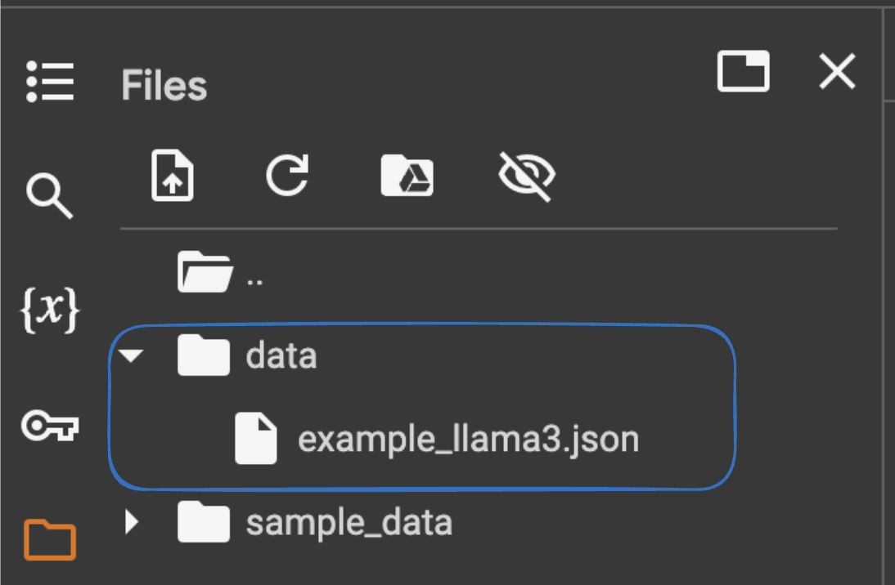

<span class="colour" style="color:red">Note </span> Ensure that your files are saved elsewhere. This runtime's files will be deleted when its is terminated.

***Summary: So far, we have our raw dataset as example_llama3.json, enabled Hugging Face in our Colab notebook, and uploaded the data into our folder. we will be convertig the dataset (example_llama3.json) into Llama3 format and uploading on Hugging Face so it can be used for our fine tuning in the upcoming steps***

<span style="color: green;"> We will start by installing specific Python packages. </span>

``` py
!pip install datasets huggingface_hub google-colab
```


<span class="colour" style="color:red">Note </span> You don't need to install the packages if you are using the same notebook as in Task 8a when the datasets were created for Llama2.

* The ! at the beginning is used in Jupyter notebooks or Google Colab to run shell commands. Using pip install we will install Python packages  

* datasets: This package is part of the Hugging Face ecosystem and provides tools for working with large datasets. It allows users to easily download, preprocess, and manage datasets, especially those used in machine learning and natural language processing (NLP).

* huggingface_hub: This package provides tools to interact with the Hugging Face Hub. 

* google-colab: This package includes utilities specifically designed for Google Colab, a  Jupyter notebook environment that runs in the cloud.


<span style="color: green;"> Step 1: Import the required modules </span>

``` py linenums="1"

# Import required modules
from datasets import Dataset
from huggingface_hub import login
import os
from google.colab import userdata
import json
import pandas as pd
```

* from datasets import Dataset: imports the Dataset class from the datasets library. The Dataset class is used to create and manipulate datasets. This library is part of the Hugging Face ecosystem and is especially useful for handling datasets for machine learning and NLP tasks.

* from huggingface_hub import login: This imports the login function from the huggingface_hub library. The login function is used to authenticate with the Hugging Face Hub, allowing the user to upload and manage models and datasets on the platform.

* import os: This imports the os module, which provides a way of using operating system-dependent functionality like reading or writing to the file system, environment variables, and more. 

* from google.colab import userdata: imports the userdata module from the google.colab library. The google.colab library contains utilities specifically designed for use with Google Colab. 

* import Json: will be used to Parsed JSON data

* import pandas as pd: used for data manipulation and analysis 

<span style="color: green;">Step 2:  Retrieve Hugging Face token from Colab secrets </span>

``` py linenums="1"
# Retrieve Hugging Face token from Colab secrets
os.environ["HF_TOKEN"] = userdata.get('HF_TOKEN')
# Login to Hugging Face
login(token=os.environ["HF_TOKEN"])
```


* This part of the code retrieves a previously stored Hugging Face token from Colab secrets. This token is essential for authenticating with the Hugging Face platform. Storing tokens in Colab secrets is a secure way to handle sensitive information without hardcoding it in your script.

* Login to Hugging Face: This line logs into Hugging Face using the retrieved token. Logging in allows our code to interact with the Hugging Face Hub, and allow us to upload datasets and models.

```
!huggingface-cli whoami
```

<span style="color: Red;">Note: Confirm you are connected to your HuggingFace account </span>

<span style="color: green;"> Step 3: Standardizing and load data from example_llama3.json </span>

``` py linenums="1"
# Load JSON data from a file
with open('/content/data/example_llama3.json', 'r') as f:
# with open('new_data_records.json', 'r') as f:
    data = json.load(f)

# Transform the data to match the desired format
transformed_data = []
for item in data:
    transformed_data.append({
        "question": item["question"],
        "context": item["context"],
        "answer": item["answer"]
    })

```
<span style="color: red;"> Note: How to get path for your file in GoogleColab </span>

* Right click on your file (example_llama3.json) and select Copy Path

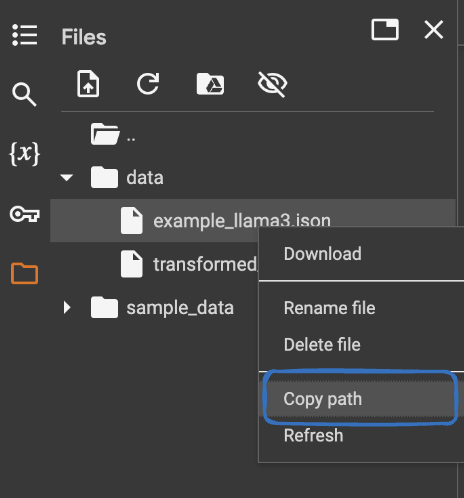

<span style="color: green;"> Step 3a: List and confirm data from  transformed_data. </span>

``` py linenums="1"
print(transformed_data[0])
```
<span style="color: red;"> Output: </span>
{'question': 'What is the solution provided by Webex Calling?', 'context': 'Webex Calling is part of an integrated, intelligent, and modular team collaboration suite. It provides enterprise-grade PBX features, functionality, and performance previously only possible with an on-premises PBX network.', 'answer': 'Webex Calling provides enterprise-grade PBX features, functionality, and performance.'}

<span style="color: green;"> Step 4: Saves the transformed data to a new JSON file, ensuring it is stored in a structured and readable format for future use.</span>

``` py linenums="1"
# Save the transformed data to a new JSON file
with open('/content/data/transformed_data.json', 'w') as f:
    json.dump(transformed_data, f, indent=2)
```

<span style="color: green;"> Step 5: Converts the transformed JSON data into a pandas DataFrame and then into a Dataset object.  </span>

``` py linenums="1"
# Create a Dataset from the transformed data
df = pd.DataFrame(transformed_data)
dataset = Dataset.from_pandas(df)

```

<span style="color: green;"> Step 6: Push our new Dataset to Hugging Face Hub so it can be processed and used for fine tuning </span>

``` py linenums="1"
# Push the dataset to Hugging Face Hub
dataset.push_to_hub("WebexOne/llama3Data")
```
<span class="colour" style="color:orange">Complete Code - FOR REFERENCE ONLY</span>

``` py linenums="1"
from datasets import Dataset
from huggingface_hub import login
import os
from google.colab import userdata
import json
import pandas as pd

# Retrieve Hugging Face token from Colab secrets
os.environ["HF_TOKEN"] = userdata.get('HF_TOKEN')
# Login to Hugging Face
login(token=os.environ["HF_TOKEN"])

# Load JSON data from a file
with open('/content/data/example_llama3.json', 'r') as f:
# with open('new_data_records.json', 'r') as f:
    data = json.load(f)

# Transform the data to match the desired format
transformed_data = []
for item in data:
    transformed_data.append({
        "question": item["question"],
        "context": item["context"],
        "answer": item["answer"]
    })
# Save the transformed data to a new JSON file
with open('/content/data/transformed_data.json', 'w') as f:
    json.dump(transformed_data, f, indent=2)

# Create a Dataset from the transformed data
df = pd.DataFrame(transformed_data)
dataset = Dataset.from_pandas(df)

# Push the dataset to Hugging Face Hub
dataset.push_to_hub("WebexOne/llama3Data")
```

### Fine-tuning Llama3 Model

<span class="colour" style="color:RED"> NOTE: If you’re serious about fine-tuning models, using a script instead of a notebook is recommended. You can easily rent GPUs on Lambda Labs, Runpod, Vast.ai e.t.c </span>

### Background on Fine-Tuning 


Meta has released a new series of large language models (LLMs) called Llama 3, a collection of pre-trained and instruction-tuned text-to-text models. 

Llama 3 is an auto-regressive language model that uses an optimized transformer architecture. Both pre-trained and instruction-tuned models come with 8B and 70B parameters with a context length of 8K tokens.

As mentioned earlier Language models (LLMs) are pretrained on extensive text corpus. The 8B model has a knowledge cutoff of March 2023, while the 70B model has a cutoff of December 2023. The models use Grouped-Query Attention (GQA), which reduces memory bandwidth and improves efficiency.

In this lab, we will FineTune Llama3-8b parameter model with our dataset that was created earlier.

<span class="colour" style="color:red">Note:</span> As mentioned earlier, the choice of prompt template is crucial for fine-tuning. The following prompt template will be used to fine tune Llama3-8b

``` title="Sample Format - Dont Copy - reference ONLY"
<|begin_of_text|><|start_header_id|>system<|end_header_id|> You are a helpful AI assistant for  Collaboration<|eot_id|>

                 <|start_header_id|>user<|end_header_id|> What can you help me with?<|eot_id|>

                 <|start_header_id|>assistant<|end_header_id|>
```

<span class="colour" style="color:red">Note:</span> For this tutorial, we will use a preformatted dataset (WebexOne/llama3Data) that was uploaded earlier on Hugging Face. We will apply Supervised Fine-Tuning (SFT) to a base model.

#### Guide to Fine-Tuning Llama 3

In this section, we will learn about all the steps required to fine-tune the Llama 3 model with 8billion parameters on a T4 GPU with high RAM using Google Colab.

The Colab T4 GPU has a limited 16 GB of VRAM. 

#### Base models for Fine Tuning

* We have the option to fine-tune the Llama3 8b model <span class="colour" style="color:blue">(meta-llama/Meta-Llama-3-8B-Instruct)</span>, which can be found in the Hugging Face [repository](https://huggingface.co/meta-llama/Meta-Llama-3-8B-Instruct)

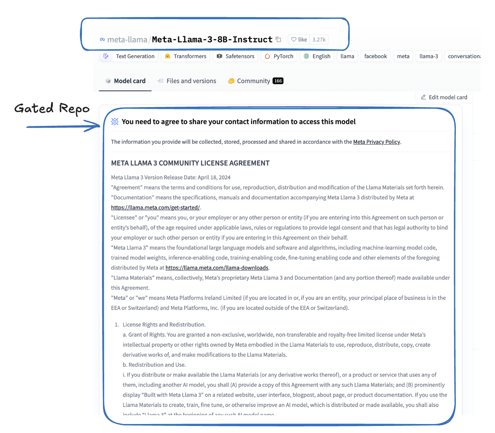

* Since it is a gated repository, you'll need to provide the required information to access and use the model. Please scroll down, fill in the necessary details, and submit the form.


* Once submitted, you can check the status of your request by navigating to Settings and clicking on Gated Repositories.


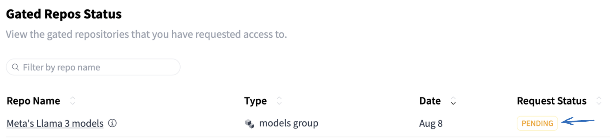

<span class="colour" style="color:red"> NOTE: It may take some time for the status to update from Pending to Accepted.</span>

* **Lets continue**


#### Logging into Google Collab

* You can either use the existing notebook from above and add a new code cell to start fine-tuning, or create a new Colab Notebook.


* Change Runtime Environment: Click the “Runtime” dropdown menu at the top of the Colab interface.


* Select “Change runtime type”: This will open a dialog box where you can configure the runtime environment.

* Select Hardware Accelerator: From the “Hardware accelerator” dropdown menu, choose >> T4 GPU and enable toggle for High RAM


* Save Settings: Click “Save” to apply the changes.

<span class="colour" style="color:red">Reminder: </span>Whenever you want to copy the code in Google Colab and run it, be sure to click on + Code to add a new code cell.


<span class="colour" style="color:red">Reminder: </span>Click the play button to the left of the code, or use the keyboard shortcut "Command/Ctrl+Enter" while the cell is selected.


#### Set up Envoirnment

<span class="colour" style="color:green">Step 1: Check the status of Nvidia chipset. OPTIONAL STEP </span>

```py linenums="1"
!nvidia-smi 
```

<span class="colour" style="color:red">Note: Remember to execute each cell individually </span>


<span class="colour" style="color:red">Note: </span> nvidia-smi stands for NVIDIA System Management Interface. It is a command-line utility that provides information about NVIDIA GPUs installed on the system. This tool is part of the NVIDIA GPU driver package. By using !nvidia-smi, you can quickly check the status and health of your NVIDIA GPUs from within a Jupyter Notebook, making it a useful tool for machine learning and data science workflows.

<span class="colour" style="color:green">Step 2: Install the required libraries. </span>

``` py linenums="1"
!pip install transformers
!pip install datasets
!pip install accelerate
!pip install bitsandbytes
!pip install peft
!pip install trl
!pip install --upgrade jinja2
!pip install tensorboard
!pip install scikit-learn
!pip install python-dotenv
```

<span class="colour" style="color:red">Note: Remember to execute each cell individually </span>


* datasets: accessing and using various datasets for NLP 

* bitsandbytes: is a library for efficient model quantization 

* transformers library by Hugging Face that provides pre-trained models and tools for natural language processing (NLP) tasks.

* trl:  Transformer Reinforcement Learning. It is a library for applying reinforcement learning techniques to transformer models. 

* peft: package for fine tuning LLM's

<span class="colour" style="color:green">Step 3: Load the necessary modules </span>

``` py linenums="1"
from textwrap import dedent
from typing import Dict, List
import numpy as np
import pandas as pd
import torch
from datasets import Dataset, load_dataset
from peft import (
    LoraConfig,
    PeftModel,
    TaskType,
    get_peft_model,
    prepare_model_for_kbit_training,
)
from sklearn.model_selection import train_test_split
from torch.utils.data import DataLoader
from tqdm import tqdm
from transformers import (
    AutoModelForCausalLM,
    AutoTokenizer,
    BitsAndBytesConfig,
    pipeline,
)
from dotenv import load_dotenv
import os
```

<span class="colour" style="color:red">Note: Remember to execute each cell individually </span>

* datasets:  library, is part of the Hugging Face ecosystem, that provides tools to load and process datasets.

* transformers: Hugging Face Transformers library, which provides tools for working with transformer-based models.

* AutoModelForCausalLM: automatically selects the appropriate model architecture for causal language modeling (e.g., Llama or GPT based models).

* AutoTokenizer: A class that automatically selects the appropriate tokenizer for a given model.

* BitsAndBytesConfig: Configuration class for model quantization

* pipeline: The pipelines are a great and easy way to use models for inference. [More info](https://huggingface.co/docs/transformers/en/main_classes/pipelines)

* peft: Stands for Parameter-Efficient Fine-Tuning (PEFT), which includes methods like LoRA (Low-Rank Adaptation) and Qlora

* trl: Stands for Transformer Reinforcement Learning, a library that includes tools for fine-tuning and training models

<span class="colour" style="color:green">Step 4: Retrieve Hugging Face token and set as an environment variable. </span>

```py linenums="1"
from google.colab import userdata
os.environ["HF_TOKEN"] = userdata.get("HF_TOKEN")
```
<span class="colour" style="color:red">Note: Remember to execute each cell individually </span>

``` py linenums="1"
!huggingface-cli whoami
```


* Verify to confirm that the Hugging Face CLI is correctly authenticated with your account.


#### Load model 

<span class="colour" style="color:green">Step 5: Before we start processing the data let's load our base llama3 model.  </span>

``` py linenums="1"
PAD_TOKEN = "<|pad|>"
MODEL_NAME = "meta-llama/Meta-Llama-3-8B-Instruct"
NEW_MODEL = "WebexOne-lllama-3"
```

<span class="colour" style="color:red">Note: You can name the NEW_MODEL variable whatever you prefer.</span>

* PAD_TOKEN: is set to help model not to repeat text.

* MODEL_NAME: specifies the name of a pre-trained model from Hugging Face that we will be using

* NEW_MODEL: gives a custom name for our fine-tuned version of the model.

#### Load Quantization 

<span class="colour" style="color:green">Step 6: Loading a Quantized Language Model  </span>

``` py linenums="1"
quantization_config = BitsAndBytesConfig(
    load_in_4bit=True, bnb_4bit_quant_type="nf4", bnb_4bit_compute_dtype=torch.bfloat16
)

tokenizer = AutoTokenizer.from_pretrained(MODEL_NAME, use_fast=True)
tokenizer.add_special_tokens({"pad_token": PAD_TOKEN}) #help modles not to repeat text
tokenizer.padding_side = "right"  #help modles not to repeat text

model = AutoModelForCausalLM.from_pretrained(
    MODEL_NAME,
    quantization_config=quantization_config,
    device_map="auto",
)
model.resize_token_embeddings(len(tokenizer), pad_to_multiple_of=8) #help models not to repeat text
```

* Creating a configuration for the model with 4-bit precision and bfloat16 compute type. Specified the quantization type as nf4

* Downloading the original tokenizer from the Meta repository and adding special tokens. Used the fast tokenizer implementation for faster processing

* Loading the quantized model and automatically mapping it to available devices.

* Resizing the model's token embeddings to match the tokenizer's vocabulary and setting the padding side to 'right' to prevent the model from generating text automatically.

* Adding a padding token to help prevent text repetition.

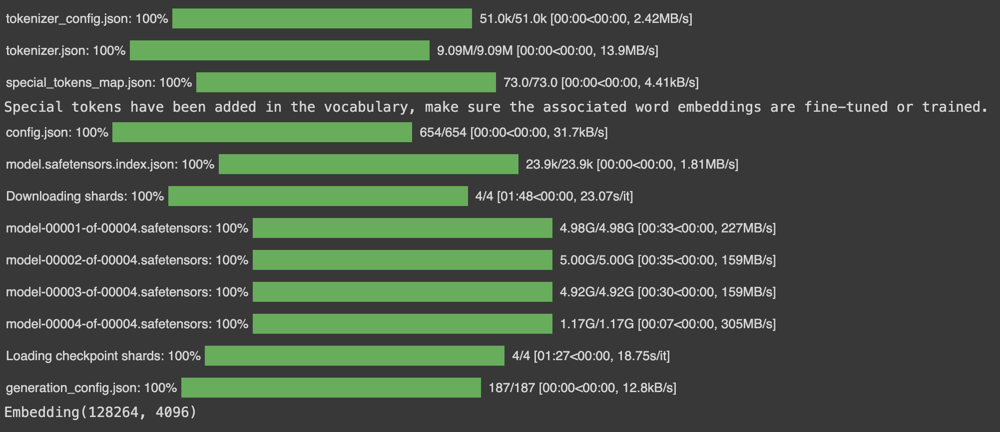

<span class="colour" style="color:green">Step 7: Retrieves the configuration associated with our loaded model - OPTIONAL STEP</span>

``` py linenums="1"
model.config
```

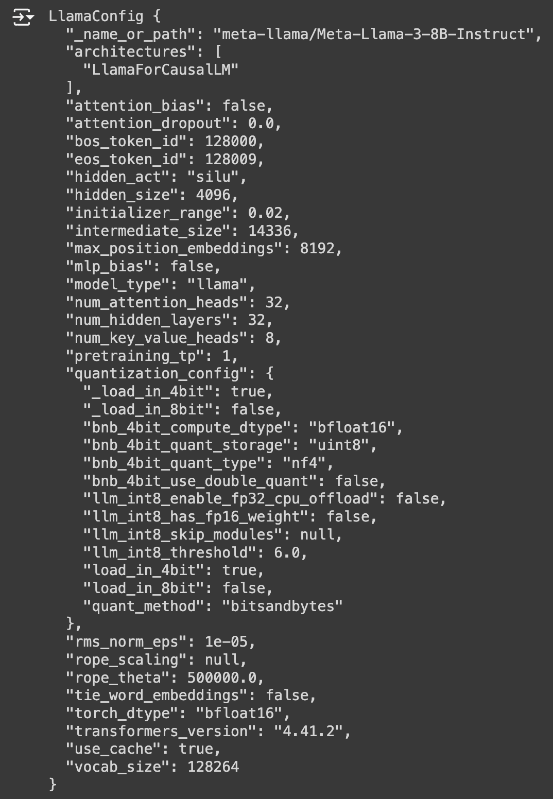

* **You will be able to see the config here for Quantization**

#### Load Dataset

<span class="colour" style="color:green">Step 7: Loading Dataset  </span>

``` py linenums="1"
dataset = load_dataset("WebexOne/llama3Data")
dataset
```

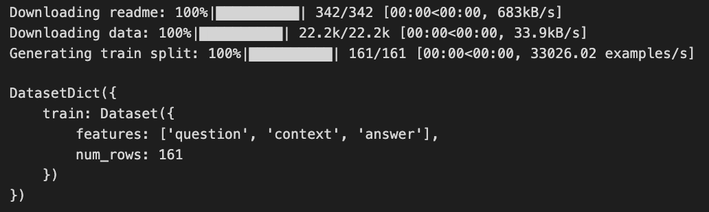

<span class="colour" style="color:green">Step 8: Extracting and converting Dataset into a pandas DataFrame  </span>

``` py linenums="1"
rows = []
for item in dataset["train"]:
    rows.append(
        {
            "question": item["question"],
            "context": item["context"],
            "answer": item["answer"],
        }
    )
df = pd.DataFrame(rows)
```

* Initialize an empty list called rows.  Iterate over each item in the training split of the dataset and extracted the "question", "context", and "answer" fields from each item.

*  Converted our list (rows) into a pandas DataFrame (df variable).


``` py linenums="1"
df
```
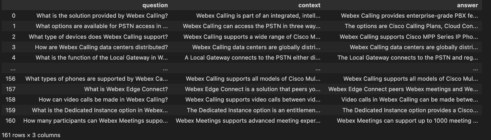


<span class="colour" style="color:green">Step 9: Lets create a function which will format each row into a list of dictionaries (messages), followed by a conversation-like structure that is suitable for training Llama3. Each message includes a role (system, user, assistant) and corresponding content.  </span>

```py linenums="1"

def format_example(row: dict):
    prompt = dedent(
        f"""
        {row["question"]}

        Information:
        ```
        {row["context"]}
        ```
        """
    )
    messages = [
        {
            "role": "system",
            "content": "Use only the information to answer the question. If you dont know the answer just say it.",
        },
        {"role": "user", "content": prompt},
        {"role": "assistant", "content": row["answer"]},
    ]
    print(messages)
    return tokenizer.apply_chat_template(messages, tokenize=False)

```

<span class="colour" style="color:red ">Note: tokenizer.apply_chat_template(messages, tokenize=False): Applies the chat template to the messages list using the tokenizer. The tokenize=False argument indicates that the text should not be tokenized at this stage. This step prepares the text in a format that can be used by Llama3 for training and inference. </span>

<span class="colour" style="color:green">Step 10: Apply the Function to our DataFrame </span>

``` py linenums="1"
df["text"] = df.apply(format_example, axis=1)
```

<span class="colour" style="color:red ">Note: axis = 1 , apply the function to each row </span>

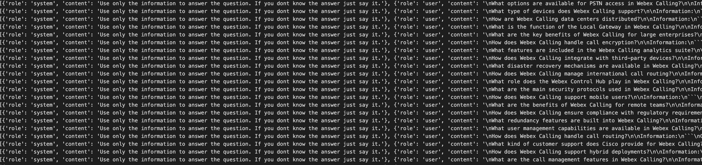

``` py linenums="1"
df.text[0]
```

``` py title="OUTPUT - For Reference ONLY"
'<|begin_of_text|><|start_header_id|>system<|end_header_id|>\n\nUse only the information to answer the question. If you dont know the answer just say it.<|eot_id|><|start_header_id|>user<|end_header_id|>\n\nWhat is the solution provided by Webex Calling?\n\nInformation:\n```\nWebex Calling is part of an integrated, intelligent, and modular team collaboration suite. It provides enterprise-grade PBX features, functionality, and performance previously only possible with an on-premises PBX network.\n```<|eot_id|><|start_header_id|>assistant<|end_header_id|>\n\nWebex Calling provides enterprise-grade PBX features, functionality, and performance.<|eot_id|>'
``` 

<span class="colour" style="color:green">Step 11: Counting Tokens for Each Text in a DataFrame </span>

* Lets define a function to calculate the number of tokens in each  entry within our DataFrame. <span class="colour" style="color:red">Note: Optional Step </span>

``` py linenums="1"
def count_tokens(row: Dict) -> int:
    return len(
        tokenizer(
            row["text"],
            add_special_tokens=True,
            return_attention_mask=False,
        )["input_ids"]
    )
```

* Lets convert text into tokens and then counts how many tokens each piece of text contains. The result is stored in a new column named token_count in the DataFrame, providing an easy reference for the length of each text in terms of tokens. 

```py linenums="1"
df["token_count"] = df.apply(count_tokens, axis=1)
```

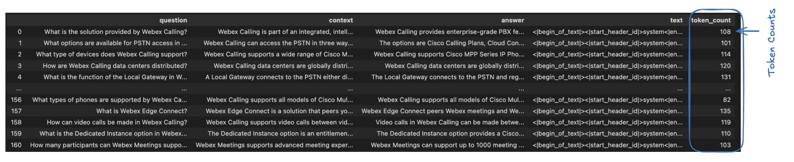

#### Splitting a Dataset into Training, Validation, and Test Sets

<span class="colour" style="color:green">Step 12:</span> We will split our dataset into three distinct subsets: a training set, a validation set, and a test set. This is a common practice in machine learning to ensure that the model is trained, validated, and tested on separate data, which helps to evaluate its performance more reliably.

<span class="colour" style="color:red">Note: For our fine-tuning, we will only use the training dataset. However, I'll demonstrate how to split and create separate datasets.</span>


```py linenums="1"
train, temp = train_test_split(df, test_size=0.2)
val, test = train_test_split(temp, test_size=0.2)
```

* We performed a two-step data splitting process to divide a dataset into training, validation, and test :
    
    * **First Split:** The original dataset  is split into a training set (80%) and a temporary set (temp, 20%).

    * **Second Split:** The temporary set is further split into a validation set (val, 16%) and a test set (test, 4%).

The final result is:

* **train:** 80% of the data for training the model.
* **val:** 16% of the data for validating the model during training.
* **test:** 4% of the data for testing the model's performance.

This method ensures that the model is trained, validated, and tested on different subsets of the data, which helps in preventing overfitting and provides a more accurate assessment of the model's generalization capability.

<span class="colour" style="color:green">Step 13: Calculating Dataset Proportions and Sizes </span>

``` py linenums="1"
len(train) / len(df), len(val) / len(df), len(test) / len(df)

len(train), len(val), len(test)
```
<span class="colour" style="color:red"> Output </span>

(128, 26, 7)

* We calculate both the proportions and the absolute sizes of the training, validation, and test datasets relative to the original dataset   This helps in confirming that the dataset was split correctly and understanding how the data is distributed among the training, validation, and test sets.

<span class="colour" style="color:green">Step 14: Sampling and Exporting Subsets to JSON Files </span>

```py linenums="1"
train.sample(n=128).to_json("train.json", orient="records", lines=True)
val.sample(n=26).to_json("val.json", orient="records", lines=True)
```

* Performs 2 functions:
    * Random Sampling: It randomly selects 128 samples from the training dataset (train) (absoulte size calculated above) and 26 samples from the validation dataset (val).
    * Export to JSON: The sampled data is then exported to JSON files (train.json and val.json) in a format where each row is a separate JSON object. orient="records": allows the JSON output so that each object is written on a new line.

* This approach is very useful for creating smaller, representative datasets for testing or sharing, ensuring that the data remains in a structured and easily readable format.


<span class="colour" style="color:green">Step 15: Loading a Dataset from JSON Files </span>

*  Load dataset from JSON files using the Hugging Face datasets library:

```py linenums="1"
dataset = load_dataset(
    "json",
    data_files={"train": "train.json", "validation": "val.json"}
)
```


* To view JSON data

``` py linenums="1"

dataset['train'][0]["text"]

```

<span class="colour" style="color:green">Step 16: Testing Before Fine-Tuning our model</span>

* Setting Up the Text Generation Pipeline

``` py linenums="1"
pipe = pipeline(
    task="text-generation",
    model=model,
    tokenizer=tokenizer,
    max_new_tokens=128,
    return_full_text=False,
)
```

* We'll create a test prompt by removing the original answer from the prompt. By setting add_generation_prompt=True, the following be added at the end of prompt <|eot_id|><|start_header_id|>assistant<|end_header_id|>

``` py linenums="1"

def create_test_prompt(data_row):
    prompt = dedent(
        f"""
        {data_row["question"]}

        Information:
        ```
        {data_row["context"]}
        ```
        """
    )
    messages = [
        {
            "role": "system",
            "content": "Use only the information to answer the question. If you dont know the answer just say it.",
        },
        {"role": "user", "content": prompt},
    ]
    return tokenizer.apply_chat_template(
        messages, tokenize=False, add_generation_prompt=True
    )
```

* We will test the Model with a Sample Row from our training dataset  

``` py linenums="1"
row = dataset["train"][0]
prompt = create_test_prompt(row)
print(prompt)
```
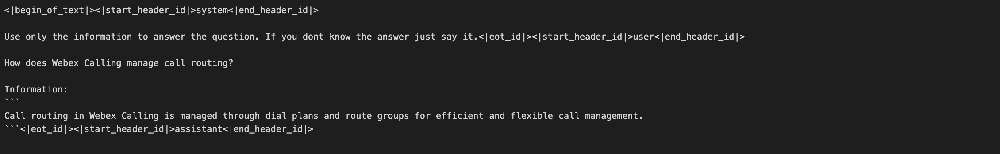

* Generating and Comparing Output

``` py linenums="1"
%%time
outputs = pipe(prompt)
response = f"""
answer: {row["answer"]}
prediction: {outputs[0]["generated_text"]}
"""
print(response)
```
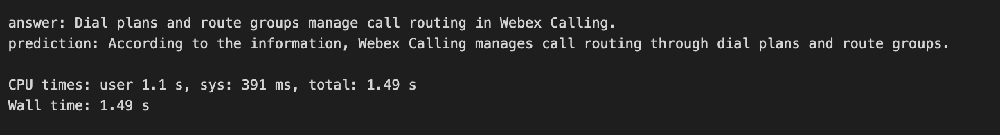

#### Configuring and Preparing a Model for Low-Rank Adaptation (LoRA) with Quantization

<span class="colour" style="color:green">Step 17: Testing Before Fine-Tuning our model</span>

* K-bit quantization reduces the precision of the model's weights to k-bits (e.g., 4-bit or 8-bit)

* The LoRA configuration is applied to the model, adding low-rank matrices to the specified layers, enabling efficient fine-tuning with minimal additional parameters.

* We will target all the linear layers to train models like query, key , value pretty much every linear layer in the model mlp = multilayer preception.  Its like creating a small model on top of orignal model, we will only finetune teh weights of the small model.

```py linenums="1"
lora_config = LoraConfig(
    r=32,
    lora_alpha=16,
    target_modules=[
        "self_attn.q_proj",
        "self_attn.k_proj",
        "self_attn.v_proj",
        "self_attn.o_proj",
        "mlp.gate_proj",
        "mlp.up_proj",
        "mlp.down_proj",
    ],
    lora_dropout=0.05,
    bias="none",
    task_type=TaskType.CAUSAL_LM,
)
model = prepare_model_for_kbit_training(model) #  as we using Kbit for quantization
model = get_peft_model(model, lora_config)
OUTPUT_DIR = "./l3Webex1"
```

* To view total parameters of the model 
```py linenums="1" 
model.print_trainable_parameters()
```

<span class="colour" style="color:green">Step 18: Configuring and Initializing a Supervised Fine-Tuning (SFT)</span>

* We will setup configuration for supervised fine-tuning (SFT) of a language model and then initializes a trainer to perform the fine-tuning process. As discussed, SFT is a method used to fine-tune pre-trained language models on specific datasets with labeled data, enabling the model to perform better on specific tasks.

``` py linenums="1"
sft_config = SFTConfig(
    output_dir=OUTPUT_DIR,
    dataset_text_field="text",
    max_seq_length=512,
    num_train_epochs=1,
    per_device_train_batch_size=2,
    per_device_eval_batch_size=2,
    gradient_accumulation_steps=4,
    optim="paged_adamw_8bit", #8 bit optimmizer
    eval_strategy="steps",
    save_steps=0.2,
    eval_steps=0.2,
    logging_steps=10,
    learning_rate=2e-4,
    fp16=True,  # or bf16=True,
    save_strategy="steps",
    warmup_ratio=0.1,
    save_total_limit=2,
    lr_scheduler_type="constant",
    report_to="tensorboard",
    save_safetensors=True,
    dataset_kwargs={
        "add_special_tokens": False,  # We template with special tokens
        "append_concat_token": False,  # No need to add additional separator token
    }
)

trainer = SFTTrainer(
    model=model,
    args=sft_config,
    train_dataset=dataset["train"],
    eval_dataset=dataset["validation"],
    tokenizer=tokenizer,
)
```


<span class="colour" style="color:red">Note: eval_dataset=dataset["validation"]: The validation dataset is specified for info only As in the future this dataset can be used to evaluate the model's performance during training. </span>

<span class="colour" style="color:green">Step 19: Executing the Training Process </span>

* trainer.train() initiates the training process. This method triggers the training loop, where the model is fine-tuned on the training dataset (train_dataset) according to the configuration (sft_config) passed to the SFTTrainer in step18  

```py linenums="1"
trainer.train()
```

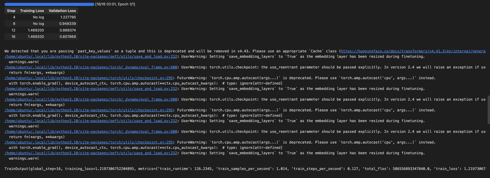

<span class="colour" style="color:green">Step 20: Saving the Fine-Tuned Model </span>

```py linenums="1"
trainer.save_model(NEW_MODEL)
```

<span class="colour" style="color:green">Step 21: Loading and Preparing a Fine-Tuned Model </span>

<span class="colour" style="color:red"> Note: This step may not work on Google Colab due to its resource limitations. It involves resizing token embeddings and merging a PEFT (Parameter-Efficient Fine-Tuning) model with the base model before pushing it to Hugging Face. If you're using your own servers (not Google Colab), feel free to proceed. Otherwise, this is for your information only, and you might encounter an error similar to the one shown below. Please skip to the [inferencing step](https://allchapters.github.io/Ai/Task8b/#use-the-uploaded-model-and-test-for-inferencing) to use the uploaded model on Hugging Face and test how it works.</span>

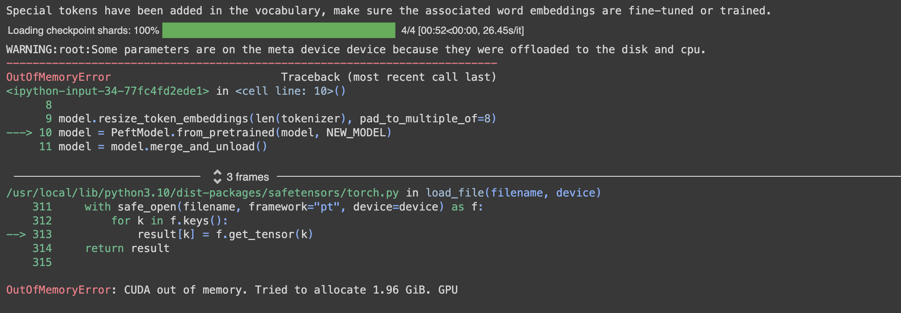

* We will merge PEFT model with the base model and unloads unnecessary components. 

* Reloads and configures the tokenizer for consistent padding and token handling.

``` py linenums="1"
import torch
from transformers import AutoModelForCausalLM, AutoTokenizer
from peft import PeftModel

# Function to clear GPU cache
def clear_gpu_cache():
    torch.cuda.empty_cache()

# Load model with low memory usage
model = AutoModelForCausalLM.from_pretrained(
    MODEL_NAME,
    low_cpu_mem_usage=True,
    return_dict=True,
    torch_dtype=torch.float16,
    device_map="cpu",
)
clear_gpu_cache()

# Resize token embeddings
model.resize_token_embeddings(len(tokenizer), pad_to_multiple_of=8)
clear_gpu_cache()

# Load PeftModel and merge
model = PeftModel.from_pretrained(model, NEW_MODEL)
model = model.merge_and_unload()
clear_gpu_cache()

# Reload tokenizer to save it
tokenizer = AutoTokenizer.from_pretrained(NEW_MODEL, trust_remote_code=True)
tokenizer.pad_token = tokenizer.eos_token
tokenizer.padding_side = "right"

# Clear GPU cache one last time
clear_gpu_cache()
```
* Similar to the model, this command uploads the tokenizer to the same Hugging Face Hub repository that was defined at the begining of this section 

```py linenums="1"
model.push_to_hub(NEW_MODEL, use_temp_dir=False)
tokenizer.push_to_hub(NEW_MODEL, use_temp_dir=False)
```

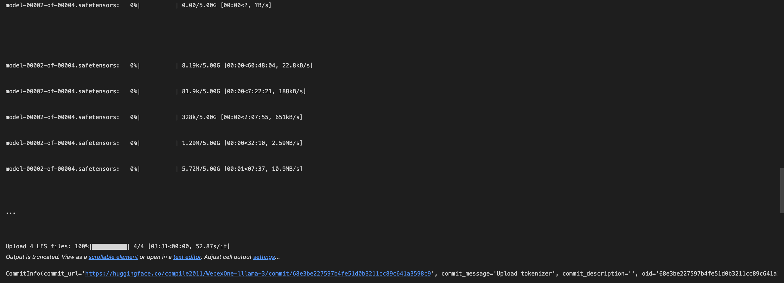

#### Use the uploaded model and test for inferencing

<span class="colour" style="color:red"> Note: Since we were unable to upload our fine-tuned model to the Hugging Face Hub, I have already trained and fine-tuned the model using the same datasets we discussed in the lab. You can download the [model](https://huggingface.co/compile2011/WebexOne-lllama-3?library=transformers) and use it for inference. </span>

* Log in to the Hugging Face Hub and navigate to your model's page (from above)

* Click on "Use this model" and then "Transformers".

* Copy the provided code snippet for using the model.

<span class="colour" style="color:green">Step 22: Load model directly </span>

```py linenums="1"
from transformers import AutoTokenizer, AutoModelForCausalLM
tokenizer = AutoTokenizer.from_pretrained("compile2011/WebexOne-lllama-3")
model = AutoModelForCausalLM.from_pretrained("compile2011/WebexOne-lllama-3")
```

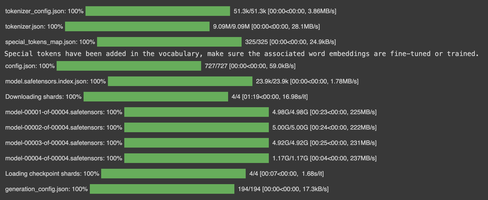

```py linenums="1"
from transformers import pipeline

pipe = pipeline(
    task="text-generation",
    model=model,
    tokenizer=tokenizer,
    max_new_tokens=128,
    return_full_text=False,
)
```

```py linenums="1"
from textwrap import dedent
def create_test_prompt(question, context):
    prompt = dedent(
        f"""
        {question}

        Information:
        ```
        {context}
        ```
        """
    )
    messages = [
        {
            "role": "system",
            "content": "Use only the information to answer the question. If you dont know the answer just say it.",
        },
        {"role": "user", "content": prompt},
    ]
    return tokenizer.apply_chat_template(
        messages, tokenize=False, add_generation_prompt=True
    )
```

``` py linenums="1"
context = "How does Webex Calling support call analytics?"
question = ""
prompt = create_test_prompt(question,context)
print(prompt)
```

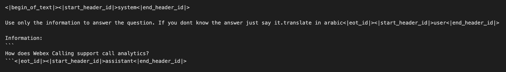

```py linenums="1"
%%time
outputs = pipe(prompt)
response = f"""
prediction: {outputs[0]["generated_text"]}
"""
print(response)
```
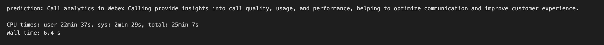

<span class="colour" style="color:red">Note:You can compare the answers with those in the dataset file that was uploaded to Hugging Face.</span>

#### Troubleshooting - Best Practices

* Challenges are an inherent part of model training. Let's discuss some common issues and their resolutions.

##### Out of Memory (OOM) Errors

* If you encounter an Out of Memory (OOM) error:

    * **Reduce Batch Size:** Lowering the batch size can help fit the model into memory.
    * **Shorten Training Samples:** Decrease the context length (e.g., max_length in tokenize()).

##### Slow Training

* If training seems sluggish:

    * **Increase Batch Size:** A larger batch size can speed up training.

    * **Use Multiple GPUs:** Consider using multiple GPUs, either by purchasing or renting (e.g., on platforms like Runpod). The provided code is compatible with accelerate for multi-GPU settings. Simply launch it with <span class="colour" style="color:blue"> accelerate launch your_file.py </span> instead of <span class="colour" style="color:blue"> python your_file.py </span>

##### Poor Model Quality

The quality of your model reflects the quality of your dataset. To improve model quality ensure your dataset is rich and relevant.

## Conclusions

So, we have explored the process of fine-tuning our model and performing inference with it. Now, let’s say you have successfully trained or fine-tuned your model and are ready to deploy it for widespread use. However, you notice that the latency is too slow, and you want to speed up the model. There are four key methods you can employ to enhance your model's performance. While these steps are not covered in this lab, they serve as a good starting point for further investigation:

* **Quantization**
* **Pruning**
* **Model or Knowledge Distillation**
* **Engineering Optimizations**


