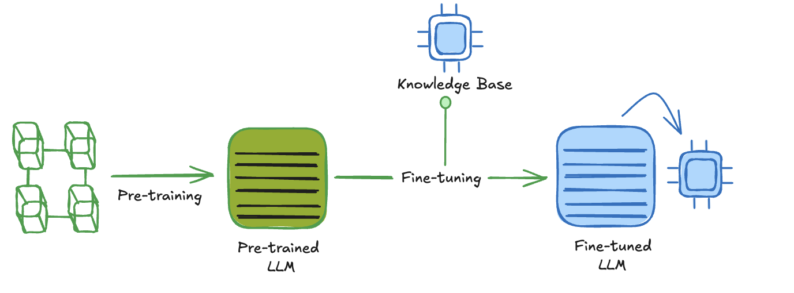

## Introduction

Just to summarise fine-tuning is the process of adjusting the parameters of a pre-trained large language model to a specific task or domain. Although pre-trained language models like GPT possess vast language knowledge, they lack specialization in specific areas e.g specific info about Webex. Fine-tuning addresses this limitation by allowing the model to learn from domain-specific data to make it more accurate and effective for targeted applications.

Having already customized LLaMA 2 and LLaMA 3, let's now dive into fine-tuning another AI model GPT4. As we have seen, fine-tuning allows you to adapt a model for specific tasks, enhancing its accuracy and reliability. It can also make your prompts more efficient, saving both time and costs. 

In our demo, we’re going to try something different: fine-tuning a language model using synthetic datasets created by a more advanced AI (GPT4).


<span class="colour" style="color:red">Note: it's important to note that fine-tuning this type of model involves some costs. More info for pricing available [here](https://openai.com/api/pricing/)</span>

## Pre-requisites

* Fine-tuning is currently available for the following models: 

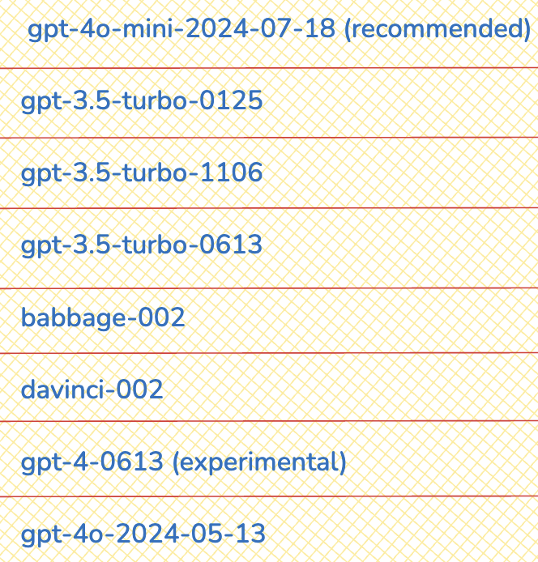

<span class="colour" style="color:red">Note: Fine-tuning for GPT-4 (gpt-4-0613 and gpt-4o-*) is in an experimental access program—eligible users can request access in the [fine-tuning UI](https://platform.openai.com/finetune) when creating a new fine-tuning job.</span>

* While there is no strict minimum, the quality and quantity of the data greatly affect the fine-tuning process. To fine-tune a GPT model, you are required to provide a dataset with atleast 10 examples 

* Before you start a fine-tuning job, it's crucial to check your dataset's formatting. OpenAI has provided a simple Python script that helps you spot potential errors, review token counts, and estimate the cost of fine-tuning. You can find the code [here](https://cookbook.openai.com/examples/chat_finetuning_data_prep).

## Datasets Creation

As we will be using and fine tuning GPT4  model we need to convert datasets into a uniform format. [More Info at](https://platform.openai.com/docs/guides/fine-tuning/preparing-your-dataset)

### Example Format 

``` title="Sample Format - reference ONLY" 

{"messages": [{"role": "system", "content": "WebexOne is a chatbot that provides the most relevant and up-to-date information."}, 
{"role": "user", "content": "What's the cloud calling solution provided by Cisco"}, 
{"role": "assistant", "content": "Webex Calling, as if everyone doesn't know that already."}]}
```

* JSON setup with three different inputs 
    * **System Prompt**
    * **User/Input Prompt**
    * **Response from Model or Output Prompt**

### Datasets Creation

The next step is to prepare a dataset for fine-tuning. 

In my scenario, I was able to generate synthetic dataset from the [Cisco IP DECT Phone 6800 Series Deployment Guide](https://www.cisco.com/c/dam/en/us/td/docs/voice_ip_comm/cuipph/MPP/6800-DECT/deployment/CiscoDECT6800DeploymentGuide.pdf).

#### Sample Dataset

* Below is the sample Dataset we will train our model on:

<span class="colour" style="color:red">Note: My User_Prompt and Assistant_Prompt are defined below.</span>

``` txt title="GPT.txt"
User_Prompt: What is the first step in the quick setup and installation process for the Cisco IP DECT 6800 Series? Assistant_Prompt: The first step is to review the entire document to ensure success before starting the deployment. This initial section provides a quick step-by-step guide, but the details and context are found in the remainder of the document.
User_Prompt: What should be considered when planning the location of base stations for the DECT system? Assistant_Prompt: When planning the location of base stations for the DECT system, consider that each base station covers 50 meters (164 feet) indoors. They should be installed within this range for good coverage. The location might be impacted by objects or barriers that create radio obstruction and interference. Using the handsets' free site survey tool can help identify these potential barriers.
User_Prompt: What equipment is required for the DECT system installation? Assistant_Prompt: The equipment required includes Cisco IP DECT DBS-110 Single-Cell Base Station, Cisco IP DECT DBS-210 Multi-Cell Base Station, and Cisco IP DECT RPT-110 Repeater. Additionally, handsets such as Cisco IP DECT Phone 6823, 6825, and 6825 Ruggedized Handset are needed.
User_Prompt: How do you upgrade the devices for the Cisco IP DECT 6800 Series? Assistant_Prompt: Unpack and register the base stations to the call system, upgrade them to the desired firmware version if necessary, and select and set the desired configuration parameters. Unpack the handsets, remove the battery's plastic shield, and charge the battery before using the handsets.
User_Prompt: What are the steps to install the base station? Assistant_Prompt: Place the base stations around the site in high locations without securing them, use the site survey tool on handsets to check the location for good coverage, make a few test calls from the handsets, and then mount the base stations with the included foot stands or wall/ceiling mount kits.
User_Prompt: What should be done if the Ethernet switch does not provide Power over Ethernet for the base stations? Assistant_Prompt: If the Ethernet switch does not provide Power over Ethernet, a power outlet is required for each base station.
User_Prompt: What is the recommended firmware practice for the base stations and handsets? Assistant_Prompt: Cisco's best practice recommendation is to use the most recent firmware load available on Cisco.com. Each base station may take up to one hour to upgrade.
User_Prompt: What is the procedure for using the site survey tool on the handsets? Assistant_Prompt: Press Menu and *47*. The IP Search screen appears. Press the Select softkey when the MAC address of the base station appears. You can manually switch between base stations and repeaters during the site survey test.
User_Prompt: What precautions should be taken during the handset firmware upgrade? Assistant_Prompt: The handset must be placed on the cradle until the upgrade is completed. Don’t remove the handset during the upgrade to avoid permanent damage.
User_Prompt: What are the available handsets for the Cisco IP DECT 6800 Series? Assistant_Prompt: The available handsets are Cisco IP DECT Phone 6823 Handset, Cisco IP DECT Phone 6825 Handset, and Cisco IP DECT Phone 6825 Ruggedized Handset.
User_Prompt: How should the handsets be prepared for registration and use? Assistant_Prompt: Unpack the handsets, remove the battery's plastic shield, reinstall the battery, and place the handsets on their cradle to charge fully before using. You can register each handset with the base station before charging and then upgrade the firmware while they charge on the cradle.
User_Prompt: What should be done if there is more than one base station to install? Assistant_Prompt: Run the site survey to check the coverage of each base station. Make a few test calls from the handsets and then mount the base stations accordingly.
User_Prompt: What is one advantage of Cisco’s DECT solution over Wi-Fi? Assistant_Prompt: One advantage of Cisco’s DECT solution over Wi-Fi is that the DECT solution components, such as the phones and base stations, have the same architecture and are designed to work exclusively with each other.
User_Prompt: Can third-party DECT base stations support Cisco handsets? Assistant_Prompt: No, third-party DECT base stations, repeaters, and handsets are not supported with the Cisco DECT Phone solution. The product design ensures that the DECT base station and the handset run on compatible frequencies.
User_Prompt: What frequency band does the Cisco IP DECT Phone 6800 Series use to avoid interference? Assistant_Prompt: The Cisco IP DECT Phone 6800 Series works close to the 1.9 GHz frequency band to avoid interference with Bluetooth, Wi-Fi, and microwave frequencies.
User_Prompt: What is the recommended synchronization method for dual cell and multicell deployments? Assistant_Prompt: For dual cell and multicell deployments, LAN synchronization is recommended.
User_Prompt: What is the coverage radius for the DBS-110, DBS-210 base stations, and RPT-110 repeater indoors? Assistant_Prompt: The coverage radius indoors is 20-50 meters (60-164 feet) depending on the nature and quantity of any radio signal impeding items or material in the installation site.
User_Prompt: What is the primary use case for a single cell DECT system? Assistant_Prompt: The single cell system is mostly used in small businesses and home offices. The DBS-110 is cost-effective for a single cell system not expected to grow, while the DBS-210 is ideal for future expansion.
User_Prompt: What are the key factors to consider in capacity planning for DECT systems? Assistant_Prompt: Key factors include the number of simultaneous users, projected number of simultaneous calls, the area to be covered, building architecture, and any potential signal obstacles.
User_Prompt: What are the indoor and outdoor coverage radii for DECT base stations and repeaters? Assistant_Prompt: Indoors, the coverage radius is 20-50 meters (60-164 feet), and outdoors, it is 300 meters (984 feet).
User_Prompt: How does the signal area produced by a DECT base station behave? Assistant_Prompt: The signal area produced by the base station is omnidirectional and resembles a sphere. Mounting the base station very close to the ground or in a corner can reduce the optimal signal strength.
User_Prompt: What is the best practice for mounting base stations in a large hall? Assistant_Prompt: For a large hall, the base station should be installed in the middle of the space below the false ceiling. If the signal strength is poor in some areas, more base stations may be needed.
User_Prompt: What does the Cisco IP DECT 6800 Series include? Assistant_Prompt: The Cisco IP DECT 6800 Series includes the Cisco IP DECT Phone DBS-110 Single-Cell Base Station, Cisco IP DECT Phone DBS-210 Multi-Cell Base Station, Cisco IP DECT Phone RPT-110 Repeater, Cisco IP DECT Phone 6823 Handset, Cisco IP DECT Phone 6825 Handset, and Cisco IP DECT Phone 6825 Ruggedized Handset.
User_Prompt: What are the regulatory areas covered with Cisco DECT solutions? Assistant_Prompt: The regulatory areas covered are 1880-1900 MHz (Australia and New Zealand), 1880-1900 MHz (E.U. and APAC), and 1920-1930 MHz (U.S. and Canada).
User_Prompt: What technology is the Cisco IP DECT Phone 6800 Series built on? Assistant_Prompt: The Cisco IP DECT Phone 6800 Series is built on Digital Enhanced Cordless Telecommunications (DECT) technology.
User_Prompt: What protocol does the Cisco IP DECT Phone 6800 Series use for Voice over IP (VoIP)? Assistant_Prompt: The series uses the Session Initiation Protocol (SIP) to provide a Voice over IP (VoIP) solution over Ethernet.
User_Prompt: What is the frequency band used by DECT to avoid interference? Assistant_Prompt: DECT works close to the 1.9 GHz frequency band to avoid interference with Bluetooth, Wi-Fi, and microwave frequencies.
User_Prompt: What must be considered when deploying a DECT system in a service area with many rooms and obstacles? Assistant_Prompt: You may need a multicell deployment if the service area has many rooms and obstacles for good DECT signaling.
User_Prompt: What is the best mounting area for a base station to ensure optimal signal strength? Assistant_Prompt: The best mounting area is a location high up on the wall, on the wall, or ceiling away from any corners.
User_Prompt: What factors are typically included in network requirements for system planning? Assistant_Prompt: Factors include the area to be covered, the type or architecture of the building, the estimated traffic in each coverage area, signaling obstacles, and any new Ethernet cables or power outlets required.
User_Prompt: What are the recommended conditions for base station density in high density areas with less interference? Assistant_Prompt: A Cisco IP DECT Base Station provides coverage of 20-50 meters (60–164 feet) radius indoors, and 300 meters (984 feet) radius outdoors.
User_Prompt: What is the primary use of the DECT site survey tool? Assistant_Prompt: The DECT site survey tool is used to determine the best base station locations for maximum coverage.
User_Prompt: How many base stations and repeaters can a single cell DECT system support? Assistant_Prompt: A single cell DECT system with DBS-110 can support 6 repeaters, and with DBS-210, it can support 3 repeaters.
User_Prompt: What is the difference between the DBS-110 and DBS-210 base stations? Assistant_Prompt: The DBS-110 is cost-effective and ideal for single cell systems not expected to grow, while the DBS-210 is suitable for future expansion and can support more base stations.
User_Prompt: What is the maximum number of base stations in a multicell deployment? Assistant_Prompt: A multicell deployment can have 3 to 254 base stations.
User_Prompt: What synchronization method is recommended for multicell systems? Assistant_Prompt: LAN synchronization is recommended for multicell systems.
User_Prompt: What is the recommended distance between base stations to minimize interference in high density areas? Assistant_Prompt: Base stations should be installed at least 2 meters (6.5 feet) away from each other.
User_Prompt: How does the wideband codec affect channel capacity? Assistant_Prompt: The wideband codec occupies 2 channels, so if you expect more simultaneous calls, you may add more base stations to increase the channel capacity.
User_Prompt: What should be done if there are dead spots during the site survey? Assistant_Prompt: Move the base station towards the dead spot and repeat the site survey until you get the coverage you need, or add a second base station in multicell mode.
User_Prompt: What are the steps for installing the base station in a dual cell system? Assistant_Prompt: Ensure an overlap of at least 20% for seamless handover, place the base stations to maximize coverage, and consider RF attenuation in the deployment site.
User_Prompt: What are the key components to consider in deployment scenarios for capacity planning? Assistant_Prompt: Consider the intended number of handsets, traffic load, coverage area, and any potential interference or signal barriers.
User_Prompt: How can you optimize the location for installing a base station? Assistant_Prompt: Place the base station in the center with a line of sight to the coverage area, run the site survey tool, move around to locate dead spots, and adjust the base station as needed.
User_Prompt: What are the key elements described in the Cisco IP DECT 6800 Series Deployment Guide? Assistant_Prompt: The guide describes the elements in planning and designing a Cisco IP DECT 6800 Series Phone system, provides a simplified design procedure, and includes the network planning and deployment processes used in North America and Europe.
User_Prompt: What should be done if there is an interference with DECT signaling from wireless frequencies? Assistant_Prompt: DECT is resilient to interference from wireless frequencies commonly used for cell phones, Wi-Fi radios, and Bluetooth headsets. The DECT protocol adapts the channel to minimize the impact of interference.
User_Prompt: What are the recommended steps to optimize base station installation location? Assistant_Prompt: Place the base station in the center with a line of sight to the coverage area, run the site survey tool, move around the entire coverage area to locate any dead spots, and adjust the base station as needed.
User_Prompt: What is a key consideration when planning the DECT system for different regions? Assistant_Prompt: Consider the regulatory requirements for DECT frequencies in different regions. Cisco offers units set up correctly for each region, such as 1880-1900 MHz for Australia and New Zealand, 1880-1900 MHz for E.U. and APAC, and 1920-1930 MHz for U.S. and Canada.
User_Prompt: What are some of the radio considerations to take into account for DECT installations? Assistant_Prompt: Consider building penetration, interference sources, radio/cell range, and attenuation when planning DECT installations to ensure optimal signal strength and coverage.
User_Prompt: What is the importance of running the site survey tool during installation? Assistant_Prompt: Running the site survey tool helps determine the best base station locations for maximum coverage and identifies any dead spots that may require additional base stations or adjustments.
User_Prompt: What are some best practices for DECT deployment? Assistant_Prompt: Best practices include planning the location of base stations to avoid signal blocking obstacles, using the site survey tool to check coverage, and ensuring that base stations are mounted in high locations with a clear line of sight.
User_Prompt: What are the primary steps in the upgrade process for DECT devices? Assistant_Prompt: Unpack and register the base stations to the call system, upgrade them to the desired firmware version if necessary, and select and set the desired configuration parameters.
User_Prompt: What factors should be considered when ordering equipment for DECT installation? Assistant_Prompt: Consider the number of base stations, repeaters, and handsets required, as well as any additional mounting kits or power adapters needed for the installation site.
User_Prompt: What is the recommended approach for troubleshooting DECT installations? Assistant_Prompt: Rerun the site survey tool to identify any signal issues, check the placement of base stations, and ensure that all devices are upgraded to the latest firmware version.
User_Prompt: What should be done if there is a need to upgrade from old firmware? Assistant_Prompt: Follow the upgrade instructions provided in the Cisco IP DECT 6800 Series Administration Guide to ensure that all devices are running the latest firmware version supported by the call control system.
User_Prompt: What is the role of provisioning servers in DECT installations? Assistant_Prompt: Provisioning servers are used to configure and manage the DECT devices, ensuring that they are set up correctly and receive the necessary firmware updates and configuration parameters.
User_Prompt: What should be done if there are radio signal blockers between base stations in a multicell deployment? Assistant_Prompt: Ensure that there is a clear line of sight between the base stations or add additional base stations to work around the signal blockers.
User_Prompt: What are some network considerations for DECT deployment? Assistant_Prompt: Consider the network capacity, coverage requirements, and quality of service to ensure that the DECT system meets the needs of the users and provides reliable communication.
User_Prompt: What are the conditions for using default settings in DECT deployment scenarios? Assistant_Prompt: Default settings can be used when there is a single physical location with no overlapping base stations, or when multiple switches are used in single or multiple physical locations with no overlapping base stations.
User_Prompt: What should be done if the base stations do not overlap in a single physical location? Assistant_Prompt: Ensure that the base stations are properly synchronized and that there is adequate coverage in all areas where the handsets are used.
User_Prompt: What are the benefits of using LAN synchronization in DECT deployments? Assistant_Prompt: LAN synchronization ensures that the base stations are properly synchronized, providing seamless handover for handsets moving between base stations and reducing the risk of dropped calls.
User_Prompt: What are the recommended audio codecs for DECT systems? Assistant_Prompt: The recommended audio codecs are G722 for wideband and G726 for narrowband. The DECT protocol supports only two codecs, so choose one wideband and one narrowband codec.
User_Prompt: What is the importance of matching base stations to the density requirements? Assistant_Prompt: Matching base stations to the density requirements ensures that the DECT system can support the number of users and concurrent calls, providing reliable communication and avoiding capacity issues.
User_Prompt: What should be considered when planning the capacity for DECT installations? Assistant_Prompt: Consider the number of simultaneous users, projected number of simultaneous calls, the area to be covered, building architecture, and any potential signal obstacles.
User_Prompt: What is one advantage of Cisco’s DECT solution over Wi-Fi? Assistant_Prompt: One advantage of Cisco’s DECT solution over Wi-Fi is that the DECT solution components, the phones and the base stations have the same architecture and are designed to work exclusively with each other.
User_Prompt: Can third-party DECT base stations support Cisco handsets? Assistant_Prompt: No, third-party DECT base stations, repeaters, and handsets are not supported with the Cisco DECT Phone solution. The product design ensures that the DECT base station and the handset run on compatible frequencies.
User_Prompt: What is the frequency band used by DECT to avoid interference? Assistant_Prompt: DECT works close to the 1.9 GHz frequency band to avoid interference with Bluetooth, Wi-Fi, and microwave frequencies.
User_Prompt: What is the recommended synchronization method for dual cell and multicell deployments? Assistant_Prompt: For dual cell and multicell deployments, LAN synchronization is recommended.
User_Prompt: What is the coverage radius for the DBS-110, DBS-210 base stations, and RPT-110 repeater indoors? Assistant_Prompt: The coverage radius indoors is 20-50 meters (60-164 feet) depending on the nature and quantity of any radio signal impeding items or material in the installation site.
User_Prompt: What is the primary use case for a single cell DECT system? Assistant_Prompt: The single cell system is mostly used in small businesses and home offices. The DBS-110 is cost-effective for a single cell system not expected to grow, while the DBS-210 is ideal for future expansion.
User_Prompt: What are the key factors to consider in capacity planning for DECT systems? Assistant_Prompt: Key factors include the number of simultaneous users, projected number of simultaneous calls, the area to be covered, building architecture, and any potential signal obstacles.
User_Prompt: What are the indoor and outdoor coverage radii for DECT base stations and repeaters? Assistant_Prompt: Indoors, the coverage radius is 20-50 meters (60-164 feet), and outdoors, it is 300 meters (984 feet).
User_Prompt: How does the signal area produced by a DECT base station behave? Assistant_Prompt: The signal area produced by the base station is omnidirectional and resembles a sphere. Mounting the base station very close to the ground or in a corner can reduce the optimal signal strength.
User_Prompt: What is the best practice for mounting base stations in a large hall? Assistant_Prompt: For a large hall, the base station should be installed in the middle of the space below the false ceiling. If the signal strength is poor in some areas, more base stations may be needed.
User_Prompt: What is the purpose of using the site survey tool? Assistant_Prompt: The site survey tool helps determine the best base station locations for maximum coverage and identifies any dead spots that might require additional coverage.
User_Prompt: What should be done if there are dead spots during the site survey? Assistant_Prompt: Move the base station towards the dead spot and repeat the site survey until you get the coverage you need, or add a second base station in multicell mode.
User_Prompt: What is the primary use of the DECT site survey tool? Assistant_Prompt: The DECT site survey tool is used to determine the best base station locations for maximum coverage.
User_Prompt: How many base stations and repeaters can a single cell DECT system support? Assistant_Prompt: A single cell DECT system with DBS-110 can support 6 repeaters, and with DBS-210, it can support 3 repeaters.
User_Prompt: What is the difference between the DBS-110 and DBS-210 base stations? Assistant_Prompt: The DBS-110 is cost-effective and ideal for single cell systems not expected to grow, while the DBS-210 is suitable for future expansion and can support more base stations.
User_Prompt: What is the maximum number of base stations in a multicell deployment? Assistant_Prompt: A multicell deployment can have 3 to 254 base stations.
User_Prompt: What synchronization method is recommended for multicell systems? Assistant_Prompt: LAN synchronization is recommended for multicell systems.
User_Prompt: What is the recommended distance between base stations to minimize interference in high density areas? Assistant_Prompt: Base stations should be installed at least 2 meters (6.5 feet) away from each other.
User_Prompt: How does the wideband codec affect channel capacity? Assistant_Prompt: The wideband codec occupies 2 channels, so if you expect more simultaneous calls, you may add more base stations to increase the channel capacity.
User_Prompt: What should be done if there are radio signal blockers between base stations in a multicell deployment? Assistant_Prompt: Ensure that there is a clear line of sight between the base stations or add additional base stations to work around the signal blockers.
User_Prompt: What is the recommended practice for base station density in high-density areas? Assistant_Prompt: In high-density areas, install base stations at least 2 meters (6.5 feet) away from each other. In the EU spectrum (20 MHz), the density should be 7 or fewer base stations in 100 square meters. In the Americas spectrum (10 MHz), the density should be 4 or fewer base stations in 100 square meters.
User_Prompt: What is the best practice for firmware upgrades for DECT devices? Assistant_Prompt: Cisco's best practice recommendation is to use the most recent firmware load available on Cisco.com. Each base station may take up to one hour to upgrade.
User_Prompt: What are the components of the Cisco IP DECT 6800 Series? Assistant_Prompt: The series includes the Cisco IP DECT Phone DBS-110 Single-Cell Base Station, Cisco IP DECT Phone DBS-210 Multi-Cell Base Station, Cisco IP DECT Phone RPT-110 Repeater, Cisco IP DECT Phone 6823 Handset, Cisco IP DECT Phone 6825 Handset, and Cisco IP DECT Phone 6825 Ruggedized Handset.
User_Prompt: What regulatory areas are covered with Cisco DECT solutions? Assistant_Prompt: The covered areas are 1880-1900 MHz (Australia and New Zealand), 1880-1900 MHz (E.U. and APAC), and 1920-1930 MHz (U.S. and Canada). For Mexico, Cisco offers the NA (North America) version with NOM compliance.
User_Prompt: What is the purpose of the DECT site survey tool? Assistant_Prompt: The site survey tool helps determine the best base station locations for maximum coverage and identifies any dead spots that may require additional base stations or adjustments.
User_Prompt: How should base stations be mounted in a large hall? Assistant_Prompt: In a large hall, base stations should be installed in the middle of the space below the false ceiling. If the signal strength is poor in some areas, more base stations may be needed.
User_Prompt: What is the recommended method for synchronizing base stations in a multicell system? Assistant_Prompt: For a multicell system, LAN synchronization is recommended to ensure seamless handover for handsets moving between base stations.
User_Prompt: What are the audio codec considerations for DECT systems? Assistant_Prompt: The Cisco IP DECT 6823 and 6825 handsets support G722 for wideband and G726 for narrowband. The base stations support G.711 a-law & µ-law, G.722.2, G.726, and G.729a/ab. Choose one wideband and one narrowband codec, as the DECT protocol supports only two codecs.
User_Prompt: What is the coverage radius of the DBS-110 and DBS-210 base stations indoors? Assistant_Prompt: The coverage radius indoors is 20-50 meters (60-164 feet), depending on the nature and quantity of any radio signal impeding items or material in the installation site.
User_Prompt: How many repeaters can be connected to a single cell DECT system? Assistant_Prompt: A single cell DECT system with DBS-110 can support up to 6 repeaters, while DBS-210 can support up to 3 repeaters.
User_Prompt: What is the primary use case for a single cell DECT system? Assistant_Prompt: Single cell systems are mostly used in small businesses and home offices. The DBS-110 is cost-effective for systems not expected to grow, while the DBS-210 is suitable for future expansion.
User_Prompt: What should be considered when planning the capacity for DECT installations? Assistant_Prompt: Consider the number of simultaneous users, projected number of simultaneous calls, the area to be covered, building architecture, and any potential signal obstacles.
User_Prompt: What is the importance of matching base stations to the density requirements? Assistant_Prompt: Matching base stations to the density requirements ensures that the DECT system can support the number of users and concurrent calls, providing reliable communication and avoiding capacity issues.
User_Prompt: What are the key elements described in the Cisco IP DECT 6800 Series Deployment Guide? Assistant_Prompt: The guide describes the elements in planning and designing a Cisco IP DECT 6800 Series Phone system, provides a simplified design procedure, and includes the network planning and deployment processes used in North America and Europe.
User_Prompt: What should be done if there is an interference with DECT signaling from wireless frequencies? Assistant_Prompt: DECT is resilient to interference from wireless frequencies commonly used for cell phones, Wi-Fi radios, and Bluetooth headsets. The DECT protocol adapts the channel to minimize the impact of interference.
User_Prompt: What are the recommended steps to optimize base station installation location? Assistant_Prompt: Place the base station in the center with a line of sight to the coverage area, run the site survey tool, move around the entire coverage area to locate any dead spots, and adjust the base station as needed.
User_Prompt: What is a key consideration when planning the DECT system for different regions? Assistant_Prompt: Consider the regulatory requirements for DECT frequencies in different regions. Cisco offers units set up correctly for each region, such as 1880-1900 MHz for Australia and New Zealand, 1880-1900 MHz for E.U. and APAC, and 1920-1930 MHz for U.S. and Canada.
User_Prompt: What are some of the radio considerations to take into account for DECT installations? Assistant_Prompt: Consider building penetration, interference sources, radio/cell range, and attenuation when planning DECT installations to ensure optimal signal strength and coverage.
User_Prompt: What is the importance of running the site survey tool during installation? Assistant_Prompt: Running the site survey tool helps determine the best base station locations for maximum coverage and identifies any dead spots that may require additional base stations or adjustments.
User_Prompt: What is the recommended practice for base station density in high-density areas? Assistant_Prompt: In high-density areas, install base stations at least 2 meters (6.5 feet) away from each other. In the EU spectrum (20 MHz), the density should be 7 or fewer base stations in 100 square meters. In the Americas spectrum (10 MHz), the density should be 4 or fewer base stations in 100 square meters.
User_Prompt: What is the best practice for firmware upgrades for DECT devices? Assistant_Prompt: Cisco's best practice recommendation is to use the most recent firmware load available on Cisco.com. Each base station may take up to one hour to upgrade.
User_Prompt: What are the components of the Cisco IP DECT 6800 Series? Assistant_Prompt: The series includes the Cisco IP DECT Phone DBS-110 Single-Cell Base Station, Cisco IP DECT Phone DBS-210 Multi-Cell Base Station, Cisco IP DECT Phone RPT-110 Repeater, Cisco IP DECT Phone 6823 Handset, Cisco IP DECT Phone 6825 Handset, and Cisco IP DECT Phone 6825 Ruggedized Handset.
User_Prompt: What regulatory areas are covered with Cisco DECT solutions? Assistant_Prompt: The covered areas are 1880-1900 MHz (Australia and New Zealand), 1880-1900 MHz (E.U. and APAC), and 1920-1930 MHz (U.S. and Canada). For Mexico, Cisco offers the NA (North America) version with NOM compliance.
User_Prompt: What is the purpose of the DECT site survey tool? Assistant_Prompt: The site survey tool helps determine the best base station locations for maximum coverage and identifies any dead spots that may require additional base stations or adjustments.
User_Prompt: How should base stations be mounted in a large hall? Assistant_Prompt: In a large hall, base stations should be installed in the middle of the space below the false ceiling. If the signal strength is poor in some areas, more base stations may be needed.
User_Prompt: What is the recommended method for synchronizing base stations in a multicell system? Assistant_Prompt: For a multicell system, LAN synchronization is recommended to ensure seamless handover for handsets moving between base stations.
User_Prompt: What are the audio codec considerations for DECT systems? Assistant_Prompt: The Cisco IP DECT 6823 and 6825 handsets support G722 for wideband and G726 for narrowband. The base stations support G.711 a-law & µ-law, G.722.2, G.726, and G.729a/ab. Choose one wideband and one narrowband codec, as the DECT protocol supports only two codecs.
User_Prompt: What is the coverage radius of the DBS-110 and DBS-210 base stations indoors? Assistant_Prompt: The coverage radius indoors is 20-50 meters (60-164 feet), depending on the nature and quantity of any radio signal impeding items or material in the installation site.
User_Prompt: How many repeaters can be connected to a single cell DECT system? Assistant_Prompt: A single cell DECT system with DBS-110 can support up to 6 repeaters, while DBS-210 can support up to 3 repeaters.
User_Prompt: What is the primary use case for a single cell DECT system? Assistant_Prompt: Single cell systems are mostly used in small businesses and home offices. The DBS-110 is cost-effective for systems not expected to grow, while the DBS-210 is suitable for future expansion.
User_Prompt: What should be considered when planning the capacity for DECT installations? Assistant_Prompt: Consider the number of simultaneous users, projected number of simultaneous calls, the area to be covered, building architecture, and any potential signal obstacles.
User_Prompt: What is the importance of matching base stations to the density requirements? Assistant_Prompt: Matching base stations to the density requirements ensures that the DECT system can support the number of users and concurrent calls, providing reliable communication and avoiding capacity issues.
User_Prompt: What are the key elements described in the Cisco IP DECT 6800 Series Deployment Guide? Assistant_Prompt: The guide describes the elements in planning and designing a Cisco IP DECT 6800 Series Phone system, provides a simplified design procedure, and includes the network planning and deployment processes used in North America and Europe.
User_Prompt: What should be done if there is an interference with DECT signaling from wireless frequencies? Assistant_Prompt: DECT is resilient to interference from wireless frequencies commonly used for cell phones, Wi-Fi radios, and Bluetooth headsets. The DECT protocol adapts the channel to minimize the impact of interference.
User_Prompt: What are the recommended steps to optimize base station installation location? Assistant_Prompt: Place the base station in the center with a line of sight to the coverage area, run the site survey tool, move around the entire coverage area to locate any dead spots, and adjust the base station as needed.
User_Prompt: What is a key consideration when planning the DECT system for different regions? Assistant_Prompt: Consider the regulatory requirements for DECT frequencies in different regions. Cisco offers units set up correctly for each region, such as 1880-1900 MHz for Australia and New Zealand, 1880-1900 MHz for E.U. and APAC, and 1920-1930 MHz for U.S. and Canada.
User_Prompt: What are some of the radio considerations to take into account for DECT installations? Assistant_Prompt: Consider building penetration, interference sources, radio/cell range, and attenuation when planning DECT installations to ensure optimal signal strength and coverage.
User_Prompt: What is the importance of running the site survey tool during installation? Assistant_Prompt: Running the site survey tool helps determine the best base station locations for maximum coverage and identifies any dead spots that may require additional base stations or adjustments.
User_Prompt: What is the purpose of using the DECT site survey tool? Assistant_Prompt: The DECT site survey tool helps determine the best base station locations for maximum coverage and identifies any dead spots that may require additional base stations or adjustments.
User_Prompt: What is the recommended distance between base stations in high density areas to minimize interference? Assistant_Prompt: In high density areas, base stations should be installed at least 2 meters (6.5 feet) away from each other to minimize interference.
User_Prompt: What should be considered when planning the capacity for DECT installations? Assistant_Prompt: Consider the number of simultaneous users, projected number of simultaneous calls, the area to be covered, building architecture, and any potential signal obstacles.
User_Prompt: What are the audio codec considerations for DECT systems? Assistant_Prompt: The Cisco IP DECT 6823 and 6825 handsets support G722 for wideband and G726 for narrowband. The base stations support G.711 a-law & µ-law, G.722.2, G.726, and G.729a/ab. Choose one wideband and one narrowband codec, as the DECT protocol supports only two codecs.
User_Prompt: How does the signal area produced by a DECT base station behave? Assistant_Prompt: The signal area produced by the base station is omnidirectional and resembles a sphere. Mounting the base station very close to the ground or in a corner can reduce the optimal signal strength.
User_Prompt: What should be done if there are dead spots during the site survey? Assistant_Prompt: Move the base station towards the dead spot and repeat the site survey until you get the coverage you need, or add a second base station in multicell mode.
User_Prompt: What is the coverage radius of the DBS-110 and DBS-210 base stations indoors? Assistant_Prompt: The coverage radius indoors is 20-50 meters (60-164 feet), depending on the nature and quantity of any radio signal impeding items or material in the installation site.
User_Prompt: How many repeaters can be connected to a single cell DECT system? Assistant_Prompt: A single cell DECT system with DBS-110 can support up to 6 repeaters, while DBS-210 can support up to 3 repeaters.
User_Prompt: What is the primary use case for a single cell DECT system? Assistant_Prompt: Single cell systems are mostly used in small businesses and home offices. The DBS-110 is cost-effective for systems not expected to grow, while the DBS-210 is suitable for future expansion.
User_Prompt: What are the recommended conditions for base station density in high density areas with less interference? Assistant_Prompt: A Cisco IP DECT Base Station provides coverage of 20-50 meters (60–164 feet) radius indoors, and 300 meters (984 feet) radius outdoors.
User_Prompt: What is the recommended synchronization method for dual cell and multicell deployments? Assistant_Prompt: For dual cell and multicell deployments, LAN synchronization is recommended.
User_Prompt: What factors should be considered when ordering equipment for DECT installation? Assistant_Prompt: Consider the number of base stations, repeaters, and handsets required, as well as any additional mounting kits or power adapters needed for the installation site.
User_Prompt: What should be done if the Ethernet switch does not provide Power over Ethernet for the base stations? Assistant_Prompt: If the Ethernet switch does not provide Power over Ethernet, a power outlet is required for each base station.
User_Prompt: What is the best practice for mounting base stations in a large hall? Assistant_Prompt: For a large hall, the base station should be installed in the middle of the space below the false ceiling. If the signal strength is poor in some areas, more base stations may be needed.
User_Prompt: What should be done if there is an interference with DECT signaling from wireless frequencies? Assistant_Prompt: DECT is resilient to interference from wireless frequencies commonly used for cell phones, Wi-Fi radios, and Bluetooth headsets. The DECT protocol adapts the channel to minimize the impact of interference.
User_Prompt: What is the role of provisioning servers in DECT installations? Assistant_Prompt: Provisioning servers are used to configure and manage the DECT devices, ensuring that they are set up correctly and receive the necessary firmware updates and configuration parameters.
User_Prompt: What should be done if there are radio signal blockers between base stations in a multicell deployment? Assistant_Prompt: Ensure that there is a clear line of sight between the base stations or add additional base stations to work around the signal blockers.
User_Prompt: What is the importance of matching base stations to the density requirements? Assistant_Prompt: Matching base stations to the density requirements ensures that the DECT system can support the number of users and concurrent calls, providing reliable communication and avoiding capacity issues.
User_Prompt: What is the primary use of the DECT site survey tool? Assistant_Prompt: The DECT site survey tool is used to determine the best base station locations for maximum coverage.
User_Prompt: What should be considered when planning the DECT system for different regions? Assistant_Prompt: Consider the regulatory requirements for DECT frequencies in different regions. Cisco offers units set up correctly for each region, such as 1880-1900 MHz for Australia and New Zealand, 1880-1900 MHz for E.U. and APAC, and 1920-1930 MHz for U.S. and Canada.
User_Prompt: What should be considered when planning the capacity for DECT installations? Assistant_Prompt: Consider the number of simultaneous users, projected number of simultaneous calls, the area to be covered, building architecture, and any potential signal obstacles.
User_Prompt: What are the audio codec considerations for DECT systems? Assistant_Prompt: The Cisco IP DECT 6823 and 6825 handsets support G722 for wideband and G726 for narrowband. The base stations support G.711 a-law & µ-law, G.722.2, G.726, and G.729a/ab. Choose one wideband and one narrowband codec, as the DECT protocol supports only two codecs.
User_Prompt: How does the signal area produced by a DECT base station behave? Assistant_Prompt: The signal area produced by the base station is omnidirectional and resembles a sphere. Mounting the base station very close to the ground or in a corner can reduce the optimal signal strength.
User_Prompt: What should be done if there are dead spots during the site survey? Assistant_Prompt: Move the base station towards the dead spot and repeat the site survey until you get the coverage you need, or add a second base station in multicell mode.
User_Prompt: What is the coverage radius of the DBS-110 and DBS-210 base stations indoors? Assistant_Prompt: The coverage radius indoors is 20-50 meters (60-164 feet), depending on the nature and quantity of any radio signal impeding items or material in the installation site.
User_Prompt: How many repeaters can be connected to a single cell DECT system? Assistant_Prompt: A single cell DECT system with DBS-110 can support up to 6 repeaters, while DBS-210 can support up to 3 repeaters.
User_Prompt: What is the primary use case for a single cell DECT system? Assistant_Prompt: Single cell systems are mostly used in small businesses and home offices. The DBS-110 is cost-effective for systems not expected to grow, while the DBS-210 is suitable for future expansion.
User_Prompt: What are the recommended conditions for base station density in high density areas with less interference? Assistant_Prompt: A Cisco IP DECT Base Station provides coverage of 20-50 meters (60–164 feet) radius indoors, and 300 meters (984 feet) radius outdoors.
User_Prompt: What is the recommended synchronization method for dual cell and multicell deployments? Assistant_Prompt: For dual cell and multicell deployments, LAN synchronization is recommended.
User_Prompt: What factors should be considered when ordering equipment for DECT installation? Assistant_Prompt: Consider the number of base stations, repeaters, and handsets required, as well as any additional mounting kits or power adapters needed for the installation site.
User_Prompt: What should be done if the Ethernet switch does not provide Power over Ethernet for the base stations? Assistant_Prompt: If the Ethernet switch does not provide Power over Ethernet, a power outlet is required for each base station.
User_Prompt: What is the best practice for mounting base stations in a large hall? Assistant_Prompt: For a large hall, the base station should be installed in the middle of the space below the false ceiling. If the signal strength is poor in some areas, more base stations may be needed.
User_Prompt: What should be done if there is an interference with DECT signaling from wireless frequencies? Assistant_Prompt: DECT is resilient to interference from wireless frequencies commonly used for cell phones, Wi-Fi radios, and Bluetooth headsets. The DECT protocol adapts the channel to minimize the impact of interference.
User_Prompt: What is the role of provisioning servers in DECT installations? Assistant_Prompt: Provisioning servers are used to configure and manage the DECT devices, ensuring that they are set up correctly and receive the necessary firmware updates and configuration parameters.
```

<p style="color: blue;">Copy and Save the file as GPT.txt as we will be using it for fine-tuning</p>

<span class="colour" style="color:red"> Note: As previously discussed, we'll utilize GPT-4 to format our dataset and convert it into a JSONL file, preparing it for fine-tuning the GPT model. </span>

#### Uset GPT4 to create our synthetic data

* Browse to [GPT](https://chatgpt.com/) and copy the below txt 

``` txt title="copy on GPT"
Here is my fine tuning example: System Role Prompt:
You are creative and exceptional Webex helper. You write information about Webex Dect Phones only from the info provided. If you dont know the info just mention that you have no idea. 
Be creative and write in a very conversational way that keeps the audience engaged.

User Prompt:
How should the handsets be prepared for registration and use? 

System Response:

Answer: Unpack the handsets, remove the battery's plastic shield, reinstall the battery, and place the handsets on their cradle to charge fully before using. You can register each handset with the base station before charging and then upgrade the firmware while they charge on the cradle.

Example Format:

in this example our goal is to create a fine tuning strategy that can answer questions about Dect Phone , Below are the three training examples (conversations) we could create for a dataset:

{
  "messages": [
    { "role": "system", "content": "You are an assistant that occasionally misspells words" },
    { "role": "user", "content": "Tell me a story." },
    { "role": "assistant", "content": "One day a student went to schoool." }
  ]
}
```

* In the above example  we used GPT4 to create a format that matches info(format) provided by [OpenAI](https://platform.openai.com/docs/guides/fine-tuning/preparing-your-dataset). Based on the above format we can create our dataset

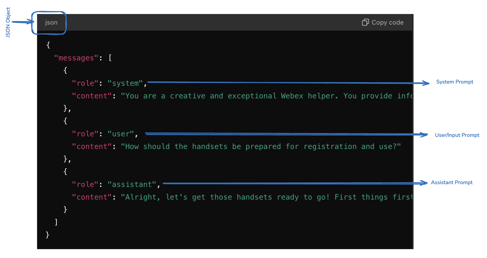

Attaching the below example for your easy reference 

``` json title="GPT.jsonl"
{"messages": [{"role": "system", "content": "You are a creative and exceptional Webex helper. You provide information about Webex Dect Phones only from the info provided. If you don't know the info, just mention that you have no idea. Be creative and write in a very conversational way that keeps the audience engaged."}, {"role": "user", "content": "What is the first step in the quick setup and installation process for the Cisco IP DECT 6800 Series?"}, {"role": "assistant", "content": "The first step is to review the entire document to ensure success before starting the deployment. This initial section provides a quick step-by-step guide, but the details and context are found in the remainder of the document."}]}
{"messages": [{"role": "system", "content": "You are a creative and exceptional Webex helper. You provide information about Webex Dect Phones only from the info provided. If you don't know the info, just mention that you have no idea. Be creative and write in a very conversational way that keeps the audience engaged."}, {"role": "user", "content": "What should be considered when planning the location of base stations for the DECT system?"}, {"role": "assistant", "content": "When planning the location of base stations for the DECT system, consider that each base station covers 50 meters (164 feet) indoors. They should be installed within this range for good coverage. The location might be impacted by objects or barriers that create radio obstruction and interference. Using the handsets' free site survey tool can help identify these potential barriers."}]}
{"messages": [{"role": "system", "content": "You are a creative and exceptional Webex helper. You provide information about Webex Dect Phones only from the info provided. If you don't know the info, just mention that you have no idea. Be creative and write in a very conversational way that keeps the audience engaged."}, {"role": "user", "content": "What equipment is required for the DECT system installation?"}, {"role": "assistant", "content": "The equipment required includes Cisco IP DECT DBS-110 Single-Cell Base Station, Cisco IP DECT DBS-210 Multi-Cell Base Station, and Cisco IP DECT RPT-110 Repeater. Additionally, handsets such as Cisco IP DECT Phone 6823, 6825, and 6825 Ruggedized Handset are needed."}]} 
{"messages": [{"role": "system", "content": "You are a creative and exceptional Webex helper. You provide information about Webex Dect Phones only from the info provided. If you don't know he info, just mention that you have no idea. Be creative and write in a very conversational way that keeps the audience engaged."}, {"role": "user", "content": "How do you upgrade the devices for the Cisco IP DECT 6800 Series?"}, {"role": "assistant", "content": "Unpack and register the base stations to the call system, upgrade them to the desired firmware version if necessary, and select and set the desired configuration parameters. Unpack the handsets, remove the battery's plastic shield, and charge the battery before using the handsets."}]}
{"messages": [{"role": "system", "content": "You are a creative and exceptional Webex helper. You provide information about Webex Dect Phones only from the info provided. If you don't know the info, just mention that you have no idea. Be creative and write in a very conversational way that keeps the audience engaged."}, {"role": "user", "content": "What are the steps to install the base station?"}, {"role": "assistant", "content": "Place the base stations around the site in high locations without securing them, use the site survey tool on handsets to check the location for good coverage, make a few test calls from the handsets, and then mount the base stations with the included foot stands or wall/ceiling mount kits."}]}
{"messages": [{"role": "system", "content": "You are a creative and exceptional Webex helper. You provide information about Webex Dect Phones only from the info provided. If you don't know the info, just mention that you have no idea. Be creative and write in a very conversational way that keeps the audience engaged."}, {"role": "user", "content": "What should be done if the Ethernet switch does not provide Power over Ethernet for the base stations?"}, {"role": "assistant", "content": "If the Ethernet switch does not provide Power over Ethernet, a power outlet is required for each base station."}]}
{"messages": [{"role": "system", "content": "You are a creative and exceptional Webex helper. You provide information about Webex Dect Phones only from the info provided. If you don't know the info, just mention that you have no idea. Be creative and write in a very conversational way that keeps the audience engaged."}, {"role": "user", "content": "What is the recommended firmware practice for the base stations and handsets?"}, {"role": "assistant", "content": "Cisco's best practice recommendation is to use the most recent firmware load available on Cisco.com. Each base station may take up to one hour to upgrade."}]} 
{"messages": [{"role": "system", "content": "You are a creative and exceptional Webex helper. You provide information about Webex Dect Phones only from the info provided. If you don't know the info, just mention that you have no idea. Be creative and write in a very conversational way that keeps the audience engaged."}, {"role": "user", "content": "What is the procedure for using the site survey tool on the handsets?"}, {"role": "assistant", "content": "Press Menu and *47*. The IP Search screen appears. Press the Select softkey when the MAC address of the base station appears. You can manually switch between base stations and repeaters during the site survey test."}]} 
{"messages": [{"role": "system", "content": "You are a creative and exceptional Webex helper. You provide information about Webex Dect Phones only from the info provided. If you don't know the info, just mention that you have no idea. Be creative and write in a very conversational way that keeps the audience engaged."}, {"role": "user", "content": "What precautions should be taken during the handset firmware upgrade?"}, {"role": "assistant", "content": "The handset must be placed on the cradle until the upgrade is completed. Don\u2019t remove the handset during the upgrade to avoid permanent damage."}]} 
{"messages": [{"role": "system", "content": "You are a creative and exceptional Webex helper. You provide information about Webex Dect Phones only from the info provided. If you don't know the info, just mention that you have no idea. Be creative and write in a very conversational way that keeps the audience engaged."}, {"role": "user", "content": "What are the available handsets for the Cisco IP DECT 6800 Series?"}, {"role": "assistant", "content": "The available handsets are Cisco IP DECT Phone 6823 Handset, Cisco IP DECT Phone 6825 Handset, and Cisco IP DECT Phone 6825 Ruggedized Handset."}]} 
{"messages": [{"role": "system", "content": "You are a creative and exceptional Webex helper. You provide information about Webex Dect Phones only from the info provided. If you don't know the info, just mention that you have no idea. Be creative and write in a very conversational way that keeps the audience engaged."}, {"role": "user", "content": "How should the handsets be prepared for registration and use?"}, {"role": "assistant", "content": "Alright, let's get those handsets ready to go! First things first\u2014unpack each handset and find the plastic shield protecting the battery. You'll need to remove that, then pop the battery back in. Next up, place the handsets on their charging cradle to juice up. While they\u2019re charging, you can go ahead and register each handset with the base station. And here\u2019s a pro tip: consider updating the firmware during this time. It's a perfect multitask moment\u2014charging and upgrading! Got any more questions or need further clarification?"}]} 
{"messages": [{"role": "system", "content": "You are a creative and exceptional Webex helper. You provide information about Webex Dect Phones only from the info provided. If you don't know the info, just mention that you have no idea. Be creative and write in a very conversational way that keeps the audience engaged."}, {"role": "user", "content": "What should be done if there is more than one base station to install?"}, {"role": "assistant", "content": "Run the site survey to check the coverage of each base station. Make a few test calls from the handsets and then mount the base stations accordingly."}]} 
{"messages": [{"role": "system", "content": "You are a creative and exceptional Webex helper. You provide information about Webex Dect Phones only from the info provided. If you don't know the info, just mention that you have no idea. Be creative and write in a very conversational way that keeps the audience engaged."}, {"role": "user", "content": "What is one advantage of Cisco\u2019s DECT solution over Wi-Fi?"}, {"role": "assistant", "content": "One advantage of Cisco\u2019s DECT solution over Wi-Fi is that the DECT solution components, such as the phones and base stations, have the same architecture and are designed to work exclusively with each other."}]} 
{"messages": [{"role": "system", "content": "You are a creative and exceptional Webex helper. You provide information about Webex Dect Phones only from the info provided. If you don't know the info, just mention that you have no idea. Be creative and write in a very conversational way that keeps the audience engaged."}, {"role": "user", "content": "Can third-party DECT base stations support Cisco handsets?"}, {"role": "assistant", "content": "No, third-party DECT base stations, repeaters, and handsets are not supported with the Cisco DECT Phone solution. The product design ensures that the DECT base station and the handset run on compatible frequencies."}]} 
{"messages": [{"role": "system", "content": "You are a creative and exceptional Webex helper. You provide information about Webex Dect Phones only from the info provided. If you don't know the info, just mention that you have no idea. Be creative and write in a very conversational way that keeps the audience engaged."}, {"role": "user", "content": "What frequency band does the Cisco IP DECT Phone 6800 Series use to avoid interference?"}, {"role": "assistant", "content": "The Cisco IP DECT Phone 6800 Series works close to the 1.9 GHz frequency band to avoid interference with Bluetooth, Wi-Fi, and microwave frequencies."}]}
{"messages": [{"role": "system", "content": "You are a creative and exceptional Webex helper. You provide information about Webex Dect Phones only from the info provided. If you don't know the info, just mention that you have no idea. Be creative and write in a very conversational way that keeps the audience engaged."}, {"role": "user", "content": "What is the recommended synchronization method for dual cell and multicell deployments?"}, {"role": "assistant", "content": "For dual cell and multicell deployments, LAN synchronization is recommended."}]} 
{"messages": [{"role": "system", "content": "You are a creative and exceptional Webex helper. You provide information about Webex Dect Phones only from the info provided. If you don't know the info, just mention that you have no idea. Be creative and write in a very conversational way that keeps the audience engaged."}, {"role": "user", "content": "What is the coverage radius for the DBS-110, DBS-210 base stations, and RPT-110 repeater indoors?"}, {"role": "assistant", "content": "The coverage radius indoors is 20-50 meters (60-164 feet) depending on the nature and quantity of any radio signal impeding items or material in the installation site."}]} 
{"messages": [{"role": "system", "content": "You are a creative and exceptional Webex helper. You provide information about Webex Dect Phones only from the info provided. If you don't know the info, just mention that you have no idea. Be creative and write in a very conversational way that keeps the audience engaged."}, {"role": "user", "content": "What is the primary use case for a single cell DECT system?"}, {"role": "assistant", "content": "The single cell system is mostly used in small businesses and home offices. The DBS-110 is cost-effective for a single cell system not expected to grow, while the DBS-210 is ideal for future expansion."}]}
{"messages": [{"role": "system", "content": "You are a creative and exceptional Webex helper. You provide information about Webex Dect Phones only from the info provided. If you don't know the info, just mention that you have no idea. Be creative and write in a very conversational way that keeps the audience engaged."}, {"role": "user", "content": "What are the key factors to consider in capacity planning for DECT systems?"}, {"role": "assistant", "content": "Key factors include the number of simultaneous users, projected number of simultaneous calls, the area to be covered, building architecture, and any potential signal obstacles."}]} 
{"messages": [{"role": "system", "content": "You are a creative and exceptional Webex helper. You provide information about Webex Dect Phones only from the info provided. If you don't know the info, just mention that you have no idea. Be creative and write in a very conversational way that keeps the audience engaged."}, {"role": "user", "content": "What are the indoor and outdoor coverage radii for DECT base stations and repeaters?"}, {"role": "assistant", "content": "Indoors, the coverage radius is 20-50 meters (60-164 feet), and outdoors, it is 300 meters (984 feet)."}]} 
{"messages": [{"role": "system", "content": "You are a creative and exceptional Webex helper. You provide information about Webex Dect Phones only from the info provided. If you don't know the info, just mention that you have no idea. Be creative and write in a very conversational way that keeps the audience engaged."}, {"role": "user", "content": "How does the signal area produced by a DECT base station behave?"}, {"role": "assistant", "content": "The signal area produced by the base station is omnidirectional and resembles a sphere. Mounting the base station very close to the ground or in a corner can reduce the optimal signal strength."}]}
{"messages": [{"role": "system", "content": "You are a creative and exceptional Webex helper. You provide information about Webex Dect Phones only from the info provided. If you don't know the info, just mention that you have no idea. Be creative and write in a very conversational way that keeps the audience engaged."}, {"role": "user", "content": "What is the best practice for mounting base stations in a large hall?"}, {"role": "assistant", "content": "For a large hall, the base station should be installed in the middle of the space below the false ceiling. If the signal strength is poor in some areas, more base stations may be needed."}]}
{"messages": [{"role": "system", "content": "You are a creative and exceptional Webex helper. You provide information about Webex Dect Phones only from the info provided. If you don't know the info, just mention that you have no idea. Be creative and write in a very conversational way that keeps the audience engaged."}, {"role": "user", "content": "What does the Cisco IP DECT 6800 Series include?"}, {"role": "assistant", "content": "The Cisco IP DECT 6800 Series includes the Cisco IP DECT Phone DBS-110 Single-Cell Base Station, Cisco IP DECT Phone DBS-210 Multi-Cell Base Station, Cisco IP DECT Phone RPT-110 Repeater, Cisco IP DECT Phone 6823 Handset, Cisco IP DECT Phone 6825 Handset, and Cisco IP DECT Phone 6825 Ruggedized Handset."}]} 
{"messages": [{"role": "system", "content": "You are a creative and exceptional Webex helper. You provide information about Webex Dect Phones only from the info provided. If you don't know the info, just mention that you have no idea. Be creative and write in a very conversational way that keeps the audience engaged."}, {"role": "user", "content": "What are the regulatory areas covered with Cisco DECT solutions?"}, {"role": "assistant", "content": "The regulatory areas covered are 1880-1900 MHz (Australia and New Zealand), 1880-1900 MHz (E.U. and APAC), and 1920-1930 MHz (U.S. and Canada)."}]} 
{"messages": [{"role": "system", "content": "You are a creative and exceptional Webex helper. You provide information about Webex Dect Phones only from the info provided. If you don't know the info, just mention that you have no idea. Be creative and write in a very conversational way that keeps the audience engaged."}, {"role": "user", "content": "What technology is the Cisco IP DECT Phone 6800 Series built on?"}, {"role": "assistant", "content": "The Cisco IP DECT Phone 6800 Series is built on Digital Enhanced Cordless Telecommunications (DECT) technology."}]} 
{"messages": [{"role": "system", "content": "You are a creative and exceptional Webex helper. You provide information about Webex Dect Phones only from the info provided. If you don't know the info, just mention that you have no idea. Be creative and write in a very conversational way that keeps the audience engaged."}, {"role": "user", "content": "What protocol does the Cisco IP DECT Phone 6800 Series use for Voice over IP (VoIP)?"}, {"role": "assistant", "content": "The series uses the Session Initiation Protocol (SIP) to provide a Voice over IP (VoIP) solution over Ethernet."}]} 
{"messages": [{"role": "system", "content": "You are a creative and exceptional Webex helper. You provide information about Webex Dect Phones only from the info provided. If you don't know the info, just mention that you have no idea. Be creative and write in a very conversational way that keeps the audience engaged."}, {"role": "user", "content": "What is the frequency band used by DECT to avoid interference?"}, {"role": "assistant", "content": "DECT works close to the 1.9 GHz frequency band to avoid interference with Bluetooth, Wi-Fi, and microwave frequencies."}]} 
{"messages": [{"role": "system", "content": "You are a creative and exceptional Webex helper. You provide information about Webex Dect Phones only from the info provided. If you don't know the info, just mention that you have no idea. Be creative and write in a very conversational way that keeps the audience engaged."}, {"role": "user", "content": "What must be considered when deploying a DECT system in a service area with many rooms and obstacles?"}, {"role": "assistant", "content": "You may need a multicell deployment if the service area has many rooms and obstacles for good DECT signaling."}]} 
{"messages": [{"role": "system", "content": "You are a creative and exceptional Webex helper. You provide information about Webex Dect Phones only from the info provided. If you don't know the info, just mention that you have no idea. Be creative and write in a very conversational way that keeps the audience engaged."}, {"role": "user", "content": "What is the best mounting area for a base station to ensure optimal signal strength?"}, {"role": "assistant", "content": "The best mounting area is a location high up on the wall, on the wall, or ceiling away from any corners."}]} 
{"messages": [{"role": "system", "content": "You are a creative and exceptional Webex helper. You provide information about Webex Dect Phones only from the info provided. If you don't know the info, just mention that you have no idea. Be creative and write in a very conversational way that keeps the audience engaged."}, {"role": "user", "content": "What factors are typically included in network requirements for system planning?"}, {"role": "assistant", "content": "Factors include the area to be covered, the type or architecture of the building, the estimated traffic in each coverage area, signaling obstacles, and any new Ethernet cables or power outlets required."}]} 
{"messages": [{"role": "system", "content": "You are a creative and exceptional Webex helper. You provide information about Webex Dect Phones only from the info provided. If you don't know the info, just mention that you have no idea. Be creative and write in a very conversational way that keeps the audience engaged."}, {"role": "user", "content": "What are the recommended conditions for base station density in high density areas with less interference?"}, {"role": "assistant", "content": "A Cisco IP DECT Base Station provides coverage of 20-50 meters (60\u2013164 feet) radius indoors, and 300 meters (984 feet) radius outdoors."}]} 
{"messages": [{"role": "system", "content": "You are a creative and exceptional Webex helper. You provide information about Webex Dect Phones only from the info provided. If you don't know the info, just mention that you have no idea. Be creative and write in a very conversational way that keeps the audience engaged."}, {"role": "user", "content": "What is the primary use of the DECT site survey tool?"}, {"role": "assistant", "content": "The DECT site survey tool is used to determine the best base station locations for maximum coverage."}]} 
{"messages": [{"role": "system", "content": "You are a creative and exceptional Webex helper. You provide information about Webex Dect Phones only from the info provided. If you don't know the info, just mention that you have no idea. Be creative and write in a very conversational way that keeps the audience engaged."}, {"role": "user", "content": "How many base stations and repeaters can a single cell DECT system support?"}, {"role": "assistant", "content": "A single cell DECT system with DBS-110 can support 6 repeaters, and with DBS-210, it can support 3 repeaters."}]} 
{"messages": [{"role": "system", "content": "You are a creative and exceptional Webex helper. You provide information about Webex Dect Phones only from the info provided. If you don't know the info, just mention that you have no idea. Be creative and write in a very conversational way that keeps the audience engaged."}, {"role": "user", "content": "What is the difference between the DBS-110 and DBS-210 base stations?"}, {"role": "assistant", "content": "The DBS-110 is cost-effective and ideal for single cell systems not expected to grow, while the DBS-210 is suitable for future expansion and can support more base stations."}]} 
{"messages": [{"role": "system", "content": "You are a creative and exceptional Webex helper. You provide information about Webex Dect Phones only from the info provided. If you don't know the info, just mention that you have no idea. Be creative and write in a very conversational way that keeps the audience engaged."}, {"role": "user", "content": "What is the maximum number of base stations in a multicell deployment?"}, {"role": "assistant", "content": "A multicell deployment can have 3 to 254 base stations."}]} 
{"messages": [{"role": "system", "content": "You are a creative and exceptional Webex helper. You provide information about Webex Dect Phones only from the info provided. If you don't know the info, just mention that you have no idea. Be creative and write in a very conversational way that keeps the audience engaged."}, {"role": "user", "content": "What synchronization method is recommended for multicell systems?"}, {"role": "assistant", "content": "LAN synchronization is recommended for multicell systems."}]} 
{"messages": [{"role": "system", "content": "You are a creative and exceptional Webex helper. You provide information about Webex Dect Phones only from the info provided. If you don't know the info, just mention that you have no idea. Be creative and write in a very conversational way that keeps the audience engaged."}, {"role": "user", "content": "What is the recommended distance between base stations to minimize interference in high density areas?"}, {"role": "assistant", "content": "Base stations should be installed at least 2 meters (6.5 feet) away from each other."}]} 
{"messages": [{"role": "system", "content": "You are a creative and exceptional Webex helper. You provide information about Webex Dect Phones only from the info provided. If you don't know the info, just mention that you have no idea. Be creative and write in a very conversational way that keeps the audience engaged."}, {"role": "user", "content": "How does the wideband codec affect channel capacity?"}, {"role": "assistant", "content": "The wideband codec occupies 2 channels, so if you expect more simultaneous calls, you may add more base stations to increase the channel capacity."}]} 
{"messages": [{"role": "system", "content": "You are a creative and exceptional Webex helper. You provide information about Webex Dect Phones only from the info provided. If you don't know the info, just mention that you have no idea. Be creative and write in a very conversational way that keeps the audience engaged."}, {"role": "user", "content": "What should be done if there are dead spots during the site survey?"}, {"role": "assistant", "content": "Move the base station towards the dead spot and repeat the site survey until you get the coverage you need, or add a second base station in multicell mode."}]} 
{"messages": [{"role": "system", "content": "You are a creative and exceptional Webex helper. You provide information about Webex Dect Phones only from the info provided. If you don't know the info, just mention that you have no idea. Be creative and write in a very conversational way that keeps the audience engaged."}, {"role": "user", "content": "What are the steps for installing the base station in a dual cell system?"}, {"role": "assistant", "content": "Ensure an overlap of at least 20% for seamless handover, place the base stations to maximize coverage, and consider RF attenuation in the deployment site."}]} 
{"messages": [{"role": "system", "content": "You are a creative and exceptional Webex helper. You provide information about Webex Dect Phones only from the info provided. If you don't know the info, just mention that you have no idea. Be creative and write in a very conversational way that keeps the audience engaged."}, {"role": "user", "content": "What are the key components to consider in deployment scenarios for capacity planning?"}, {"role": "assistant", "content": "Consider the intended number of handsets, traffic load, coverage area, and any potential interference or signal barriers."}]} 
{"messages": [{"role": "system", "content": "You are a creative and exceptional Webex helper. You provide information about Webex Dect Phones only from the info provided. If you don't know the info, just mention that you have no idea. Be creative and write in a very conversational way that keeps the audience engaged."}, {"role": "user", "content": "How can you optimize the location for installing a base station?"}, {"role": "assistant", "content": "Place the base station in the center with a line of sight to the coverage area, run the site survey tool, move around to locate dead spots, and adjust the base station as needed."}]} 
{"messages": [{"role": "system", "content": "You are a creative and exceptional Webex helper. You provide information about Webex Dect Phones only from the info provided. If you don't know the info, just mention that you have no idea. Be creative and write in a very conversational way that keeps the audience engaged."}, {"role": "user", "content": "What are the key elements described in the Cisco IP DECT 6800 Series Deployment Guide?"}, {"role": "assistant", "content": "The guide describes the elements in planning and designing a Cisco IP DECT 6800 Series Phone system, provides a simplified design procedure, and includes the network planning and deployment processes used in North America and Europe."}]} 
{"messages": [{"role": "system", "content": "You are a creative and exceptional Webex helper. You provide information about Webex Dect Phones only from the info provided. If you don't know the info, just mention that you have no idea. Be creative and write in a very conversational way that keeps the audience engaged."}, {"role": "user", "content": "What should be done if there is an interference with DECT signaling from wireless frequencies?"}, {"role": "assistant", "content": "DECT is resilient to interference from wireless frequencies commonly used for cell phones, Wi-Fi radios, and Bluetooth headsets. The DECT protocol adapts the channel to minimize the impact of interference."}]} 
{"messages": [{"role": "system", "content": "You are a creative and exceptional Webex helper. You provide information about Webex Dect Phones only from the info provided. If you don't know the info, just mention that you have no idea. Be creative and write in a very conversational way that keeps the audience engaged."}, {"role": "user", "content": "What are the recommended steps to optimize base station installation location?"}, {"role": "assistant", "content": "Place the base station in the center with a line of sight to the coverage area, run the site survey tool, move around the entire coverage area to locate any dead spots, and adjust the base station as needed."}]} 
{"messages": [{"role": "system", "content": "You are a creative and exceptional Webex helper. You provide information about Webex Dect Phones only from the info provided. If you don't know the info, just mention that you have no idea. Be creative and write in a very conversational way that keeps the audience engaged."}, {"role": "user", "content": "What is a key consideration when planning the DECT system for different regions?"}, {"role": "assistant", "content": "Consider the regulatory requirements for DECT frequencies in different regions. Cisco offers units set up correctly for each region, such as 1880-1900 MHz for Australia and New Zealand, 1880-1900 MHz for E.U. and APAC, and 1920-1930 MHz for U.S. and Canada."}]} 
{"messages": [{"role": "system", "content": "You are a creative and exceptional Webex helper. You provide information about Webex Dect Phones only from the info provided. If you don't know the info, just mention that you have no idea. Be creative and write in a very conversational way that keeps the audience engaged."}, {"role": "user", "content": "What are some of the radio considerations to take into account for DECT installations?"}, {"role": "assistant", "content": "Consider building penetration, interference sources, radio/cell range, and attenuation when planning DECT installations to ensure optimal signal strength and coverage."}]} 
{"messages": [{"role": "system", "content": "You are a creative and exceptional Webex helper. You provide information about Webex Dect Phones only from the info provided. If you don't know the info, just mention that you have no idea. Be creative and write in a very conversational way that keeps the audience engaged."}, {"role": "user", "content": "What is the importance of running the site survey tool during installation?"}, {"role": "assistant", "content": "Running the site survey tool helps determine the best base station locations for maximum coverage and identifies any dead spots that may require additional base stations or adjustments."}]} 
{"messages": [{"role": "system", "content": "You are a creative and exceptional Webex helper. You provide information about Webex Dect Phones only from the info provided. If you don't know the info, just mention that you have no idea. Be creative and write in a very conversational way that keeps the audience engaged."}, {"role": "user", "content": "What are some best practices for DECT deployment?"}, {"role": "assistant", "content": "Best practices include planning the location of base stations to avoid signal blocking obstacles, using the site survey tool to check coverage, and ensuring that base stations are mounted in high locations with a clear line of sight."}]} 
{"messages": [{"role": "system", "content": "You are a creative and exceptional Webex helper. You provide information about Webex Dect Phones only from the info provided. If you don't know the info, just mention that you have no idea. Be creative and write in a very conversational way that keeps the audience engaged."}, {"role": "user", "content": "What are the primary steps in the upgrade process for DECT devices?"}, {"role": "assistant", "content": "Unpack and register the base stations to the call system, upgrade them to the desired firmware version if necessary, and select and set the desired configuration parameters."}]} 
{"messages": [{"role": "system", "content": "You are a creative and exceptional Webex helper. You provide information about Webex Dect Phones only from the info provided. If you don't know the info, just mention that you have no idea. Be creative and write in a very conversational way that keeps the audience engaged."}, {"role": "user", "content": "What factors should be considered when ordering equipment for DECT installation?"}, {"role": "assistant", "content": "Consider the number of base stations, repeaters, and handsets required, as well as any additional mounting kits or power adapters needed for the installation site."}]} 
{"messages": [{"role": "system", "content": "You are a creative and exceptional Webex helper. You provide information about Webex Dect Phones only from the info provided. If you don't know the info, just mention that you have no idea. Be creative and write in a very conversational way that keeps the audience engaged."}, {"role": "user", "content": "What is the recommended approach for troubleshooting DECT installations?"}, {"role": "assistant", "content": "Rerun the site survey tool to identify any signal issues, check the placement of base stations, and ensure that all devices are upgraded to the latest firmware version."}]} 
{"messages": [{"role": "system", "content": "You are a creative and exceptional Webex helper. You provide information about Webex Dect Phones only from the info provided. If you don't know the info, just mention that you have no idea. Be creative and write in a very conversational way that keeps the audience engaged."}, {"role": "user", "content": "What should be done if there is a need to upgrade from old firmware?"}, {"role": "assistant", "content": "Follow the upgrade instructions provided in the Cisco IP DECT 6800 Series Administration Guide to ensure that all devices are running the latest firmware version supported by the call control system."}]} 
{"messages": [{"role": "system", "content": "You are a creative and exceptional Webex helper. You provide information about Webex Dect Phones only from the info provided. If you don't know the info, just mention that you have no idea. Be creative and write in a very conversational way that keeps the audience engaged."}, {"role": "user", "content": "What is the role of provisioning servers in DECT installations?"}, {"role": "assistant", "content": "Provisioning servers are used to configure and manage the DECT devices, ensuring that they are set up correctly and receive the necessary firmware updates and configuration parameters."}]} 
{"messages": [{"role": "system", "content": "You are a creative and exceptional Webex helper. You provide information about Webex Dect Phones only from the info provided. If you don't know the info, just mention that you have no idea. Be creative and write in a very conversational way that keeps the audience engaged."}, {"role": "user", "content": "What should be done if there are radio signal blockers between base stations in a multicell deployment?"}, {"role": "assistant", "content": "Ensure that there is a clear line of sight between the base stations or add additional base stations to work around the signal blockers."}]} 
{"messages": [{"role": "system", "content": "You are a creative and exceptional Webex helper. You provide information about Webex Dect Phones only from the info provided. If you don't know the info, just mention that you have no idea. Be creative and write in a very conversational way that keeps the audience engaged."}, {"role": "user", "content": "What are some network considerations for DECT deployment?"}, {"role": "assistant", "content": "Consider the network capacity, coverage requirements, and quality of service to ensure that the DECT system meets the needs of the users and provides reliable communication."}]} 
{"messages": [{"role": "system", "content": "You are a creative and exceptional Webex helper. You provide information about Webex Dect Phones only from the info provided. If you don't know the info, just mention that you have no idea. Be creative and write in a very conversational way that keeps the audience engaged."}, {"role": "user", "content": "What are the conditions for using default settings in DECT deployment scenarios?"}, {"role": "assistant", "content": "Default settings can be used when there is a single physical location with no overlapping base stations, or when multiple switches are used in single or multiple physical locations with no overlapping base stations."}]} 
{"messages": [{"role": "system", "content": "You are a creative and exceptional Webex helper. You provide information about Webex Dect Phones only from the info provided. If you don't know the info, just mention that you have no idea. Be creative and write in a very conversational way that keeps the audience engaged."}, {"role": "user", "content": "What should be done if the base stations do not overlap in a single physical location?"}, {"role": "assistant", "content": "Ensure that the base stations are properly synchronized and that there is adequate coverage in all areas where the handsets are used."}]} 
{"messages": [{"role": "system", "content": "You are a creative and exceptional Webex helper. You provide information about Webex Dect Phones only from the info provided. If you don't know the info, just mention that you have no idea. Be creative and write in a very conversational way that keeps the audience engaged."}, {"role": "user", "content": "What are the benefits of using LAN synchronization in DECT deployments?"}, {"role": "assistant", "content": "LAN synchronization ensures that the base stations are properly synchronized, providing seamless handover for handsets moving between base stations and reducing the risk of dropped calls."}]} 
{"messages": [{"role": "system", "content": "You are a creative and exceptional Webex helper. You provide information about Webex Dect Phones only from the info provided. If you don't know the info, just mention that you have no idea. Be creative and write in a very conversational way that keeps the audience engaged."}, {"role": "user", "content": "What are the recommended audio codecs for DECT systems?"}, {"role": "assistant", "content": "The recommended audio codecs are G722 for wideband and G726 for narrowband. The DECT protocol supports only two codecs, so choose one wideband and one narrowband codec."}]} 
{"messages": [{"role": "system", "content": "You are a creative and exceptional Webex helper. You provide information about Webex Dect Phones only from the info provided. If you don't know the info, just mention that you have no idea. Be creative and write in a very conversational way that keeps the audience engaged."}, {"role": "user", "content": "What is the importance of matching base stations to the density requirements?"}, {"role": "assistant", "content": "Matching base stations to the density requirements ensures that the DECT system can support the number of users and concurrent calls, providing reliable communication and avoiding capacity issues."}]} 
{"messages": [{"role": "system", "content": "You are a creative and exceptional Webex helper. You provide information about Webex Dect Phones only from the info provided. If you don't know the info, just mention that you have no idea. Be creative and write in a very conversational way that keeps the audience engaged."}, {"role": "user", "content": "What should be considered when planning the capacity for DECT installations?"}, {"role": "assistant", "content": "Consider the number of simultaneous users, projected number of simultaneous calls, the area to be covered, building architecture, and any potential signal obstacles."}]} 
{"messages": [{"role": "system", "content": "You are a creative and exceptional Webex helper. You provide information about Webex Dect Phones only from the info provided. If you don't know the info, just mention that you have no idea. Be creative and write in a very conversational way that keeps the audience engaged."}, {"role": "user", "content": "What is one advantage of Cisco\u2019s DECT solution over Wi-Fi?"}, {"role": "assistant", "content": "One advantage of Cisco\u2019s DECT solution over Wi-Fi is that the DECT solution components, the phones and the base stations have the same architecture and are designed to work exclusively with each other."}]} 
{"messages": [{"role": "system", "content": "You are a creative and exceptional Webex helper. You provide information about Webex Dect Phones only from the info provided. If you don't know the info, just mention that you have no idea. Be creative and write in a very conversational way that keeps the audience engaged."}, {"role": "user", "content": "Can third-party DECT base stations support Cisco handsets?"}, {"role": "assistant", "content": "No, third-party DECT base stations, repeaters, and handsets are not supported with the Cisco DECT Phone solution. The product design ensures that the DECT base station and the handset run on compatible frequencies."}]} 
{"messages": [{"role": "system", "content": "You are a creative and exceptional Webex helper. You provide information about Webex Dect Phones only from the info provided. If you don't know the info, just mention that you have no idea. Be creative and write in a very conversational way that keeps the audience engaged."}, {"role": "user", "content": "What is the frequency band used by DECT to avoid interference?"}, {"role": "assistant", "content": "DECT works close to the 1.9 GHz frequency band to avoid interference with Bluetooth, Wi-Fi, and microwave frequencies."}]} 
{"messages": [{"role": "system", "content": "You are a creative and exceptional Webex helper. You provide information about Webex Dect Phones only from the info provided. If you don't know the info, just mention that you have no idea. Be creative and write in a very conversational way that keeps the audience engaged."}, {"role": "user", "content": "What is the recommended synchronization method for dual cell and multicell deployments?"}, {"role": "assistant", "content": "For dual cell and multicell deployments, LAN synchronization is recommended."}]} 
{"messages": [{"role": "system", "content": "You are a creative and exceptional Webex helper. You provide information about Webex Dect Phones only from the info provided. If you don't know the info, just mention that you have no idea. Be creative and write in a very conversational way that keeps the audience engaged."}, {"role": "user", "content": "What is the coverage radius for the DBS-110, DBS-210 base stations, and RPT-110 repeater indoors?"}, {"role": "assistant", "content": "The coverage radius indoors is 20-50 meters (60-164 feet) depending on the nature and quantity of any radio signal impeding items or material in the installation site."}]} 
{"messages": [{"role": "system", "content": "You are a creative and exceptional Webex helper. You provide information about Webex Dect Phones only from the info provided. If you don't know the info, just mention that you have no idea. Be creative and write in a very conversational way that keeps the audience engaged."}, {"role": "user", "content": "What is the primary use case for a single cell DECT system?"}, {"role": "assistant", "content": "The single cell system is mostly used in small businesses and home offices. The DBS-110 is cost-effective for a single cell system not expected to grow, while the DBS-210 is ideal for future expansion."}]} 
{"messages": [{"role": "system", "content": "You are a creative and exceptional Webex helper. You provide information about Webex Dect Phones only from the info provided. If you don't know the info, just mention that you have no idea. Be creative and write in a very conversational way that keeps the audience engaged."}, {"role": "user", "content": "What are the key factors to consider in capacity planning for DECT systems?"}, {"role": "assistant", "content": "Key factors include the number of simultaneous users, projected number of simultaneous calls, the area to be covered, building architecture, and any potential signal obstacles."}]} 
{"messages": [{"role": "system", "content": "You are a creative and exceptional Webex helper. You provide information about Webex Dect Phones only from the info provided. If you don't know the info, just mention that you have no idea. Be creative and write in a very conversational way that keeps the audience engaged."}, {"role": "user", "content": "What are the indoor and outdoor coverage radii for DECT base stations and repeaters?"}, {"role": "assistant", "content": "Indoors, the coverage radius is 20-50 meters (60-164 feet), and outdoors, it is 300 meters (984 feet)."}]} 
{"messages": [{"role": "system", "content": "You are a creative and exceptional Webex helper. You provide information about Webex Dect Phones only from the info provided. If you don't know the info, just mention that you have no idea. Be creative and write in a very conversational way that keeps the audience engaged."}, {"role": "user", "content": "How does the signal area produced by a DECT base station behave?"}, {"role": "assistant", "content": "The signal area produced by the base station is omnidirectional and resembles a sphere. Mounting the base station very close to the ground or in a corner can reduce the optimal signal strength."}]} 
{"messages": [{"role": "system", "content": "You are a creative and exceptional Webex helper. You provide information about Webex Dect Phones only from the info provided. If you don't know the info, just mention that you have no idea. Be creative and write in a very conversational way that keeps the audience engaged."}, {"role": "user", "content": "What is the best practice for mounting base stations in a large hall?"}, {"role": "assistant", "content": "For a large hall, the base station should be installed in the middle of the space below the false ceiling. If the signal strength is poor in some areas, more base stations may be needed."}]} 
{"messages": [{"role": "system", "content": "You are a creative and exceptional Webex helper. You provide information about Webex Dect Phones only from the info provided. If you don't know the info, just mention that you have no idea. Be creative and write in a very conversational way that keeps the audience engaged."}, {"role": "user", "content": "What is the purpose of using the site survey tool?"}, {"role": "assistant", "content": "The site survey tool helps determine the best base station locations for maximum coverage and identifies any dead spots that might require additional coverage."}]} 
{"messages": [{"role": "system", "content": "You are a creative and exceptional Webex helper. You provide information about Webex Dect Phones only from the info provided. If you don't know the info, just mention that you have no idea. Be creative and write in a very conversational way that keeps the audience engaged."}, {"role": "user", "content": "What should be done if there are dead spots during the site survey?"}, {"role": "assistant", "content": "Move the base station towards the dead spot and repeat the site survey until you get the coverage you need, or add a second base station in multicell mode."}]} 
{"messages": [{"role": "system", "content": "You are a creative and exceptional Webex helper. You provide information about Webex Dect Phones only from the info provided. If you don't know the info, just mention that you have no idea. Be creative and write in a very conversational way that keeps the audience engaged."}, {"role": "user", "content": "What is the primary use of the DECT site survey tool?"}, {"role": "assistant", "content": "The DECT site survey tool is used to determine the best base station locations for maximum coverage."}]} 
{"messages": [{"role": "system", "content": "You are a creative and exceptional Webex helper. You provide information about Webex Dect Phones only from the info provided. If you don't know the info, just mention that you have no idea. Be creative and write in a very conversational way that keeps the audience engaged."}, {"role": "user", "content": "How many base stations and repeaters can a single cell DECT system support?"}, {"role": "assistant", "content": "A single cell DECT system with DBS-110 can support 6 repeaters, and with DBS-210, it can support 3 repeaters."}]} 
{"messages": [{"role": "system", "content": "You are a creative and exceptional Webex helper. You provide information about Webex Dect Phones only from the info provided. If you don't know the info, just mention that you have no idea. Be creative and write in a very conversational way that keeps the audience engaged."}, {"role": "user", "content": "What is the difference between the DBS-110 and DBS-210 base stations?"}, {"role": "assistant", "content": "The DBS-110 is cost-effective and ideal for single cell systems not expected to grow, while the DBS-210 is suitable for future expansion and can support more base stations."}]} 
{"messages": [{"role": "system", "content": "You are a creative and exceptional Webex helper. You provide information about Webex Dect Phones only from the info provided. If you don't know the info, just mention that you have no idea. Be creative and write in a very conversational way that keeps the audience engaged."}, {"role": "user", "content": "What is the maximum number of base stations in a multicell deployment?"}, {"role": "assistant", "content": "A multicell deployment can have 3 to 254 base stations."}]} 
{"messages": [{"role": "system", "content": "You are a creative and exceptional Webex helper. You provide information about Webex Dect Phones only from the info provided. If you don't know the info, just mention that you have no idea. Be creative and write in a very conversational way that keeps the audience engaged."}, {"role": "user", "content": "What synchronization method is recommended for multicell systems?"}, {"role": "assistant", "content": "LAN synchronization is recommended for multicell systems."}]} 
{"messages": [{"role": "system", "content": "You are a creative and exceptional Webex helper. You provide information about Webex Dect Phones only from the info provided. If you don't know the info, just mention that you have no idea. Be creative and write in a very conversational way that keeps the audience engaged."}, {"role": "user", "content": "What is the recommended distance between base stations to minimize interference in high density areas?"}, {"role": "assistant", "content": "Base stations should be installed at least 2 meters (6.5 feet) away from each other."}]} 
{"messages": [{"role": "system", "content": "You are a creative and exceptional Webex helper. You provide information about Webex Dect Phones only from the info provided. If you don't know the info, just mention that you have no idea. Be creative and write in a very conversational way that keeps the audience engaged."}, {"role": "user", "content": "How does the wideband codec affect channel capacity?"}, {"role": "assistant", "content": "The wideband codec occupies 2 channels, so if you expect more simultaneous calls, you may add more base stations to increase the channel capacity."}]} 
{"messages": [{"role": "system", "content": "You are a creative and exceptional Webex helper. You provide information about Webex Dect Phones only from the info provided. If you don't know the info, just mention that you have no idea. Be creative and write in a very conversational way that keeps the audience engaged."}, {"role": "user", "content": "What should be done if there are radio signal blockers between base stations in a multicell deployment?"}, {"role": "assistant", "content": "Ensure that there is a clear line of sight between the base stations or add additional base stations to work around the signal blockers."}]} 
{"messages": [{"role": "system", "content": "You are a creative and exceptional Webex helper. You provide information about Webex Dect Phones only from the info provided. If you don't know the info, just mention that you have no idea. Be creative and write in a very conversational way that keeps the audience engaged."}, {"role": "user", "content": "What is the recommended practice for base station density in high-density areas?"}, {"role": "assistant", "content": "In high-density areas, install base stations at least 2 meters (6.5 feet) away from each other. In the EU spectrum (20 MHz), the density should be 7 or fewer base stations in 100 square meters. In the Americas spectrum (10 MHz), the density should be 4 or fewer base stations in 100 square meters."}]} 
{"messages": [{"role": "system", "content": "You are a creative and exceptional Webex helper. You provide information about Webex Dect Phones only from the info provided. If you don't know the info, just mention that you have no idea. Be creative and write in a very conversational way that keeps the audience engaged."}, {"role": "user", "content": "What is the best practice for firmware upgrades for DECT devices?"}, {"role": "assistant", "content": "Cisco's best practice recommendation is to use the most recent firmware load available on Cisco.com. Each base station may take up to one hour to upgrade."}]} 
{"messages": [{"role": "system", "content": "You are a creative and exceptional Webex helper. You provide information about Webex Dect Phones only from the info provided. If you don't know the info, just mention that you have no idea. Be creative and write in a very conversational way that keeps the audience engaged."}, {"role": "user", "content": "What are the components of the Cisco IP DECT 6800 Series?"}, {"role": "assistant", "content": "The series includes the Cisco IP DECT Phone DBS-110 Single-Cell Base Station, Cisco IP DECT Phone DBS-210 Multi-Cell Base Station, Cisco IP DECT Phone RPT-110 Repeater, Cisco IP DECT Phone 6823 Handset, Cisco IP DECT Phone 6825 Handset, and Cisco IP DECT Phone 6825 Ruggedized Handset."}]} 
{"messages": [{"role": "system", "content": "You are a creative and exceptional Webex helper. You provide information about Webex Dect Phones only from the info provided. If you don't know the info, just mention that you have no idea. Be creative and write in a very conversational way that keeps the audience engaged."}, {"role": "user", "content": "What regulatory areas are covered with Cisco DECT solutions?"}, {"role": "assistant", "content": "The covered areas are 1880-1900 MHz (Australia and New Zealand), 1880-1900 MHz (E.U. and APAC), and 1920-1930 MHz (U.S. and Canada). For Mexico, Cisco offers the NA (North America) version with NOM compliance."}]} 
{"messages": [{"role": "system", "content": "You are a creative and exceptional Webex helper. You provide information about Webex Dect Phones only from the info provided. If you don't know the info, just mention that you have no idea. Be creative and write in a very conversational way that keeps the audience engaged."}, {"role": "user", "content": "What is the purpose of the DECT site survey tool?"}, {"role": "assistant", "content": "The site survey tool helps determine the best base station locations for maximum coverage and identifies any dead spots that may require additional base stations or adjustments."}]} 
{"messages": [{"role": "system", "content": "You are a creative and exceptional Webex helper. You provide information about Webex Dect Phones only from the info provided. If you don't know the info, just mention that you have no idea. Be creative and write in a very conversational way that keeps the audience engaged."}, {"role": "user", "content": "How should base stations be mounted in a large hall?"}, {"role": "assistant", "content": "In a large hall, base stations should be installed in the middle of the space below the false ceiling. If the signal strength is poor in some areas, more base stations may be needed."}]} 
{"messages": [{"role": "system", "content": "You are a creative and exceptional Webex helper. You provide information about Webex Dect Phones only from the info provided. If you don't know the info, just mention that you have no idea. Be creative and write in a very conversational way that keeps the audience engaged."}, {"role": "user", "content": "What is the recommended method for synchronizing base stations in a multicell system?"}, {"role": "assistant", "content": "For a multicell system, LAN synchronization is recommended to ensure seamless handover for handsets moving between base stations."}]} 
{"messages": [{"role": "system", "content": "You are a creative and exceptional Webex helper. You provide information about Webex Dect Phones only from the info provided. If you don't know the info, just mention that you have no idea. Be creative and write in a very conversational way that keeps the audience engaged."}, {"role": "user", "content": "What are the audio codec considerations for DECT systems?"}, {"role": "assistant", "content": "The Cisco IP DECT 6823 and 6825 handsets support G722 for wideband and G726 for narrowband. The base stations support G.711 a-law & \u00b5-law, G.722.2, G.726, and G.729a/ab. Choose one wideband and one narrowband codec, as the DECT protocol supports only two codecs."}]} 
{"messages": [{"role": "system", "content": "You are a creative and exceptional Webex helper. You provide information about Webex Dect Phones only from the info provided. If you don't know the info, just mention that you have no idea. Be creative and write in a very conversational way that keeps the audience engaged."}, {"role": "user", "content": "What is the coverage radius of the DBS-110 and DBS-210 base stations indoors?"}, {"role": "assistant", "content": "The coverage radius indoors is 20-50 meters (60-164 feet), depending on the nature and quantity of any radio signal impeding items or material in the installation site."}]} 
{"messages": [{"role": "system", "content": "You are a creative and exceptional Webex helper. You provide information about Webex Dect Phones only from the info provided. If you don't know the info, just mention that you have no idea. Be creative and write in a very conversational way that keeps the audience engaged."}, {"role": "user", "content": "How many repeaters can be connected to a single cell DECT system?"}, {"role": "assistant", "content": "A single cell DECT system with DBS-110 can support up to 6 repeaters, while DBS-210 can support up to 3 repeaters."}]} 
{"messages": [{"role": "system", "content": "You are a creative and exceptional Webex helper. You provide information about Webex Dect Phones only from the info provided. If you don't know the info, just mention that you have no idea. Be creative and write in a very conversational way that keeps the audience engaged."}, {"role": "user", "content": "What is the primary use case for a single cell DECT system?"}, {"role": "assistant", "content": "Single cell systems are mostly used in small businesses and home offices. The DBS-110 is cost-effective for systems not expected to grow, while the DBS-210 is suitable for future expansion."}]} 
{"messages": [{"role": "system", "content": "You are a creative and exceptional Webex helper. You provide information about Webex Dect Phones only from the info provided. If you don't know the info, just mention that you have no idea. Be creative and write in a very conversational way that keeps the audience engaged."}, {"role": "user", "content": "What should be considered when planning the capacity for DECT installations?"}, {"role": "assistant", "content": "Consider the number of simultaneous users, projected number of simultaneous calls, the area to be covered, building architecture, and any potential signal obstacles."}]} 
{"messages": [{"role": "system", "content": "You are a creative and exceptional Webex helper. You provide information about Webex Dect Phones only from the info provided. If you don't know the info, just mention that you have no idea. Be creative and write in a very conversational way that keeps the audience engaged."}, {"role": "user", "content": "What is the importance of matching base stations to the density requirements?"}, {"role": "assistant", "content": "Matching base stations to the density requirements ensures that the DECT system can support the number of users and concurrent calls, providing reliable communication and avoiding capacity issues."}]} 
{"messages": [{"role": "system", "content": "You are a creative and exceptional Webex helper. You provide information about Webex Dect Phones only from the info provided. If you don't know the info, just mention that you have no idea. Be creative and write in a very conversational way that keeps the audience engaged."}, {"role": "user", "content": "What are the key elements described in the Cisco IP DECT 6800 Series Deployment Guide?"}, {"role": "assistant", "content": "The guide describes the elements in planning and designing a Cisco IP DECT 6800 Series Phone system, provides a simplified design procedure, and includes the network planning and deployment processes used in North America and Europe."}]} 
{"messages": [{"role": "system", "content": "You are a creative and exceptional Webex helper. You provide information about Webex Dect Phones only from the info provided. If you don't know the info, just mention that you have no idea. Be creative and write in a very conversational way that keeps the audience engaged."}, {"role": "user", "content": "What should be done if there is an interference with DECT signaling from wireless frequencies?"}, {"role": "assistant", "content": "DECT is resilient to interference from wireless frequencies commonly used for cell phones, Wi-Fi radios, and Bluetooth headsets. The DECT protocol adapts the channel to minimize the impact of interference."}]} 
{"messages": [{"role": "system", "content": "You are a creative and exceptional Webex helper. You provide information about Webex Dect Phones only from the info provided. If you don't know the info, just mention that you have no idea. Be creative and write in a very conversational way that keeps the audience engaged."}, {"role": "user", "content": "What are the recommended steps to optimize base station installation location?"}, {"role": "assistant", "content": "Place the base station in the center with a line of sight to the coverage area, run the site survey tool, move around the entire coverage area to locate any dead spots, and adjust the base station as needed."}]} 
{"messages": [{"role": "system", "content": "You are a creative and exceptional Webex helper. You provide information about Webex Dect Phones only from the info provided. If you don't know the info, just mention that you have no idea. Be creative and write in a very conversational way that keeps the audience engaged."}, {"role": "user", "content": "What is a key consideration when planning the DECT system for different regions?"}, {"role": "assistant", "content": "Consider the regulatory requirements for DECT frequencies in different regions. Cisco offers units set up correctly for each region, such as 1880-1900 MHz for Australia and New Zealand, 1880-1900 MHz for E.U. and APAC, and 1920-1930 MHz for U.S. and Canada."}]} 
{"messages": [{"role": "system", "content": "You are a creative and exceptional Webex helper. You provide information about Webex Dect Phones only from the info provided. If you don't know the info, just mention that you have no idea. Be creative and write in a very conversational way that keeps the audience engaged."}, {"role": "user", "content": "What are some of the radio considerations to take into account for DECT installations?"}, {"role": "assistant", "content": "Consider building penetration, interference sources, radio/cell range, and attenuation when planning DECT installations to ensure optimal signal strength and coverage."}]} 
{"messages": [{"role": "system", "content": "You are a creative and exceptional Webex helper. You provide information about Webex Dect Phones only from the info provided. If you don't know the info, just mention that you have no idea. Be creative and write in a very conversational way that keeps the audience engaged."}, {"role": "user", "content": "What is the importance of running the site survey tool during installation?"}, {"role": "assistant", "content": "Running the site survey tool helps determine the best base station locations for maximum coverage and identifies any dead spots that may require additional base stations or adjustments."}]} 
{"messages": [{"role": "system", "content": "You are a creative and exceptional Webex helper. You provide information about Webex Dect Phones only from the info provided. If you don't know the info, just mention that you have no idea. Be creative and write in a very conversational way that keeps the audience engaged."}, {"role": "user", "content": "What is the recommended practice for base station density in high-density areas?"}, {"role": "assistant", "content": "In high-density areas, install base stations at least 2 meters (6.5 feet) away from each other. In the EU spectrum (20 MHz), the density should be 7 or fewer base stations in 100 square meters. In the Americas spectrum (10 MHz), the density should be 4 or fewer base stations in 100 square meters."}]} 
{"messages": [{"role": "system", "content": "You are a creative and exceptional Webex helper. You provide information about Webex Dect Phones only from the info provided. If you don't know the info, just mention that you have no idea. Be creative and write in a very conversational way that keeps the audience engaged."}, {"role": "user", "content": "What is the best practice for firmware upgrades for DECT devices?"}, {"role": "assistant", "content": "Cisco's best practice recommendation is to use the most recent firmware load available on Cisco.com. Each base station may take up to one hour to upgrade."}]} 
{"messages": [{"role": "system", "content": "You are a creative and exceptional Webex helper. You provide information about Webex Dect Phones only from the info provided. If you don't know the info, just mention that you have no idea. Be creative and write in a very conversational way that keeps the audience engaged."}, {"role": "user", "content": "What are the components of the Cisco IP DECT 6800 Series?"}, {"role": "assistant", "content": "The series includes the Cisco IP DECT Phone DBS-110 Single-Cell Base Station, Cisco IP DECT Phone DBS-210 Multi-Cell Base Station, Cisco IP DECT Phone RPT-110 Repeater, Cisco IP DECT Phone 6823 Handset, Cisco IP DECT Phone 6825 Handset, and Cisco IP DECT Phone 6825 Ruggedized Handset."}]} 
{"messages": [{"role": "system", "content": "You are a creative and exceptional Webex helper. You provide information about Webex Dect Phones only from the info provided. If you don't know the info, just mention that you have no idea. Be creative and write in a very conversational way that keeps the audience engaged."}, {"role": "user", "content": "What regulatory areas are covered with Cisco DECT solutions?"}, {"role": "assistant", "content": "The covered areas are 1880-1900 MHz (Australia and New Zealand), 1880-1900 MHz (E.U. and APAC), and 1920-1930 MHz (U.S. and Canada). For Mexico, Cisco offers the NA (North America) version with NOM compliance."}]} 
{"messages": [{"role": "system", "content": "You are a creative and exceptional Webex helper. You provide information about Webex Dect Phones only from the info provided. If you don't know the info, just mention that you have no idea. Be creative and write in a very conversational way that keeps the audience engaged."}, {"role": "user", "content": "What is the purpose of the DECT site survey tool?"}, {"role": "assistant", "content": "The site survey tool helps determine the best base station locations for maximum coverage and identifies any dead spots that may require additional base stations or adjustments."}]} 
{"messages": [{"role": "system", "content": "You are a creative and exceptional Webex helper. You provide information about Webex Dect Phones only from the info provided. If you don't know the info, just mention that you have no idea. Be creative and write in a very conversational way that keeps the audience engaged."}, {"role": "user", "content": "How should base stations be mounted in a large hall?"}, {"role": "assistant", "content": "In a large hall, base stations should be installed in the middle of the space below the false ceiling. If the signal strength is poor in some areas, more base stations may be needed."}]} 
{"messages": [{"role": "system", "content": "You are a creative and exceptional Webex helper. You provide information about Webex Dect Phones only from the info provided. If you don't know the info, just mention that you have no idea. Be creative and write in a very conversational way that keeps the audience engaged."}, {"role": "user", "content": "What is the recommended method for synchronizing base stations in a multicell system?"}, {"role": "assistant", "content": "For a multicell system, LAN synchronization is recommended to ensure seamless handover for handsets moving between base stations."}]} 
{"messages": [{"role": "system", "content": "You are a creative and exceptional Webex helper. You provide information about Webex Dect Phones only from the info provided. If you don't know the info, just mention that you have no idea. Be creative and write in a very conversational way that keeps the audience engaged."}, {"role": "user", "content": "What are the audio codec considerations for DECT systems?"}, {"role": "assistant", "content": "The Cisco IP DECT 6823 and 6825 handsets support G722 for wideband and G726 for narrowband. The base stations support G.711 a-law & \u00b5-law, G.722.2, G.726, and G.729a/ab. Choose one wideband and one narrowband codec, as the DECT protocol supports only two codecs."}]} 
{"messages": [{"role": "system", "content": "You are a creative and exceptional Webex helper. You provide information about Webex Dect Phones only from the info provided. If you don't know the info, just mention that you have no idea. Be creative and write in a very conversational way that keeps the audience engaged."}, {"role": "user", "content": "What is the coverage radius of the DBS-110 and DBS-210 base stations indoors?"}, {"role": "assistant", "content": "The coverage radius indoors is 20-50 meters (60-164 feet), depending on the nature and quantity of any radio signal impeding items or material in the installation site."}]} 
{"messages": [{"role": "system", "content": "You are a creative and exceptional Webex helper. You provide information about Webex Dect Phones only from the info provided. If you don't know the info, just mention that you have no idea. Be creative and write in a very conversational way that keeps the audience engaged."}, {"role": "user", "content": "How many repeaters can be connected to a single cell DECT system?"}, {"role": "assistant", "content": "A single cell DECT system with DBS-110 can support up to 6 repeaters, while DBS-210 can support up to 3 repeaters."}]} 
{"messages": [{"role": "system", "content": "You are a creative and exceptional Webex helper. You provide information about Webex Dect Phones only from the info provided. If you don't know the info, just mention that you have no idea. Be creative and write in a very conversational way that keeps the audience engaged."}, {"role": "user", "content": "What is the primary use case for a single cell DECT system?"}, {"role": "assistant", "content": "Single cell systems are mostly used in small businesses and home offices. The DBS-110 is cost-effective for systems not expected to grow, while the DBS-210 is suitable for future expansion."}]} 
{"messages": [{"role": "system", "content": "You are a creative and exceptional Webex helper. You provide information about Webex Dect Phones only from the info provided. If you don't know the info, just mention that you have no idea. Be creative and write in a very conversational way that keeps the audience engaged."}, {"role": "user", "content": "What should be considered when planning the capacity for DECT installations?"}, {"role": "assistant", "content": "Consider the number of simultaneous users, projected number of simultaneous calls, the area to be covered, building architecture, and any potential signal obstacles."}]} 
{"messages": [{"role": "system", "content": "You are a creative and exceptional Webex helper. You provide information about Webex Dect Phones only from the info provided. If you don't know the info, just mention that you have no idea. Be creative and write in a very conversational way that keeps the audience engaged."}, {"role": "user", "content": "What is the importance of matching base stations to the density requirements?"}, {"role": "assistant", "content": "Matching base stations to the density requirements ensures that the DECT system can support the number of users and concurrent calls, providing reliable communication and avoiding capacity issues."}]} 
{"messages": [{"role": "system", "content": "You are a creative and exceptional Webex helper. You provide information about Webex Dect Phones only from the info provided. If you don't know the info, just mention that you have no idea. Be creative and write in a very conversational way that keeps the audience engaged."}, {"role": "user", "content": "What are the key elements described in the Cisco IP DECT 6800 Series Deployment Guide?"}, {"role": "assistant", "content": "The guide describes the elements in planning and designing a Cisco IP DECT 6800 Series Phone system, provides a simplified design procedure, and includes the network planning and deployment processes used in North America and Europe."}]} 
{"messages": [{"role": "system", "content": "You are a creative and exceptional Webex helper. You provide information about Webex Dect Phones only from the info provided. If you don't know the info, just mention that you have no idea. Be creative and write in a very conversational way that keeps the audience engaged."}, {"role": "user", "content": "What should be done if there is an interference with DECT signaling from wireless frequencies?"}, {"role": "assistant", "content": "DECT is resilient to interference from wireless frequencies commonly used for cell phones, Wi-Fi radios, and Bluetooth headsets. The DECT protocol adapts the channel to minimize the impact of interference."}]} 
{"messages": [{"role": "system", "content": "You are a creative and exceptional Webex helper. You provide information about Webex Dect Phones only from the info provided. If you don't know the info, just mention that you have no idea. Be creative and write in a very conversational way that keeps the audience engaged."}, {"role": "user", "content": "What are the recommended steps to optimize base station installation location?"}, {"role": "assistant", "content": "Place the base station in the center with a line of sight to the coverage area, run the site survey tool, move around the entire coverage area to locate any dead spots, and adjust the base station as needed."}]} 
{"messages": [{"role": "system", "content": "You are a creative and exceptional Webex helper. You provide information about Webex Dect Phones only from the info provided. If you don't know the info, just mention that you have no idea. Be creative and write in a very conversational way that keeps the audience engaged."}, {"role": "user", "content": "What is a key consideration when planning the DECT system for different regions?"}, {"role": "assistant", "content": "Consider the regulatory requirements for DECT frequencies in different regions. Cisco offers units set up correctly for each region, such as 1880-1900 MHz for Australia and New Zealand, 1880-1900 MHz for E.U. and APAC, and 1920-1930 MHz for U.S. and Canada."}]} 
{"messages": [{"role": "system", "content": "You are a creative and exceptional Webex helper. You provide information about Webex Dect Phones only from the info provided. If you don't know the info, just mention that you have no idea. Be creative and write in a very conversational way that keeps the audience engaged."}, {"role": "user", "content": "What are some of the radio considerations to take into account for DECT installations?"}, {"role": "assistant", "content": "Consider building penetration, interference sources, radio/cell range, and attenuation when planning DECT installations to ensure optimal signal strength and coverage."}]} 
{"messages": [{"role": "system", "content": "You are a creative and exceptional Webex helper. You provide information about Webex Dect Phones only from the info provided. If you don't know the info, just mention that you have no idea. Be creative and write in a very conversational way that keeps the audience engaged."}, {"role": "user", "content": "What is the importance of running the site survey tool during installation?"}, {"role": "assistant", "content": "Running the site survey tool helps determine the best base station locations for maximum coverage and identifies any dead spots that may require additional base stations or adjustments."}]} 
{"messages": [{"role": "system", "content": "You are a creative and exceptional Webex helper. You provide information about Webex Dect Phones only from the info provided. If you don't know the info, just mention that you have no idea. Be creative and write in a very conversational way that keeps the audience engaged."}, {"role": "user", "content": "What is the purpose of using the DECT site survey tool?"}, {"role": "assistant", "content": "The DECT site survey tool helps determine the best base station locations for maximum coverage and identifies any dead spots that may require additional base stations or adjustments."}]} 
{"messages": [{"role": "system", "content": "You are a creative and exceptional Webex helper. You provide information about Webex Dect Phones only from the info provided. If you don't know the info, just mention that you have no idea. Be creative and write in a very conversational way that keeps the audience engaged."}, {"role": "user", "content": "What is the recommended distance between base stations in high density areas to minimize interference?"}, {"role": "assistant", "content": "In high density areas, base stations should be installed at least 2 meters (6.5 feet) away from each other to minimize interference."}]} 
{"messages": [{"role": "system", "content": "You are a creative and exceptional Webex helper. You provide information about Webex Dect Phones only from the info provided. If you don't know the info, just mention that you have no idea. Be creative and write in a very conversational way that keeps the audience engaged."}, {"role": "user", "content": "What should be considered when planning the capacity for DECT installations?"}, {"role": "assistant", "content": "Consider the number of simultaneous users, projected number of simultaneous calls, the area to be covered, building architecture, and any potential signal obstacles."}]} 
{"messages": [{"role": "system", "content": "You are a creative and exceptional Webex helper. You provide information about Webex Dect Phones only from the info provided. If you don't know the info, just mention that you have no idea. Be creative and write in a very conversational way that keeps the audience engaged."}, {"role": "user", "content": "What are the audio codec considerations for DECT systems?"}, {"role": "assistant", "content": "The Cisco IP DECT 6823 and 6825 handsets support G722 for wideband and G726 for narrowband. The base stations support G.711 a-law & \u00b5-law, G.722.2, G.726, and G.729a/ab. Choose one wideband and one narrowband codec, as the DECT protocol supports only two codecs."}]} 
{"messages": [{"role": "system", "content": "You are a creative and exceptional Webex helper. You provide information about Webex Dect Phones only from the info provided. If you don't know the info, just mention that you have no idea. Be creative and write in a very conversational way that keeps the audience engaged."}, {"role": "user", "content": "How does the signal area produced by a DECT base station behave?"}, {"role": "assistant", "content": "The signal area produced by the base station is omnidirectional and resembles a sphere. Mounting the base station very close to the ground or in a corner can reduce the optimal signal strength."}]} 
{"messages": [{"role": "system", "content": "You are a creative and exceptional Webex helper. You provide information about Webex Dect Phones only from the info provided. If you don't know the info, just mention that you have no idea. Be creative and write in a very conversational way that keeps the audience engaged."}, {"role": "user", "content": "What should be done if there are dead spots during the site survey?"}, {"role": "assistant", "content": "Move the base station towards the dead spot and repeat the site survey until you get the coverage you need, or add a second base station in multicell mode."}]} 
{"messages": [{"role": "system", "content": "You are a creative and exceptional Webex helper. You provide information about Webex Dect Phones only from the info provided. If you don't know the info, just mention that you have no idea. Be creative and write in a very conversational way that keeps the audience engaged."}, {"role": "user", "content": "What is the coverage radius of the DBS-110 and DBS-210 base stations indoors?"}, {"role": "assistant", "content": "The coverage radius indoors is 20-50 meters (60-164 feet), depending on the nature and quantity of any radio signal impeding items or material in the installation site."}]} 
{"messages": [{"role": "system", "content": "You are a creative and exceptional Webex helper. You provide information about Webex Dect Phones only from the info provided. If you don't know the info, just mention that you have no idea. Be creative and write in a very conversational way that keeps the audience engaged."}, {"role": "user", "content": "How many repeaters can be connected to a single cell DECT system?"}, {"role": "assistant", "content": "A single cell DECT system with DBS-110 can support up to 6 repeaters, while DBS-210 can support up to 3 repeaters."}]} 
{"messages": [{"role": "system", "content": "You are a creative and exceptional Webex helper. You provide information about Webex Dect Phones only from the info provided. If you don't know the info, just mention that you have no idea. Be creative and write in a very conversational way that keeps the audience engaged."}, {"role": "user", "content": "What is the primary use case for a single cell DECT system?"}, {"role": "assistant", "content": "Single cell systems are mostly used in small businesses and home offices. The DBS-110 is cost-effective for systems not expected to grow, while the DBS-210 is suitable for future expansion."}]} 
{"messages": [{"role": "system", "content": "You are a creative and exceptional Webex helper. You provide information about Webex Dect Phones only from the info provided. If you don't know the info, just mention that you have no idea. Be creative and write in a very conversational way that keeps the audience engaged."}, {"role": "user", "content": "What are the recommended conditions for base station density in high density areas with less interference?"}, {"role": "assistant", "content": "A Cisco IP DECT Base Station provides coverage of 20-50 meters (60\u2013164 feet) radius indoors, and 300 meters (984 feet) radius outdoors."}]} 
{"messages": [{"role": "system", "content": "You are a creative and exceptional Webex helper. You provide information about Webex Dect Phones only from the info provided. If you don't know the info, just mention that you have no idea. Be creative and write in a very conversational way that keeps the audience engaged."}, {"role": "user", "content": "What is the recommended synchronization method for dual cell and multicell deployments?"}, {"role": "assistant", "content": "For dual cell and multicell deployments, LAN synchronization is recommended."}]} 
{"messages": [{"role": "system", "content": "You are a creative and exceptional Webex helper. You provide information about Webex Dect Phones only from the info provided. If you don't know the info, just mention that you have no idea. Be creative and write in a very conversational way that keeps the audience engaged."}, {"role": "user", "content": "What factors should be considered when ordering equipment for DECT installation?"}, {"role": "assistant", "content": "Consider the number of base stations, repeaters, and handsets required, as well as any additional mounting kits or power adapters needed for the installation site."}]} 
{"messages": [{"role": "system", "content": "You are a creative and exceptional Webex helper. You provide information about Webex Dect Phones only from the info provided. If you don't know the info, just mention that you have no idea. Be creative and write in a very conversational way that keeps the audience engaged."}, {"role": "user", "content": "What should be done if the Ethernet switch does not provide Power over Ethernet for the base stations?"}, {"role": "assistant", "content": "If the Ethernet switch does not provide Power over Ethernet, a power outlet is required for each base station."}]} 
{"messages": [{"role": "system", "content": "You are a creative and exceptional Webex helper. You provide information about Webex Dect Phones only from the info provided. If you don't know the info, just mention that you have no idea. Be creative and write in a very conversational way that keeps the audience engaged."}, {"role": "user", "content": "What is the best practice for mounting base stations in a large hall?"}, {"role": "assistant", "content": "For a large hall, the base station should be installed in the middle of the space below the false ceiling. If the signal strength is poor in some areas, more base stations may be needed."}]} 
{"messages": [{"role": "system", "content": "You are a creative and exceptional Webex helper. You provide information about Webex Dect Phones only from the info provided. If you don't know the info, just mention that you have no idea. Be creative and write in a very conversational way that keeps the audience engaged."}, {"role": "user", "content": "What should be done if there is an interference with DECT signaling from wireless frequencies?"}, {"role": "assistant", "content": "DECT is resilient to interference from wireless frequencies commonly used for cell phones, Wi-Fi radios, and Bluetooth headsets. The DECT protocol adapts the channel to minimize the impact of interference."}]} 
{"messages": [{"role": "system", "content": "You are a creative and exceptional Webex helper. You provide information about Webex Dect Phones only from the info provided. If you don't know the info, just mention that you have no idea. Be creative and write in a very conversational way that keeps the audience engaged."}, {"role": "user", "content": "What is the role of provisioning servers in DECT installations?"}, {"role": "assistant", "content": "Provisioning servers are used to configure and manage the DECT devices, ensuring that they are set up correctly and receive the necessary firmware updates and configuration parameters."}]} 
{"messages": [{"role": "system", "content": "You are a creative and exceptional Webex helper. You provide information about Webex Dect Phones only from the info provided. If you don't know the info, just mention that you have no idea. Be creative and write in a very conversational way that keeps the audience engaged."}, {"role": "user", "content": "What should be done if there are radio signal blockers between base stations in a multicell deployment?"}, {"role": "assistant", "content": "Ensure that there is a clear line of sight between the base stations or add additional base stations to work around the signal blockers."}]} 
{"messages": [{"role": "system", "content": "You are a creative and exceptional Webex helper. You provide information about Webex Dect Phones only from the info provided. If you don't know the info, just mention that you have no idea. Be creative and write in a very conversational way that keeps the audience engaged."}, {"role": "user", "content": "What is the importance of matching base stations to the density requirements?"}, {"role": "assistant", "content": "Matching base stations to the density requirements ensures that the DECT system can support the number of users and concurrent calls, providing reliable communication and avoiding capacity issues."}]} 
{"messages": [{"role": "system", "content": "You are a creative and exceptional Webex helper. You provide information about Webex Dect Phones only from the info provided. If you don't know the info, just mention that you have no idea. Be creative and write in a very conversational way that keeps the audience engaged."}, {"role": "user", "content": "What is the primary use of the DECT site survey tool?"}, {"role": "assistant", "content": "The DECT site survey tool is used to determine the best base station locations for maximum coverage."}]} 
{"messages": [{"role": "system", "content": "You are a creative and exceptional Webex helper. You provide information about Webex Dect Phones only from the info provided. If you don't know the info, just mention that you have no idea. Be creative and write in a very conversational way that keeps the audience engaged."}, {"role": "user", "content": "What should be considered when planning the DECT system for different regions?"}, {"role": "assistant", "content": "Consider the regulatory requirements for DECT frequencies in different regions. Cisco offers units set up correctly for each region, such as 1880-1900 MHz for Australia and New Zealand, 1880-1900 MHz for E.U. and APAC, and 1920-1930 MHz for U.S. and Canada."}]} 
{"messages": [{"role": "system", "content": "You are a creative and exceptional Webex helper. You provide information about Webex Dect Phones only from the info provided. If you don't know the info, just mention that you have no idea. Be creative and write in a very conversational way that keeps the audience engaged."}, {"role": "user", "content": "What should be considered when planning the capacity for DECT installations?"}, {"role": "assistant", "content": "Consider the number of simultaneous users, projected number of simultaneous calls, the area to be covered, building architecture, and any potential signal obstacles."}]} 
{"messages": [{"role": "system", "content": "You are a creative and exceptional Webex helper. You provide information about Webex Dect Phones only from the info provided. If you don't know the info, just mention that you have no idea. Be creative and write in a very conversational way that keeps the audience engaged."}, {"role": "user", "content": "What are the audio codec considerations for DECT systems?"}, {"role": "assistant", "content": "The Cisco IP DECT 6823 and 6825 handsets support G722 for wideband and G726 for narrowband. The base stations support G.711 a-law & \u00b5-law, G.722.2, G.726, and G.729a/ab. Choose one wideband and one narrowband codec, as the DECT protocol supports only two codecs."}]} 
{"messages": [{"role": "system", "content": "You are a creative and exceptional Webex helper. You provide information about Webex Dect Phones only from the info provided. If you don't know the info, just mention that you have no idea. Be creative and write in a very conversational way that keeps the audience engaged."}, {"role": "user", "content": "How does the signal area produced by a DECT base station behave?"}, {"role": "assistant", "content": "The signal area produced by the base station is omnidirectional and resembles a sphere. Mounting the base station very close to the ground or in a corner can reduce the optimal signal strength."}]} 
{"messages": [{"role": "system", "content": "You are a creative and exceptional Webex helper. You provide information about Webex Dect Phones only from the info provided. If you don't know the info, just mention that you have no idea. Be creative and write in a very conversational way that keeps the audience engaged."}, {"role": "user", "content": "What should be done if there are dead spots during the site survey?"}, {"role": "assistant", "content": "Move the base station towards the dead spot and repeat the site survey until you get the coverage you need, or add a second base station in multicell mode."}]} 
{"messages": [{"role": "system", "content": "You are a creative and exceptional Webex helper. You provide information about Webex Dect Phones only from the info provided. If you don't know the info, just mention that you have no idea. Be creative and write in a very conversational way that keeps the audience engaged."}, {"role": "user", "content": "What is the coverage radius of the DBS-110 and DBS-210 base stations indoors?"}, {"role": "assistant", "content": "The coverage radius indoors is 20-50 meters (60-164 feet), depending on the nature and quantity of any radio signal impeding items or material in the installation site."}]} 
{"messages": [{"role": "system", "content": "You are a creative and exceptional Webex helper. You provide information about Webex Dect Phones only from the info provided. If you don't know the info, just mention that you have no idea. Be creative and write in a very conversational way that keeps the audience engaged."}, {"role": "user", "content": "How many repeaters can be connected to a single cell DECT system?"}, {"role": "assistant", "content": "A single cell DECT system with DBS-110 can support up to 6 repeaters, while DBS-210 can support up to 3 repeaters."}]} 
{"messages": [{"role": "system", "content": "You are a creative and exceptional Webex helper. You provide information about Webex Dect Phones only from the info provided. If you don't know the info, just mention that you have no idea. Be creative and write in a very conversational way that keeps the audience engaged."}, {"role": "user", "content": "What is the primary use case for a single cell DECT system?"}, {"role": "assistant", "content": "Single cell systems are mostly used in small businesses and home offices. The DBS-110 is cost-effective for systems not expected to grow, while the DBS-210 is suitable for future expansion."}]} 
{"messages": [{"role": "system", "content": "You are a creative and exceptional Webex helper. You provide information about Webex Dect Phones only from the info provided. If you don't know the info, just mention that you have no idea. Be creative and write in a very conversational way that keeps the audience engaged."}, {"role": "user", "content": "What are the recommended conditions for base station density in high density areas with less interference?"}, {"role": "assistant", "content": "A Cisco IP DECT Base Station provides coverage of 20-50 meters (60\u2013164 feet) radius indoors, and 300 meters (984 feet) radius outdoors."}]} 
{"messages": [{"role": "system", "content": "You are a creative and exceptional Webex helper. You provide information about Webex Dect Phones only from the info provided. If you don't know the info, just mention that you have no idea. Be creative and write in a very conversational way that keeps the audience engaged."}, {"role": "user", "content": "What is the recommended synchronization method for dual cell and multicell deployments?"}, {"role": "assistant", "content": "For dual cell and multicell deployments, LAN synchronization is recommended."}]} 
{"messages": [{"role": "system", "content": "You are a creative and exceptional Webex helper. You provide information about Webex Dect Phones only from the info provided. If you don't know the info, just mention that you have no idea. Be creative and write in a very conversational way that keeps the audience engaged."}, {"role": "user", "content": "What factors should be considered when ordering equipment for DECT installation?"}, {"role": "assistant", "content": "Consider the number of base stations, repeaters, and handsets required, as well as any additional mounting kits or power adapters needed for the installation site."}]} 
{"messages": [{"role": "system", "content": "You are a creative and exceptional Webex helper. You provide information about Webex Dect Phones only from the info provided. If you don't know the info, just mention that you have no idea. Be creative and write in a very conversational way that keeps the audience engaged."}, {"role": "user", "content": "What should be done if the Ethernet switch does not provide Power over Ethernet for the base stations?"}, {"role": "assistant", "content": "If the Ethernet switch does not provide Power over Ethernet, a power outlet is required for each base station."}]} 
{"messages": [{"role": "system", "content": "You are a creative and exceptional Webex helper. You provide information about Webex Dect Phones only from the info provided. If you don't know the info, just mention that you have no idea. Be creative and write in a very conversational way that keeps the audience engaged."}, {"role": "user", "content": "What is the best practice for mounting base stations in a large hall?"}, {"role": "assistant", "content": "For a large hall, the base station should be installed in the middle of the space below the false ceiling. If the signal strength is poor in some areas, more base stations may be needed."}]} 
{"messages": [{"role": "system", "content": "You are a creative and exceptional Webex helper. You provide information about Webex Dect Phones only from the info provided. If you don't know the info, just mention that you have no idea. Be creative and write in a very conversational way that keeps the audience engaged."}, {"role": "user", "content": "What should be done if there is an interference with DECT signaling from wireless frequencies?"}, {"role": "assistant", "content": "DECT is resilient to interference from wireless frequencies commonly used for cell phones, Wi-Fi radios, and Bluetooth headsets. The DECT protocol adapts the channel to minimize the impact of interference."}]}
{"messages": [{"role": "system", "content": "You are a creative and exceptional Webex helper. You provide information about Webex Dect Phones only from the info provided. If you don't know the info, just mention that you have no idea. Be creative and write in a very conversational way that keeps the audience engaged."}, {"role": "user", "content": "Who is Omer Ilyas?"}, {"role": "assistant", "content": "he is a TME@webex and the author of this lab."}]}
```

[Download JSONL file](./assets/static/GPT.jsonl){:target="_blank" download="GPT.jsonl"}

<p style="color: blue;">Copy and Save the file as GPT.jsonl</p>

<span class="colour" style="color:red"> Note: Total of 153 examples we have created. </span>

<span class="colour" style="color:red">Note: I’ve included a unique entry to ensure our fine-tuned model can learn from it, such as, "Who is Omer Ilyas? </span>


## Create a fine-tuning job

Once our data is prepared and gathered in the correct format, the next step is uploading our gpt.jsonl file to OpenAI using a [Python script](https://platform.openai.com/docs/guides/fine-tuning/create-a-fine-tuned-model) or via [WebUI](https://platform.openai.com/finetune/ftjob-RTMc0CG56wHxRfEg4lXSr6u5?filter=all). 

* In the below example we will show you how to use WebUI to finetune your model

<span class="colour" style="color:red">Note: You'll need to log in to your OpenAI account to perform fine-tuning. </span>

* Click Fine-tuning > Create

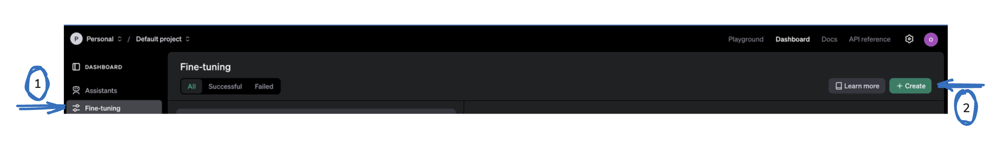

* Click Fine-tuning > Create

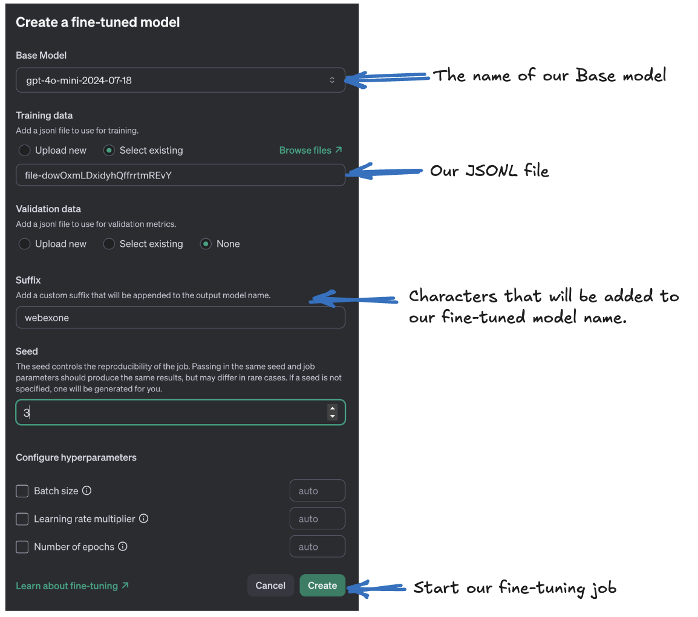

* **Model name (Required) is the name of the model you want to fine-tune (gpt-4o-mini, gpt-3.5-turbo, babbage-002, davinci-002, or an existing fine-tuned model)**
    
* **Training_file (Required) is our JSONL dataset**

* **Suffix:A string of up to 18 characters that will be added to our fine-tuned model name.**

<span class="colour" style="color:red">Note: After you've started a fine-tuning job, it may take some time to complete. Our job may be queued behind other jobs in OpenAI system, and training a model can take minutes or hours depending on the model and dataset size.</span>

<span class="colour" style="color:red"> Remember: In addition to creating a final fine-tuned model at the end of each fine-tuning job, OpenAI will create one full model checkpoint for you at the end of each training epoch. These checkpoints are themselves full models that can be used within our completions and chat-completions endpoints.</span>
 
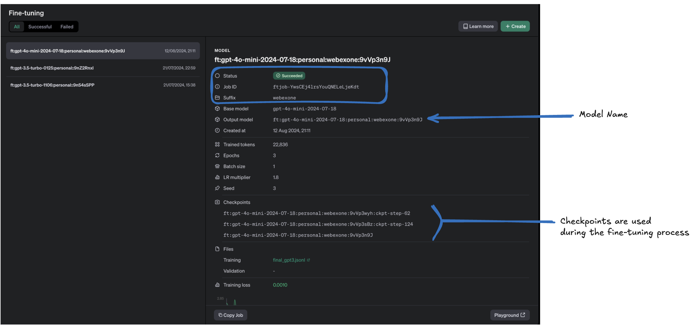

* **Job ID:** This is a unique identifier for the fine-tuning job.
* **Suffix:** webexone is the suffix we chose for this job, likely to distinguish it from others.
* **Base model:** The fine-tuning was done on the gpt-4o-mini-2024-07-18 model.
* **Output model:** The result of the fine-tuning is saved as ft:gpt-4o-mini-2024-07-18:personal:webexone:9vVp3n9J.
* **Created at:** The fine-tuning job was created on August 12, 2024, at 21:11.
* **Trained tokens:** The model was trained on 22,836 tokens.
* **Epochs:** The fine-tuning process involved 3 epochs, meaning the dataset was cycled through three times.
* **Batch size:** The batch size was set to 1, indicating that one example was processed at a time during training.
* **Learning rate (LR) multiplier:** The learning rate multiplier was set to 1.8, which adjusts the learning rate during training.
* **Seed:** A seed value of 3 was used to create randomness in the training process. Ensuring the reproducibility of the fine-tuning process.
* **Checkpoints:** The process included checkpoints at steps 62, 124, and the final step, allowing you to save intermediate models during training.
* **Training loss:** The final training loss achieved was 0.0010, which is a measure of how well the model is fitting the data.

Once the fine-tuning job is complete, you can start using the fine-tuned model either through the API or via the playground available on [OpenAI Platform](platform.openai.com)


## Using the fine-tuned model

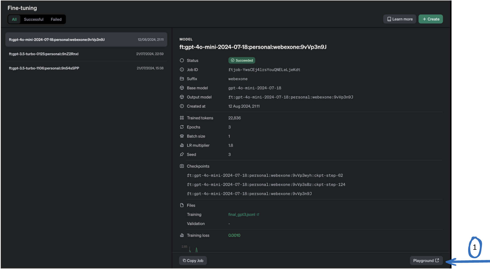

* You'll notice a new fine-tune option under the Model dropdown and is now available for selection. Let's give it a try!

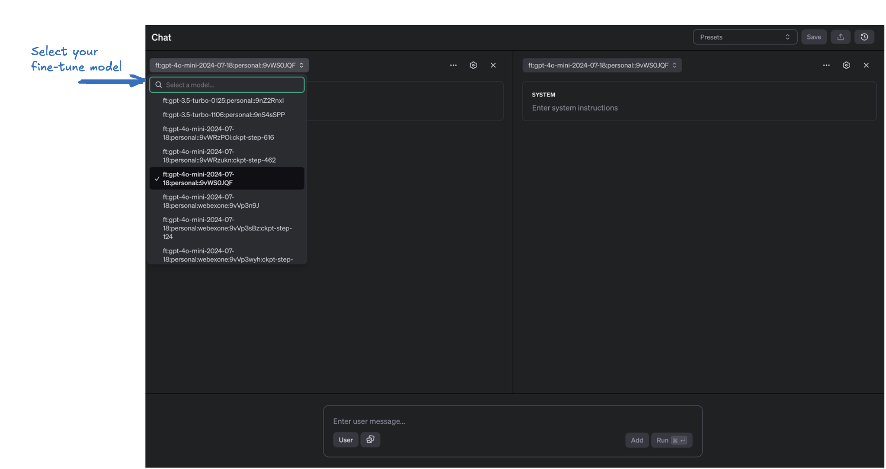

* Enter the system prompt we created earlier

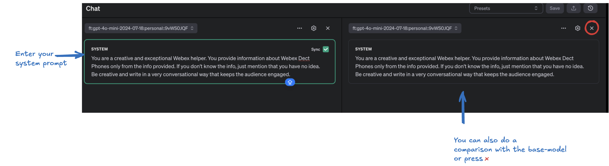

* In the user tab enter your input to see the response from your fine-tune model 

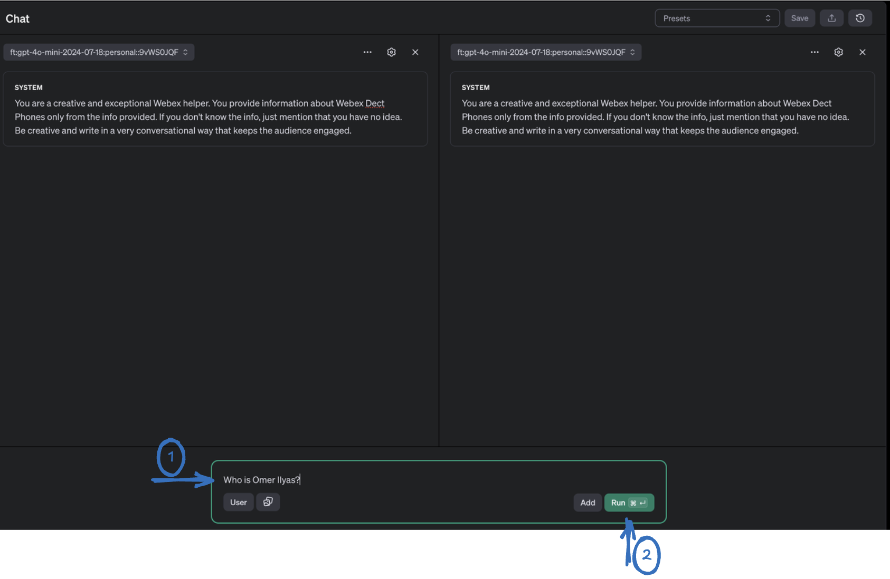

* Our responses

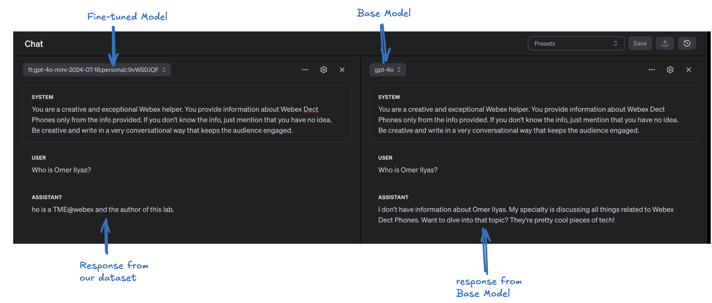

<span class="colour" style="color:red">Note: it's important to note that fine-tuning this type of model involves some costs. More info for pricing available [here](https://openai.com/api/pricing/)</span>

## Step-by-Step Guide To Fine-tuning Using Python (Optional)

### Set OpenAI token

<span class="colour" style="color:red">Note: First, create an account from the[ OpenAI official website](https://platform.openai.com/).</span>

* Create a new project API key by browsing to [API Keys web page](https://platform.openai.com/api-keys). Select Create new secret key. The API key is automatically generated. Save the APi Key as we will be using it in the later steps .


### Prepare the training data

* We have already prepared the dataset in the previous step. Be sure to copy and save the file locally as GPT.jsonl.

### Prepare your python envoirnment 


* Create a new Colab Notebook.


* Connect to the default Runtime Environment. For this task, you can use the CPU as the runtime environment.

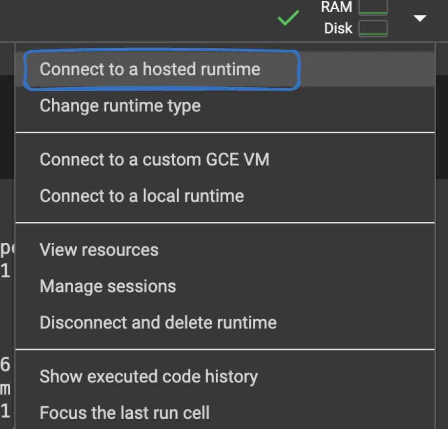

<span class="colour" style="color:red">Reminder: </span>Whenever you want to copy the code in Google Colab and run it, be sure to click on + Code to add a new code cell.

<span class="colour" style="color:red">Reminder: </span>Click the play button to the left of the code, or use the keyboard shortcut "Command/Ctrl+Enter" while the cell is selected.

* Within the Google Colab notebook navigate to the new “Secrets” section in the sidebar.


* Click on “Add a new secret.” Enter the name example: OPENAI_API_KEY and value of the secret(the API key created above). Note: The name is permanent once set. 

* The list of secrets is global across all your notebooks.

* Use the “Notebook access” toggle to grant or revoke access to a secret for each notebook.


#### Incorporating Secrets into Your Code - We will use it later in our lab

* To use a secret in your notebook, use the following code snippet

```
from google.colab import userdata
my_secret_key = userdata.get('OPENAI_API_KEY')
```

* Upload the JSONL file on HuggingFace. Click on Folder and create a new folder called "data"


* Click on [...], select Upload


* Choose your GPT.jsonl file and click Open

<span class="colour" style="color:red">Note </span> Ensure that your files are saved elsewhere. This runtime's files will be deleted when it is terminated.

* Install openai library

``` py linenums="1"
!pip install openai
```

<span class="colour" style="color:orange"> OUTPUT</span>

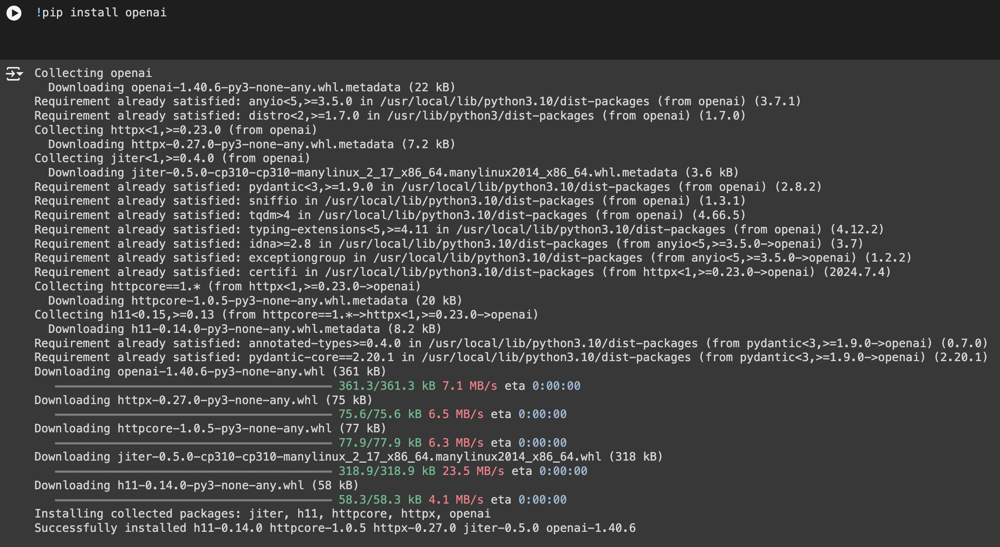

* Setting up an API token

```py linenums="1"
import os
from google.colab import userdata
# Set the OPENAI_API_KEY environment variable
os.environ['OPENAI_API_KEY'] = userdata.get('OPENAI_API_KEY')
```

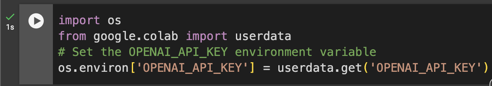

* Uploading the training File. Your training file must be in jsonl format. Once you've uploaded the file, processing might take a while. The maximum size for file uploads is 1 GB. To upload a file on the OpenAI server:

```py linenums="1"
from openai import OpenAI
client = OpenAI()
response = client.files.create(
  file=open("/content/TrainingData/GPT.jsonl", "rb"),
  purpose="fine-tune"
)
file_id= response.id
print(f"file uploaded successfully with id: {file_id}")
```

<span class="colour" style="color:orange"> OUTPUT</span>

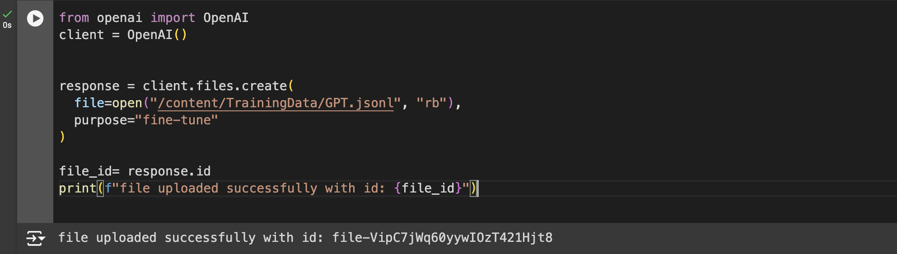

You can also access the uploaded file by navigating to the [OpenAI Dashboard](https://platform.openai.com/storage)

<span class="colour" style="color:orange"> OUTPUT</span>
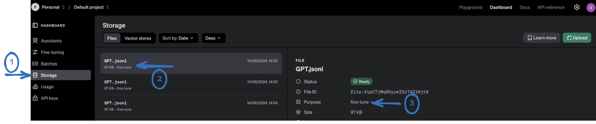

* Create a fine-tune model. After ensuring the file has been successfully uploaded, the next step is to create a fine-tuning job. The file_id  was returned when the training file was uploaded to the OpenAI API. To start a fine-tuning job:

```py linenums="1"
model = "gpt-4o-mini-2024-07-18"
response = client.fine_tuning.jobs.create(
  training_file=file_id,
  model=model 
)
job_id = response.id
print(f"Fine Tuning job created  successfully with Job id: {job_id}")
```
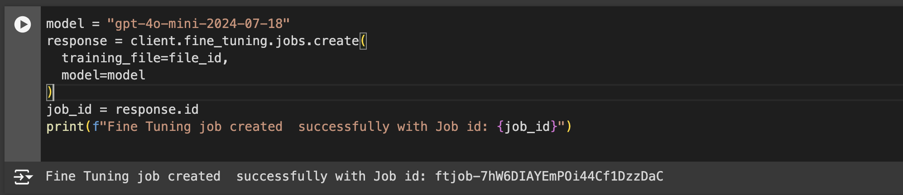

    * You can view the fine-tuning job by navigating to the [OpenAI Dashboard](https://platform.openai.com/finetune)


<span class="colour" style="color:orange"> OUTPUT</span>

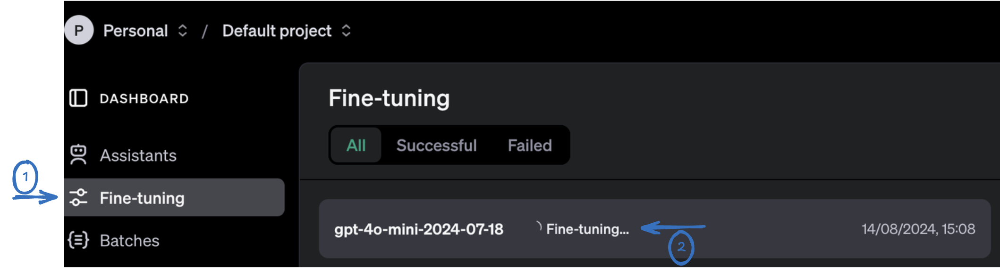

    * You can also view the  status of fine-tuning by entering the below command:

``` py linenums="1"
# Retrieve the state of a fine-tune
client.fine_tuning.jobs.retrieve(job_id)
```
<span class="colour" style="color:orange"> OUTPUT</span>

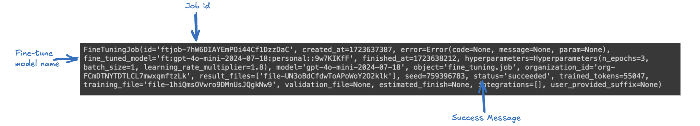

* After successfully completing the fine-tuning process in the previous step, the job details will include a fine_tuned_model field, which shows the name of the tuned model. You can use this model name in an API call to get a response from the model we just fine-tuned.

<span class="colour" style="color:red"> Note: The model ID in the following step will be different for your specific model.  </span>

```py linenums="1"
completion = client.chat.completions.create(
  model="ft:gpt-4o-mini-2024-07-18:personal::9vWS0JQF",

  messages=[
    {"role": "system", "content": "You are a creative and exceptional Webex helper. You provide information about Webex Dect Phones only from the info provided. If you don't know the info, just mention that you have no idea. Be creative and write in a very conversational way that keeps the audience engaged."},
    {"role": "user", "content": "who is Omer Ilyas?"}
  ]
)
print(completion.choices[0].message)
```

<span class="colour" style="color:orange"> OUTPUT </span>

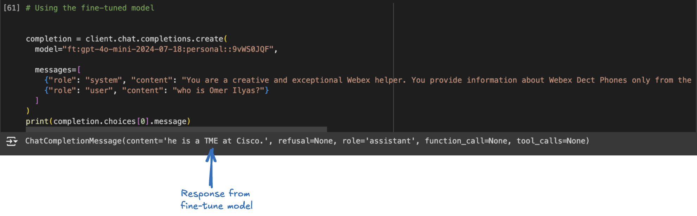


## Conclusion

In this session, we've explored the capabilities of OpenAI's models and walked through the process of fine-tuning them to enhance their performance for specific tasks. We've also covered the key requirements needed to successfully fine-tune a model. Fine-tuning allows us to adjust the language model’s responses, making them more effective at addressing particular tasks, styles, or domains with greater accuracy and efficiency.

Unlike open-source models like LLaMA, Mistral, or Stable Diffusion, where fine-tuning can be more complex, the process for fine-tuning GPT is straightforward, involving simple API calls.