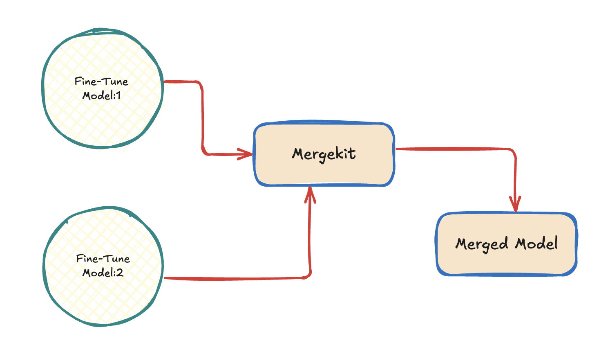

# **Language Model Merging**

 Note: The below section is for information only

Language model merging involves integrating the weights of two or more fine-tuned large language models (LLMs) into a single, unified model. By merging these models, each specialized in different tasks or domains, you can combine their fine-tuned capabilities into one model, enhancing its overall performance and versatility. This process is an effective way to maximize the potential of your LLMs. Our preferred tool for this process is Mergekit, an open-source repository available at <a href="https://github.com/arcee-ai/mergekit" target="_blank">Mergekit</a>. For a deeper understanding of the underlying concepts, you can refer to the <a href="https://arxiv.org/abs/2403.13257" target="_blank">Research paper</a>

