# GenAI- Frameworks

???+ blank "GenAI"

    ??? info "Introduction"

        === "Introduction"

            In the previous sections of this lab, we started by exploring  basics of neural networks/tokenization, which are key to understanding how modern AI models, particularly large language models (LLMs), operate. We moved on to embeddings and vector databases, which play a vital role in how these models represent and retrieve information.

            We also looked into the concept of context windows and how they influence model performance. To address some of the limitations inherent in traditional context windows, we introduced Retrieval Augmented Generation (RAG). This approach enables models to dynamically retrieve relevant information, significantly improving their ability to generate accurate and contextually appropriate responses. To make you understand better, we even built a quick RAG application. Additionally, we touched on multimodal RAG, which takes this a step further by enabling the model to process and integrate information from multiple sources, such as text, images, and more, making it even more versatile.

            While we’ve covered the basics, it’s crucial to recognize that the field of AI is rapidly advancing. Companies like OpenAI, Mistral, Google, Meta, and others are in a race to develop the most sophisticated large language models (LLMs). 

            <p align="right"><a href="http://127.0.0.1:8000/Task9/#__tabbed_1_2" class="md-button md-button--primary">Next</a></p>

        === "GenAI Framework"
            
            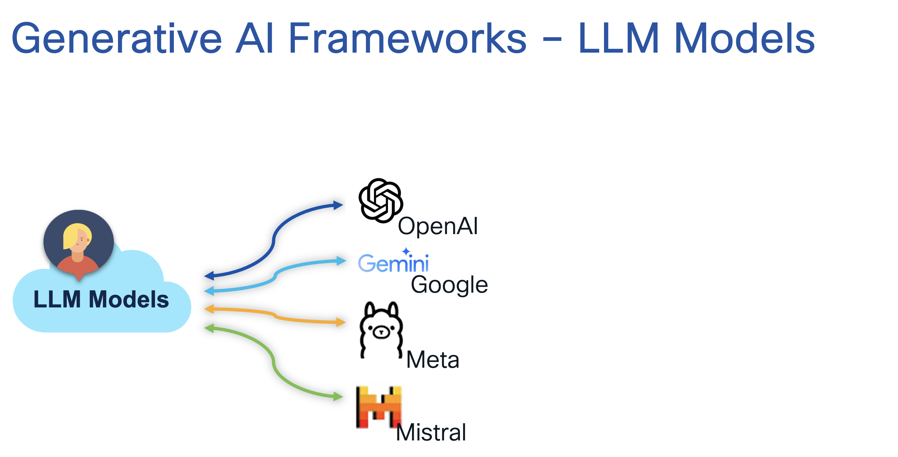

            However, effectively using these powerful LLMs in real-world scenarios involves more than just sending and receiving API requests. Challenges such as fine-tuning models, integrating them with third-party systems e.g. Webex, and ensuring they perform well in complex environments require more than what LLMs alone can offer. 

            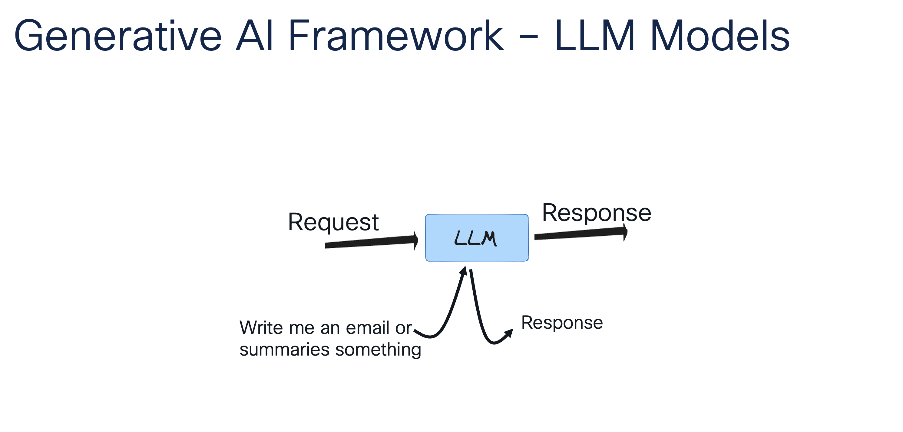

            This is where GenAI frameworks come into play, providing the essential infrastructure to bridge the gap between raw LLM capabilities and practical, scalable AI solutions. There are numerous frameworks available for use.

            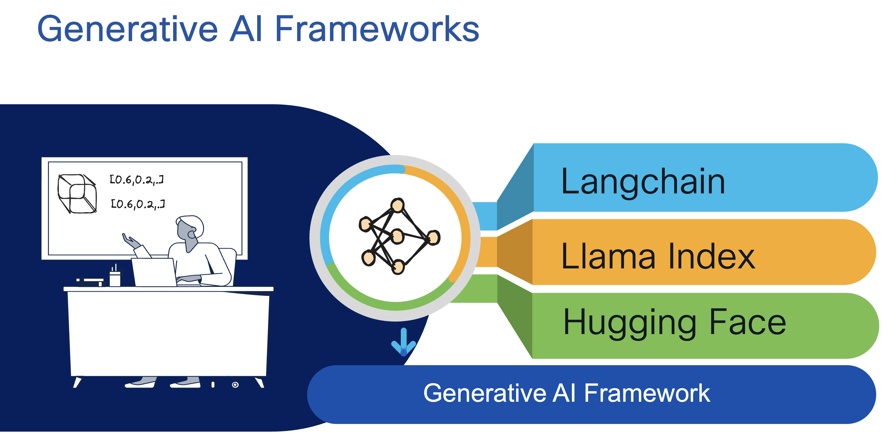

            The question of which framework to choose ultimately depends on your specific preferences and needs. Many of these frameworks have overlapping functionalities. In this section, we'll focus on 
            <a href="https://python.langchain.com/v0.1/docs/get_started/introduction" target="_blank">LangChain</a>, exploring what it is and how it can be used to create AI-powered applications.

            ??? "Langchain"
                
                LangChain is an open-source framework that enables developers to integrate large language models (LLMs) with external data sources and computational resources. Available as a Python, JavaScript, or TypeScript package, it offers a versatile pipeline abstraction that can be used for various purposes, from creating AI enabled applications to managing data ingestion from external sources.

                While an LLM like (GPT or Gemini e.t.c) has impressive general knowledge, LangChain is essential for retrieving information from your own documents or fine-tuning models for specific tasks. It allows you to connect LLMs to your data sources, enabling actions like sending messages to a Webex Space. The process involves breaking your data or documents into smaller chunks and storing them in a vector database as embeddings. LangChain supports various vector stores, such as Chroma, Faiss, and Cassandra e.t.c making data retrieval and action-taking both efficient and seamless. <a href="https://python.langchain.com/v0.1/docs/get_started/introduction" target="_blank">More info on langchain can be found here.</a>


                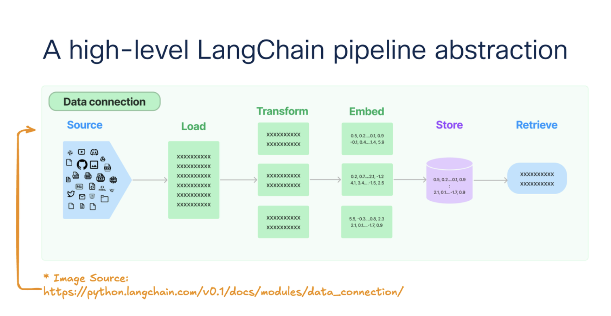

                This below image outlines a very high-level LangChain pipeline, showing how data flows from various sources, gets loaded using specific loaders, and is transformed for further processing. Sources can be structured e.g (CSV, JSON) or unstructured (PDF, text, HTML), including online platforms like YouTube, GitHub, and Twitter. The loading stage involves selecting the right loader, which extracts content based on parameters like file paths or URLs. Once loaded, documents are split into pages and further chunked with overlap using a splitter (as mentioned in previous section). This structured processing is essential for effective retrieval and even improving the accuracy of retrieval-augmented generation (RAG) workflows.

                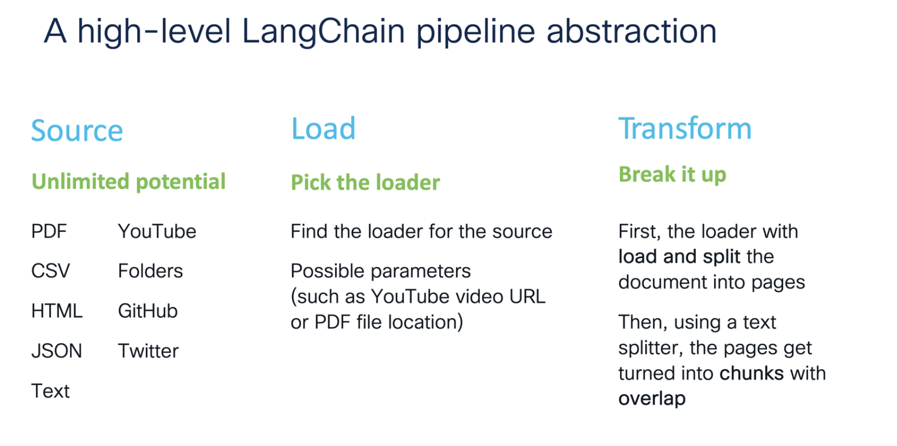

                There are different text splitters in LangChain, which break down data into smaller chunks based on various rules like characters, tokens, HTML, Markdown, or semantics. The choice of splitter impacts how well related text stays together, affecting retrieval process.

                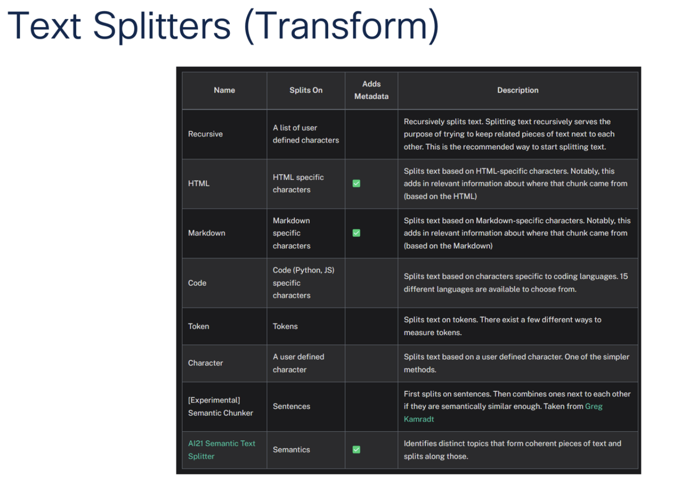

                !!! important
                    More info about Embeddings can be found in [Task4](Task4.md)

                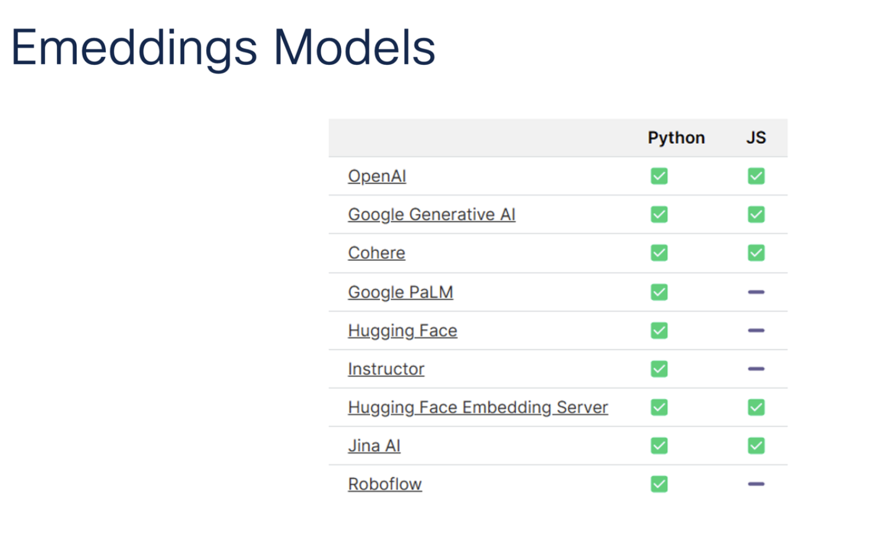

                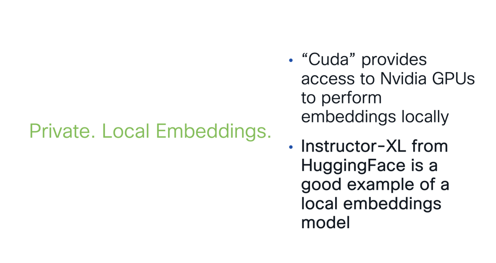

                Below is a summary from a [Langchain blog](https://blog.langchain.dev/langchain-state-of-ai-2023/) that outlines the most commonly used LLMs, embeddings, and vector stores.

                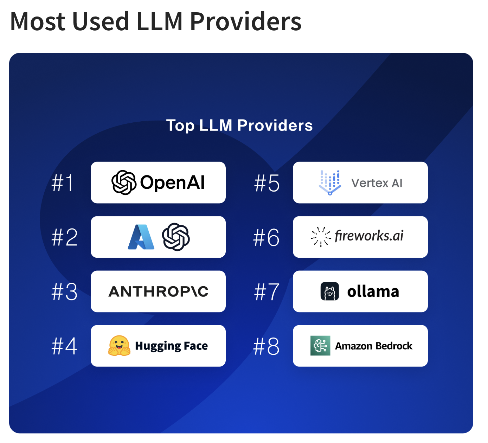

                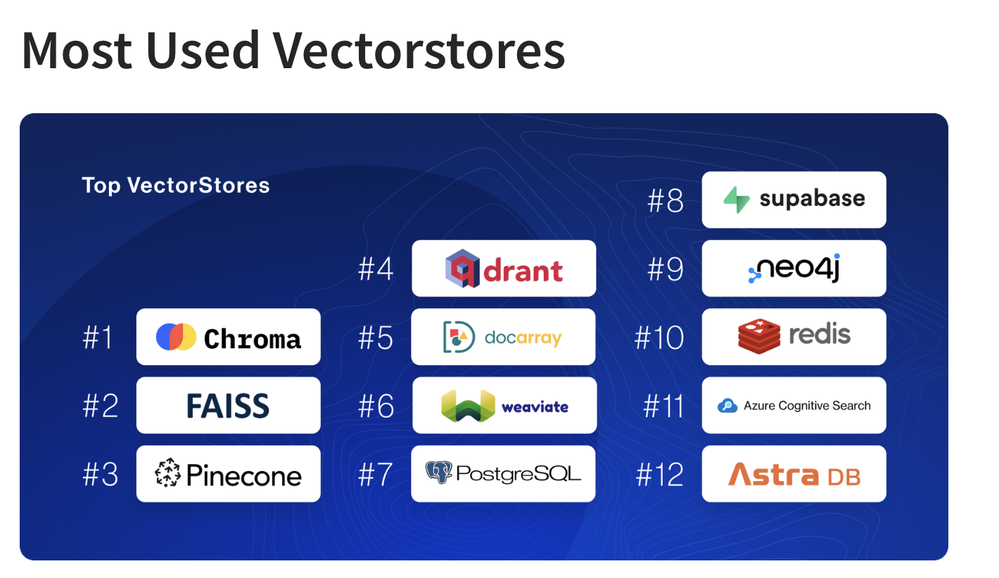

                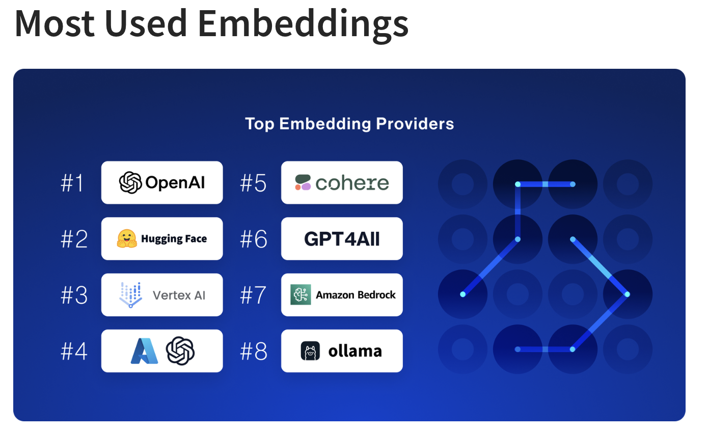

                The beauty of Langchain lies in its ability to provide a comprehensive ecosystem, regardless of the LLM model you choose to work with. Within the Langchain ecosystem, there's a tool called Langsmith, which is designed for monitoring and debugging your applications, think of it as LLM ops. If you're building applications as APIs, Langchain offers Langserve (create services in the form of APIs). Additionally, the ecosystem includes agents, chains, retrievers, and LLM tools, making it a versatile platform for various NLP tasks.

                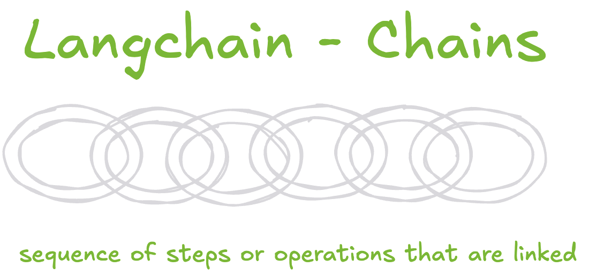

                !!! note
                    Chains are a sequence of steps or operations that are linked together to achieve a particular task. Each step in the chain can involve various processes, such as invoking a language model, performing a calculation, calling an external API, or manipulating data. Chains allow developers to structure these steps in a way that the output of one step becomes the input of the next, creating a pipeline of operations. </span>

                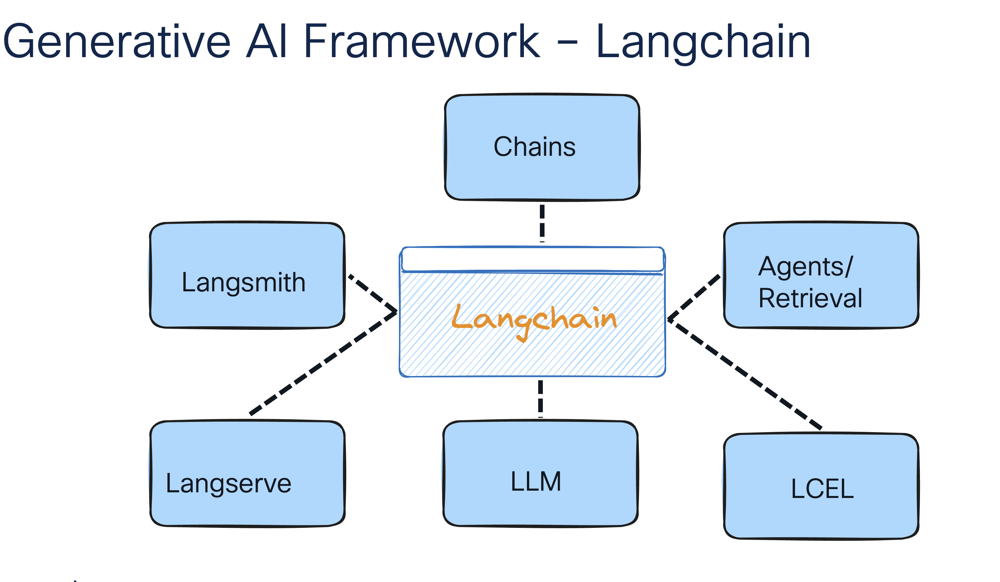

                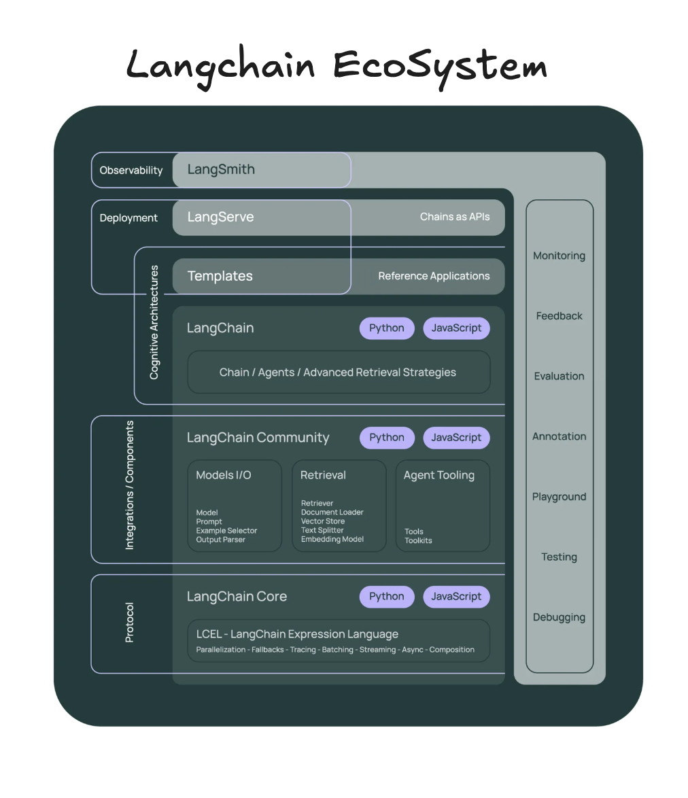

                !!! important
                    The above image was obtained from <a href="https://js.langchain.com/v0.1/docs/get_started/introduction" target="_blank">Langchain</a>
            
            <p align="right"><a href="http://127.0.0.1:8000/Task9/#__tabbed_2_1" class="md-button md-button--primary">Next</a></p>

???+ blank "Langchain - UseCases"

    ??? info "Labs"

        === "UseCase-1"

            !!! important

                    Make sure you have created a Langchain account as explained in the "Getting Started with LangChain" section in Task1

            === "Pre-requisite"
        
                Let's start building chatbot application using LangChain, I'll guide you through the basic steps. 

                With LangChain, when creating an application, you have the flexibility to use either paid LLMs or open-source LLMs. One way to integrate open-source LLMs is through Hugging Face or Ollama, but since we're focusing on LangChain, we'll explore how this can be done within its ecosystem.

                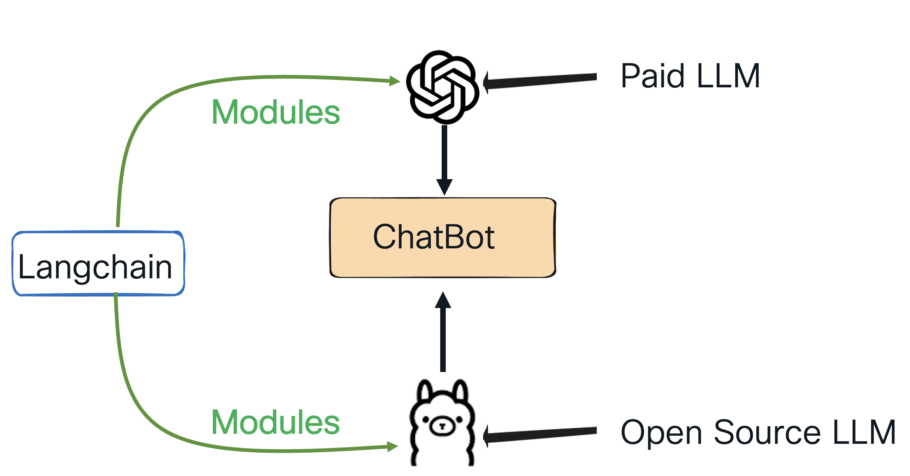

                We’ll build a chatbot using paid models (like OpenAI and Open Source models). LangChain provides modules that can seamlessly interact with both paid services and open-source models, allowing you to create versatile and powerful applications.

                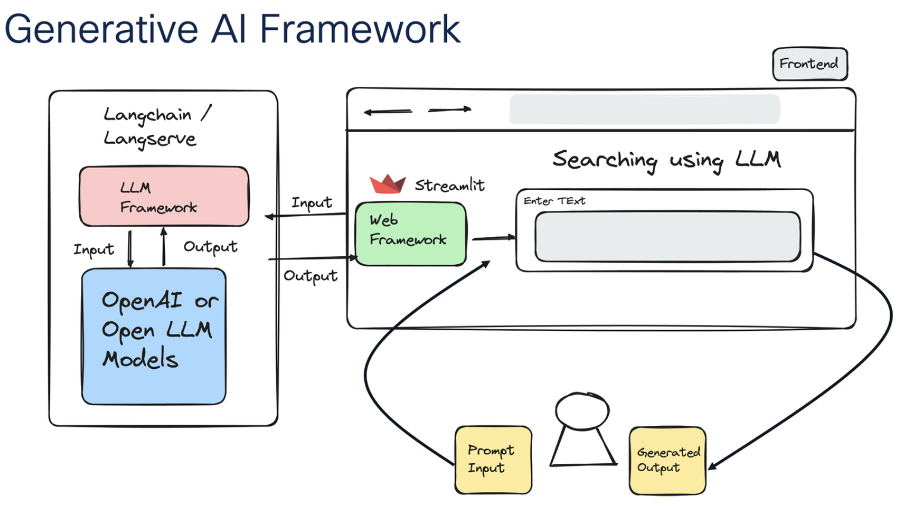

                !!! important

                    In this example, we'll explore the use of Langchain and Langserve, starting with the installation of essential libraries like langchain_openai, langchain, and langchain_core. We'll demonstrate how to leverage Langserve for managing large language models (LLM) operations. 
                    Furthermore, I'll show you how to utilize Streamlit, a server-based application, to interactively visualize and interact with your code. Given the challenges of running Streamlit directly on Google Colab, we'll deploy NGROK to facilitate executing and accessing our code through a web interface.

                === "Task 1"

                    !!! important
                        Log into the Lab Environment

                    

                    * Open Google Colab and create a new notebook or use an existing one. Click on "File" > "New notebook". Please refer to the [following section](Task1.md) to create Google Colab account.

                    

                    * Make sure you are connected to a runtime. For this task, you can use the CPU as the runtime environment.

                    

                    <p align="right"><a href="http://127.0.0.1:8000/Task9/#__tabbed_4_2" class="md-button md-button--primary">Next</a></p>

                === "Set OpenAI token"

                    !!! note                                              
                        Skip this step and jump to [set-langchain-tokens](https://allchapters.github.io/genAi/Task9/#__tabbed_4_3) if you have already created the OpenAI account . If this is the first module you working with please, create an account from the [OpenAI official website](https://platform.openai.com/).

                    * Create a new project API key by browsing to <a href="https://platform.openai.com/api-keys" target="_blank">API Keys web page</a>. Select Create new secret key. The API key is automatically generated. Save the APi Key as we will be using it in the later steps .

                    

                    * Within your existing Google Colab notebook navigate to the new “Secrets” section in the sidebar.

                    

                    * Click on “Add a new secret.” Enter the name example: OPENAI_API_KEY and value of the secret(the API key created above). Note: The name is permanent once set. 

                    * The list of secrets is global across all your notebooks.

                    * Use the “Notebook access” toggle to grant or revoke access to a secret for each notebook.

                    

                    <p align="right"><a href="http://127.0.0.1:8000/Task9/#__tabbed_4_3" class="md-button md-button--primary">Next</a></p>

                === "Set Langchain tokens"

                    !!! important
                        Make sure you have created a Langchain account as explained in the "Getting Started with LangChain" section in [Task1](Task1.md)
                        
                    * Copy your Langchain Key and save it 
                    
                    !!! important
                        You can also use the key that was sent to your tmedemouserX account at the start of the lab.

                    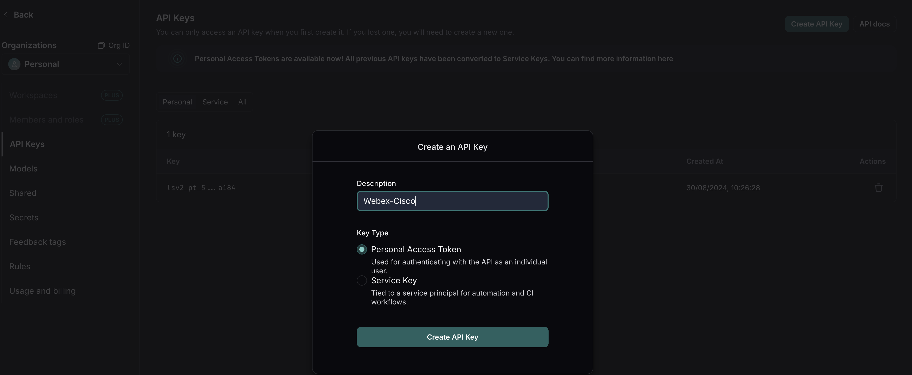

                    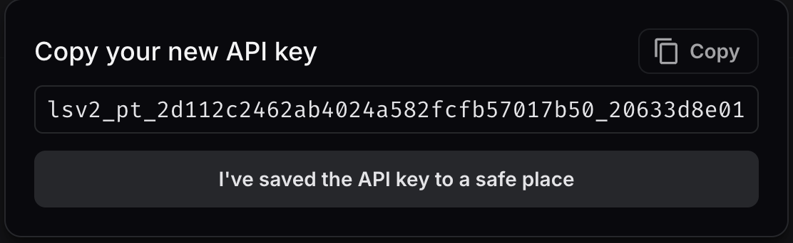

                    * Within your existing Google Colab notebook navigate again to the new “Secrets” section in the sidebar. Click on “Add a new secret.” Enter the name example: LANGCHAIN_API_KEY and value of the secret(the API key created in Langchain). 

                    

                    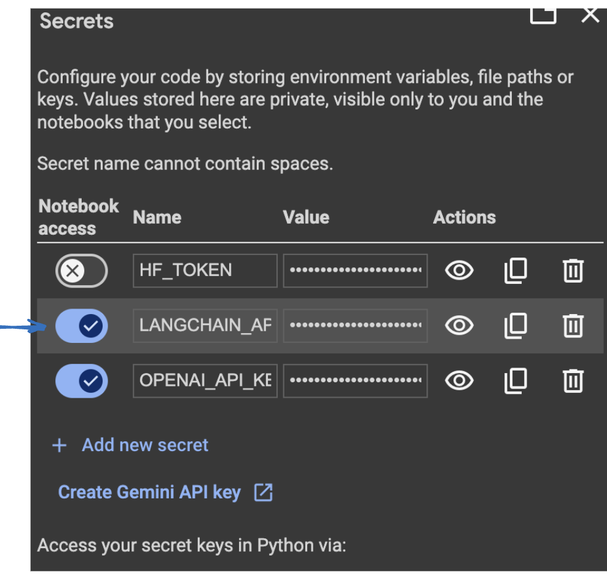

                    <p align="right"><a href="http://127.0.0.1:8000/Task9/#__tabbed_4_4" class="md-button md-button--primary">Next</a></p>

                === "Set NGROK"

                    !!! important
                        You can also use the NGROK key that was sent to your tmedemouserX account at the start of the lab.
                
                    * Browse to <a href="https://ngrok.com/" target="_blank">NGROK</a> and click on Login. Ngrok is a reverse proxy application allowing cloud-based applications send notifications to your application which are running behind a firewall

                    * I’ll be using the "Login with Google" option to access my account, but feel free to choose the login method that works best for you.

                    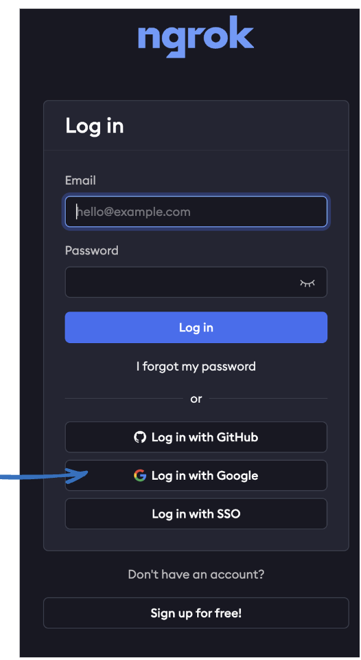

                    * Get your NGROK auth key. We will be using it in the later steps.

                    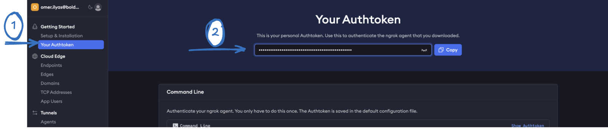

                    <span class="colour" style="color:red"> Note: Since we are using a free NGROK account, we can only run up to 3 tunnels simultaneously. If you need to terminate any active tunnels, please use the following steps </span>

                    ```py
                    !pkill ngrok
                    ```

                    <p align="right"><a href="http://127.0.0.1:8000/Task9/#__tabbed_3_2" class="md-button md-button--primary">Next</a></p>

            === "Configuration"

                * Lets start by installing all the necessary packages

                ```py linenums="1"
                ! pip install langchain_openai langchain langchain_core python-dotenv streamlit langchain_community langserve streamlit pyngrok ngrok
                ```

                * We will import libraries

                ```py linenums="1"
                from langchain_openai import ChatOpenAI
                from langchain_core.prompts import ChatPromptTemplate
                from langchain_core.output_parsers import StrOutputParser
                import requests
                import streamlit as st
                import os
                from dotenv import load_dotenv
                from google.colab import userdata
                from pyngrok import ngrok
                import subprocess
                import os
                ```

                *  Lets start by configuring the environment variables. We will use and define Langserve for our LLM ops

                ```py linenums="1"
                import os
                from google.colab import userdata
                os.environ['OPENAI_API_KEY'] = userdata.get('OPENAI_API_KEY')
                os.environ['LANGCHAIN_API_KEY'] = userdata.get('LANGCHAIN_API_KEY')
                os.environ["LANGCHAIN_TRACING_V2"] = "true"
                os.environ["LANGCHAIN_ENDPOINT"] = "https://api.smith.langchain.com"
                os.environ["LANGCHAIN_PROJECT"] = "default"
                ```

                ??? important 
                
                    <span class="colour" style="color:red"> Note: Due to the challenges of running Streamlit directly on Google Colab, we'll use NGROK to enable the execution and access of our code via a web interface. The code below is for your <b>understanding only</b> or if you're running it as Python packages in your own environment. To continue and run the code in this lab or on Google Colab, please proceed and copy the code from <b>Configuration1 section </b> </span>


                    * (Optional Step for your understanding) As we creating a simple chatbot application lets create our prompt 

                    ```py linenums="1" title="Optional Code"
                    prompt=ChatPromptTemplate.from_messages(
                        [
                            ("system","You are a helpful Cisco assistant. Please respond to the user queries"),
                            ("user","Question:{question}")
                        ]
                    )
                    ```

                    * (Optional Step for your understanding) Lets define Streamlit Framework

                    ```py linenums="1" title="Optional Code"
                    st.title('Langchain using OPENAI API')
                    input_text=st.text_input("Search the topic you want")
                    ```

                    * (Optional Step for your understanding) We will initialize the Language Model and set-up the Output parser 

                    ```py linenums="1" title="Optional Code"
                    llm=ChatOpenAI(model="gpt-4o")
                    output_parser=StrOutputParser()
                    ```

                    * (Optional Step for your understanding) Langchain offers features that allow us to connect various components into a seamless workflow, known as chains. So far, we have created a chat prompt template, initialized the LLM (Language Model), and set up an Output Parser. Now, let's combine all these elements.

                    ```py linenums="1" title="Optional Code"
                    chain=prompt|llm|output_parser
                    ```

                    * (Optional Step for your understanding) Lets give our input as question and pass it to our chain 

                    ```py linenums="1" title="Optional Code"
                    if input_text:
                        response = chain.invoke({'question': input_text})
                        st.write(response)
                    ```

                    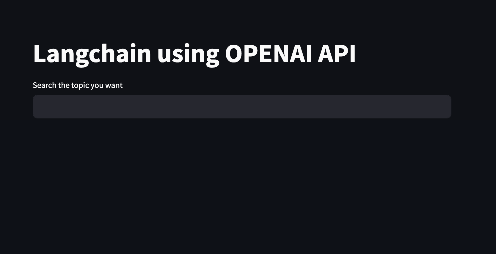

                !!! note
                    Configuration 1 - Let's execute the Code from here

                 * Running Streamlit apps directly within Google Colab can be challenging due to the need for a continuous web interface, which is not natively supported in Colab's environment. To address this, we will use NGROK, which creates a secure tunnel to make the Streamlit app accessible via a web interface.

                * The code will start by creating a Streamlit application using a prompt template, a language model (LLM), and an output parser. These components are combined into a chain to process user input and generate responses using  GPT-4o model. The app will prompt the user to input a query and then processes it through the chain, displaying the generated response in the Streamlit interface. We will save Streamlit app code to a file (app.py), and a subprocess is started to run the app.

                !!! important
                    Be sure to add your ngrok token before running the cell. Please enter your NGROK token in cell 43.

                ```py linenums="1"

                streamlit_code = """
                from langchain_openai import ChatOpenAI
                from langchain_core.prompts import ChatPromptTemplate
                from langchain_core.output_parsers import StrOutputParser
                import requests
                import streamlit as st
                import os
                from dotenv import load_dotenv

                load_dotenv()
                # Set up the prompt template
                prompt = ChatPromptTemplate.from_messages(
                    [
                        ("system", "You are a helpful Cisco Live assistant. Please respond to the user queries"),
                        ("user", "Question:{question}")
                    ]
                )

                # Streamlit interface
                st.title('Langchain using OPENAI API')
                input_text = st.text_input("Search the topic you want")

                # Initialize the OpenAI LLM
                llm = ChatOpenAI(model="gpt-4o")
                output_parser = StrOutputParser()

                # Create the chain
                chain = prompt | llm | output_parser

                if input_text:
                    response = chain.invoke({'question': input_text})
                    st.write(response)
                """

                # Save the streamlit app code to a file
                with open("app.py", "w") as file:
                    file.write(streamlit_code)

                # Start the Streamlit app using subprocess
                process = subprocess.Popen(['streamlit', 'run', 'app.py'])

                # Start ngrok tunnel
                ngrok.set_auth_token("Replace-with-your-ngrok-authtoken-created-above")  
                public_url = ngrok.connect(8501, "http")  # Use http instead of specifying as a named argument
                print(f"Your Streamlit app is live at: {public_url}")
                ```

                !!! important
                    Be sure to add your ngrok token before running the cell. Please enter your NGROK token in cell 43.

                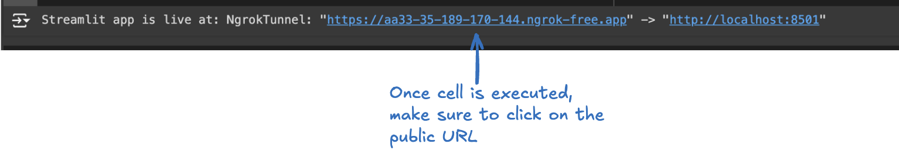

                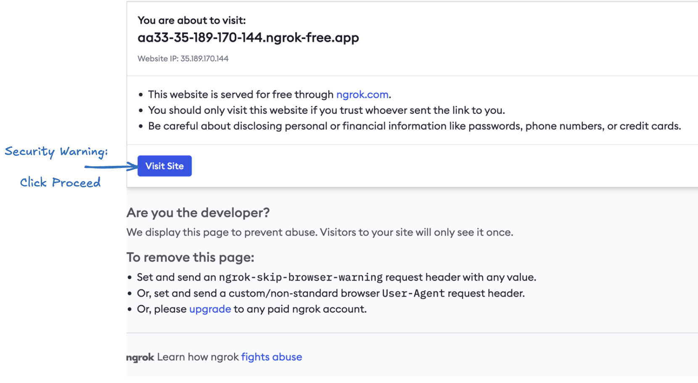

                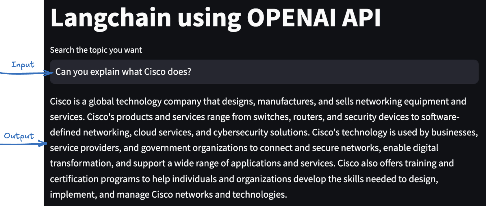

                !!! note
                    Since we are using a free NGROK account, we can only run up to 3 tunnels simultaneously. If you need to terminate any active tunnels, please use the following steps

                    ```py linenums="1" title="Optional Step in case you need to terminate NGROK"
                    !pkill ngrok
                    ```

                * Since we're using <a href="https://smith.langchain.com/" target="_blank">Langserve for llm-ops</a>, let's log in and explore its features there.

                !!! note
                    Make sure to log in using the same Gmail account(tmedemouserX) you used to sign in and create the API keys, as mentioned in Task 1.

                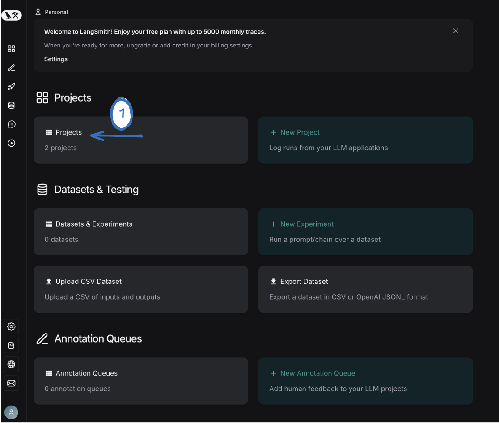

                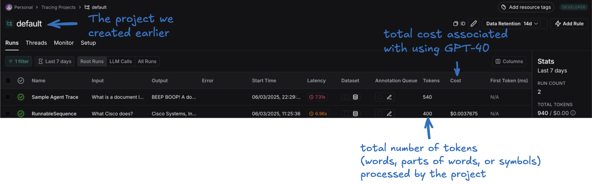

                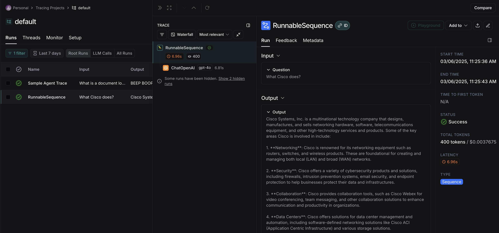

                This dashboard provides a summary of the performance, usage, and cost metrics for the "default" project within the last 7 days. It offers insights into how frequently the project has been run, the efficiency (in terms of error rates and latency), and the associated costs, helping users to monitor and optimize their LLM (Large Language Model) operations. By leveraging LangSmith’s observability tools, users can gain deeper insights into model behavior, fine-tune prompts, and improve overall system performance.

                <div style="background-color:#fff3cd; padding:10px; border-left:6px solid #ffc107; font-weight:bold; font-size:18px; color:black;">
                🚀 Enhancing Our Streamlit App to Send Messages to a Webex Space </div>


   
                !!! important
                    
                    Streamlit is an open-source Python library that makes it easy to create interactive, data-driven web applications. It allows users to build web apps for machine learning, data visualization, and data science projects without needing extensive web development knowledge. With Streamlit, you can quickly turn your Python scripts into interactive web interfaces by adding widgets like sliders, buttons, and charts, all using just Python code. It's an efficient way to visualize and share data insights in real time.</span>

                !!! note
                
                    We’ve seen how simple it is to interact with LLM and create an application using Langchain + Streamlit. Now, let’s take it a step further by modifying the application so that the responses are not only displayed in the Streamlit interface but are also sent directly to a specific Webex space.

                !!! important
                    Ensure you have the Webex Bearer Token and Space ID available. If you don't have them, please reach out to your lab proctor.

                * let's modify our code to send the generated responses directly to a Webex space. This will enable real-time collaboration and communication with team members through Webex, enhancing the utility of our AI applications.

                !!! important
                    Lets terminate any active tunnels, before proceeding with the below code.

                    ```py linenums="1"
                    !pkill ngrok
                    ```

                !!! note
                    Sometimes, Google Colab may have issues running modified code. As a best practice, if you're using the same Colab notebook, make sure to terminate any existing NGROK processes before restarting. Alternatively, consider creating a new notebook to avoid conflicts.

                ```py linenums="1"
                ! pip install langchain_openai langchain langchain_core python-dotenv streamlit langchain_community langserve streamlit pyngrok ngrok
                ```

                *  Lets start by configuring the environment variables. We will use and define Langserve for our LLM ops

                ```py linenums="1"
                import os
                from google.colab import userdata
                os.environ['OPENAI_API_KEY'] = userdata.get('OPENAI_API_KEY')
                os.environ['LANGCHAIN_API_KEY'] = userdata.get('LANGCHAIN_API_KEY')
                os.environ["LANGCHAIN_TRACING_V2"] = "true"
                os.environ["LANGCHAIN_ENDPOINT"] = "https://api.smith.langchain.com"
                os.environ["LANGCHAIN_PROJECT"] = "default"
                ```

                ```py linenums="1"
                from langchain_openai import ChatOpenAI
                from langchain_core.prompts import ChatPromptTemplate
                from langchain_core.output_parsers import StrOutputParser
                import requests
                import streamlit as st
                import os
                from dotenv import load_dotenv
                from google.colab import userdata
                from pyngrok import ngrok
                import subprocess
                import os
                ```
                

                !!! important
                    Before running the code, make sure to enter your webex_space_id and Bearer token in cells 18 and 19. Also, add your NGROK token in cell 71.

                ```py linenums="1"
                # Create the Streamlit app code
                streamlit_code = """
                from langchain_openai import ChatOpenAI
                from langchain_core.prompts import ChatPromptTemplate
                from langchain_core.output_parsers import StrOutputParser
                import requests
                import streamlit as st
                import os
                from dotenv import load_dotenv
                from google.colab import userdata
                from pyngrok import ngrok
                import subprocess
                import os

                load_dotenv()

                # Webex setup
                webex_access_token = "Your-Webex-Token"
                webex_space_id = "Your-Space-ID"

                # Function to send a message to Webex
                def send_webex_message(content):
                    url = "https://webexapis.com/v1/messages"
                    headers = {
                        "Authorization": f"Bearer {webex_access_token}",
                        "Content-Type": "application/json"
                    }
                    payload = {
                        "roomId": webex_space_id,
                        "text": content
                    }
                    response = requests.post(url, headers=headers, json=payload)
                    if response.status_code == 200:
                        print("Message sent to Webex:", response.json())
                    else:
                        print("Failed to send message:", response.text)

                # Set up the prompt template
                prompt = ChatPromptTemplate.from_messages(
                    [
                        ("system", "You are a helpful Cisco Live assistant. Please respond to the user queries"),
                        ("user", "Question:{question}")
                    ]
                )

                # Streamlit interface
                st.title('Langchain using OPENAI API')
                input_text = st.text_input("Search the topic you want")

                # Initialize the OpenAI LLM
                llm = ChatOpenAI(model="gpt-4o")
                output_parser = StrOutputParser()

                # Create the chain
                chain = prompt | llm | output_parser

                if input_text:
                    response = chain.invoke({'question': input_text})
                    st.write(response)
                    send_webex_message(response)
                """

                # Save the streamlit app code to a file
                with open("app.py", "w") as file:
                    file.write(streamlit_code)

                # Start the Streamlit app using subprocess
                process = subprocess.Popen(['streamlit', 'run', 'app.py'])

                # Start ngrok tunnel
                ngrok.set_auth_token("Replace-with-your-ngrok-authtoken-created-above")  # Replace with your ngrok authtoken
                public_url = ngrok.connect(8501, "http")  # Use http instead of specifying as a named argument
                print(f"Your Streamlit app is live at: {public_url}")
                ```

                !!! important
                    Before running the code, make sure to enter your webex_space_id and Bearer token in cells 18 and 19. Also, add your NGROK token in cell 71.

                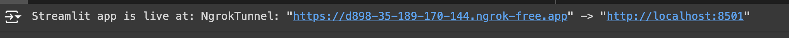

                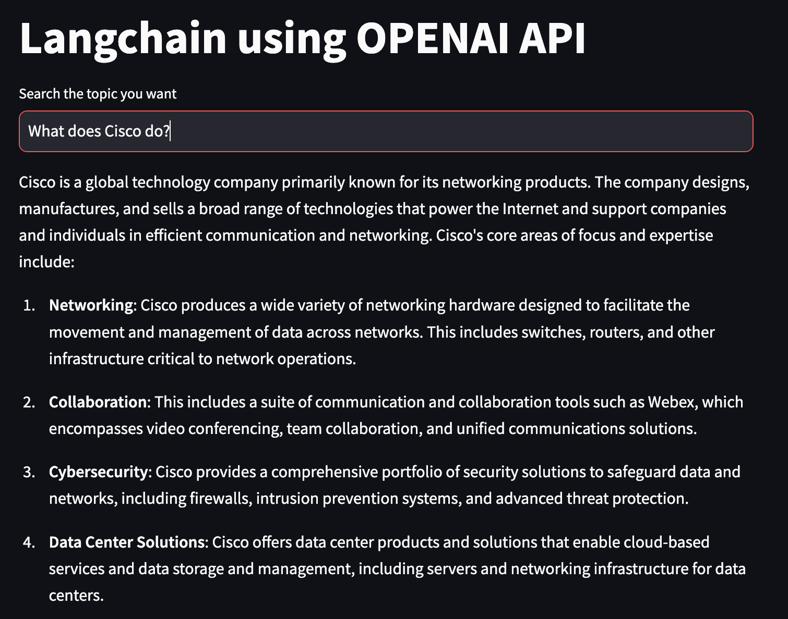

                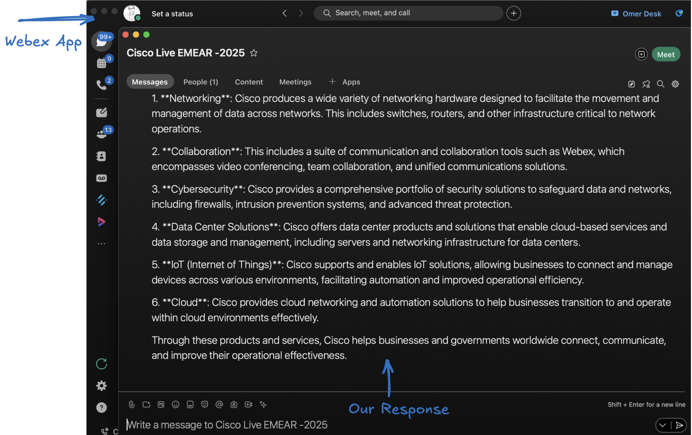

                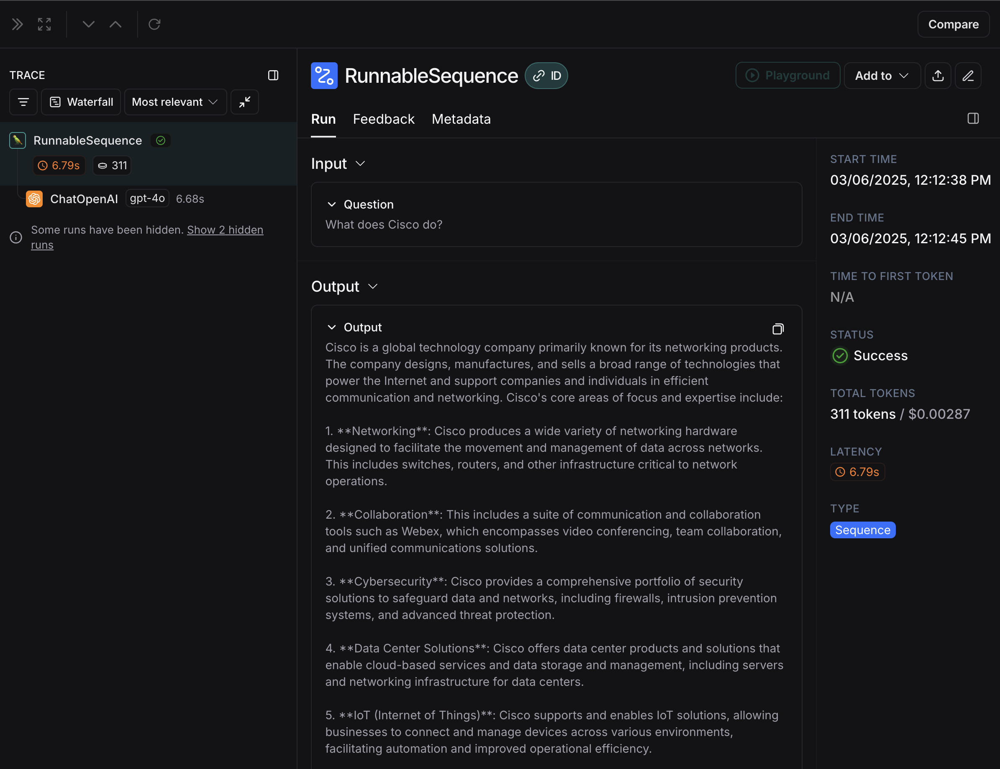

                ??? note
                
                    Building using Ollama Models(opensource) - OPTIONAL Source Code - For Informational Purpose Only

                    <span class="colour" style="color:red"> Note: The code below will work only if you are running Ollama locally on your machine as explained in [Task1](Task1.md)</span>

                    In this example, we're leveraging LangChain to build an AI assistant using the LLama3 model, accessible through the Ollama API. The assistant is designed to help with queries and is implemented using Streamlit, which provides a user-friendly interface as shown above. 

                    <span class="colour" style="color:red">Note:</span> Make sure you are running Ollama locally on your machine, as explained in [Task1](Task1.md), to ensure the Llama3 model is properly accessible.

                    ```py linenums="1" title="Optional Code"
                    from langchain_openai import ChatOpenAI
                    from langchain_core.prompts import ChatPromptTemplate
                    from langchain_core.output_parsers import StrOutputParser
                    from langchain_community.llms import Ollama
                    import streamlit as st
                    import os
                    from dotenv import load_dotenv
                    load_dotenv()
                    ## Prompt Template
                    prompt=ChatPromptTemplate.from_messages(
                        [
                            ("system","You are a helpful Cisco  assistant. Please respond to the user queries"),
                            ("user","Question:{question}")
                        ]
                    )
                    st.title('Langchain With LLAMA2 API')
                    input_text=st.text_input("Search the topic you want")

                    # ollama LLAma3 LLm 
                    llm=Ollama(model="llama3:latest")
                    output_parser=StrOutputParser()
                    chain=prompt|llm|output_parser

                    if input_text:
                        st.write(chain.invoke({"question":input_text}))
                    ```

                    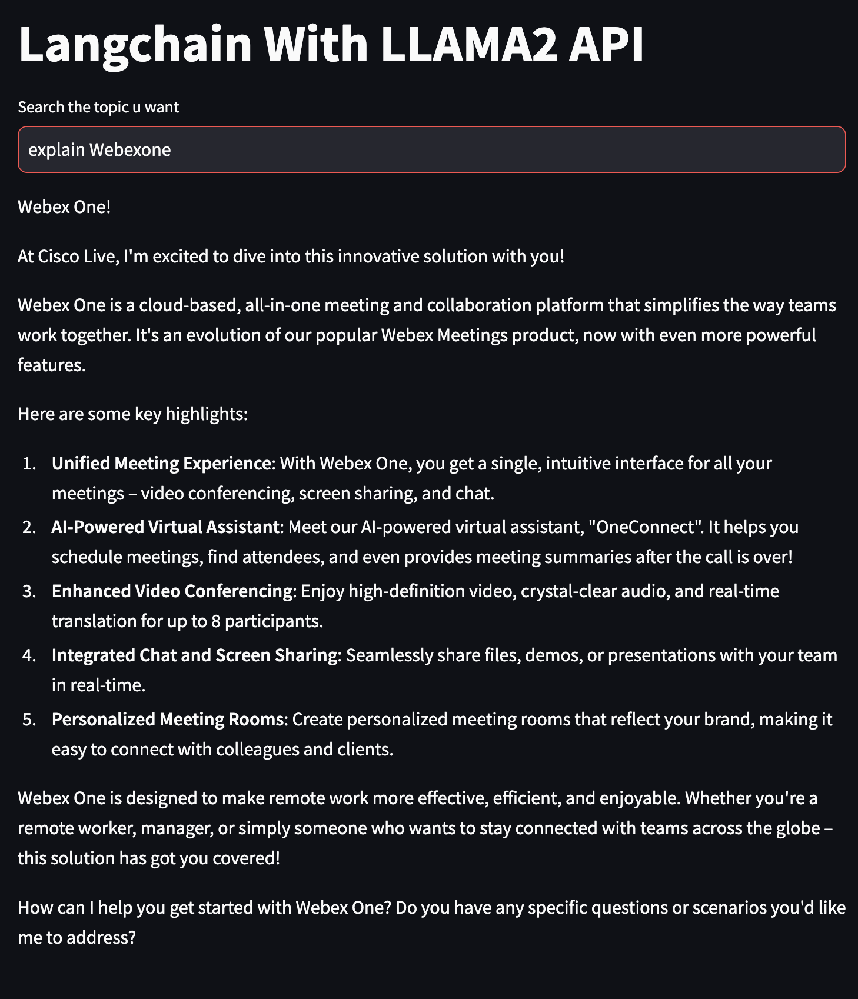

                    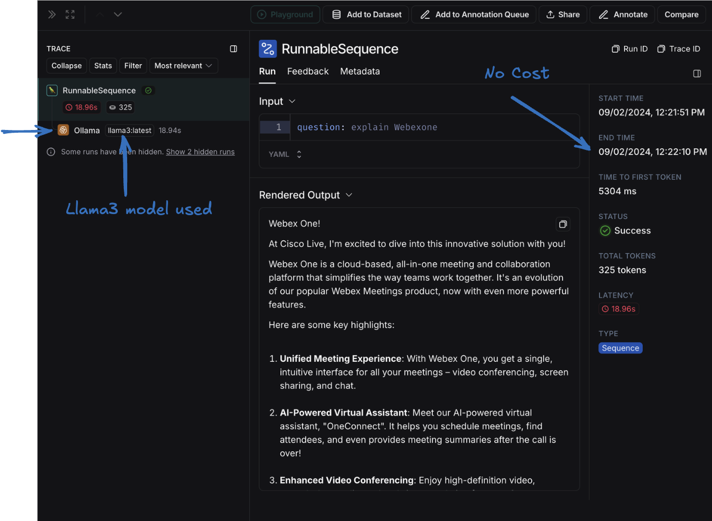

                <p align="right"><a href="http://127.0.0.1:8000/Task9/#__tabbed_2_2" class="md-button md-button--primary">Next</a></p>

        === "UseCase-2"

            <b>Langchain - Advanced Rag - Chains and Retrievers</b>
            
            In [Task5](Task5.md), we explored the basics of a simple Retrieval-Augmented Generation (RAG) application, where we utilized similarity search to find and retrieve information from our database. While this approach is effective for specific, straightforward use cases, it does come with some limitations among them being lack of flexibility.

            One of the drawbacks of relying solely on similarity search is that it doesn’t easily accommodate more complex workflows or integration with additional tools. It’s powerful for direct matches but can struggle when the task requires multi-step logic, advanced filtering, or a combination of different data sources.

            LangChain’s <a href="https://python.langchain.com/v0.1/docs/modules/data_connection/retrievers/" target="_blank">retrievals</a> and <a href="https://python.langchain.com/v0.1/docs/modules/chains/" target="_blank">chains</a>, on the other hand, provide a more versatile and scalable framework. They enable the creation of sophisticated RAG applications by allowing you to define workflows that can incorporate multiple retrieval strategies, conditional logic, and integration with other LLM's or APIs.

            Let’s now shift our focus towards creating an advanced RAG application by leveraging the capabilities of LangChain’s chains and retrievers. This will not only improve the flexibility and power of our application but also open up new possibilities for handling complex queries and delivering more refined results.

            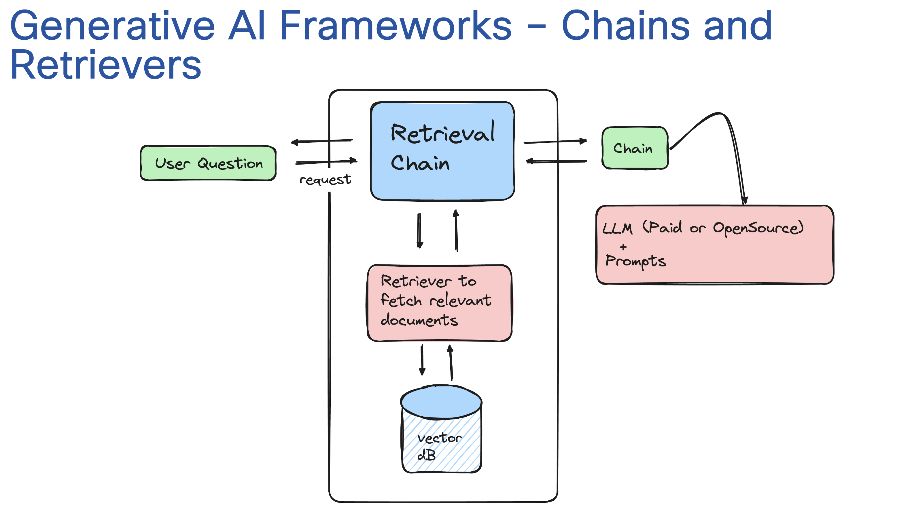

            !!! note
                
                **Chain: A chain in LangChain is like a sequence of tasks that you want to accomplish step by step.** 

                **Retriever: is like a search engine inside your application. Its job is to find and pull out the most relevant information from a vector database or a collection of documents.**

                **A retrieval chain is when you combine the power of both chains and retrievers.**

            <b>Task 1: Log into the Lab Environment</b>

            * Open Google Colab and start a new notebook, or you can use an existing one. Ensure that your OpenAI and LangChain tokens are already set up and activated for this notebook, as described in Use Case 1.

            * Let's load our PDF files into Google Colab. For this example, we can use the article titled "Cisco Preferred Architecture for Webex Calling". You can  [download the  article here](./assets/static/webex_calling.pdf){:target="_blank" download="webex_calling.pdf"} as we will be using in the next step.

            * Within Google Colab, Click on Folder and create a new folder called "data"

            

            * Click on [...], select Upload

            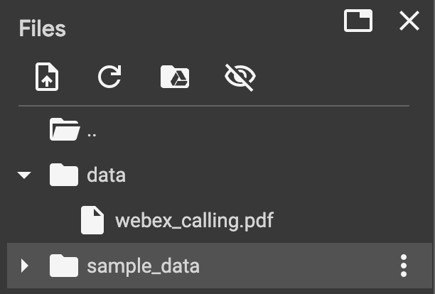

            * Choose your webex_calling.pdf file and click Open

            <b>Configuration</b>

            * Let's start by installing all the packages

            ```py linenums="1"
            ! pip install langchain_openai langchain langchain_core python-dotenv langchain_community langserve PyPDF chromadb
            ```

            * Let's start by configuring the environment variables. We will use and define Langserve for our LLM ops

            ```py linenums="1"
            import os
            from google.colab import userdata
            os.environ['OPENAI_API_KEY'] = userdata.get('OPENAI_API_KEY')
            os.environ['LANGCHAIN_API_KEY'] = userdata.get('LANGCHAIN_API_KEY')
            os.environ["LANGCHAIN_TRACING_V2"] = "true"
            os.environ["LANGCHAIN_ENDPOINT"] = "https://api.smith.langchain.com"
            os.environ["LANGCHAIN_PROJECT"] = "default"
            ```

            * We will import libraries

            ```py linenums="1"
            from langchain_openai import ChatOpenAI
            from langchain_core.prompts import ChatPromptTemplate
            from langchain_core.output_parsers import StrOutputParser
            import requests
            import os
            from dotenv import load_dotenv
            from google.colab import userdata
            ```

            If we examine the RAG pipeline, we typically need to follow these steps

            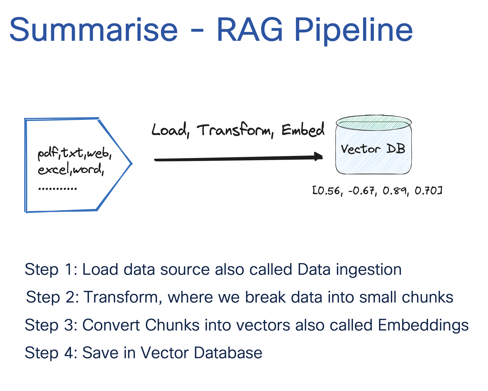

            * Let's load our data source

            ```py linenums="1"
            from langchain_community.document_loaders import PyPDFLoader
            loader=PyPDFLoader("/content/data/webex_calling.pdf")
            docs=loader.load()
            ```

            * We will do transformation to break data into smaller chunks

            ```py linenums="1"
            from langchain.text_splitter import RecursiveCharacterTextSplitter
            text_splitter=RecursiveCharacterTextSplitter(chunk_size=1000, chunk_overlap=200)
            documents=text_splitter.split_documents(docs)
            ```

            * We will now convert chunks into embeddings and store in Vector database e.g. Chroma

            ```py linenums="1"
            from langchain_openai import OpenAIEmbeddings
            from langchain_community.vectorstores import Chroma
            db = Chroma.from_documents(documents,OpenAIEmbeddings())
            ```

            * At this stage, I can query my vector database and retrieve information based on similarity search.

            ```py linenums="1"
            query = "Where are Globally Distributed Datacenter?"
            result = db.similarity_search(query)
            print(result[0].page_content)
            ```

            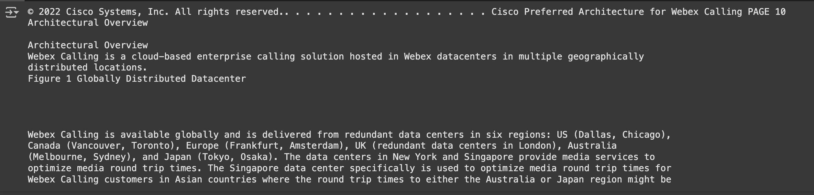

            * We will  now combine prompts with chains and retrievers to generate responses based on the prompts. Let's start by defining our LLM

            ```py linenums="1"
            llm=ChatOpenAI(model="gpt-4o")
            ```

            !!! note
                 <b>Optional</b> You can also use open source models like Ollama using the following code:

                ```
                 from langchain_community.llms import Ollama 
                 llm=Ollama(model="llama2") 
                ```

            * Let's design our chat prompt templates instead of querying our database using similarity search. We'll be utilizing [langchain_core.prompts](https://api.python.langchain.com/en/latest/prompts/langchain_core.prompts.chat.ChatPromptTemplate.html) for this purpose.

            ```py linenums="1"
            from langchain_core.prompts import ChatPromptTemplate
            prompt= ChatPromptTemplate.from_template("""
                                                    Answer the following question based only on the provided context. If no answer is available just say I dont know.
                                                    <context>
                                                    {context}
                                                    </context>
                                                    Question: {input}""")
            ```

            * Let's create our Chain now. Chains are sequences of operations that process input to produce the desired output. We will use [create_stuff_documents_chain](https://python.langchain.com/v0.1/docs/modules/chains/)

            ```py linenums="1"
            from langchain.chains.combine_documents import create_stuff_documents_chain
            document_chain=create_stuff_documents_chain(llm,prompt)
            ```

            * Now, let's define our retrievers. As previously mentioned, a retriever is an interface that returns documents based on an unstructured query. It is broader in scope than a vector store, as it doesn't need to store documents, only to retrieve them. While vector stores can serve as the foundation for a retriever, there are other types of retrievers available as well. For more information, you can refer to the documentation <a href="https://python.langchain.com/docs/how_to/#retrievers" target="_blank">here</a>

            ```py linenums="1"
            retriever=db.as_retriever()
            retriever
            ```

            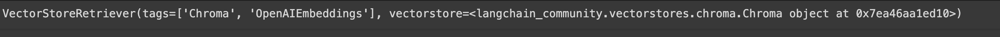

            * In this step, we'll set up a retrieval chain. This chain will start by taking a user inquiry and passing it to the retriever to fetch relevant documents. The retrieved documents, along with the original inputs, will then be sent to a language model (LLM) to generate a response. For further details on how to implement a retrieval chain, refer to the <a href="https://python.langchain.com/docs/versions/migrating_chains/" target="_blank">following doc</a>

            ```py linenums="1"
            from langchain.chains import create_retrieval_chain
            retrieval_chain=create_retrieval_chain(retriever,document_chain)
            ```

            * Now, let's combine our retriever and chain to generate responses:

            ```py linenums="1"
            response=retrieval_chain.invoke({"input":" what are the bandwidth required on the internet access for Webex Calling"})
            ```

            ```
            response['answer']
            ```

            !!! note

                Let's jump into <a href="https://smith.langchain.com/" target="_blank">LangSmith</a> to review the logs.

            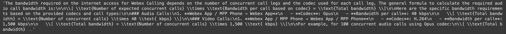

            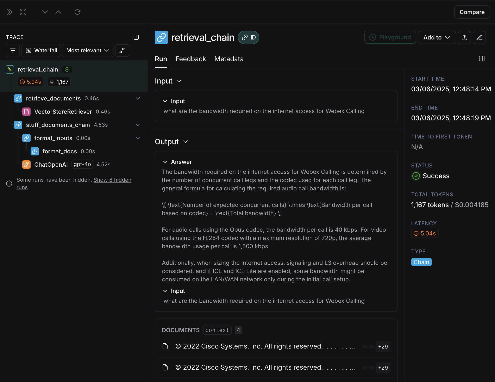

            <b>Summary</b>

            In this lab, we've built an advanced Retrieval-Augmented Generation (RAG) system. The process begins with a user query, which is passed through a retrieval chain to fetch relevant documents from a vector database. These documents, along with the original query, are then processed by a Language Model (LLM) to generate a detailed and accurate response. This setup allows us to efficiently handle complex queries by combining the strengths of chains, retrieval and language models.

            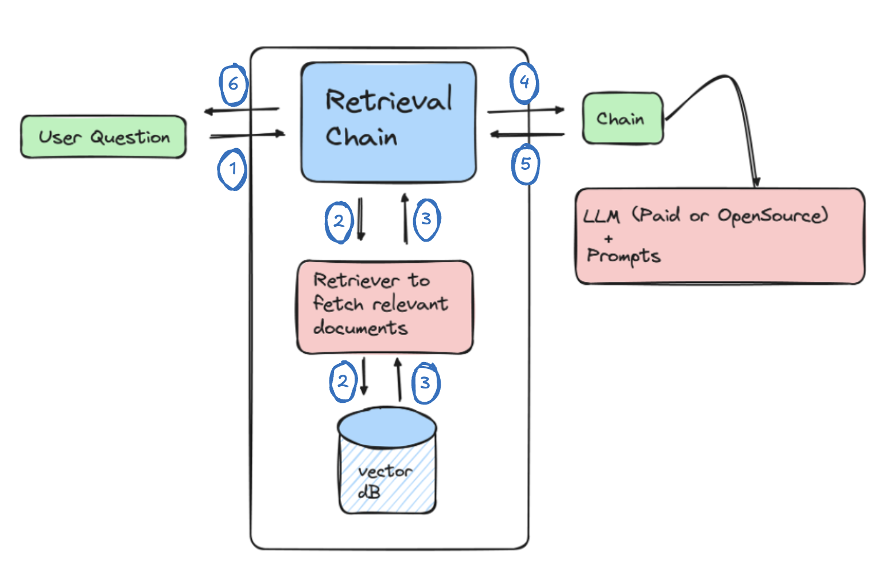

            <p align="right"><a href="http://127.0.0.1:8000/Task9/#__tabbed_2_3" class="md-button md-button--primary">Next</a></p>

        === "UseCase-3"
        
            <b>Advanced Rag - Multisearch Agents RAG application </b>

            If you recall in our previous use case, we discussed chains where we manually defined the sequence of actions to execute. However, the core concept behind <a href="https://python.langchain.com/v0.1/docs/modules/agents/" target="_blank">agents</a> is different. Instead of hardcoding the sequence of actions (as we do in chains), agents leverage a language model as a reasoning engine. This allows the model/agents to dynamically decide which actions to take and in what order.

            In this context, <a href="https://python.langchain.com/v0.1/docs/modules/tools/" target="_blank">tools</a> play an essential role. Tools are like wrappers that the model can call upon to perform specific tasks, acting as interfaces between the agent and the outside world. By integrating tools with agents, the language model not only decides what action to take but also knows how to use the available tools to achieve the desired outcome. This flexible system allows agents to interact with different data sources or APIs dynamically, without the need for a fixed sequence of operations as seen in chains.


            <b>Lab Configuration</b>

            !!! note

                In this use-case, we will build a system that leverages the power of agents combined with tools to create a flexible and dynamic environment. We will create multiple tools that interact with different data sources, including:

                * A Wikipedia-based tool for querying concise information.

                * A custom retriever tool that searches through a specific dataset or webpage example: (ThousandEyes API documentation).

                * An <a href="https://arxiv.org/" target="_blank">Arxiv-based tool</a> for retrieving AI research papers.

                * Custom PDF-based tool for extracting information from a document (Webex Calling Preffered Architecture).

            We will combine these tools into an agent that can decide which tool to use based on the task at hand. Instead of manually defining the steps like in a chain, this agent will use a language model to reason and determine the right sequence of actions dynamically.

            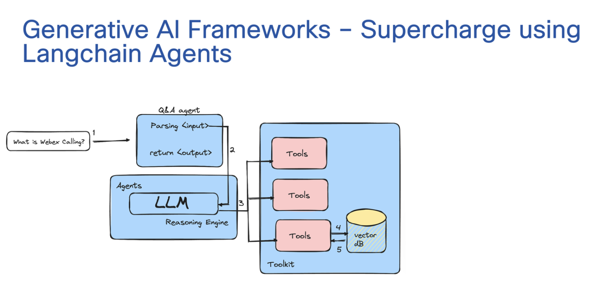

            By the end of the lab, you'll have an agent-driven system capable of dynamically selecting and using tools to perform complex tasks, like retrieving data from a variety of sources without the need for hardcoding specific steps.

            <b>Task 1: Log into the Lab Environment</b>

            * Open Google Colab and start a new notebook, or you can use an existing one. Ensure that your OpenAI and LangChain tokens are already set up and activated for this notebook, as described in Use Case 1 and Use Case 2.

            * Let's load our PDF files into Google Colab. For this example, we can use the article titled "Cisco Preferred Architecture for Webex Calling". You can  [download the  article here](./assets/static/webex_calling.pdf){:target="_blank" download="webex_calling.pdf"} as we will be using in the next step.

            * Within Google Colab, Click on Folder and create a new folder called "data"

            

            * Click on [...], select Upload

            

            * Choose your webex_calling.pdf file and click Open

            <b>Configuration</b>

            * Let's start by installing all the packages

            ```py linenums="1"
            !pip install langchain_openai langchain langchain_core python-dotenv langchain_community langserve PyPDF chromadb arxiv wikipedia langchainhub 
            ```

            *  We will configure the environment variables. We will use and define Langserve for our LLM ops

            ```py linenums="1"
            import os
            from google.colab import userdata
            os.environ['OPENAI_API_KEY'] = userdata.get('OPENAI_API_KEY')
            os.environ['LANGCHAIN_API_KEY'] = userdata.get('LANGCHAIN_API_KEY')
            os.environ["LANGCHAIN_TRACING_V2"] = "true"
            os.environ["LANGCHAIN_ENDPOINT"] = "https://api.smith.langchain.com"
            os.environ["LANGCHAIN_PROJECT"] = "default"
            ```


            !!! important
                
                We will be creating Tools (wrappers) around our data sources. Tools act as interfaces that can be used by agents, chains, or LLMs to interact with various data sources. Langchain provides built-in toolkits that allow us to easily create these wrappers and interact with data sources to extract data. In our lab guide, we will develop four different wrappers. The first wrapper tool will be built around <a href="https://python.langchain.com/v0.1/docs/integrations/tools/wikipedia/" target="_blank">Wikipedia</a>.

            **Tool 1**

            ```py linenums="1"
            from langchain_community.tools import WikipediaQueryRun
            from langchain_community.utilities import WikipediaAPIWrapper
            # I need only one result and 300 charectors- interacting with Wikipedia in this lab
            api_wrapper = WikipediaAPIWrapper(top_k_results=1,doc_content_chars_max=300)
            wiki = WikipediaQueryRun(api_wrapper=api_wrapper)
            ```

            ```py linenums="1"
            wiki.run("history of cisco")
            ```

            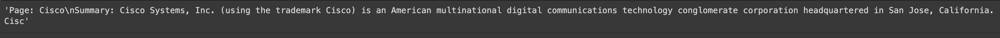

            **Tool 2**

            * Let's create a custom wrapper. Since this is my data, I won't be using predefined tools like I did for Wikipedia. Instead, I will define my own embeddings, vectors, and retrievers. In this Wrapper we will read API guide for ThousandEyes

            ```py linenums="1"
            from langchain_community.document_loaders import WebBaseLoader
            from langchain_community.vectorstores import Chroma
            from langchain_openai import OpenAIEmbeddings
            from langchain_text_splitters import RecursiveCharacterTextSplitter
            from langchain_openai import ChatOpenAI
            import os
            os.environ["USER_AGENT"] = "Mozilla/5.0 (Windows NT 10.0; Win64; x64) AppleWebKit/537.36 (KHTML, like Gecko) Chrome/91.0.4472.124 Safari/537.36"

            loader = WebBaseLoader("https://docs.thousandeyes.com/product-documentation/getting-started/getting-started-with-the-thousandeyes-api")
            docs = loader.load()
            documents = RecursiveCharacterTextSplitter(chunk_size=1000,chunk_overlap=200).split_documents(docs)
            vectordb = Chroma.from_documents(documents,OpenAIEmbeddings())
            retriever = vectordb.as_retriever()
            retriever
            ```
            * Lets create a custom retriever tool using Langchain to search through our TE dataset. More info on create_retriever_tool available <a href="https://api.python.langchain.com/en/latest/tools/langchain.tools.retriever.create_retriever_tool.html" target="_blank">here</a>

            ```py linenums="1"
            # Use prompts from Hub for my retriver
            from langchain.tools.retriever import create_retriever_tool
            retriever_tool=create_retriever_tool(retriever,"ThousandEyes_Search",
                                "Search for information about ThousandEyes APis. For any questions about APIs, you must use this tool!")
            retriever_tool.invoke("How do I authenticate with the ThousandEyes API?")
            ```

            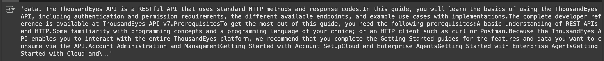

            **Tool 3**

            * Arxiv is a free distribution service and an open-access archive where researchers from various fields, such as computer science, physics, and more, share their research papers.  In this section, we will create a tool that interfaces with Arxiv to search and retrieve research papers. The below code sets up a tool to query Arxiv and extract  results from the top research papers relevant to the query.

            ```py linenums="1"
            from langchain_community.utilities import ArxivAPIWrapper
            from langchain_community.tools import ArxivQueryRun
            # I need only one result and 300 charectors- interacting with Arxiv in this lab
            arxiv_wrapper=ArxivAPIWrapper(top_k_results=1, doc_content_chars_max=300)
            arxiv=ArxivQueryRun(api_wrapper=arxiv_wrapper)
            arxiv.name
            ```

            **Tool 4**

            * Let's create another custom wrapper for my PDF files. Since this is my data, I won't be using predefined tools like I did for Wikipedia and Arxiv. Instead, I will define my own embeddings, vectors, and retrievers, similar to how we did with the ThousandEyes API guide. We'll use the Webex Calling Preferred Architecture Guide, make sure it's uploaded according to the steps we've covered earlier.

            ```py linenums="1"
            from langchain_community.document_loaders import PyPDFLoader
            from langchain.text_splitter import RecursiveCharacterTextSplitter
            from langchain_openai import OpenAIEmbeddings
            from langchain_community.vectorstores import Chroma
            loader=PyPDFLoader("/content/data/webex_calling.pdf")
            docs=loader.load()
            text_splitter=RecursiveCharacterTextSplitter(chunk_size=1000, chunk_overlap=200)
            documents=text_splitter.split_documents(docs)
            db = Chroma.from_documents(documents,OpenAIEmbeddings())
            retriever1=db.as_retriever()
            retriever1
            ```

            * Lets create a custom retriever tool using Langchain to search through our PDF. More info on create_retriever_tool available <a href="https://api.python.langchain.com/en/latest/tools/langchain.tools.retriever.create_retriever_tool.html" target="_blank">here</a>.

            ```py linenums="1"
            from langchain.tools.retriever import create_retriever_tool
            retriever_tool1=create_retriever_tool(retriever1,"Webex_Calling_Search",
                                "Search for information about Webex Calling. For any questions about Webex Calling, you must use this tool!")
            retriever_tool1.invoke("Are webex calling data centres globally distributed?")
            ```

            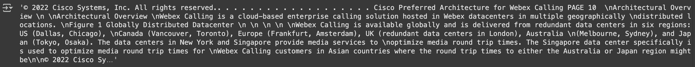

            * We will combine all the tools/wrappers together now

            ```py linenums="1"
            tools=[wiki,arxiv,retriever_tool,retriever_tool1]
            ```

            * The next step is to query these tools, and that's where agents come in. Whenever I send a query to the LLM, it will search across all the available tools (Wiki, my custom retrieval tool, Arxiv, etc.) to find the most relevant source and provide the answer. Agents typically use the LLM to perform a sequence of actions. In this case, the LLM acts as a reasoning engine, determining which tool to use based on the query, searching the relevant sources, and delivering the most accurate response. Lets define our LLM 

            ```py linenums="1"
            from dotenv import load_dotenv
            from langchain_openai import ChatOpenAI
            load_dotenv()
            import os
            os.environ['OPENAI_API_KEY']=os.getenv("OPENAI_API_KEY")
            llm = ChatOpenAI(model="gpt-4o", temperature=0)
            ```

            * Let's use the prompt from the hub. If you'd like to create your own custom prompt, feel free to do so as well! 

            ``` py linenums="1"
            # Get prompts
            from langchain import hub
            prompt = hub.pull("hwchase17/openai-functions-agent")
            prompt.messages
            ```

            !!! note

                <b>Optional/Information Only: </b> You can also use custom templates as shown
                ```py 
                from langchain_core.prompts import ChatPromptTemplate, SystemMessagePromptTemplate, HumanMessagePromptTemplate, MessagesPlaceholder
                # Custom prompt template
                custom_prompt = ChatPromptTemplate.from_messages([
                    SystemMessagePromptTemplate.from_template(
                        "You are a helpful assistant. If you can't find the information using the tools, please say so and apologize to the user."
                    ),
                    MessagesPlaceholder(variable_name="chat_history", optional=True),
                    HumanMessagePromptTemplate.from_template("{input}"),
                    MessagesPlaceholder(variable_name="agent_scratchpad")
                ])

                # View structure
                custom_prompt.messages
                ```


            * As we are creating an agent that can interact with multiple tools by leveraging the OpenAI language model. The create_openai_tools_agent function combines the LLM, tools, and a prompt to form an agent. This agent will use the LLM as a reasoning engine to dynamically decide which tool to use based on the input query. It allows us to query Wikipedia, custom retrieval tools, Arxiv, and more, all within one unified system.

            ```py linenums="1"
            from langchain.agents import create_openai_tools_agent
            agent=create_openai_tools_agent(llm,tools,prompt)
            ```

            * Let's create an Agent Executor. It will use the previously defined agent and tools, allowing the agent to execute queries using the appropriate tool dynamically. The verbose=True option ensures that detailed output is provided during execution, helping to understand the agent's decision-making process as it selects and interacts with the tools.

            ```py linenums="1"
            from langchain.agents import AgentExecutor
            agent_executor=AgentExecutor(agent=agent,tools=tools,verbose=True)
            agent_executor
            ```

            * Lets execute our code

            ```py linenums="1"
            agent_executor.invoke({"input":"tell me about Webex Calling"})
            ```

            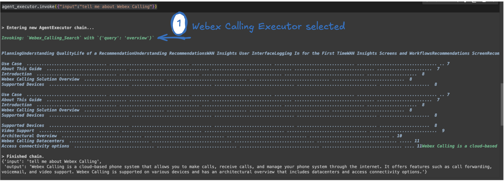


            ```py linenums="1"
            agent_executor.invoke({"input":"tell me about Getting Started with the ThousandEyes API"})
            ```

            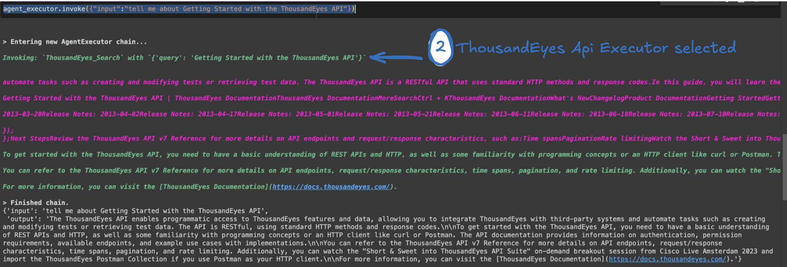

            ```py linenums="1"
            agent_executor.invoke({"input":"tell me about cisco systems"})
            ```

            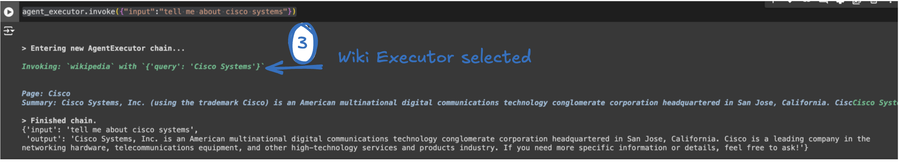

            ``` py linenums="1"
            agent_executor.invoke({"input":"tell me about research paper 2106.09685v2"})
            ```

            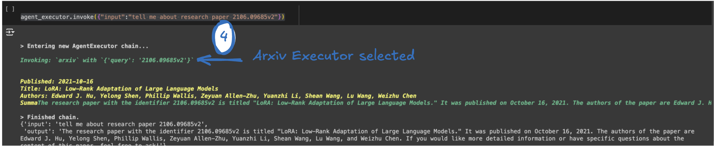

            * You can see all logs in Langsmith as well.

            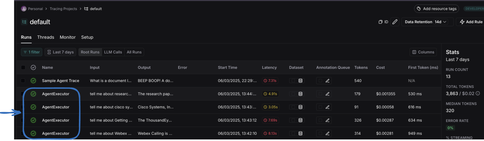

            <b>Summary</b>

            In this use case, we successfully built an AI-driven agent that dynamically interacts with multiple tools to retrieve and process information. Our agent can query Wikipedia for general knowledge, retrieve ThousandEyes API documentation using a custom
            retriever tool, fetch AI research papers from Arxiv, and even extract insights from a Webex Calling Preferred Architecture PDF. Unlike static chains, this agent leverages a reasoning engine to decide which tool to use based on the query, making it more flexible and adaptive. Through this process, we explored key concepts such as integrating multiple data sources, utilizing vector databases for efficient retrieval, and understanding how LangChain’s toolkit enables dynamic decision making. Moving forward, we can expand this system by incorporating additional tools, optimizing retrieval strategies using retrieval augmented generation (RAG), and deploying the agent in real-world applications like customer support automation. This hands-on experience provided a
            deeper understanding of how AI agents can streamline information retrieval and decision-making in complex environments. This concludes this <b>section</b>.

            <p align="left"> 👉 <b>This concludes the tasks for our session. The remaining tasks are optional and focus on fine-tuning LLMs. Please note: To run these tasks, you'll need an NVIDIA GPU, or if you're using Google Colab, a Pro subscription is required.</b> </p>


