# Overview - Understanding AI and Its Integration with Webex

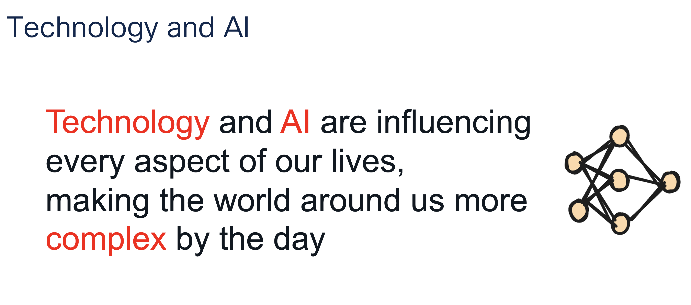

???+ blank "Responsible AI Framework"

    ??? info "Introduction"

        Artificial Intelligence (AI) is transforming the way we work, enabling innovative solutions and enhancing productivity. Cisco is committed to innovating responsibly, with responsible AI being non-negotiable. Our approach is grounded in the principles of transparency, fairness, accountability, reliability, security, and privacy. Cisco's Responsible AI Framework, aligned with the  AI Risk Management Framework, ensures that all AI initiatives undergo rigorous assessments, particularly around privacy. 
        
        Remember data has value, Cisco's AI strategy emphasizes building ethical and trustworthy systems that mitigate risks while enhancing innovation across products and services.

        <!-- 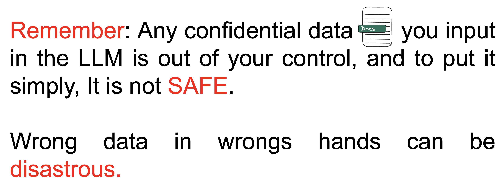 -->
        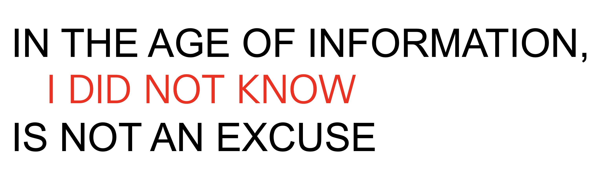

        Please refer to the below info for more detailed insights about Cisco Responsible AI:

        * <a href="https://blogs.cisco.com/news/responsible-ai-is-built-on-a-foundation-of-privacy" target="_blank">Responsible AI is built on a foundation of privacy</a>
        * <a href="https://www.cisco.com/c/dam/en_us/about/doing_business/trust-center/docs/cisco-responsible-artificial-intelligence-principles.pdf" target="_blank">Cisco's Responsible Artificial Intelligence Principles</a>
        * <a href="https://blogs.cisco.com/security/our-responsible-approach-to-governing-artificial-intelligence" target="_blank">Cisco's Responsible Approach to Governing Artificial Intelligence</a>
        * <a href="https://www.cisco.com/c/dam/en_us/about/doing_business/trust-center/docs/cisco-responsible-artificial-intelligence-framework.pdf" target="_blank">Cisco's Responsible Artificial Intelligence Framework</a>

        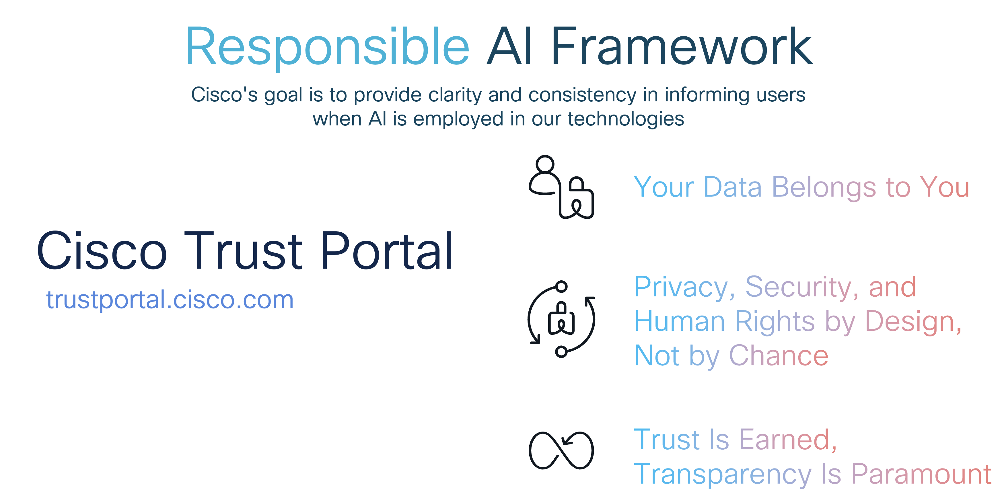

???+ blank "The Evolution of AI at Cisco"

    ??? info "Foundations of Innovation"

        At Cisco, innovation is woven into the fabric of everything we do. We've been at the forefront of AI development long before it became a buzzword.  Our journey spans decades, from early developments in audio and video intelligence, like echo cancellation, media resilience, to recent breakthroughs like noise removal, face recognition, and immersive experiences, just to name a few. We continue to push boundaries, enhancing AI across multiple domains to deliver immersive and intelligent experiences. Innovation in AI isn't just a trend for us—it's a longstanding commitment to excellence and progress.

        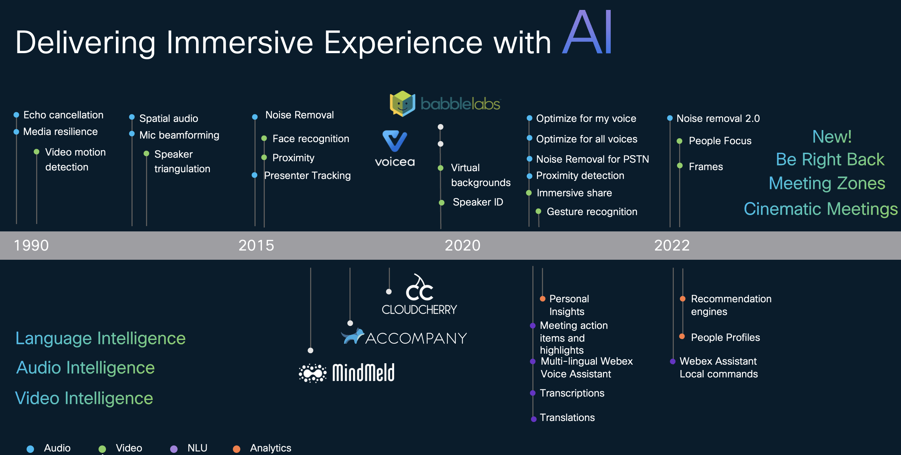

        What we want everyone to understand is that AI is the core fabric that powers our platforms, enabling  reimagining of work, workspaces, and customer experiences. Whether through the Webex Suite, advanced devices, or   contact center solutions, AI drives the seamless, intelligent, and immersive experiences that define modern collaboration. Cisco's AI-powered Webex platform is designed to transform the way we work, ensuring that every interaction is smarter, more efficient, and more personalized.

        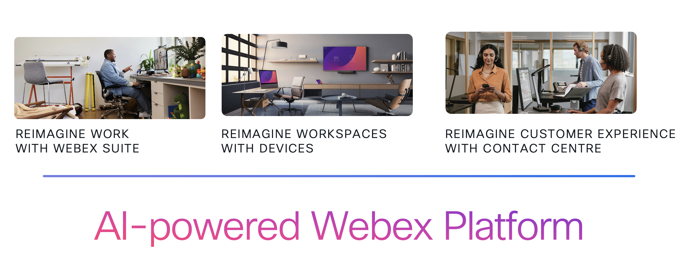

        In recent years, we've expanded our platform with several new AI capabilities. Here are a few highlights:

        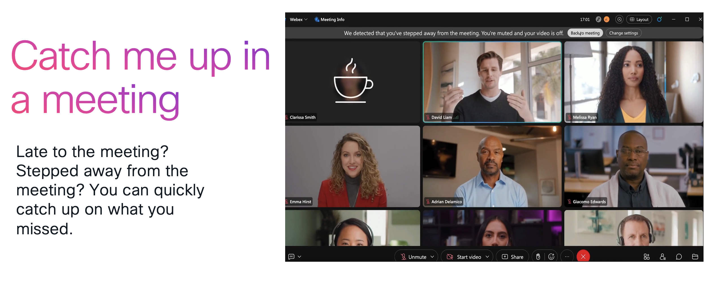

        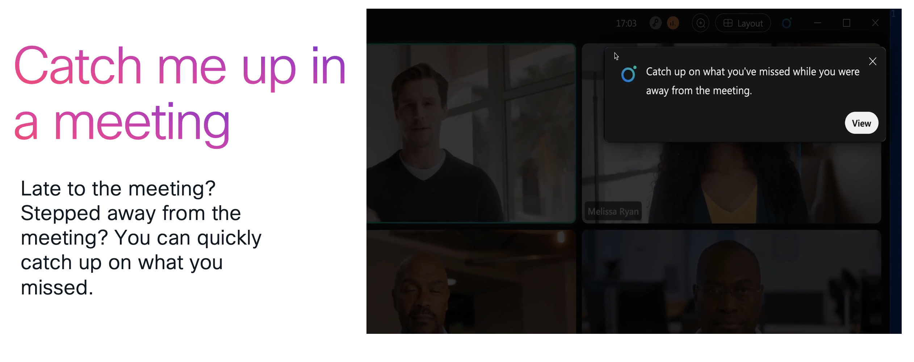

        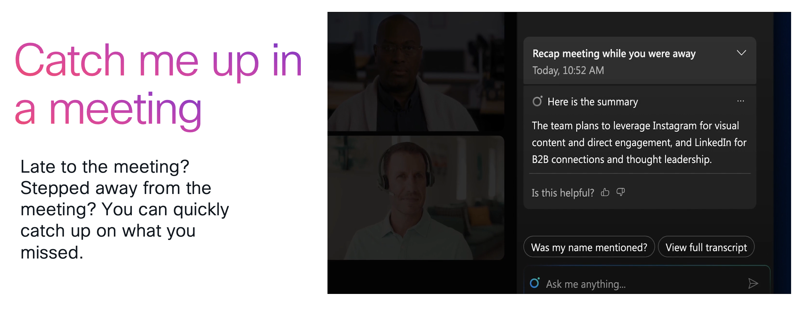

        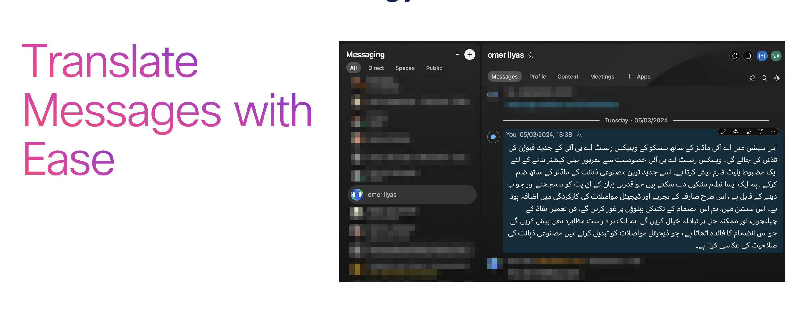

        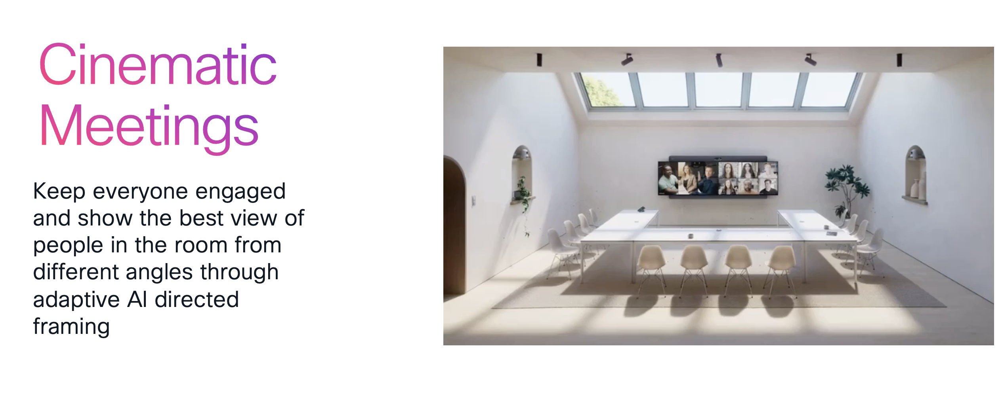

        **AI Codec Improve audio quality in poor network conditions** 

        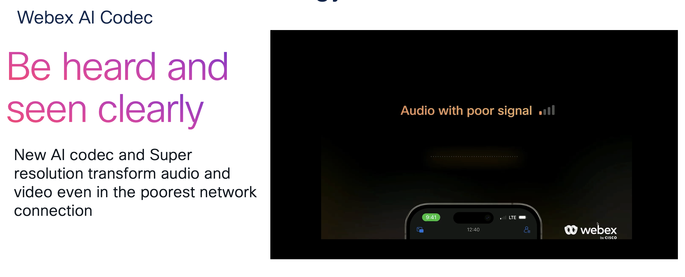

        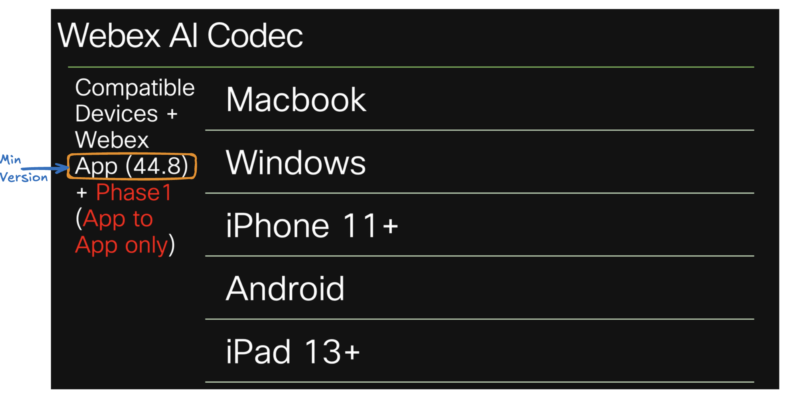

        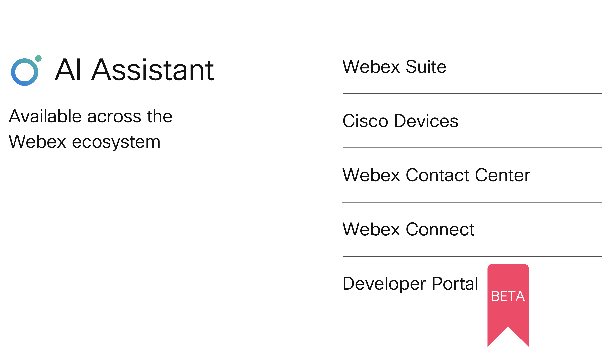

???+ blank "Roadmap AI features"

    ??? info "Upcoming Features"

        !!! important
                The following slides contain forward-looking statements about AI roadmap features. 
                These features are subject to change without notice based on ongoing research, development, and market needs. 
                Expected delivery dates / feature release are subject to change. 
                
                Please refer to our Safe Harbor Statment.

        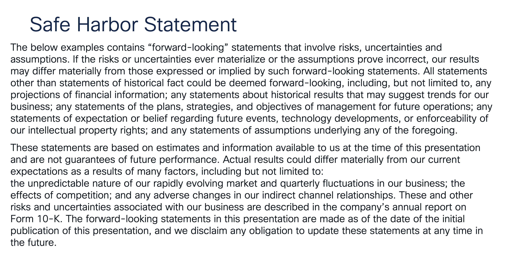

        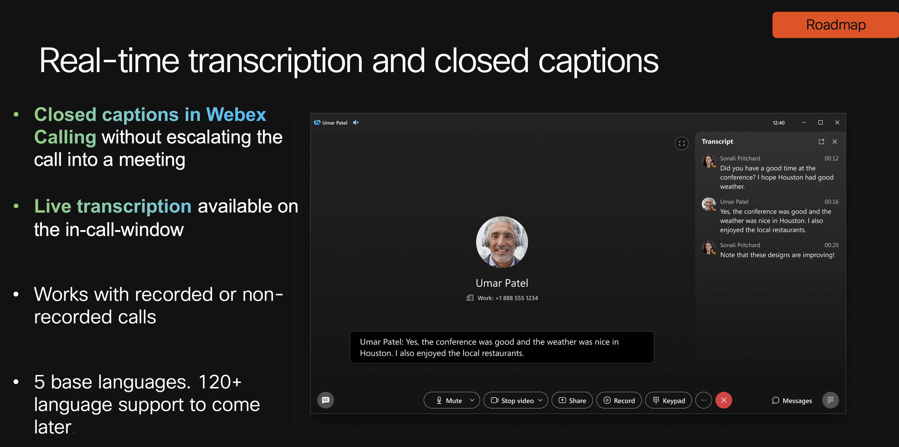

        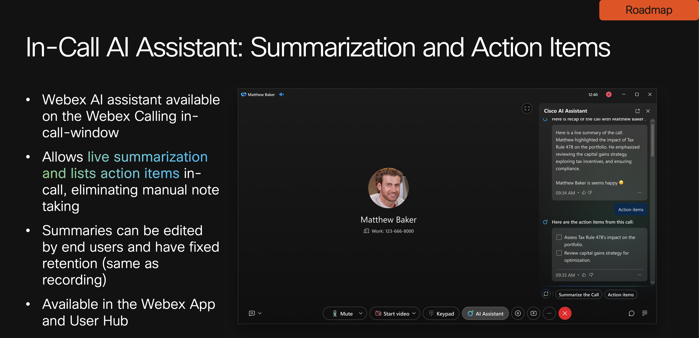

        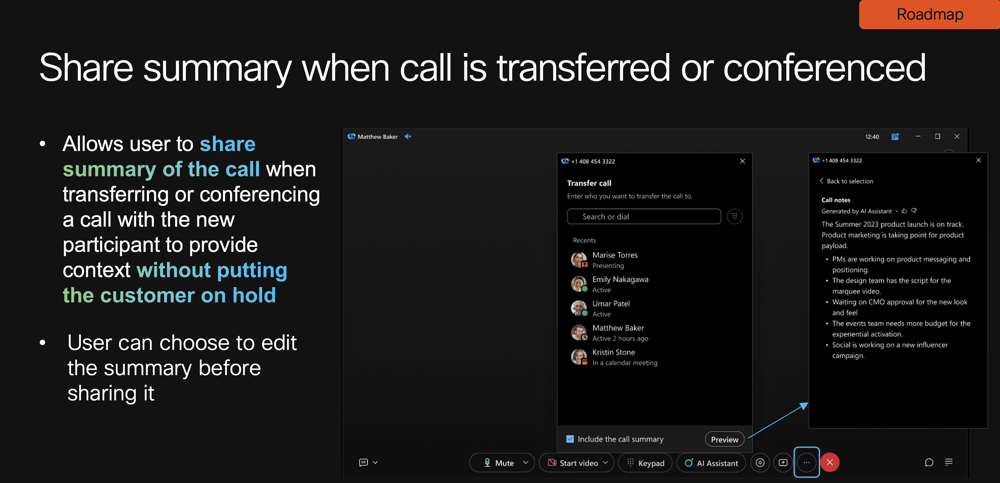

        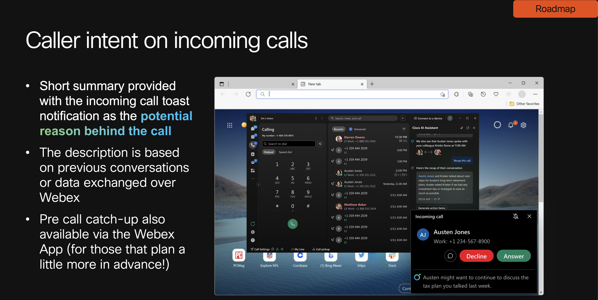

        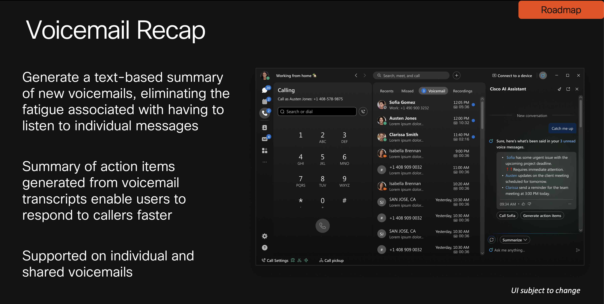

        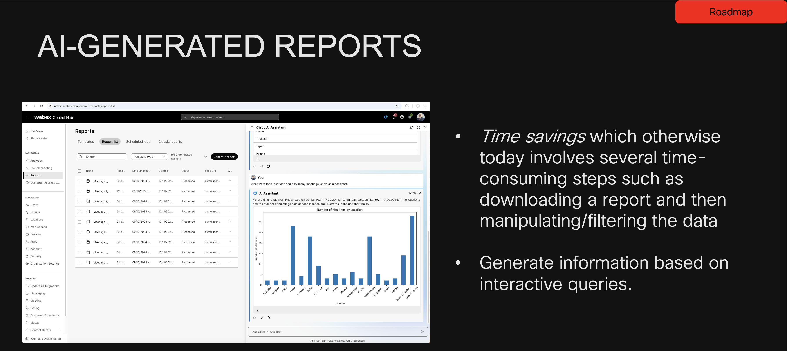

???+ blank "Summary"

    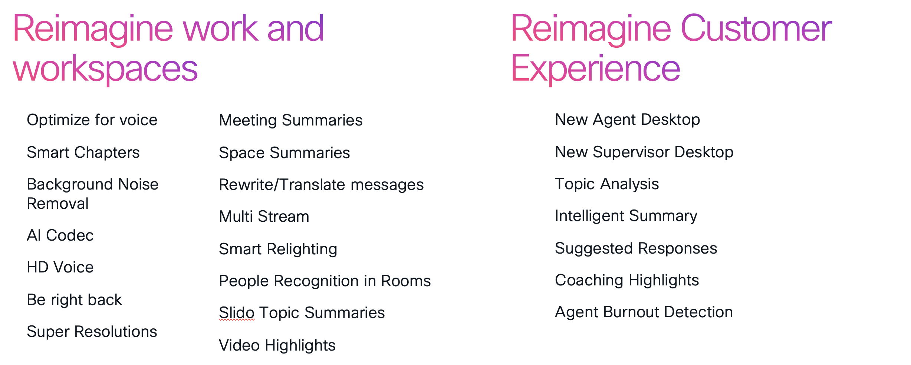

    ??? note 
        * Our product teams are hosting AI sessions. Please review the agenda and join the ones that interest you.

???+ blank "Lab Guide Overview"

    ??? info "Introduction"

        === "Key Takeaways"
        
            In this lab guide you will go through the fundamental concepts of AI, various techniques, and how AI can be integrated with Webex to create efficient workflows.

            !!! important
                
                Upon completion of this lab you will be able to:

                * Understand the basics of AI and its applications
                * Learn about embedding techniques
                * Vector databases
                * Gain insights into Generative AI models
                * Familiarize yourself with different AI frameworks
                * Integrate AI with Webex to create seamless workflows
                * Develop hands-on skills through practical exercises
                * Retrieval Augmented Generation (RAG) and Multimodal RAG
                * Understand Fine-tuning and Quantization (Optional Task)
                * Deploy Fine Tuning techniques (Optional Task)

        === "Key Prerequisites"

            * Basic understanding of AI concepts is helpful but not required.
            * We will be using Google Colab for this lab. However, if you have your own machine with an Nvidia chipset and prefer to run the lab locally, feel free to do so.

        === "Disclaimer"

            !!! important
            
                The lab design and configuration examples provided are for reference/learning purposes only. This is a sample deployment, and not all recommended features are used or enabled optimally. For design-related questions, please contact your representative at Cisco or Cisco Collab TME team.

        === "Lab Tasks Overview - Generative AI and Webex integration"
        
            * Lab Setup - Google Colab and Hugging Face
            * AI/ML Revolution Unveiled
            * Tokenization
            * Embeddings and Vector Database
            * Context Windows and Retrieval Augmented Generation (RAG)
            * Multimodal RAG
            * Understanding Fine-Tuning for Large Language Models (Optional Task)
            * Fine Tuning - Deep Dive into Quantization , LoRA and SFT (Optional Task)
            * Configuring and Fine Tuning - Using llama2 (Optional Task)
            * Configuring and Fine Tuning - Using llama3 (Optional Task)
            * Configuring and Fine Tuning - Using ChatGPT (Optional Task)
            * Model Merging (Theory Only) (Optional Task)

!!! important
    Let's get started! Click on [Task 1 - Google Collab- Accessing Google Collab and creating account](./Task1.md).

      
      